# V001 图文发布稿（带图版）

## 标题

积木代码助手购买 Key 后怎么配置并查看用量日志

## 前两段短文案

这条录屏走一遍积木代码助手的购买后闭环：先确认 Codex / Claude Code / Gemini 产品线，购买或兑换权益，再到 Key 管理创建对应 Key，按 CLI 配置页写入配置，最后用一次最小请求回到用量日志核对。

这篇主要解决：购买前不知道 Codex、Claude Code、Gemini 是不同产品线，担心买错。看完你能：明白 Codex / Claude Code / Gemini 产品线独立售卖，Key 不通用。建议先收藏，操作时对照配图一步步核对。

## 备用标题

买完 Key 先别急着重装，先按这条路线核对日志
积木代码助手入门 01：从购买 Key 到日志核对

## 完整正文备用

这条录屏走一遍积木代码助手的购买后闭环：先确认 Codex / Claude Code / Gemini 产品线，购买或兑换权益，再到 Key 管理创建对应 Key，按 CLI 配置页写入配置，最后用一次最小请求回到用量日志核对。视频不展开完整安装，也不展示真实 Key 和后台数据，所有敏感信息会打码。

这篇适合刚开始接触积木代码助手、Codex 或 Claude Code 的同学。不要只盯着一个按钮或一条命令，建议按图里的顺序看：先看当前问题，再看操作路径，最后确认结果有没有真正跑通。

常见卡点：
购买前不知道 Codex、Claude Code、Gemini 是不同产品线，担心买错
买完以后不知道先去 Key 管理，还是先去 CLI 配置文档
复制 Key、配置 API 地址时容易把 Codex Key 和 Claude Code Key 混用
终端能跑不代表链路完全正确，还需要到日志页核对是否有真实请求记录

看完这篇，你应该能做到：
从 `https://code.jimuxyz.com/` 进入价格、购买/兑换、Key 管理、CLI 配置和用量日志
明白 Codex / Claude Code / Gemini 产品线独立售卖，Key 不通用
购买或兑换后，先创建对应产品线 Key，再进入对应工具配置页
用一个最小终端验证请求确认工具能跑通

我的建议是，第一次操作时不要一边改很多地方，一边猜原因。先把页面、终端输出、配置文件、日志记录这几块分开看，哪一步不一致，就从那一步往回查。

如果你也在配置或使用 AI 编程工具，可以先收藏这篇。后面遇到类似问题时，按这条路线重新核对一遍，通常能更快判断下一步该看哪里。

## 配图说明

首图用 `cover-flow-images/V001-cover-douyin.png`。
第二张用 `cover-flow-images/V001-flow.png`。
后面从 `ppt-images/slide-01.png` 到 `ppt-images/slide-08.png` 里选关键步骤图。
如果平台限制图片数量，优先保留：流程图、关键操作、常见错误、结果确认。

## 配图预览

### 首图与流程图

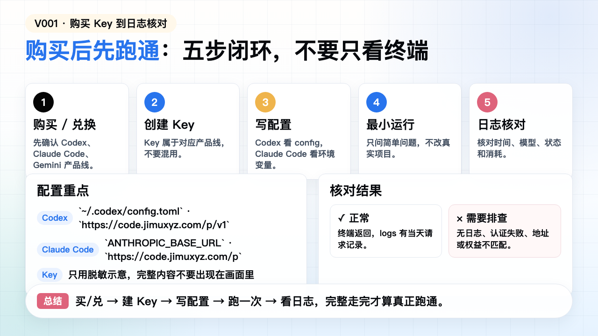

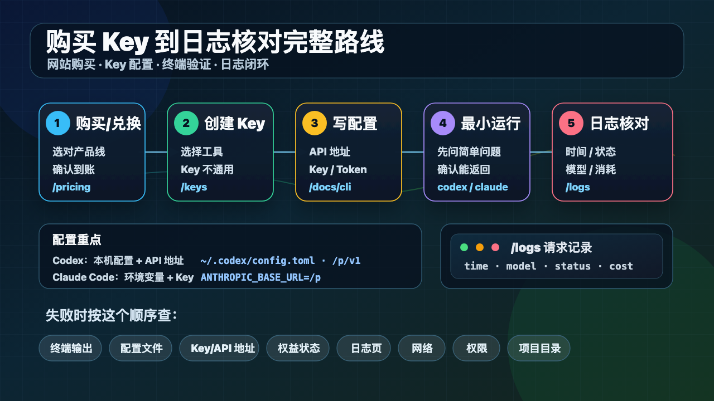

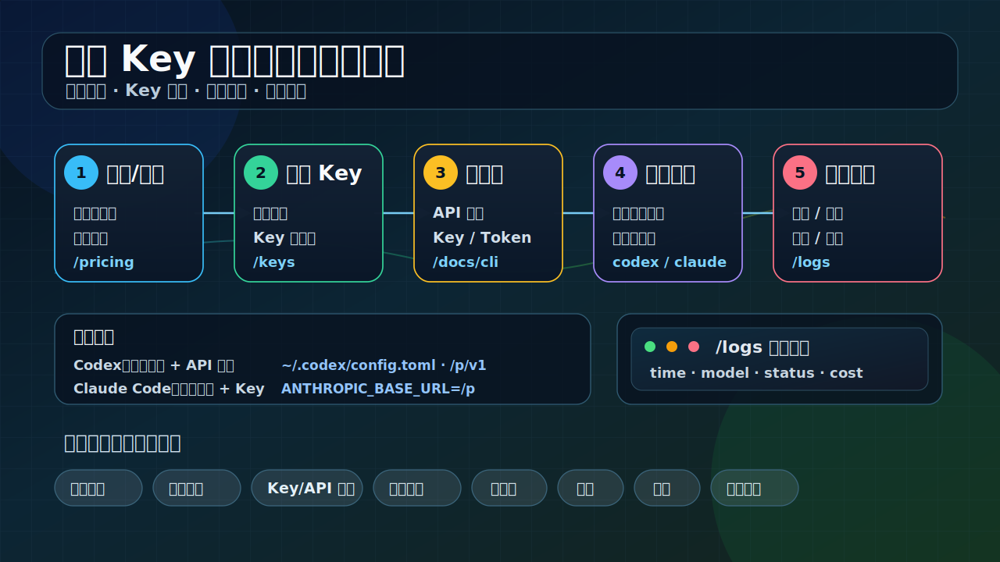

### PPT 步骤图

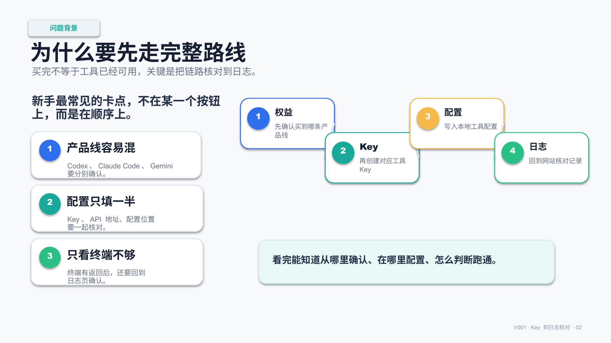

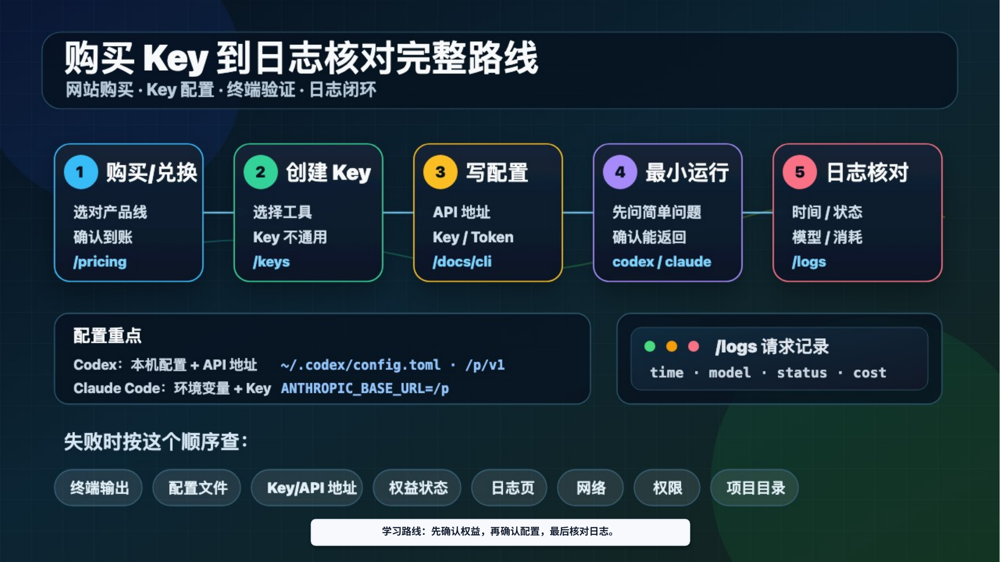

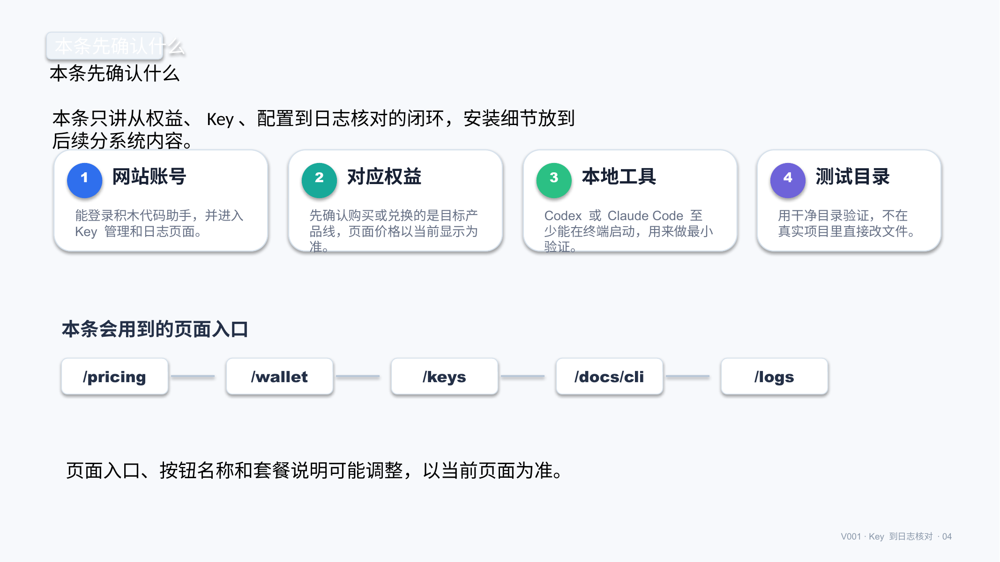

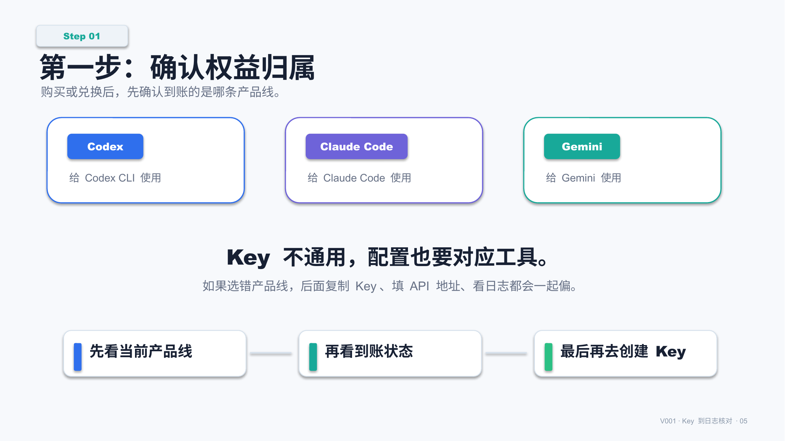

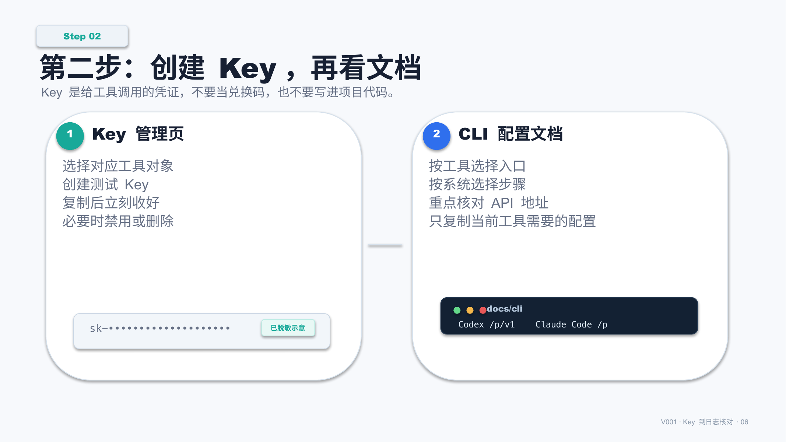

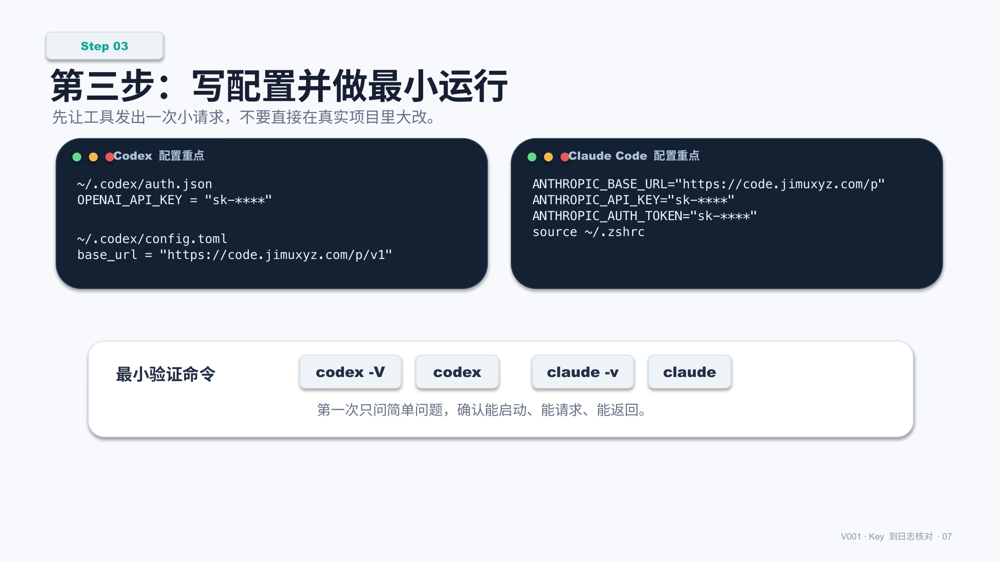

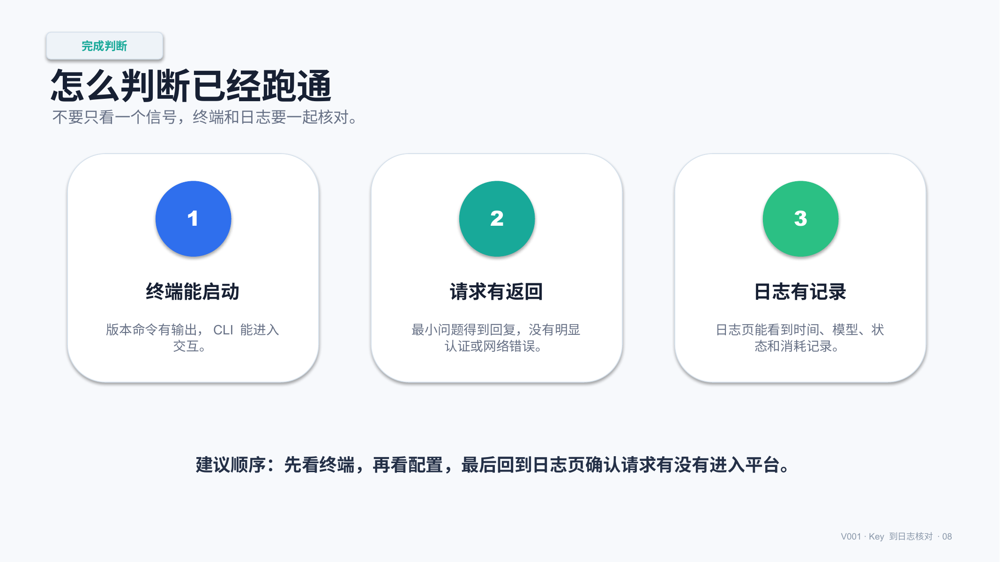

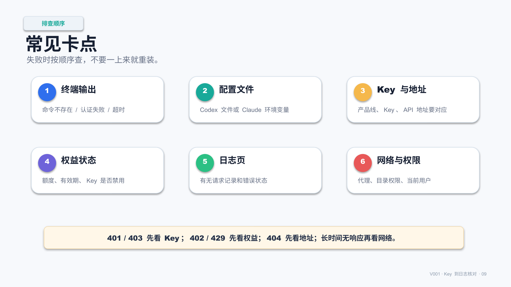

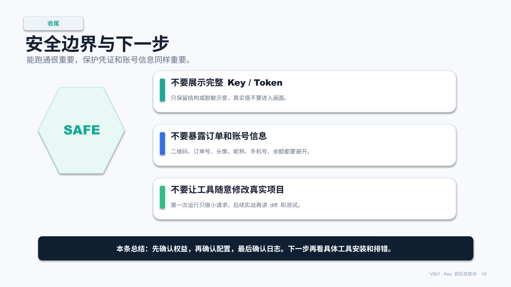

## 标签
#积木代码助手 #Codex #ClaudeCode #AI编程 #Key配置 #日志核对 #用量日志 #配置教程
