# V002 图文发布稿（带图版）

## 标题

Codex Key 配置失败先查哪 5 个地方

## 前两段短文案

这条讲 Codex Key 配置失败时的排查顺序：先看终端输出，再看配置文件，再核对 Key/API 地址，然后看权益状态和日志页，最后再查网络、权限和项目目录。

这篇主要解决：一失败就重装，浪费时间，还可能把原本正确的配置覆盖掉。看完你能：先看终端输出和 `codex doctor --summary`。建议先收藏，操作时对照配图一步步核对。

## 备用标题

Codex Key 配置失败先查哪 5 个地方：按这条路线看就够了

## 完整正文备用

这条讲 Codex Key 配置失败时的排查顺序：先看终端输出，再看配置文件，再核对 Key/API 地址，然后看权益状态和日志页，最后再查网络、权限和项目目录。适合第一次配置 Codex 跑不通，或者日志页没有记录的新用户。

这篇适合刚开始接触积木代码助手、Codex 或 Claude Code 的同学。不要只盯着一个按钮或一条命令，建议按图里的顺序看：先看当前问题，再看操作路径，最后确认结果有没有真正跑通。

常见卡点：
一失败就重装，浪费时间，还可能把原本正确的配置覆盖掉
把 Codex、Claude Code、Gemini 的 Key 或 API 地址混用
只盯着终端错误，不知道还要去 `/logs` 核对请求是否到达平台
不清楚本机配置、Key 权益、网络、权限和项目目录分别影响哪一层

看完这篇，你应该能做到：
先看终端输出和 `codex doctor --summary`
再看 `~/.codex/config.toml` 和认证缓存
核对 Codex 产品线 Key 和 API 地址
到积木代码助手 `/logs` 看当天请求记录和权益状态

我的建议是，第一次操作时不要一边改很多地方，一边猜原因。先把页面、终端输出、配置文件、日志记录这几块分开看，哪一步不一致，就从那一步往回查。

如果你也在配置或使用 AI 编程工具，可以先收藏这篇。后面遇到类似问题时，按这条路线重新核对一遍，通常能更快判断下一步该看哪里。

## 配图说明

首图用 `cover-flow-images/V002-cover-douyin.png`。
第二张用 `cover-flow-images/V002-flow.png`。
后面从 `ppt-images/slide-01.png` 到 `ppt-images/slide-08.png` 里选关键步骤图。
如果平台限制图片数量，优先保留：流程图、关键操作、常见错误、结果确认。

## 配图预览

### 首图与流程图

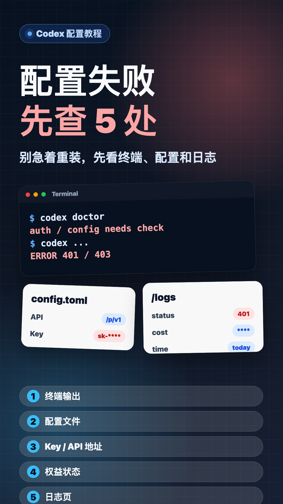

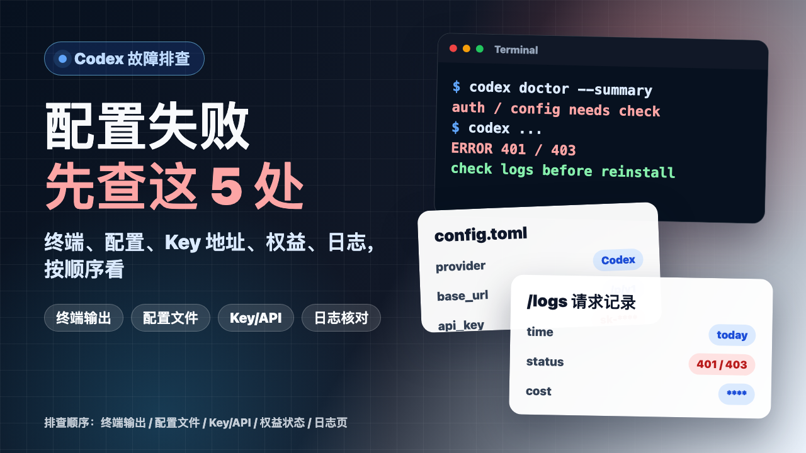

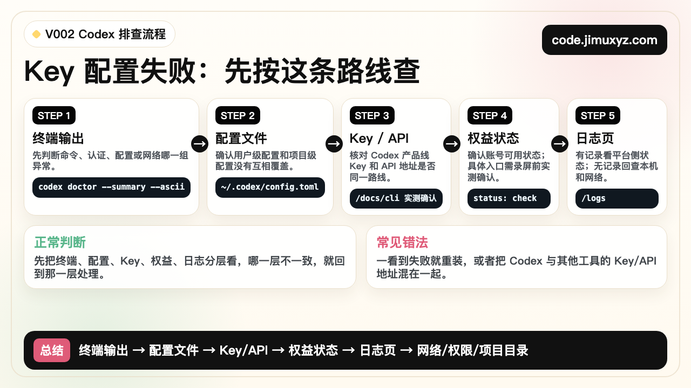

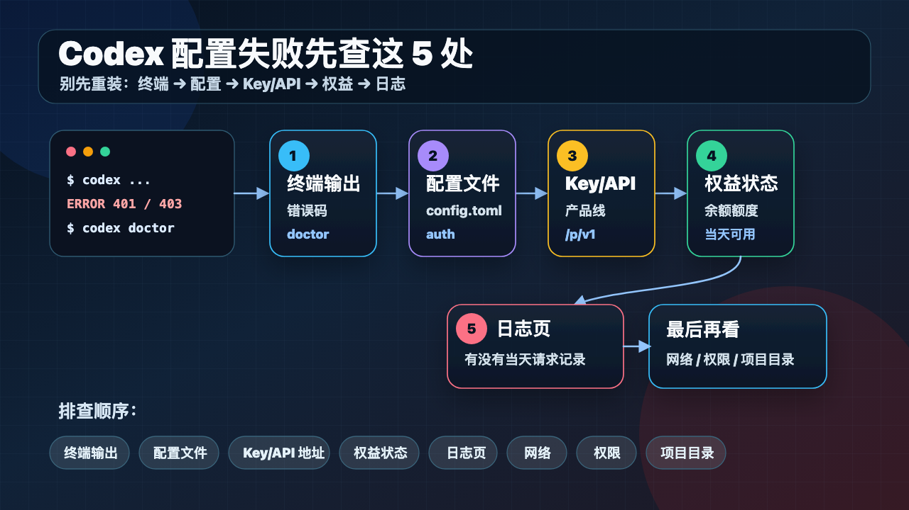

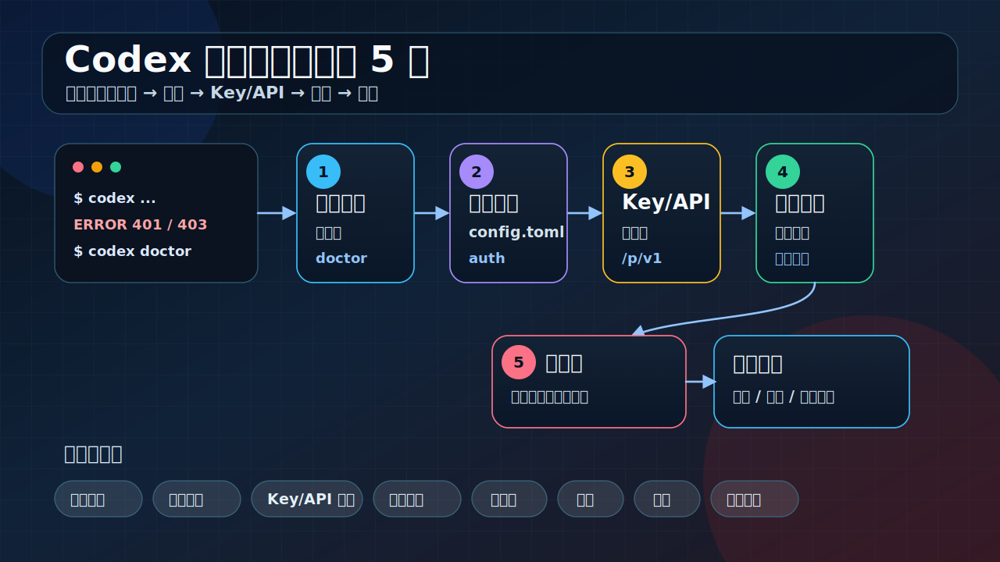

### PPT 步骤图

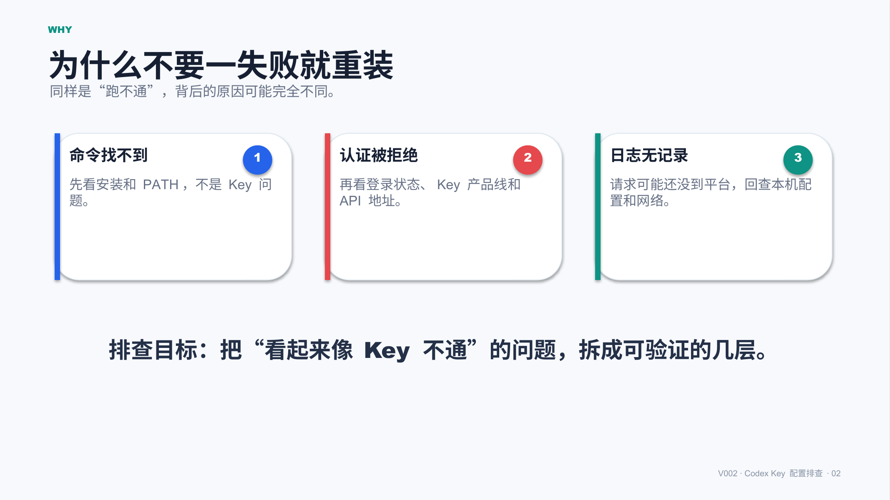

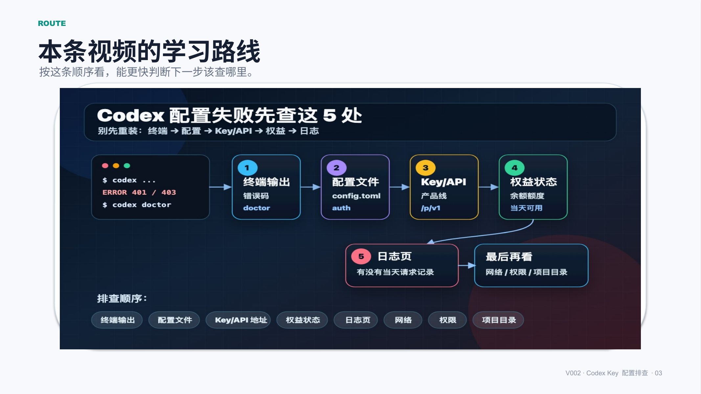

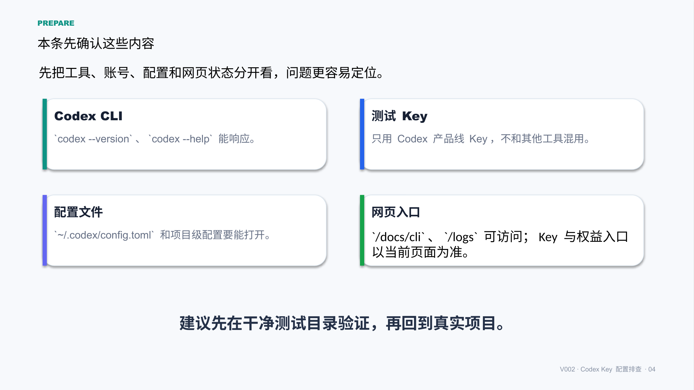

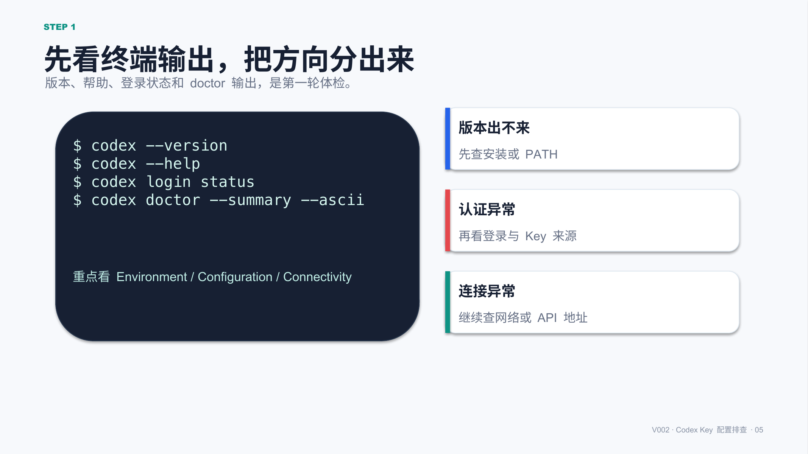

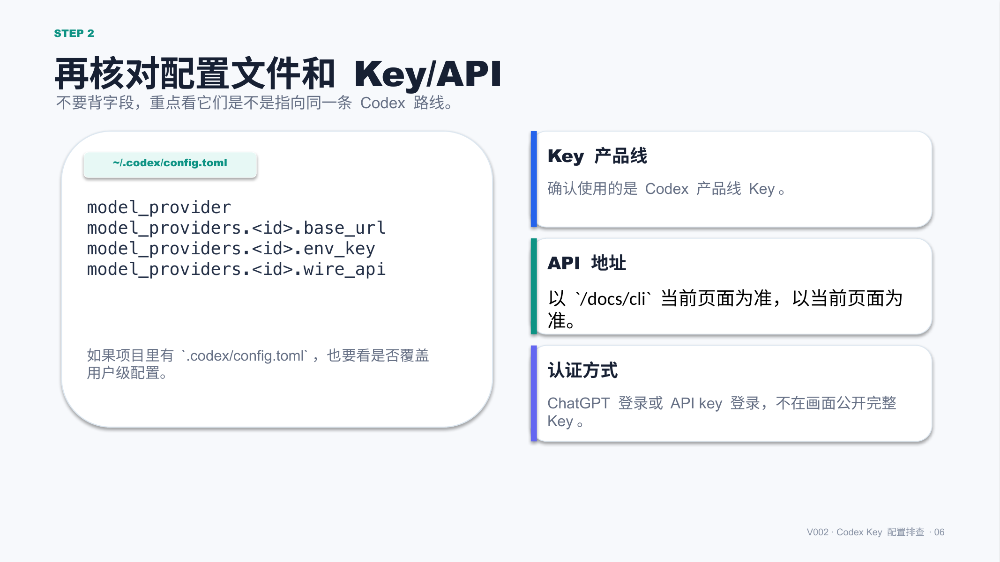

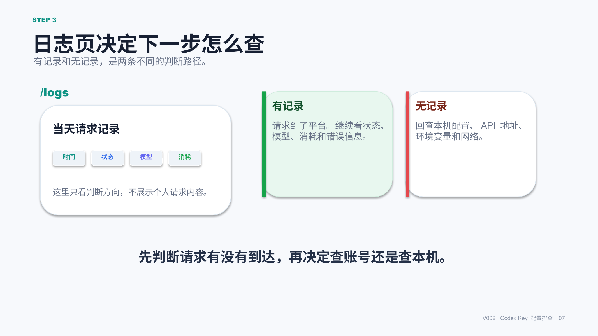

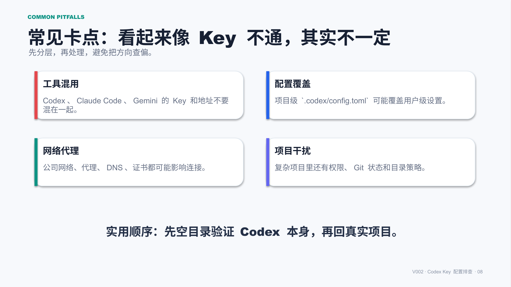

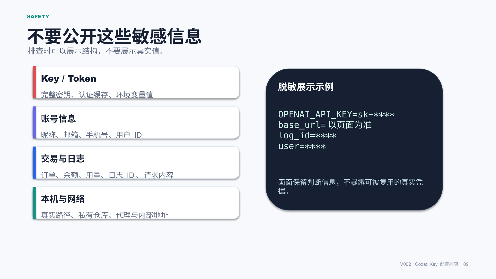

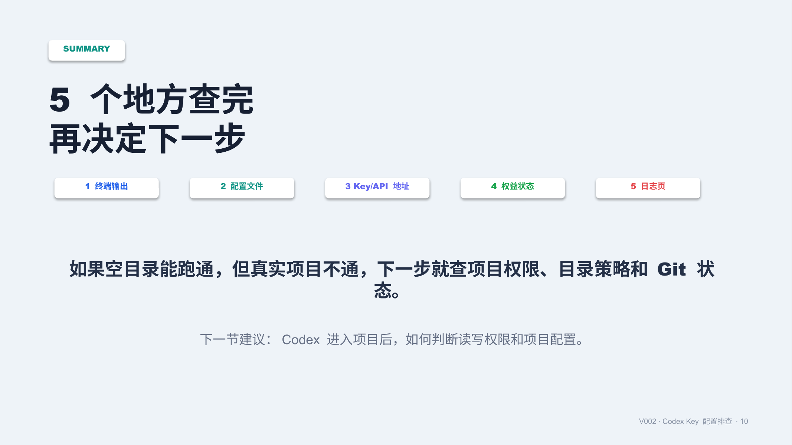

## 标签
#Codex #AI编程 #配置教程 #故障排查 #Key配置 #日志核对 #终端命令 #积木代码助手
