# V004 图文发布稿（带图版）

## 标题

购买前怎么选 Codex 还是 Claude Code

## 前两段短文案

这条视频讲购买前怎么选 Codex 还是 Claude Code。不是工具 PK，也不是完整实战课。

这篇主要解决：容易把 Codex 和 Claude Code 当成同一种命令，买错产品线或创建错 Key。看完你能：先按使用场景做选择，而不是先问“哪个更强”。建议先收藏，操作时对照配图一步步核对。

## 备用标题

购买前怎么选 Codex 还是 Claude Code：按这条路线看就够了

## 完整正文备用

这条视频讲购买前怎么选 Codex 还是 Claude Code。不是工具 PK，也不是完整实战课。重点是先看使用场景，再看产品线和 CLI 文档，用同一个本地小项目做轻量验证，最后去日志页核对请求归属。

本地小项目 `jimuxyz-logo-demo` 不从 GitHub 下载，不使用真实业务代码，只是让两个工具面对同一个项目、同一个任务，方便比较工作流。

这篇适合刚开始接触积木代码助手、Codex 或 Claude Code 的同学。不要只盯着一个按钮或一条命令，建议按图里的顺序看：先看当前问题，再看操作路径，最后确认结果有没有真正跑通。

常见卡点：
容易把 Codex 和 Claude Code 当成同一种命令，买错产品线或创建错 Key
不知道短任务、小步改代码、代码审查、长项目阅读、文档沉淀分别适合先看哪种工具路线
不知道两者配置文件和权限入口不同：Codex 侧偏 `~/.codex/config.toml`、sandbox/approval；Claude Code 侧偏 `~/.claude/settings.json`、`.claude/settings.local.json`、permission mode
不知道最后要去 `/logs` 核对请求是否走到了对应产品线

看完这篇，你应该能做到：
先按使用场景做选择，而不是先问“哪个更强”
分清 Codex 和 Claude Code 的画面：两个终端、两套命令、两套配置路径、两套权限提示
知道购买前要先看 `https://code.jimuxyz.com/pricing` 和 `https://code.jimuxyz.com/docs/cli`，并在登录后确认对应 Key/产品线入口
会用同一个本地小项目做轻量验证：两个工具读同一项目、面对同一任务、再看日志归属

我的建议是，第一次操作时不要一边改很多地方，一边猜原因。先把页面、终端输出、配置文件、日志记录这几块分开看，哪一步不一致，就从那一步往回查。

如果你也在配置或使用 AI 编程工具，可以先收藏这篇。后面遇到类似问题时，按这条路线重新核对一遍，通常能更快判断下一步该看哪里。

## 配图说明

首图用 `cover-flow-images/V004-cover-douyin.png`。
第二张用 `cover-flow-images/V004-flow.png`。
后面从 `ppt-images/slide-01.png` 到 `ppt-images/slide-08.png` 里选关键步骤图。
如果平台限制图片数量，优先保留：流程图、关键操作、常见错误、结果确认。

## 配图预览

### 首图与流程图

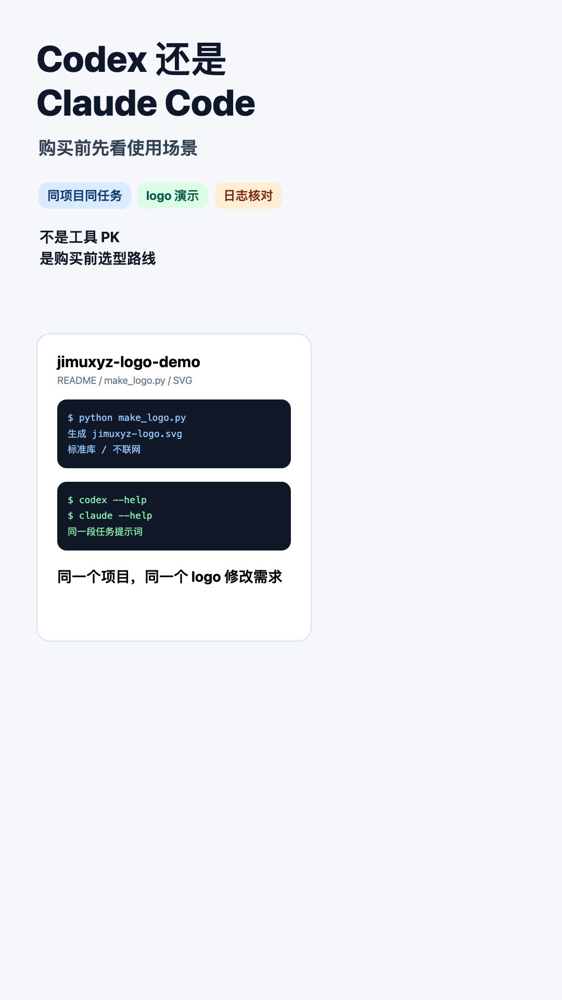

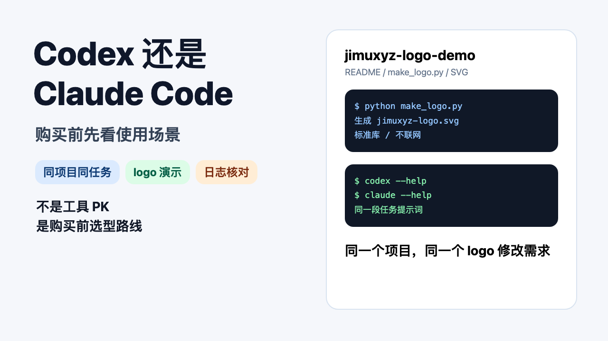

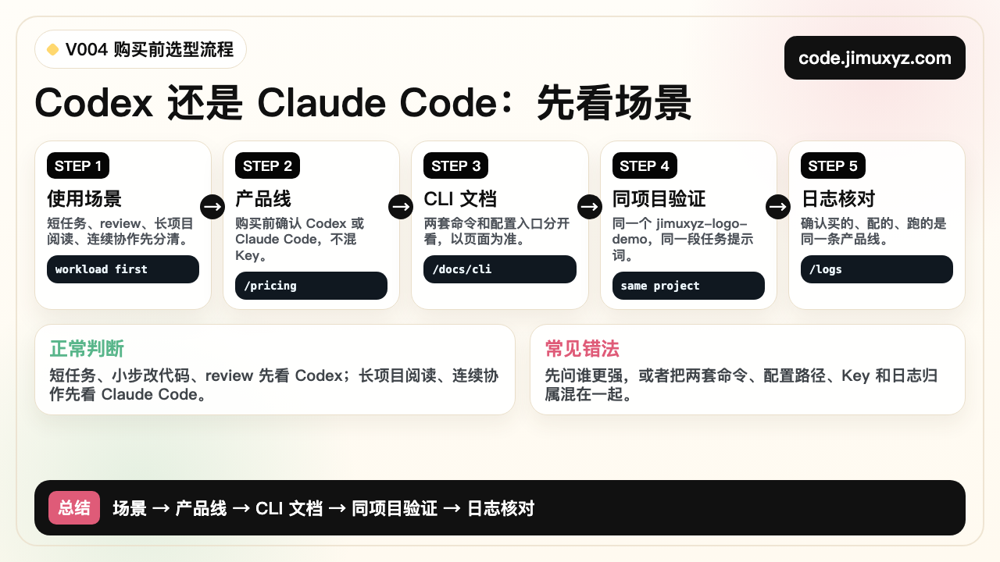

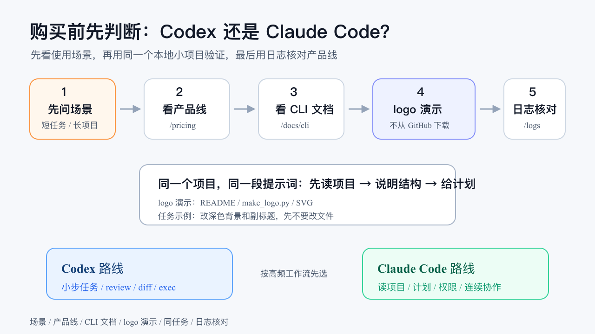

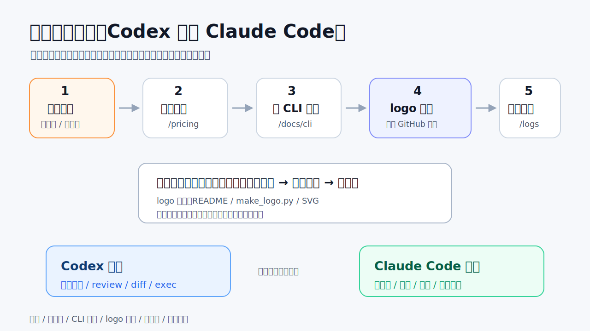

### PPT 步骤图

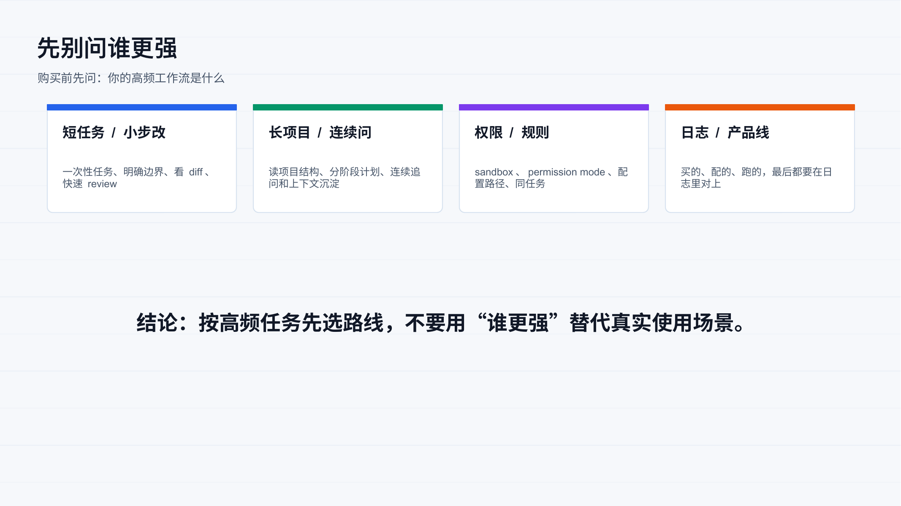

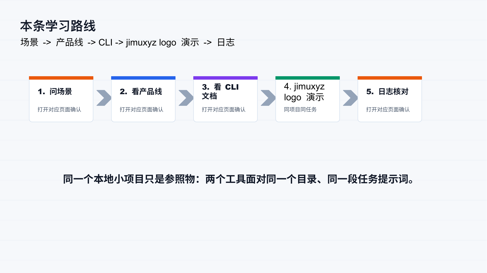

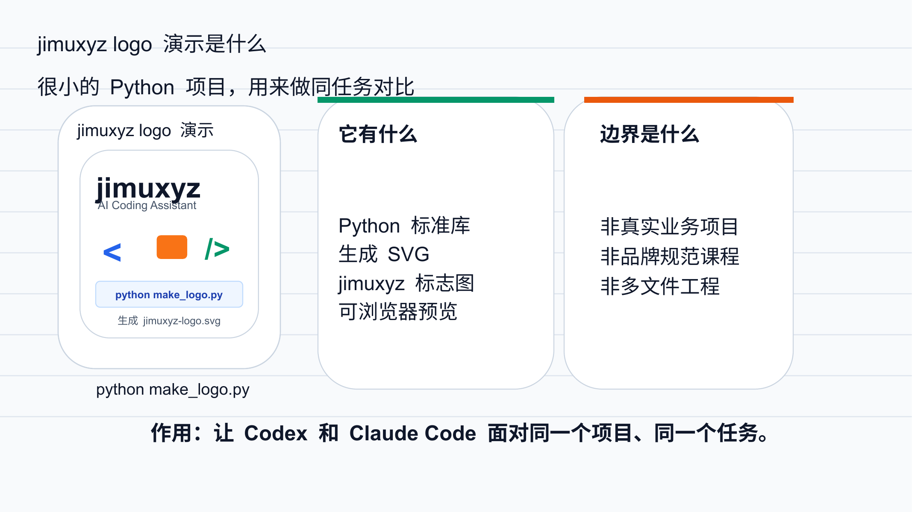

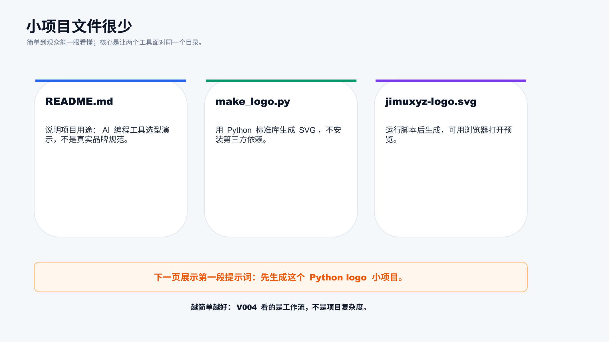

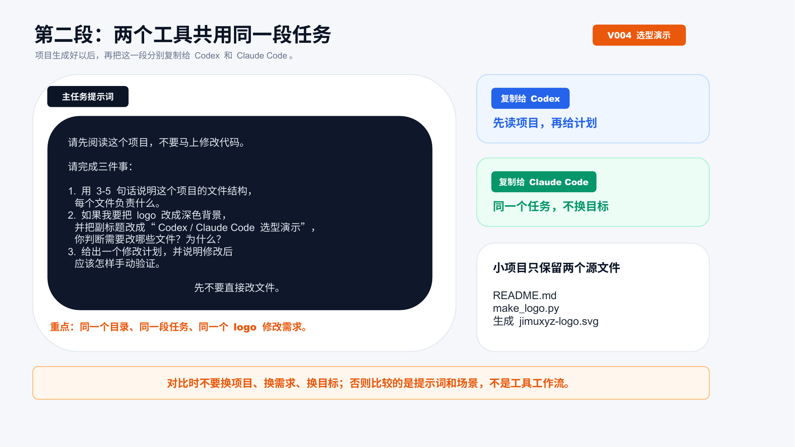

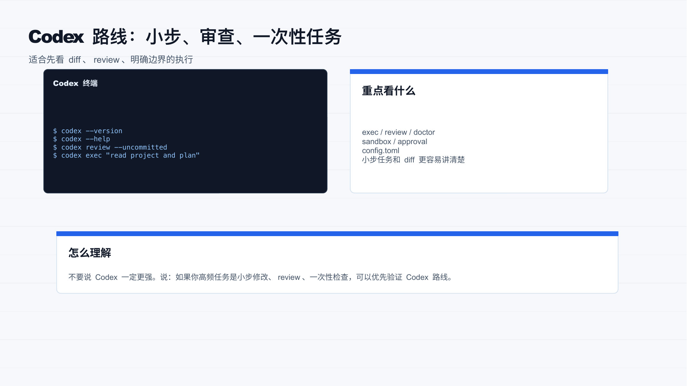

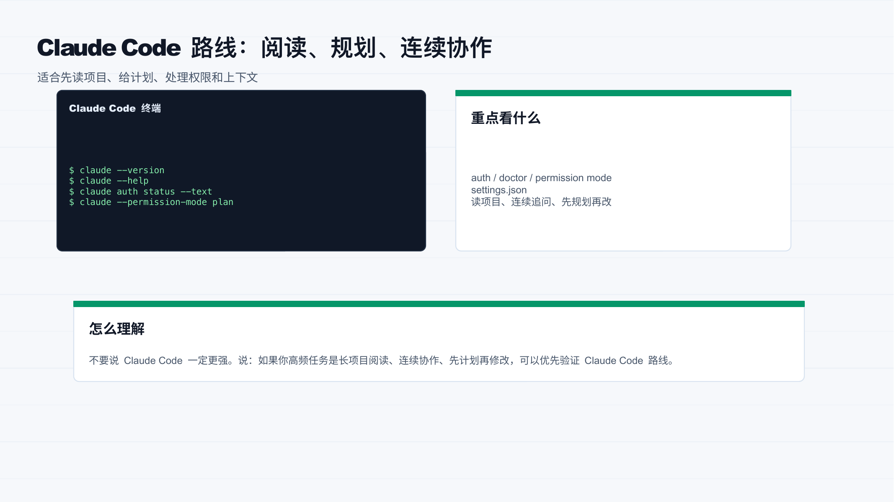

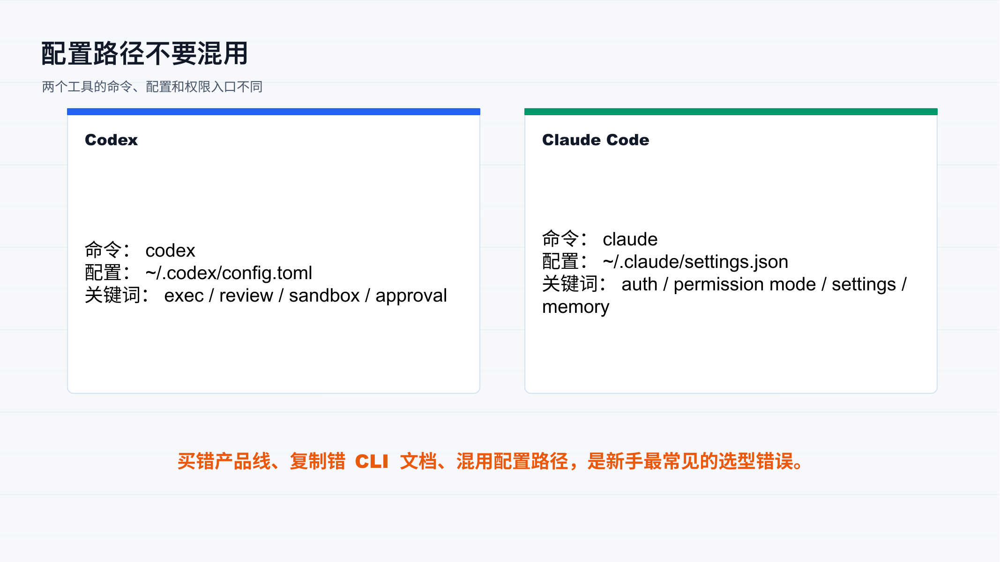

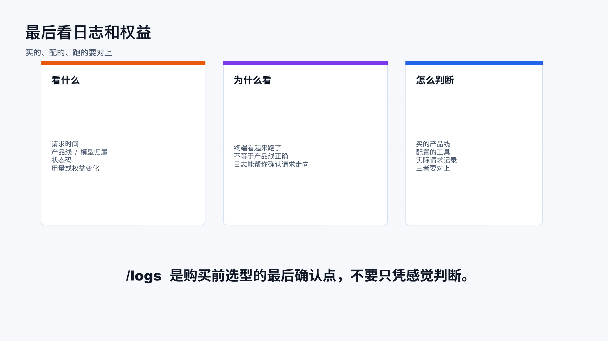

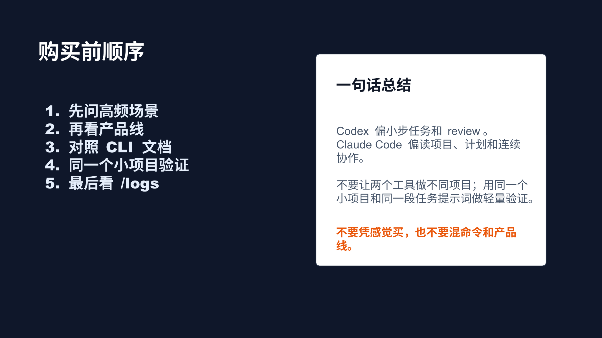

## 标签
#Codex #ClaudeCode #AI编程 #对比选型 #配置教程 #日志核对 #积木代码助手 #购买前避坑
