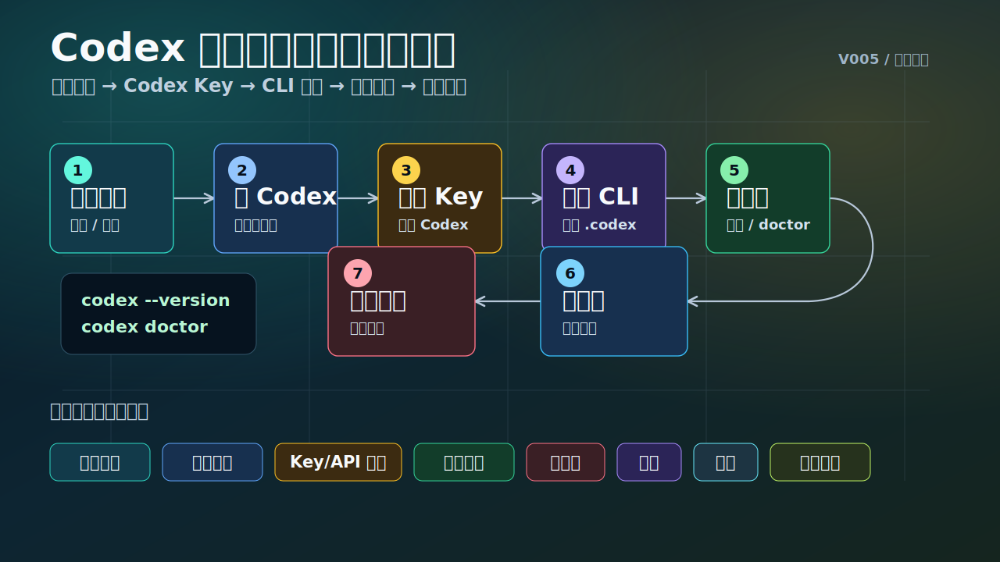
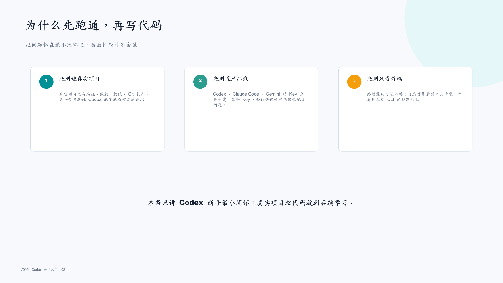
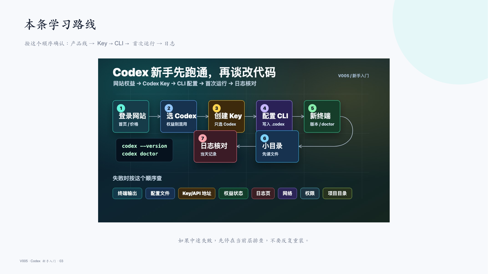
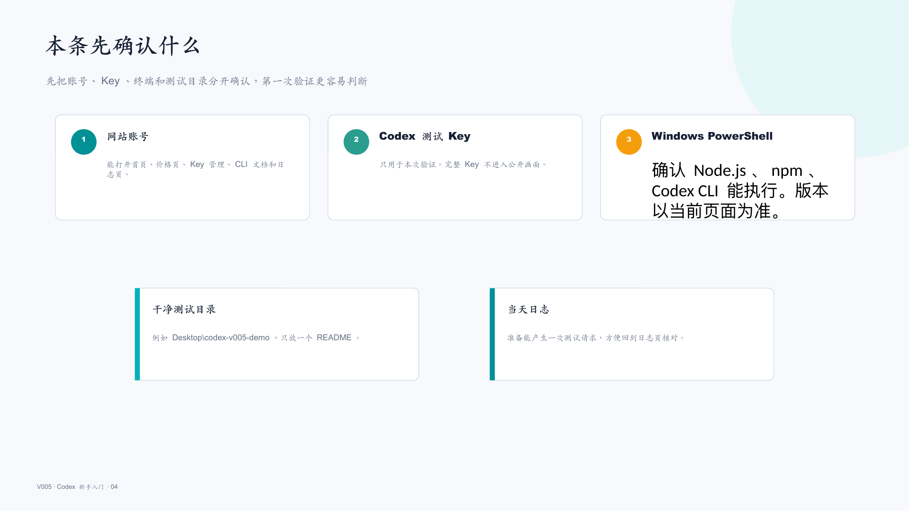
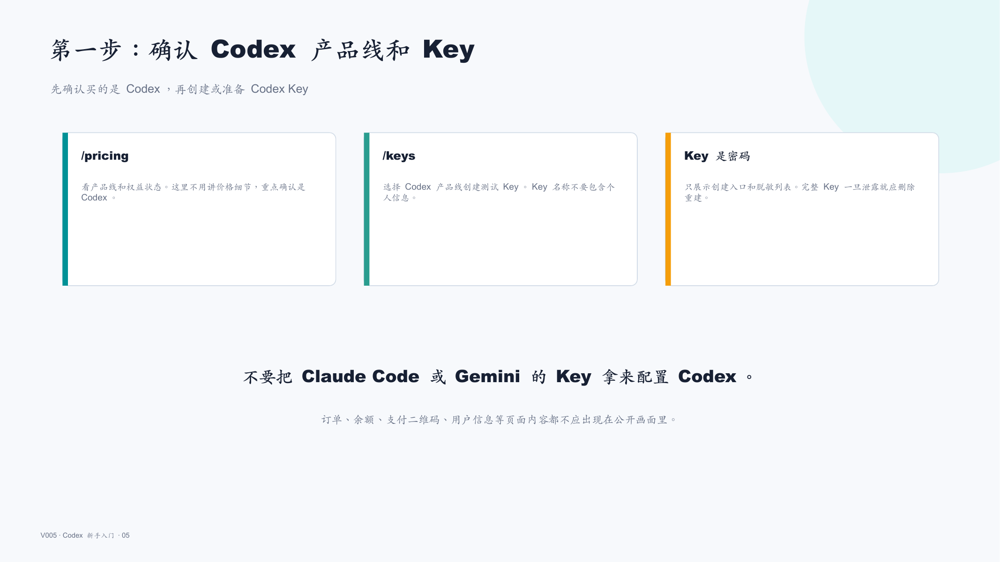
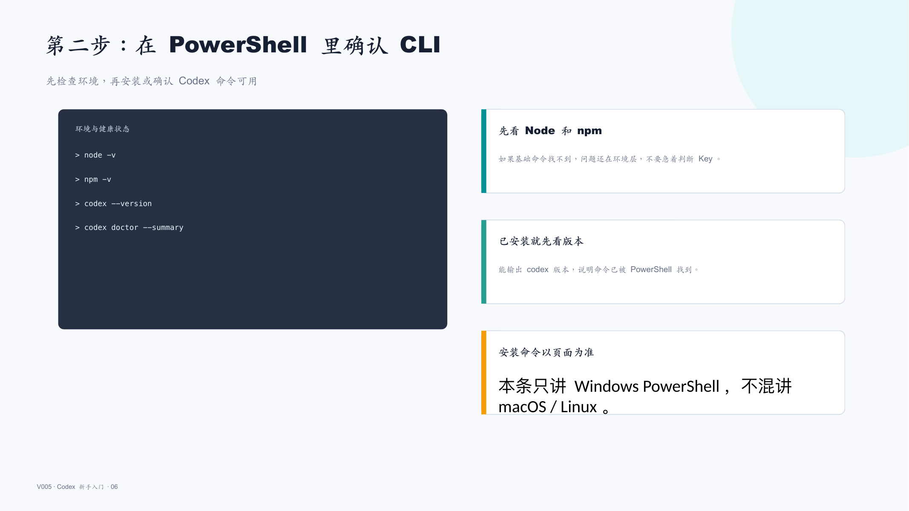
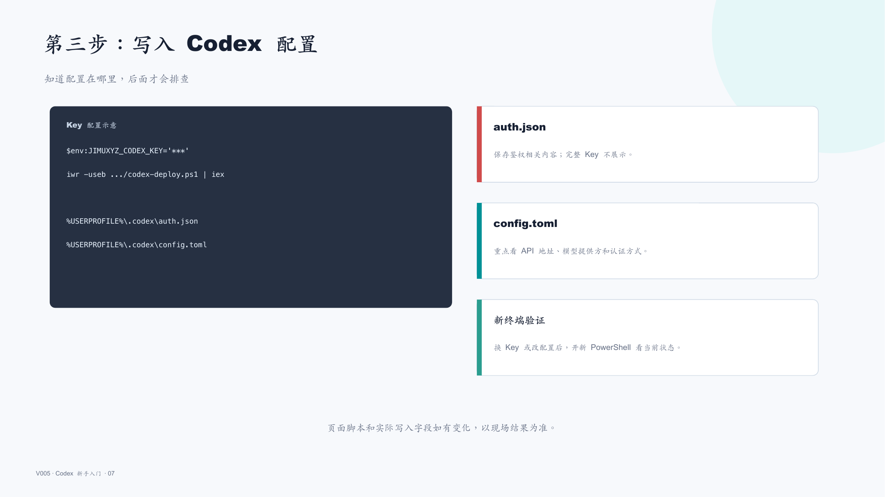
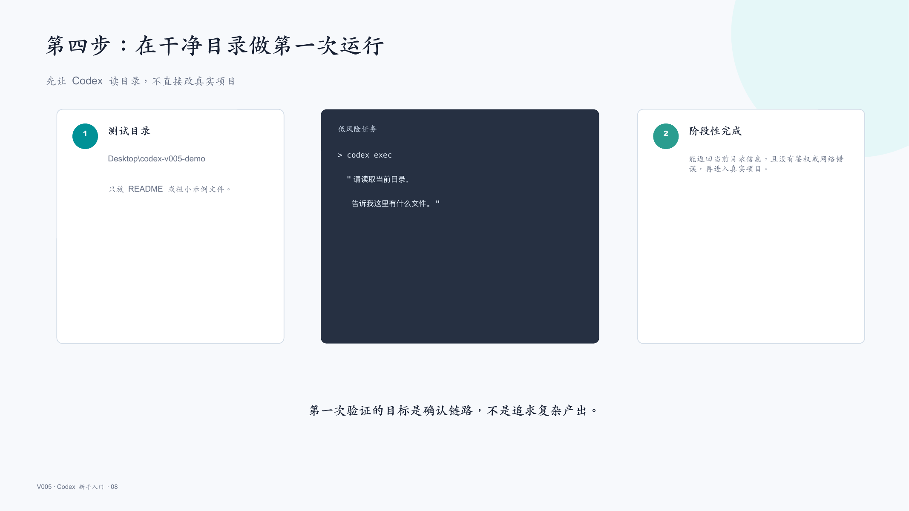
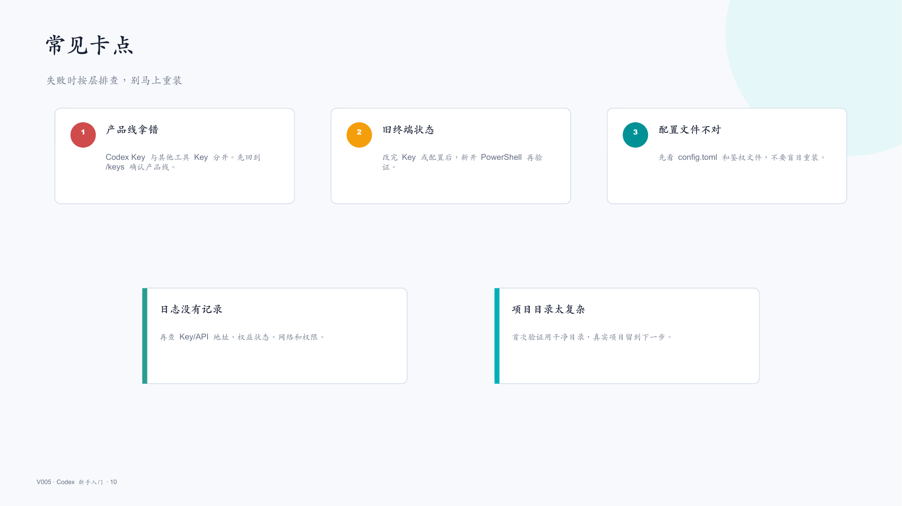
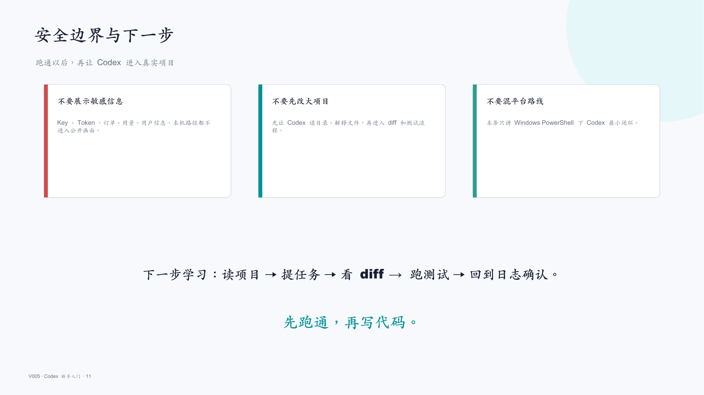

# V005 图文发布稿（带图版）

## 标题

Codex 新手教程：从 Key 配置到第一次运行和日志核对

## 前两段短文案

这条视频按真实录屏路线演示 Codex 新手第一步：先在积木代码助手确认 Codex 产品线和 Key，再按 Windows PowerShell 配置 CLI，最后用一个干净测试目录做首次运行，并回到用量日志核对记录。

这篇主要解决：一上来就让 Codex 改真实项目，结果失败后不知道是 Key、配置、权益、网络还是项目目录问题。看完你能：从积木代码助手网站确认 Codex 产品线、价格/权益、Key 管理和 CLI 文档入口。建议先收藏，操作时对照配图一步步核对。

## 备用标题

Codex 别急着改项目，先把 Key、配置和日志跑通
Codex 入门第 1 集：新手从 0 到 1 的第一条路线

## 完整正文备用

这条视频按真实录屏路线演示 Codex 新手第一步：先在积木代码助手确认 Codex 产品线和 Key，再按 Windows PowerShell 配置 CLI，最后用一个干净测试目录做首次运行，并回到用量日志核对记录。重点不是炫复杂项目，而是让你知道失败时该先看终端输出、配置文件、Key/API 地址、权益状态和日志页。

这篇适合刚开始接触积木代码助手、Codex 或 Claude Code 的同学。不要只盯着一个按钮或一条命令，建议按图里的顺序看：先看当前问题，再看操作路径，最后确认结果有没有真正跑通。

常见卡点：
一上来就让 Codex 改真实项目，结果失败后不知道是 Key、配置、权益、网络还是项目目录问题
Codex / Claude Code / Gemini 的 Key 产品线混用，终端报错后反复重装
配置写入了 `~/.codex/auth.json` 和 `~/.codex/config.toml`，但没有重开终端，也没有开新会话验证
不知道用量日志只看当天记录，录屏时没有提前准备登录态和可用额度

看完这篇，你应该能做到：
从积木代码助手网站确认 Codex 产品线、价格/权益、Key 管理和 CLI 文档入口
在 Windows PowerShell 中检查 Node.js / npm，安装或确认 Codex CLI
用 Codex Key 写入 `~/.codex/auth.json` 与 `~/.codex/config.toml`，并知道关键配置项在哪里看
在干净测试目录里启动一次 Codex，先做“小任务验证”，再去真实项目

我的建议是，第一次操作时不要一边改很多地方，一边猜原因。先把页面、终端输出、配置文件、日志记录这几块分开看，哪一步不一致，就从那一步往回查。

如果你也在配置或使用 AI 编程工具，可以先收藏这篇。后面遇到类似问题时，按这条路线重新核对一遍，通常能更快判断下一步该看哪里。

## 配图说明

首图用 `cover-flow-images/V005-cover-douyin.png`。
第二张用 `cover-flow-images/V005-flow.png`。
后面从 `ppt-images/slide-01.png` 到 `ppt-images/slide-08.png` 里选关键步骤图。
如果平台限制图片数量，优先保留：流程图、关键操作、常见错误、结果确认。

## 配图预览

### 首图与流程图

### PPT 步骤图

## 标签
#Codex #积木代码助手 #AI编程 #配置教程 #Key配置 #日志核对 #CLI #入门
