# V008 图文发布稿（带图版）

## 标题

Windows 上怎么安装 Claude Code？PowerShell 到第一次提问完整路线

## 前两段短文案

这条视频演示 Windows 上安装 Claude Code 的完整前期路线：先检查 Node.js、npm、Git，再按积木代码助手 CLI 文档配置 Claude Code Key 和 API 地址，最后用 `claude --version`、`claude doctor`、第一次提问和日志页核对结果。

这篇主要解决：不确定 Claude Code 在 Windows 上该用官方安装脚本、WinGet，还是积木站文档里的 npm 镜像方式。看完你能：在 Windows PowerShell 里按顺序检查 Node.js、npm、Git / Git Bash。建议先收藏，操作时对照配图一步步核对。

## 备用标题

Claude Code 在 Windows 跑不起来？先按这条安装顺序检查
Claude Code 入门 02：Windows 安装、配置 Key、第一次提问

## 完整正文备用

这条视频演示 Windows 上安装 Claude Code 的完整前期路线：先检查 Node.js、npm、Git，再按积木代码助手 CLI 文档配置 Claude Code Key 和 API 地址，最后用 `claude --version`、`claude doctor`、第一次提问和日志页核对结果。视频里会单独说明官方安装入口、积木站脚本路线、Key 打码和重开终端这些容易漏掉的细节。

这篇适合刚开始接触积木代码助手、Codex 或 Claude Code 的同学。不要只盯着一个按钮或一条命令，建议按图里的顺序看：先看当前问题，再看操作路径，最后确认结果有没有真正跑通。

常见卡点：
不确定 Claude Code 在 Windows 上该用官方安装脚本、WinGet，还是积木站文档里的 npm 镜像方式
不知道 Claude Code Key 和 Codex Key 不能混用
配置 Key 后没有重开终端，导致环境变量没有生效
不清楚 Git / Git Bash 在 Windows 上的作用，把 Git 缺失、权限提示、Key 错误混成一个问题

看完这篇，你应该能做到：
在 Windows PowerShell 里按顺序检查 Node.js、npm、Git / Git Bash
读懂积木站 `/docs/cli` 里 Claude Code 的 Windows 安装与配置命令
知道 Anthropic 官方当前推荐的 Windows 安装入口，以及积木站脚本路线需要录屏前实测确认的点
配置 Claude Code 的 Key 和 API 地址后，重开终端验证 `claude --version`、`claude doctor`、`claude auth status --text`

我的建议是，第一次操作时不要一边改很多地方，一边猜原因。先把页面、终端输出、配置文件、日志记录这几块分开看，哪一步不一致，就从那一步往回查。

如果你也在配置或使用 AI 编程工具，可以先收藏这篇。后面遇到类似问题时，按这条路线重新核对一遍，通常能更快判断下一步该看哪里。

## 配图说明

首图用 `cover-flow-images/V008-cover-douyin.png`。
第二张用 `cover-flow-images/V008-flow.png`。
后面从 `ppt-images/slide-01.png` 到 `ppt-images/slide-08.png` 里选关键步骤图。
如果平台限制图片数量，优先保留：流程图、关键操作、常见错误、结果确认。

## 配图预览

### 首图与流程图

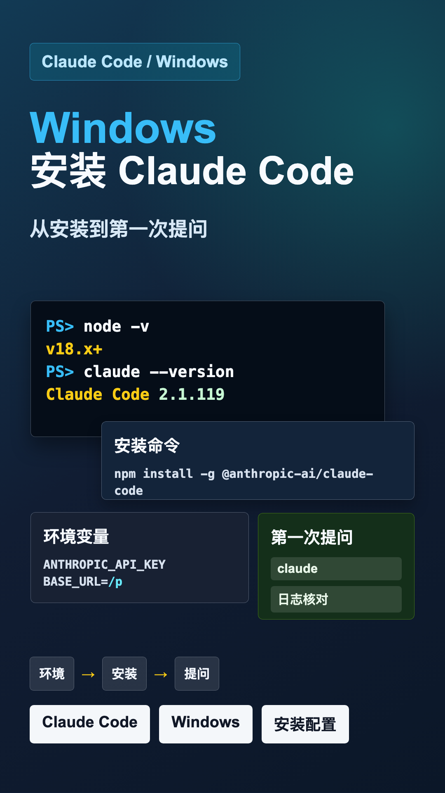

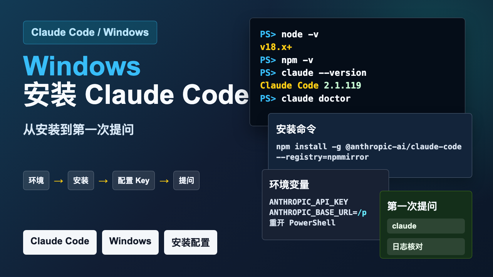

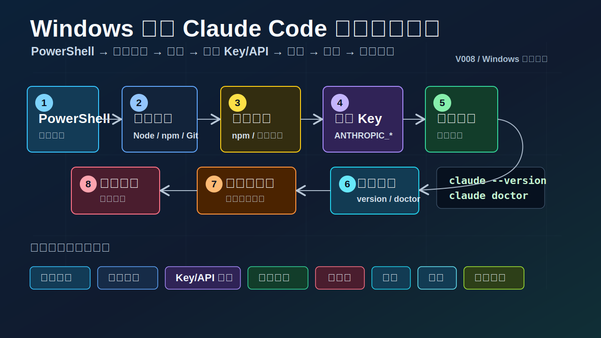

### PPT 步骤图

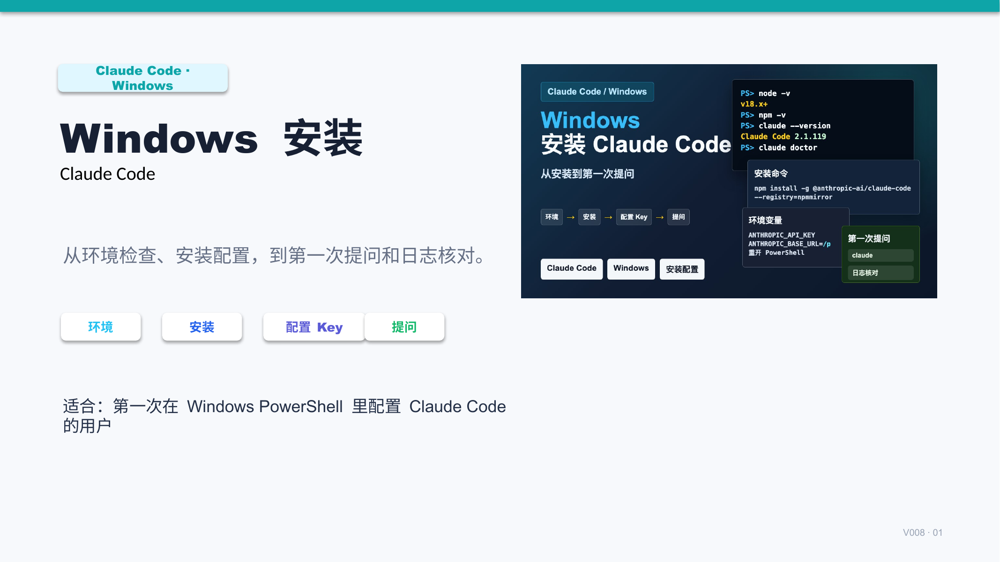

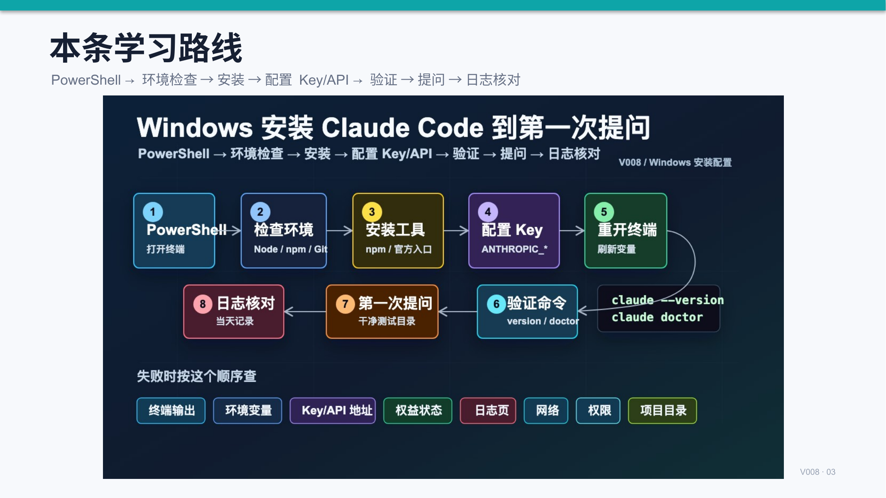

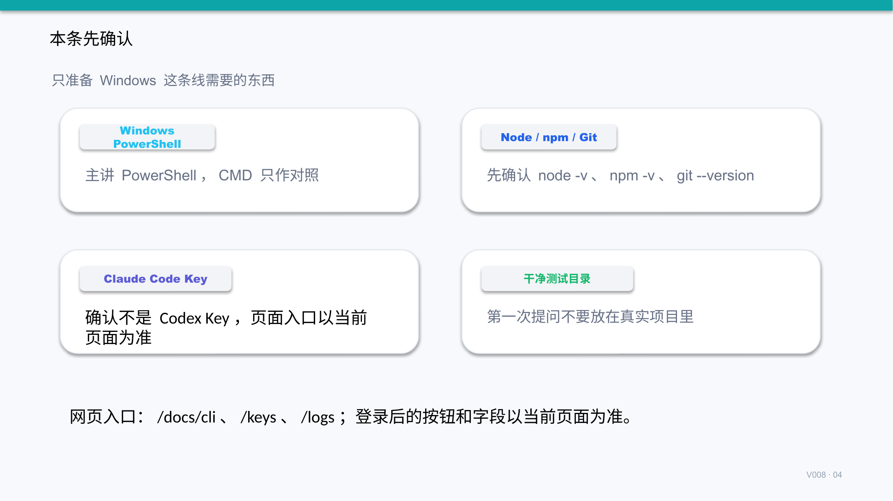

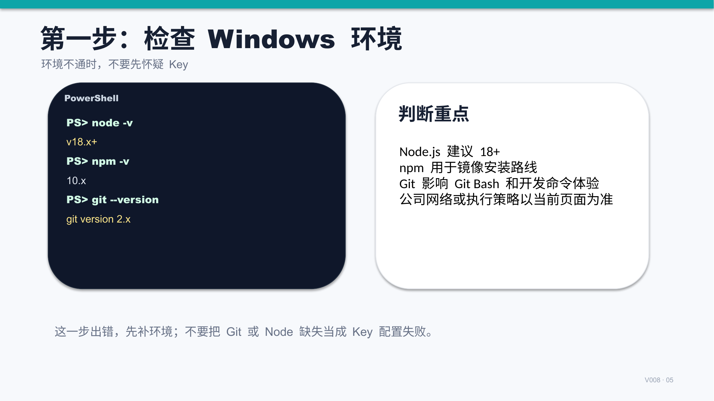

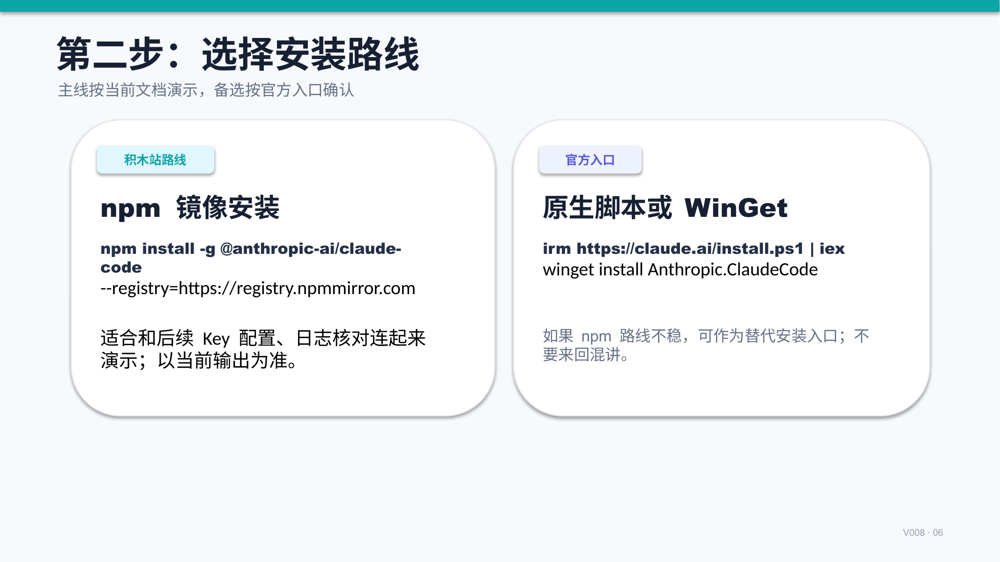

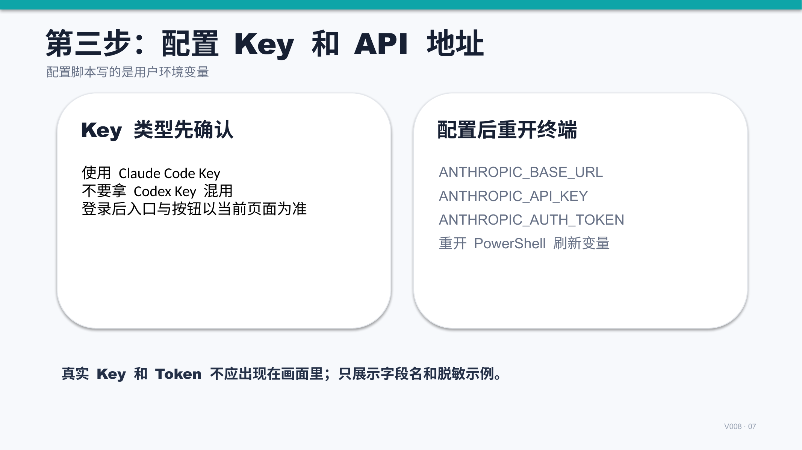

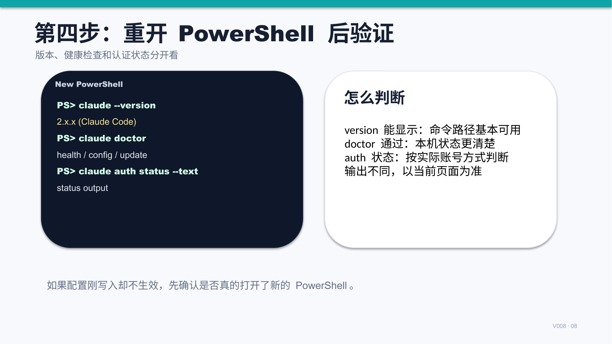

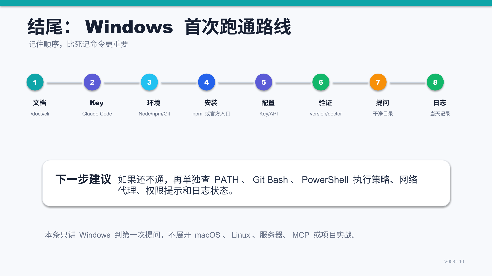

## 标签
#ClaudeCode #Windows #AI编程 #配置教程 #PowerShell #Key配置 #日志核对
