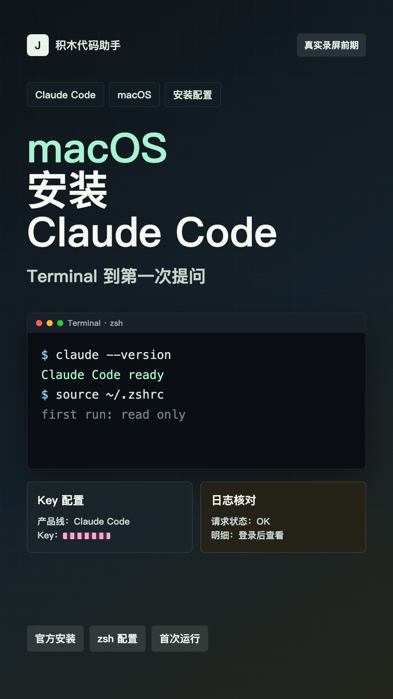
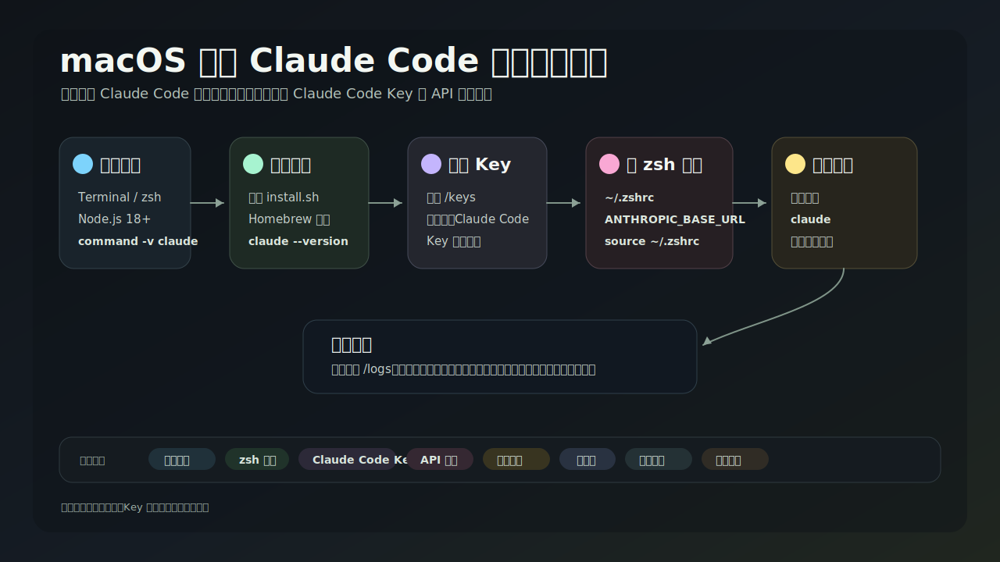

# V012 图文发布稿（带图版）

## 标题

macOS 上安装 Claude Code 到第一次提问

## 前两段短文案

这条录屏前期包对应 V012：macOS 上安装 Claude Code 到第一次提问。

这篇主要解决：不知道 macOS 终端里到底该复制哪条安装命令。看完你能：在 macOS Terminal / zsh 环境里检查 Node.js、npm、Claude Code 是否可用。建议先收藏，操作时对照配图一步步核对。

## 备用标题

macOS 上安装 Claude Code 到第一次提问：按这条路线看就够了

## 完整正文备用

这条录屏前期包对应 V012：macOS 上安装 Claude Code 到第一次提问。视频会按真实操作顺序讲：先检查 Terminal / zsh / Node.js 环境，再按官方方式安装 Claude Code，之后在积木代码助手创建 Claude Code Key、写入 `~/.zshrc`，最后进入测试目录运行 `claude` 做第一次只读提问。遇到问题时，按终端输出、配置文件、Key/API 地址、权益状态、日志页、网络和项目目录的顺序排查。

这篇适合刚开始接触积木代码助手、Codex 或 Claude Code 的同学。不要只盯着一个按钮或一条命令，建议按图里的顺序看：先看当前问题，再看操作路径，最后确认结果有没有真正跑通。

常见卡点：
不知道 macOS 终端里到底该复制哪条安装命令
分不清 Claude Code、Codex、Gemini 的 Key 是否通用
装完 `claude` 后终端提示 command not found，不知道是 PATH、终端未重开，还是安装失败
配置 API 地址和 Key 时容易把 Key 截图公开，或写进错误文件

看完这篇，你应该能做到：
在 macOS Terminal / zsh 环境里检查 Node.js、npm、Claude Code 是否可用
按官方推荐方式安装 Claude Code，并知道 Homebrew 是备选方案，npm 安装不作为主推路线
在积木代码助手网站找到 Claude Code 的 Key 管理、CLI 安装与配置、用量日志页面
将 Claude Code Key 和积木 API 地址写入 macOS shell 配置，并知道要重新打开终端或 `source ~/.zshrc`

我的建议是，第一次操作时不要一边改很多地方，一边猜原因。先把页面、终端输出、配置文件、日志记录这几块分开看，哪一步不一致，就从那一步往回查。

如果你也在配置或使用 AI 编程工具，可以先收藏这篇。后面遇到类似问题时，按这条路线重新核对一遍，通常能更快判断下一步该看哪里。

## 配图说明

首图用 `cover-flow-images/V012-cover-douyin.png`。
第二张用 `cover-flow-images/V012-flow.png`。
后面从 `ppt-images/slide-01.png` 到 `ppt-images/slide-08.png` 里选关键步骤图。
如果平台限制图片数量，优先保留：流程图、关键操作、常见错误、结果确认。

## 配图预览

### 首图与流程图

### PPT 步骤图

## 标签
#ClaudeCode #macOS #AI编程 #积木代码助手 #CLI #安装 #zsh #配置
