# V013 图文发布稿（带图版）

## 标题

Linux 服务器安装 Codex 教程：SSH、Node、Key 配置到第一次提问

## 前两段短文案

这条录屏演示 Linux 服务器上安装 Codex 的完整前期路线：SSH 登录、确认普通用户、检查 Node/npm/Git、安装 Codex、配置积木代码助手 Codex Key、第一次低风险提问，并到用量日志核对请求。

这篇主要解决：只会在本地电脑装 Codex，不知道服务器上先检查什么。看完你能：在 Linux 服务器上按顺序检查 SSH、当前用户、系统、Node.js、npm、Git。建议先收藏，操作时对照配图一步步核对。

## 备用标题

Codex 在服务器上跑不起来？先按这个顺序检查
积木代码助手实操 013：Linux 服务器上安装 Codex 到第一次提问

## 完整正文备用

这条录屏演示 Linux 服务器上安装 Codex 的完整前期路线：SSH 登录、确认普通用户、检查 Node/npm/Git、安装 Codex、配置积木代码助手 Codex Key、第一次低风险提问，并到用量日志核对请求。重点不是堆命令，而是把服务器权限、配置路径和排查顺序讲清楚。

这篇适合刚开始接触积木代码助手、Codex 或 Claude Code 的同学。不要只盯着一个按钮或一条命令，建议按图里的顺序看：先看当前问题，再看操作路径，最后确认结果有没有真正跑通。

常见卡点：
只会在本地电脑装 Codex，不知道服务器上先检查什么
容易直接用 root 装工具、写 Key，把配置放进 `/root/.codex`
不知道 `~/.codex/auth.json`、`~/.codex/config.toml` 分别负责什么
把 Key 直接粘进命令历史、录屏画面或日志里

看完这篇，你应该能做到：
在 Linux 服务器上按顺序检查 SSH、当前用户、系统、Node.js、npm、Git
用 Codex 的 Linux 路线完成安装和版本验证
用积木代码助手的 Codex Key 写入 `~/.codex/auth.json` 和 `~/.codex/config.toml`
在一个干净测试目录里完成第一次低风险提问

我的建议是，第一次操作时不要一边改很多地方，一边猜原因。先把页面、终端输出、配置文件、日志记录这几块分开看，哪一步不一致，就从那一步往回查。

如果你也在配置或使用 AI 编程工具，可以先收藏这篇。后面遇到类似问题时，按这条路线重新核对一遍，通常能更快判断下一步该看哪里。

## 配图说明

首图用 `cover-flow-images/V013-cover-douyin.png`。
第二张用 `cover-flow-images/V013-flow.png`。
后面从 `ppt-images/slide-01.png` 到 `ppt-images/slide-08.png` 里选关键步骤图。
如果平台限制图片数量，优先保留：流程图、关键操作、常见错误、结果确认。

## 配图预览

### 首图与流程图

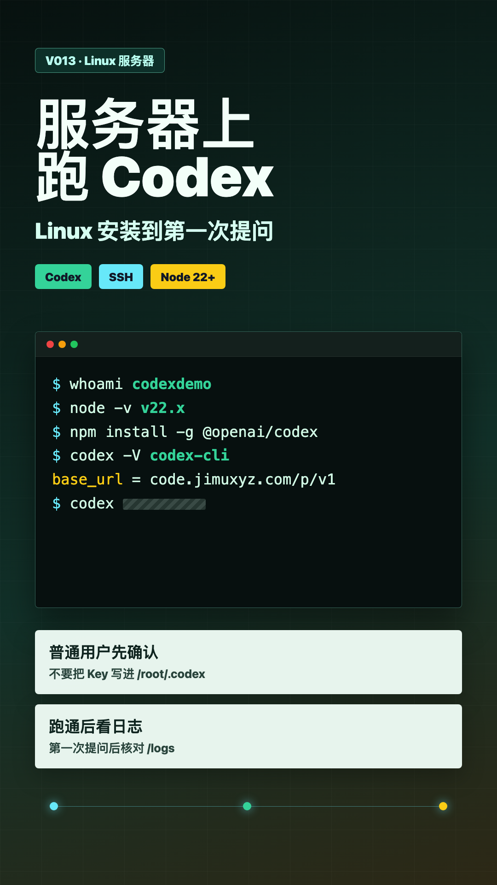

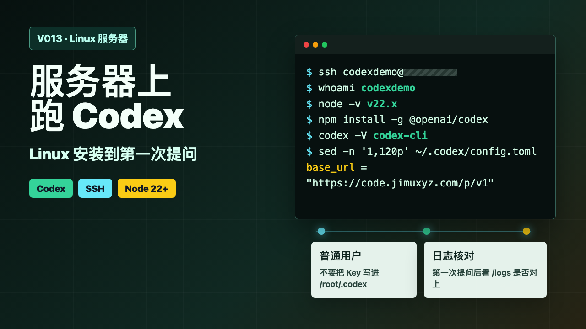

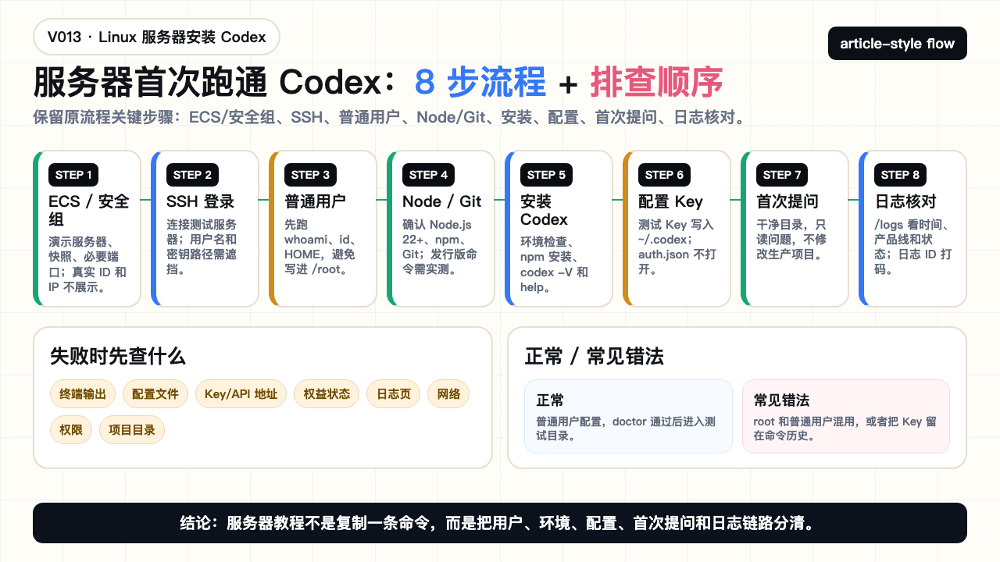

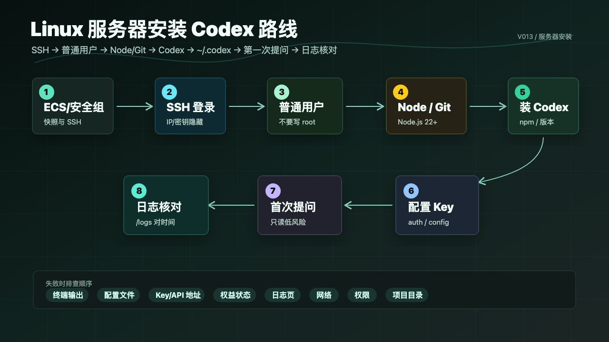

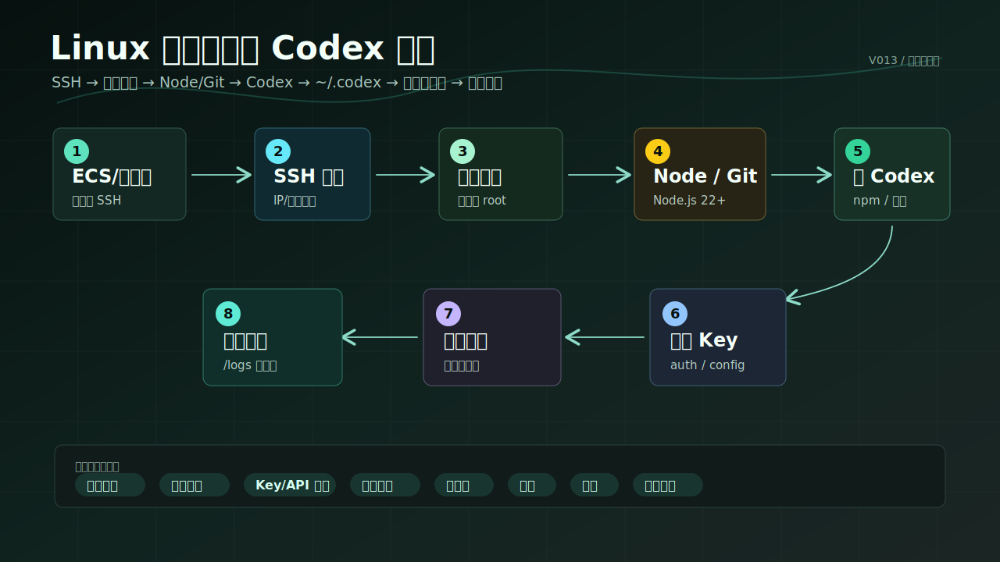

### PPT 步骤图

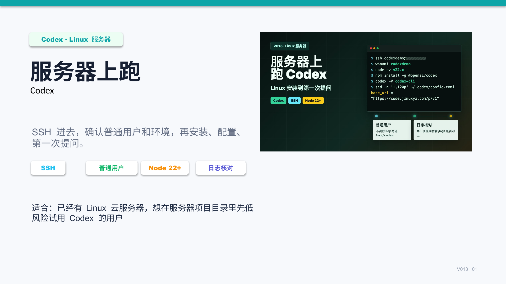

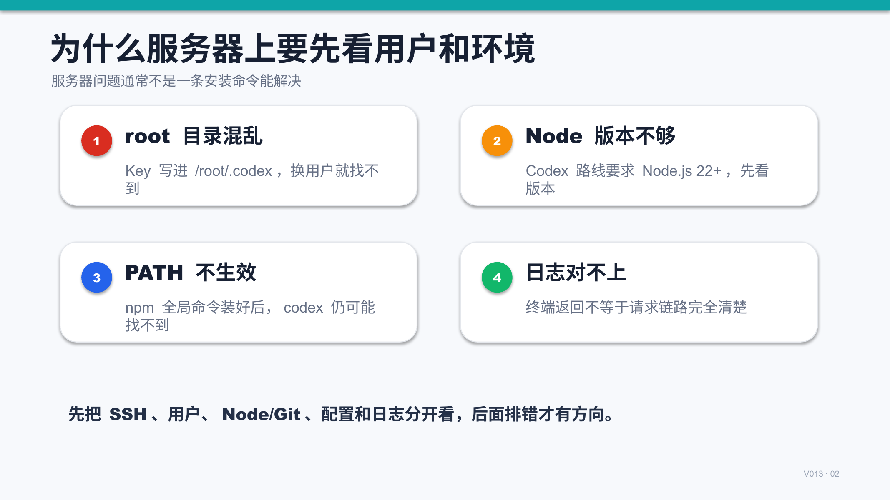

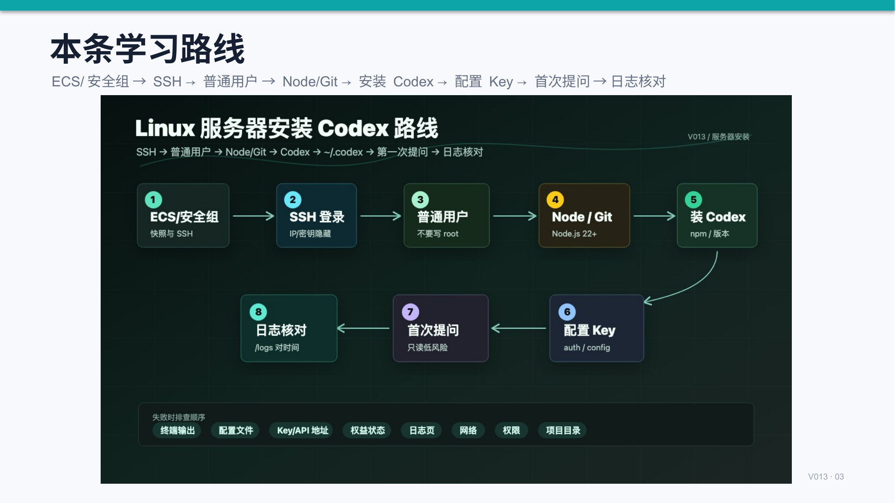

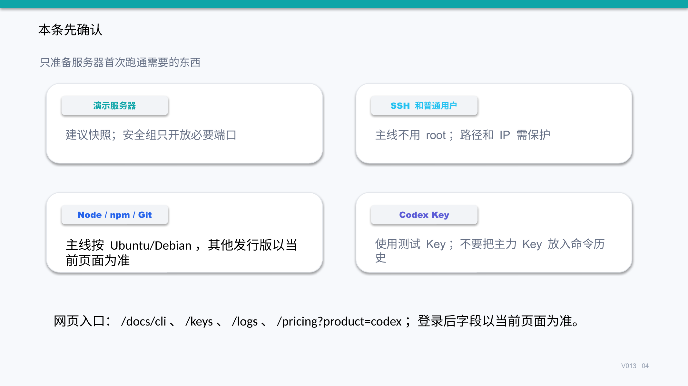

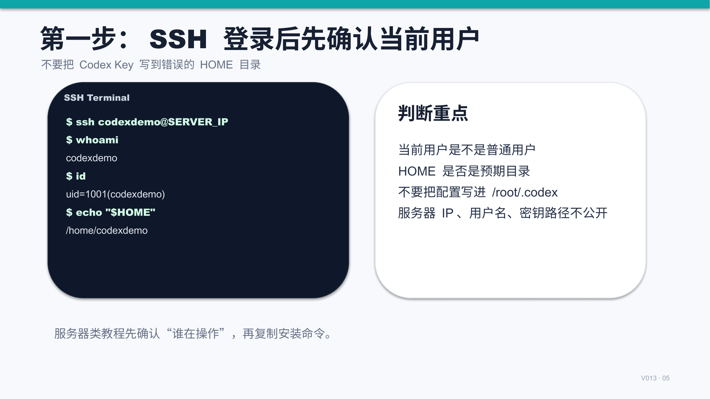

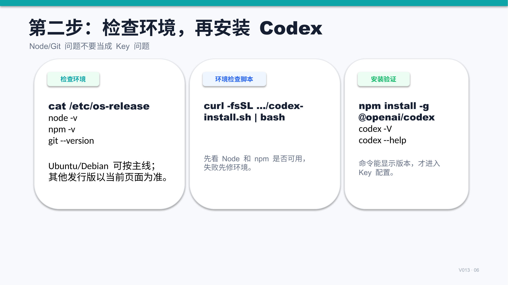

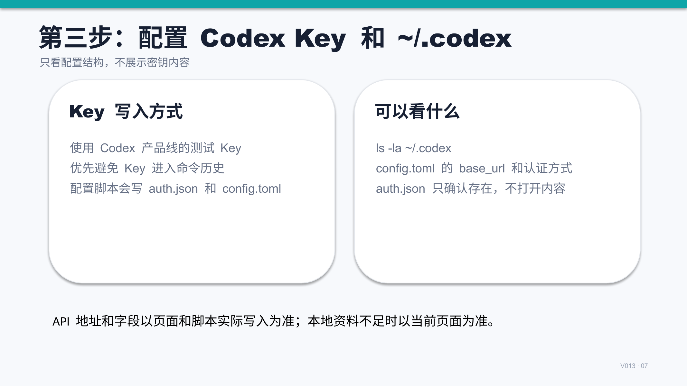

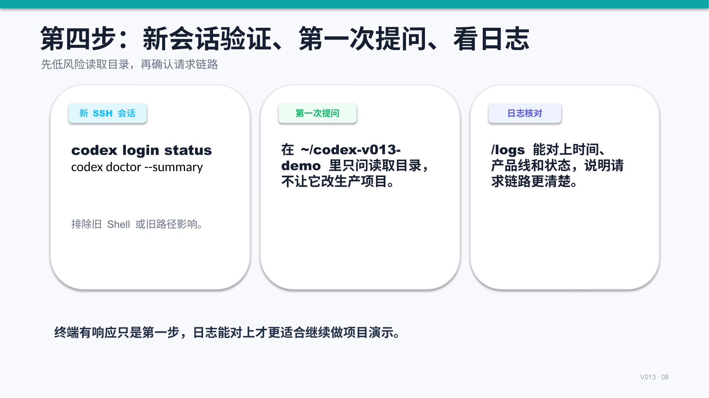

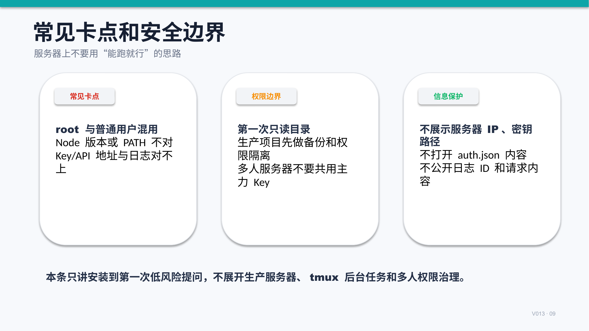

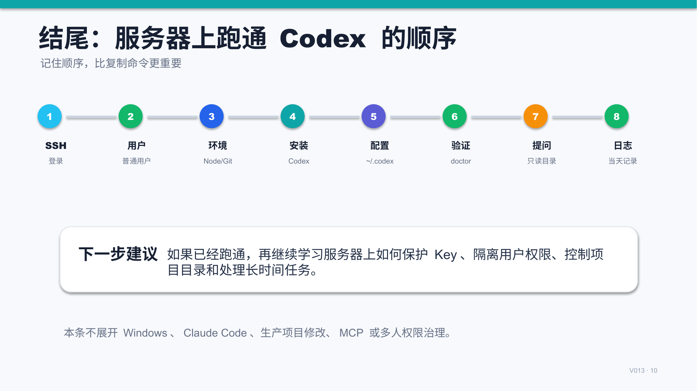

## 标签
#Codex #积木代码助手 #AI编程 #Linux #服务器 #SSH #Node.js #Key配置
