# V014 图文发布稿（带图版）

## 标题

Linux 服务器安装 Claude Code：从 SSH 到第一次提问

## 前两段短文案

这条用真实录屏路线讲 Linux 服务器上安装 Claude Code 的完整前期步骤：SSH 登录、普通用户、系统环境、Node/Git/curl、官方安装命令、认证状态、第一次进入测试目录提问。

这篇主要解决：服务器终端和本机终端不一样，容易把 macOS/Windows 的命令照搬到 Linux。看完你能：在 Linux 服务器上按顺序检查 SSH、用户权限、系统环境、Node/Git/curl。建议先收藏，操作时对照配图一步步核对。

## 备用标题

服务器上 Claude Code 跑不起来？先按这条顺序查
AI 编程服务器入门 04：Linux 上跑通 Claude Code

## 完整正文备用

这条用真实录屏路线讲 Linux 服务器上安装 Claude Code 的完整前期步骤：SSH 登录、普通用户、系统环境、Node/Git/curl、官方安装命令、认证状态、第一次进入测试目录提问。Key、API 地址、日志页和服务器信息都按脱敏方式处理。不同 Linux 发行版和第三方 Key 接入方式可能不同，正式录屏前需要在目标服务器实测确认。

这篇适合刚开始接触积木代码助手、Codex 或 Claude Code 的同学。不要只盯着一个按钮或一条命令，建议按图里的顺序看：先看当前问题，再看操作路径，最后确认结果有没有真正跑通。

常见卡点：
服务器终端和本机终端不一样，容易把 macOS/Windows 的命令照搬到 Linux
不知道安装前要先查系统、Node/Git/curl、普通用户和 sudo 权限
安装后 `claude` 命令可能找不到，PATH、shell 重载和安装位置容易混在一起
认证方式容易混：Claude.ai 订阅、Anthropic Console/API 计费、积木代码助手 Key/API 地址不是同一件事

看完这篇，你应该能做到：
在 Linux 服务器上按顺序检查 SSH、用户权限、系统环境、Node/Git/curl
使用 Claude Code 官方推荐的 Linux/macOS 安装命令安装：`curl -fsSL https://claude.ai/install.sh | bash`
用 `claude --version`、`claude --help`、`claude doctor`、`claude auth status --text` 这类命令确认状态
知道 `~/.claude/settings.json`、`.claude/settings.json`、`.claude/settings.local.json`、`~/.claude.json` 大致各管什么

我的建议是，第一次操作时不要一边改很多地方，一边猜原因。先把页面、终端输出、配置文件、日志记录这几块分开看，哪一步不一致，就从那一步往回查。

如果你也在配置或使用 AI 编程工具，可以先收藏这篇。后面遇到类似问题时，按这条路线重新核对一遍，通常能更快判断下一步该看哪里。

## 配图说明

首图用 `cover-flow-images/V014-cover-douyin.png`。
第二张用 `cover-flow-images/V014-flow.png`。
后面从 `ppt-images/slide-01.png` 到 `ppt-images/slide-08.png` 里选关键步骤图。
如果平台限制图片数量，优先保留：流程图、关键操作、常见错误、结果确认。

## 配图预览

### 首图与流程图

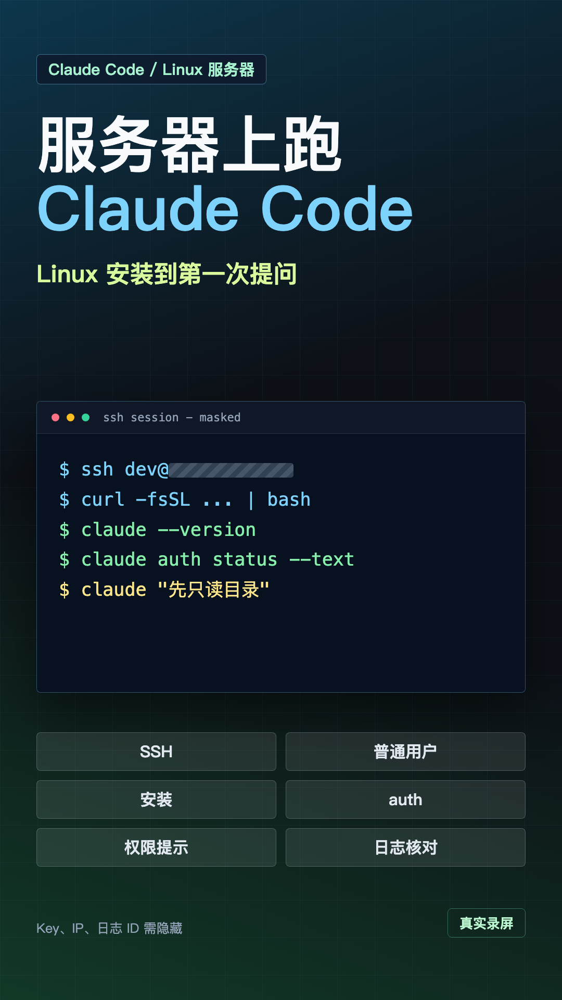

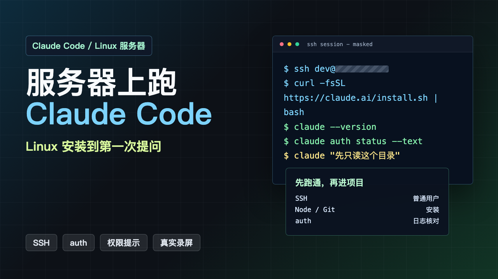

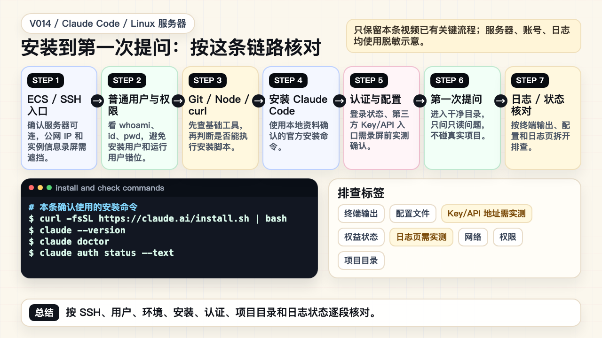

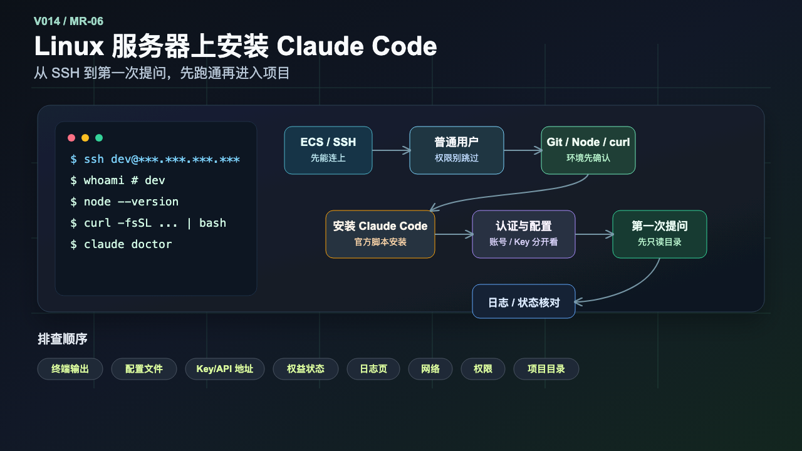

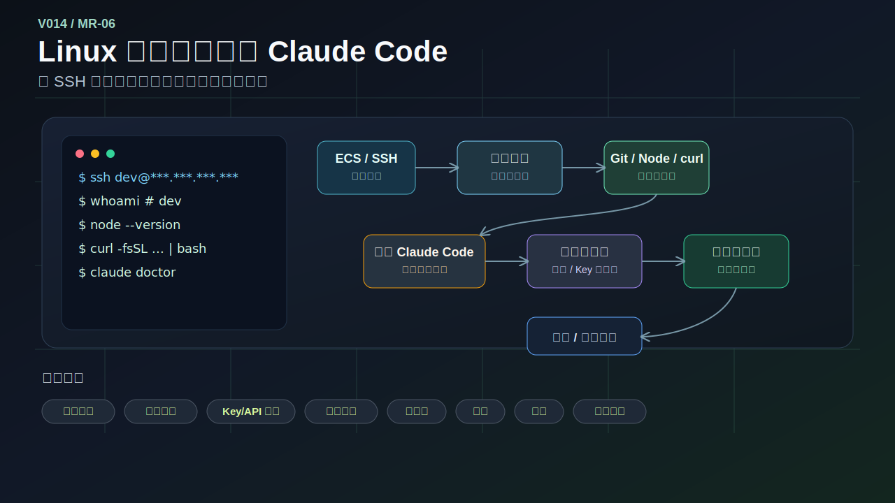

### PPT 步骤图

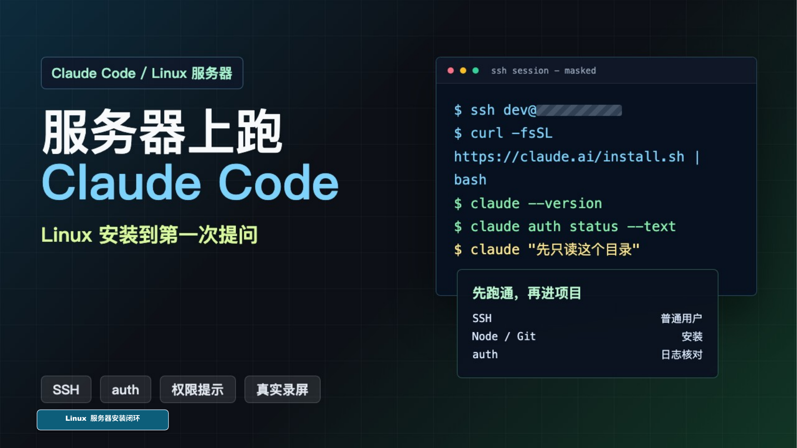

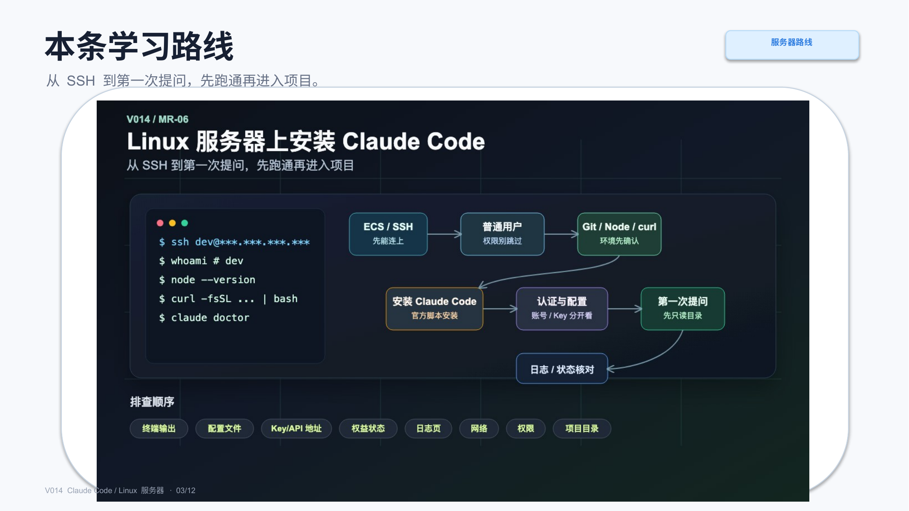

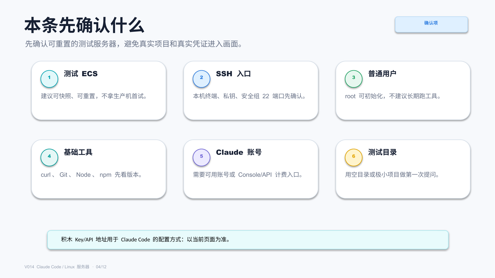

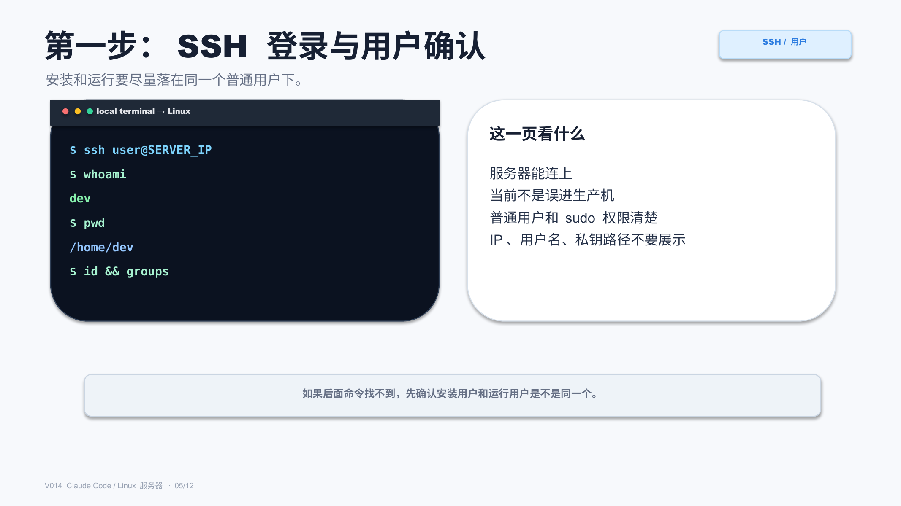

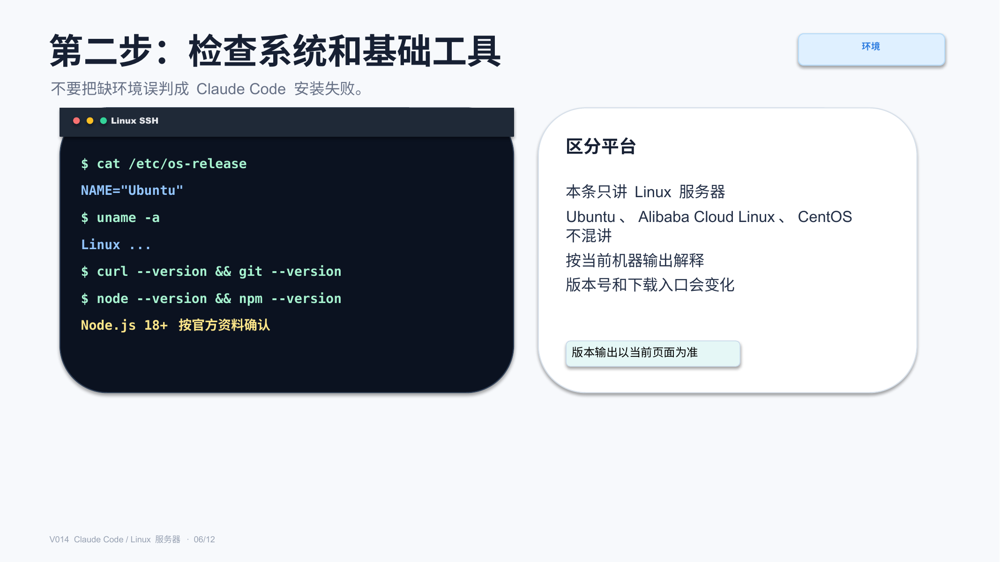

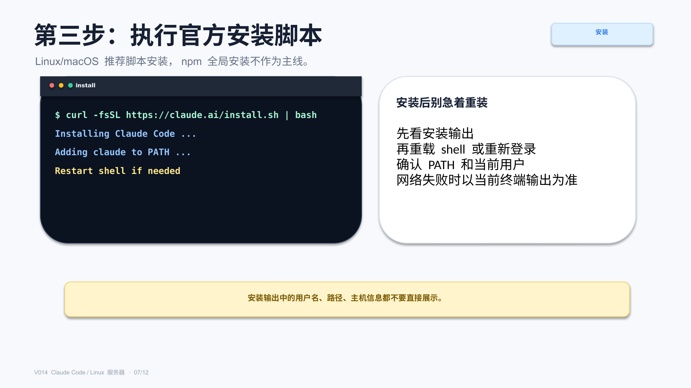

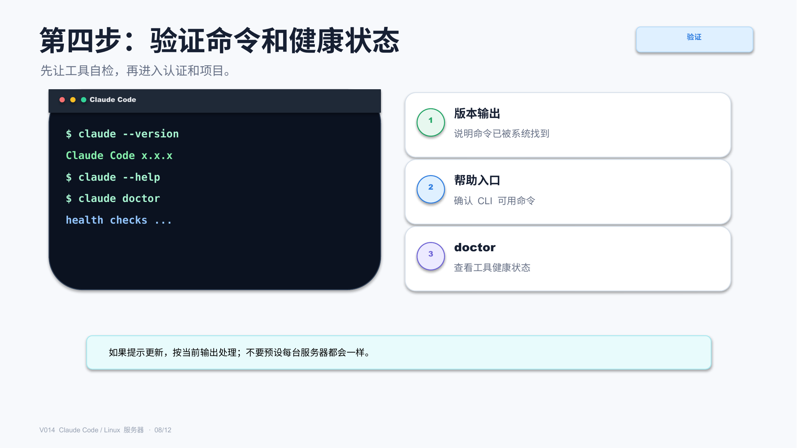

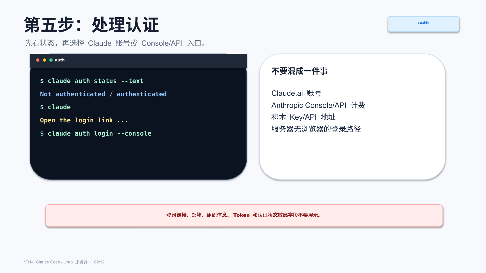

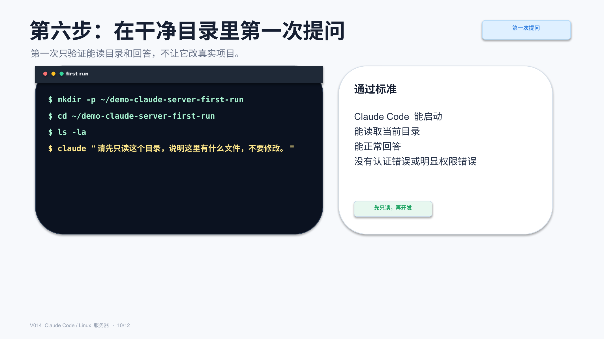

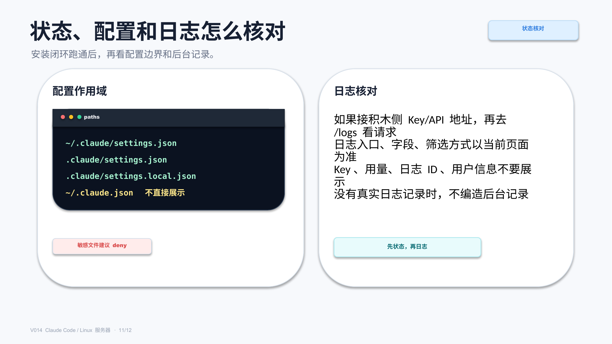

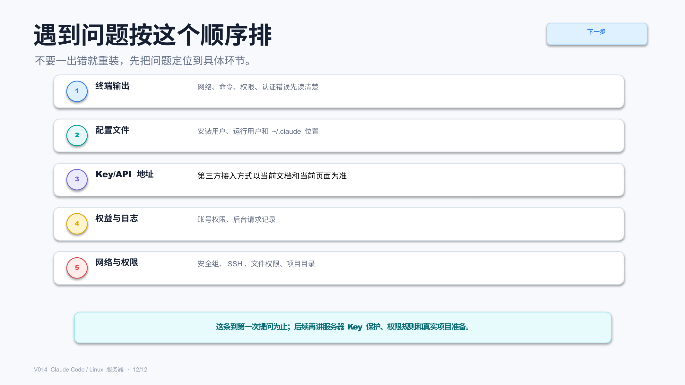

## 标签
#ClaudeCode #Linux服务器 #SSH #AI编程 #服务器部署 #配置教程 #权限安全 #日志核对 #真实录屏
