# V017 图文发布稿（带图版）

## 标题

SSH 登录阿里云服务器：Windows、Mac、Linux 三种入口

## 前两段短文案

这条录屏前期包对应 V017：SSH 登录阿里云服务器的三种入口。视频会先在 ECS 控制台确认实例运行状态、公网 IP、安全组和登录凭证，再分别演示 Windows PowerShell、macOS Terminal、Linux Terminal 的 SSH 命令，并说明 Workbench 浏览器入口适合什么时候用。

这篇主要解决：不知道公网 IP、用户名、端口、密钥文件分别从哪里找。看完你能：在阿里云 ECS 控制台找到实例公网 IP、运行状态、远程连接入口、安全组入口和登录凭证相关信息。建议先收藏，操作时对照配图一步步核对。

## 备用标题

SSH 登录阿里云服务器：Windows、Mac、Linux 三种入口：按这条路线看就够了

## 完整正文备用

这条录屏前期包对应 V017：SSH 登录阿里云服务器的三种入口。视频会先在 ECS 控制台确认实例运行状态、公网 IP、安全组和登录凭证，再分别演示 Windows PowerShell、macOS Terminal、Linux Terminal 的 SSH 命令，并说明 Workbench 浏览器入口适合什么时候用。最后按终端输出、安全组、公网 IP、用户名、密钥权限、实例状态、网络和项目目录的顺序排查常见连接失败。

这篇适合刚开始接触积木代码助手、Codex 或 Claude Code 的同学。不要只盯着一个按钮或一条命令，建议按图里的顺序看：先看当前问题，再看操作路径，最后确认结果有没有真正跑通。

常见卡点：
不知道公网 IP、用户名、端口、密钥文件分别从哪里找
Windows 用户分不清 PowerShell OpenSSH、阿里云 Workbench、PuTTY 该怎么选
macOS / Linux 用户会写 `ssh`，但经常卡在密钥文件权限、用户名、22 端口、安全组
连接超时时不知道先查安全组还是服务器状态

看完这篇，你应该能做到：
在阿里云 ECS 控制台找到实例公网 IP、运行状态、远程连接入口、安全组入口和登录凭证相关信息
判断三种入口适用场景：Windows PowerShell/OpenSSH、macOS Terminal、Linux Terminal，以及阿里云 Workbench 作为浏览器入口
按系统写出基础 SSH 命令：`ssh 用户名@公网IP` 或 `ssh -i 密钥文件 用户名@公网IP`
知道密钥文件权限需要收紧，macOS/Linux 常用 `chmod 400` 或 `chmod 600`，Windows 权限调整需录屏前实测确认

我的建议是，第一次操作时不要一边改很多地方，一边猜原因。先把页面、终端输出、配置文件、日志记录这几块分开看，哪一步不一致，就从那一步往回查。

如果你也在配置或使用 AI 编程工具，可以先收藏这篇。后面遇到类似问题时，按这条路线重新核对一遍，通常能更快判断下一步该看哪里。

## 配图说明

首图用 `cover-flow-images/V017-cover-douyin.png`。
第二张用 `cover-flow-images/V017-flow.png`。
后面从 `ppt-images/slide-01.png` 到 `ppt-images/slide-08.png` 里选关键步骤图。
如果平台限制图片数量，优先保留：流程图、关键操作、常见错误、结果确认。

## 配图预览

### 首图与流程图

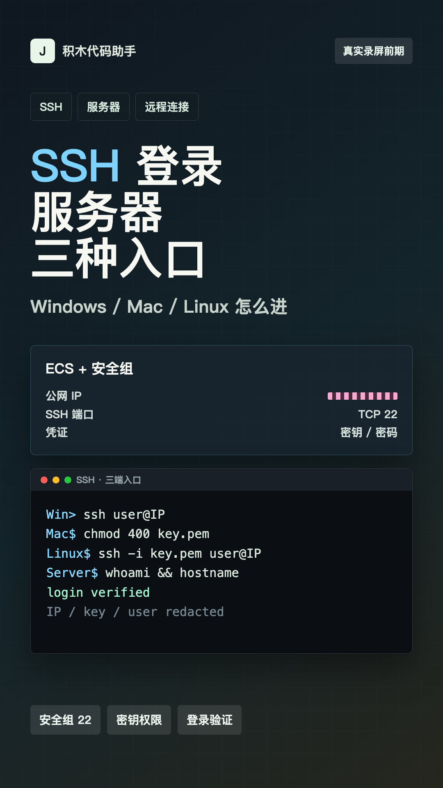

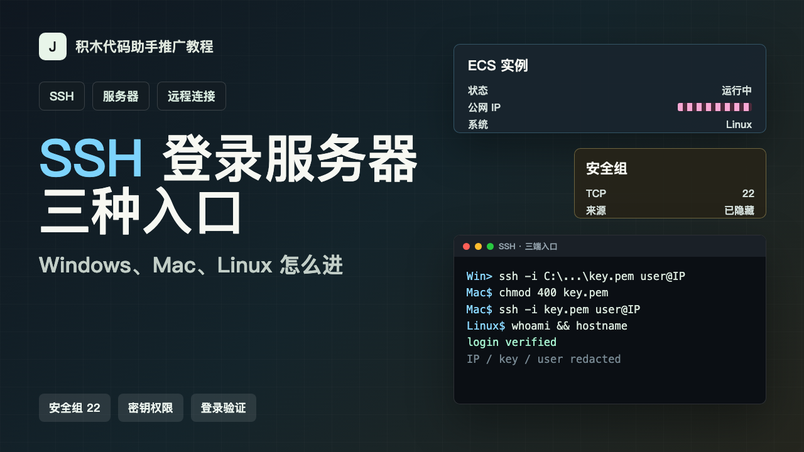

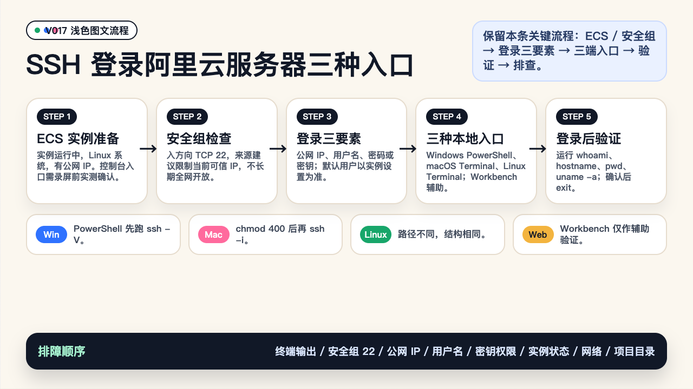

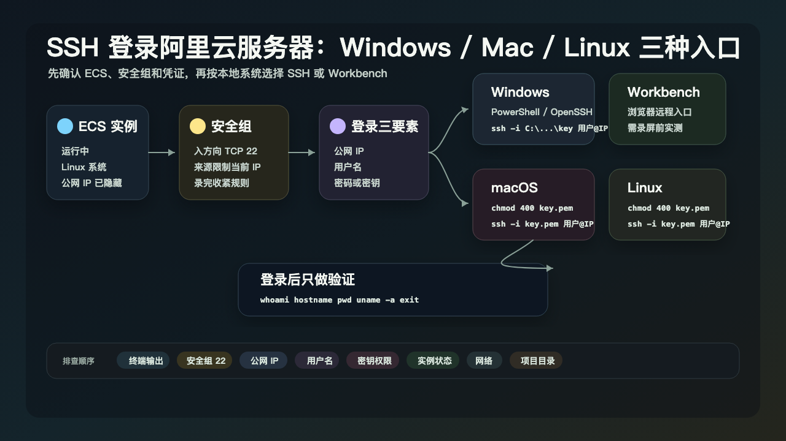

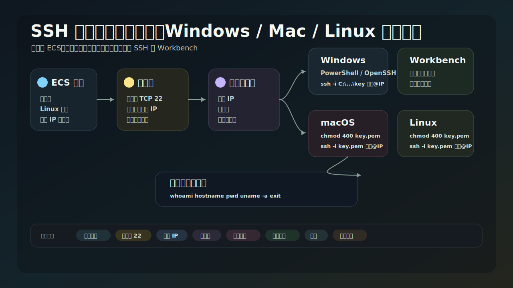

### PPT 步骤图

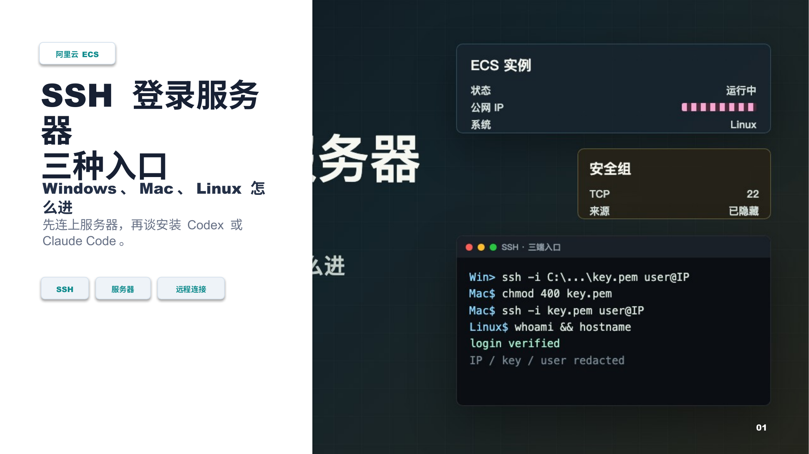

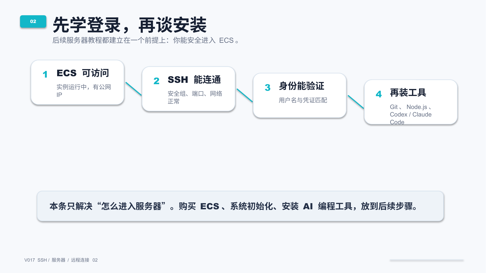

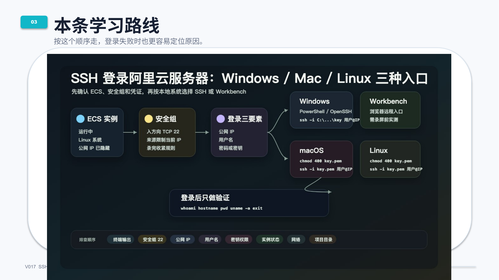

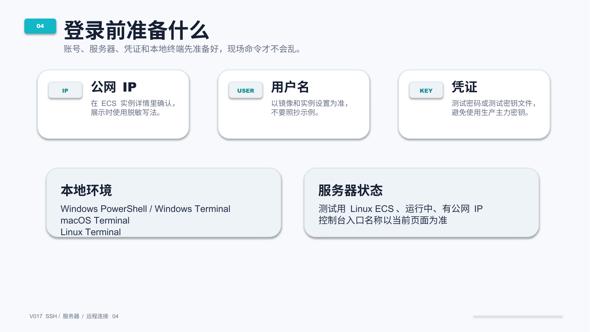

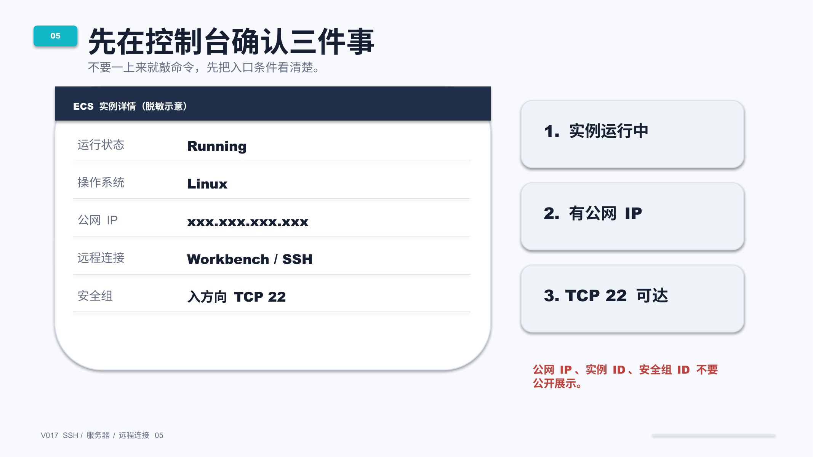

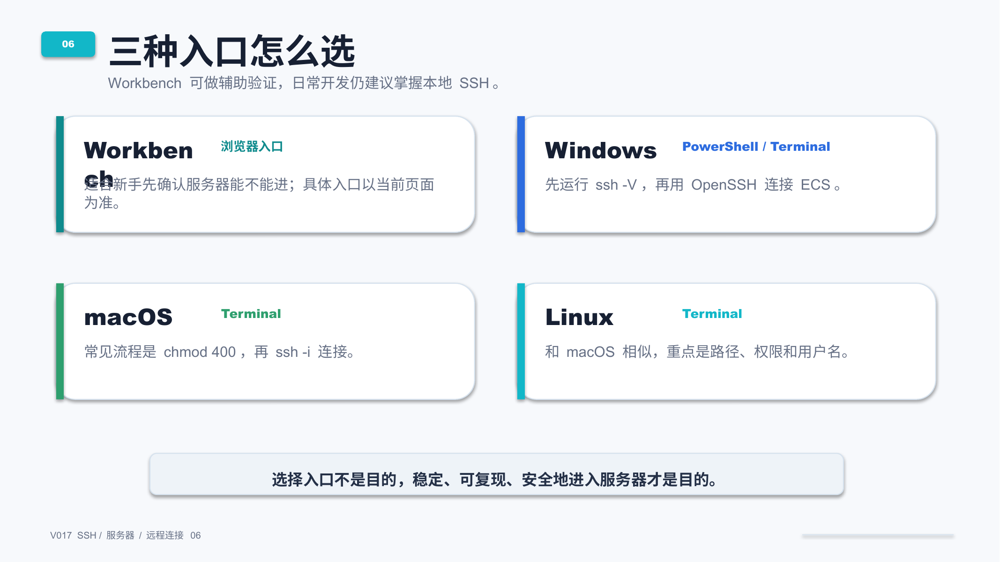

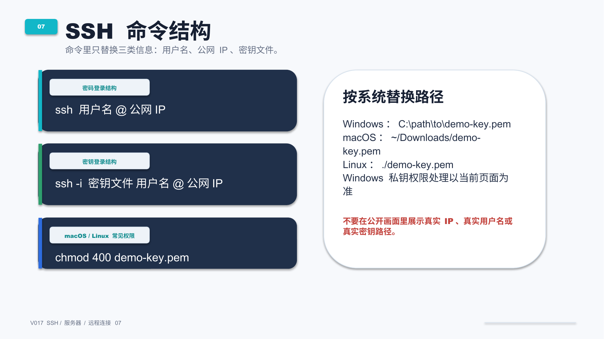

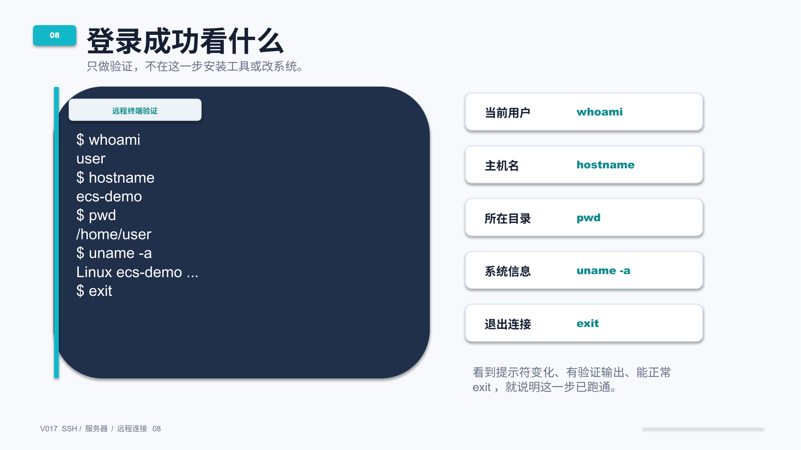

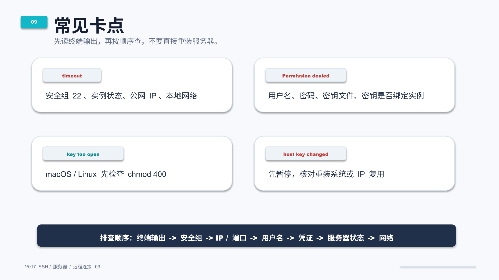

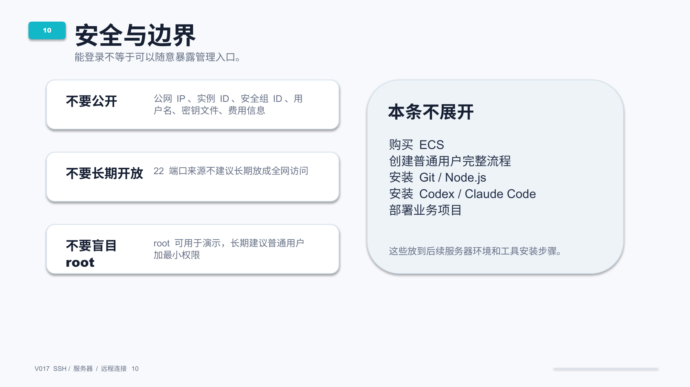

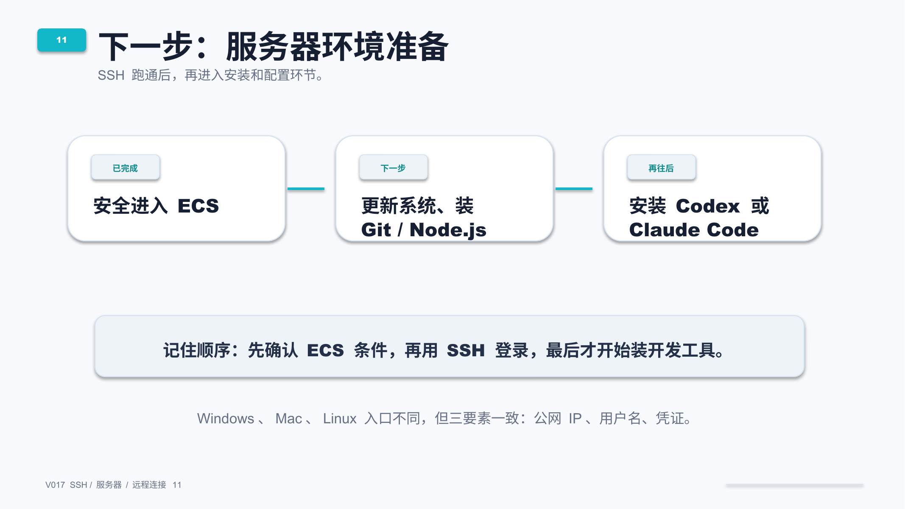

## 标签
#阿里云 #ECS #SSH #服务器 #远程连接 #Windows #Terminal #macOS #Linux #安全组
