# V019 图文发布稿（带图版）

## 标题

服务器上怎么保护 Key、配置和多人权限

## 前两段短文案

这期讲服务器上使用 Codex、Claude Code 和积木代码助手时，怎么降低 Key 泄露、配置混乱和权限过大的风险。

这篇主要解决：把 Key 写进命令、截图、日志或聊天记录里，后面不知道有没有泄露。看完你能：在服务器上把“系统登录权限、工具配置、Key、项目目录、日志核对”分开看。建议先收藏，操作时对照配图一步步核对。

## 备用标题

服务器上怎么保护 Key、配置和多人权限：按这条路线看就够了

## 完整正文备用

这期讲服务器上使用 Codex、Claude Code 和积木代码助手时，怎么降低 Key 泄露、配置混乱和权限过大的风险。重点不是重新安装，而是按顺序检查当前用户、配置目录、Key/API 地址、工具权限、Git 状态、ECS 快照和用量日志。视频里的配置和日志画面会做脱敏示意，真实 Key、Token、服务器 IP、日志 ID 不公开展示。

这篇适合刚开始接触积木代码助手、Codex 或 Claude Code 的同学。不要只盯着一个按钮或一条命令，建议按图里的顺序看：先看当前问题，再看操作路径，最后确认结果有没有真正跑通。

常见卡点：
把 Key 写进命令、截图、日志或聊天记录里，后面不知道有没有泄露
多个人共用同一个 Linux 用户，`~/.codex`、`~/.claude`、shell 历史、项目目录全混在一起
为了省事给 AI 工具开了过大的权限，例如 Codex 的 `danger-full-access` 或 Claude Code 的 `--dangerously-skip-permissions`，但不知道风险边界
服务器项目没有 Git 干净状态，也没有快照，AI 工具改错后很难回退

看完这篇，你应该能做到：
在服务器上把“系统登录权限、工具配置、Key、项目目录、日志核对”分开看
用普通用户和独立 home 目录降低多人共用时互相污染配置的风险
知道 Codex 和 Claude Code 分别有哪些权限相关入口：Codex 的 `~/.codex/config.toml`、`--sandbox`、`--ask-for-approval`、`--add-dir`；Claude Code 的 `~/.claude/settings.json`、`.claude/settings.json`、`.claude/settings.local.json`、`--allowedTools`、`--disallowedTools`、`--permission-mode`
录屏时按固定顺序排查：终端输出、配置文件、Key/API 地址、权益状态、日志页、网络、权限、项目目录

我的建议是，第一次操作时不要一边改很多地方，一边猜原因。先把页面、终端输出、配置文件、日志记录这几块分开看，哪一步不一致，就从那一步往回查。

如果你也在配置或使用 AI 编程工具，可以先收藏这篇。后面遇到类似问题时，按这条路线重新核对一遍，通常能更快判断下一步该看哪里。

## 配图说明

首图用 `cover-flow-images/V019-cover-douyin.png`。
第二张用 `cover-flow-images/V019-flow.png`。
后面从 `ppt-images/slide-01.png` 到 `ppt-images/slide-08.png` 里选关键步骤图。
如果平台限制图片数量，优先保留：流程图、关键操作、常见错误、结果确认。

## 配图预览

### 首图与流程图

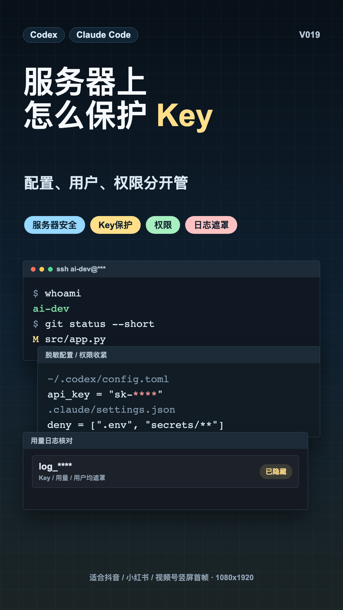

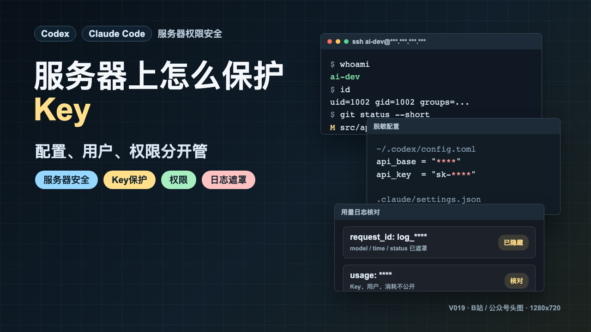

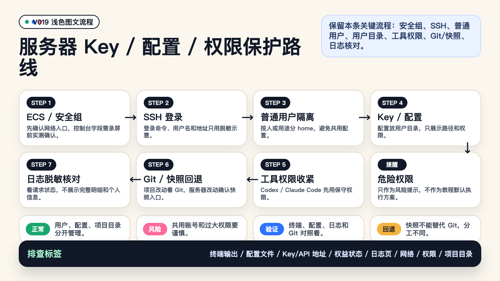

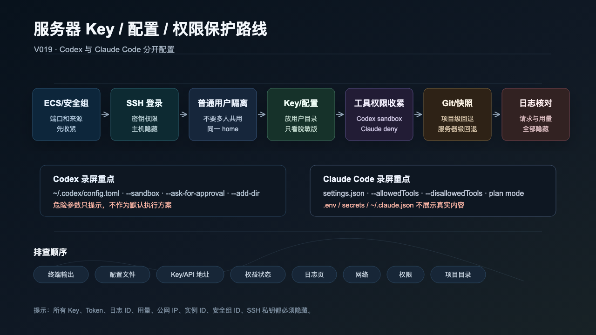

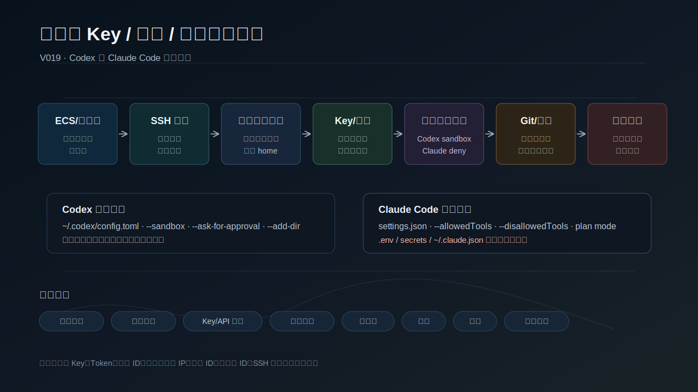

### PPT 步骤图

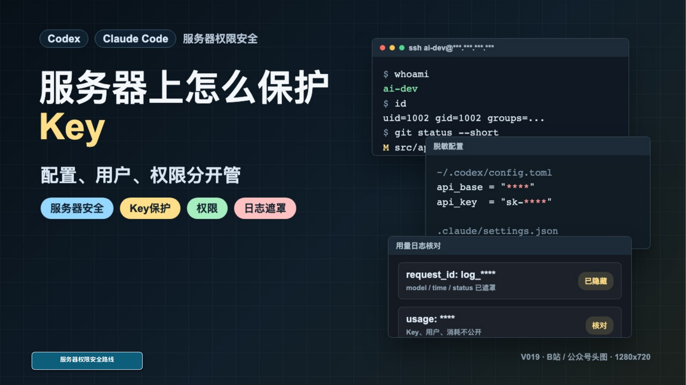

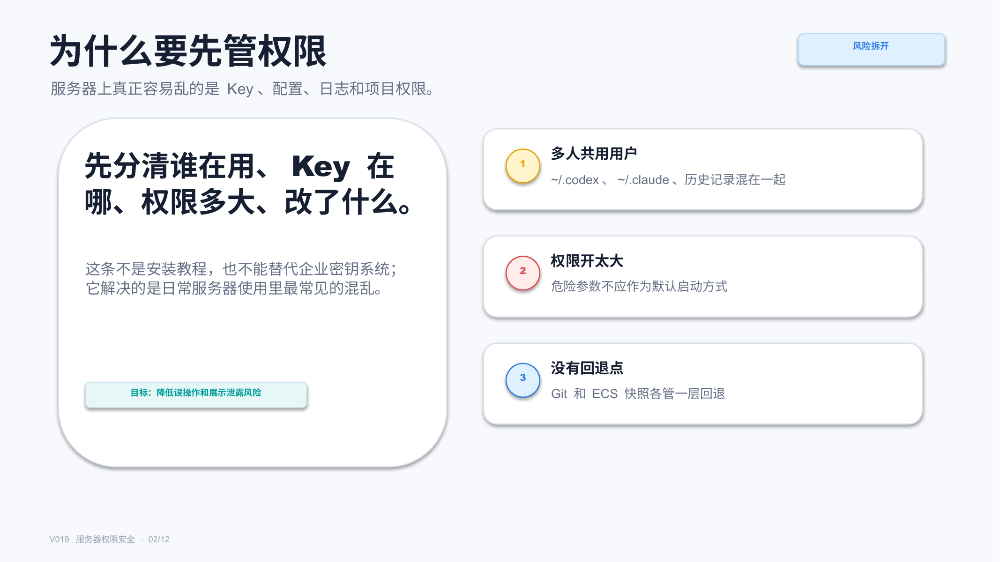

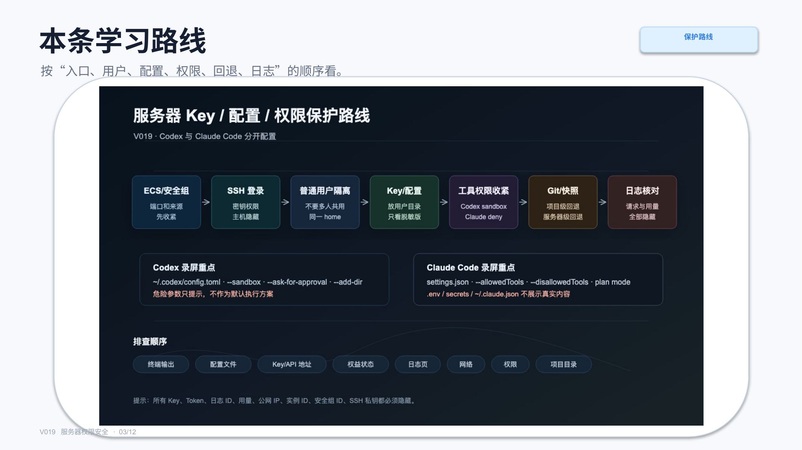

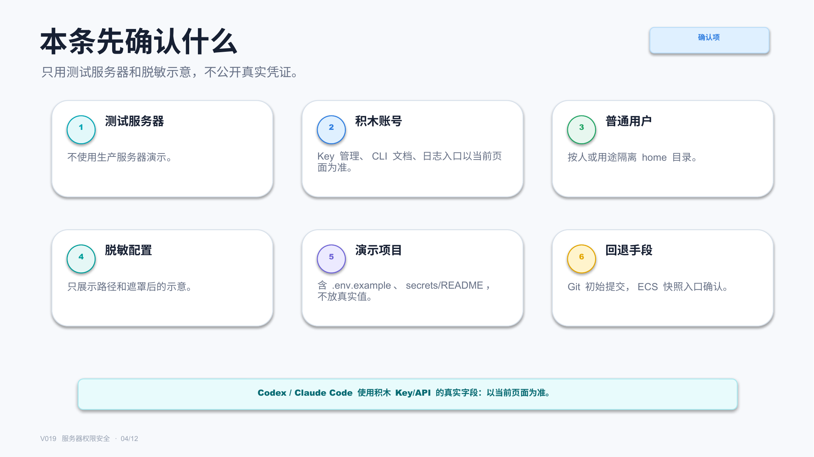

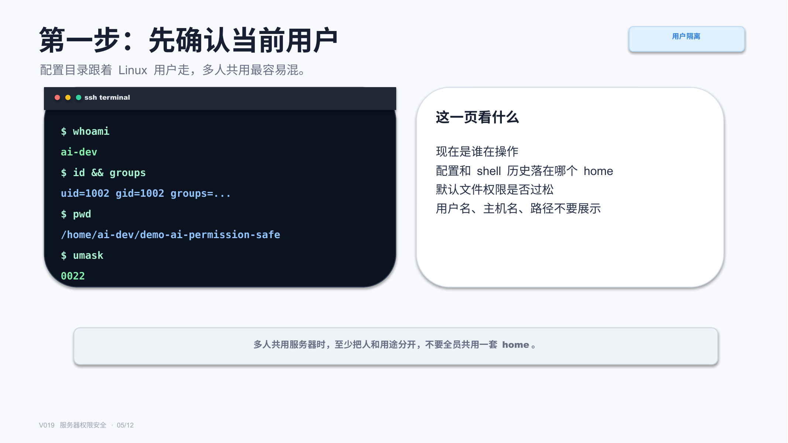

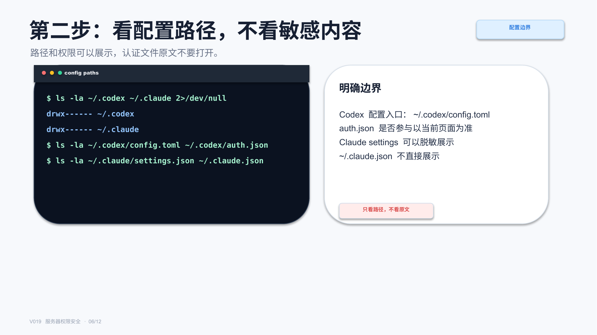

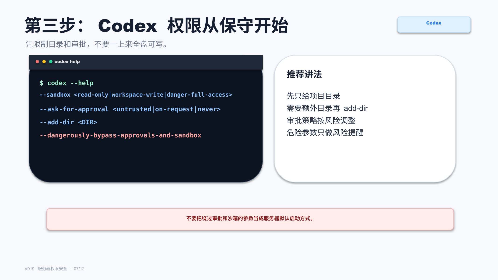

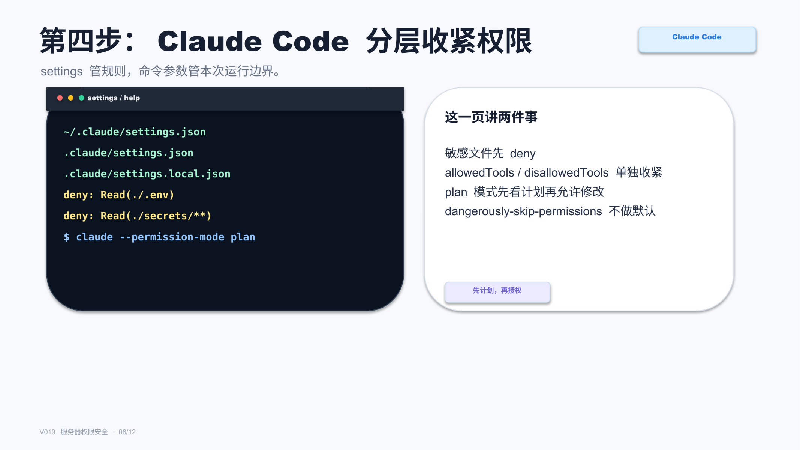

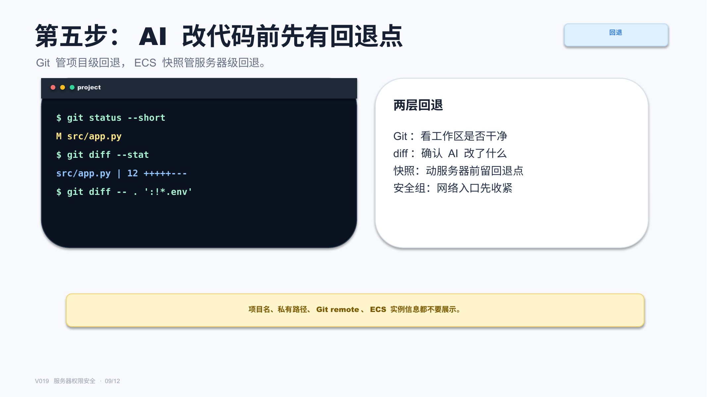

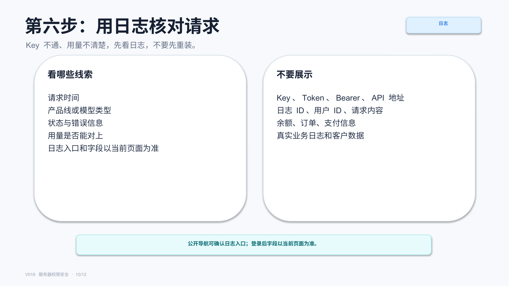

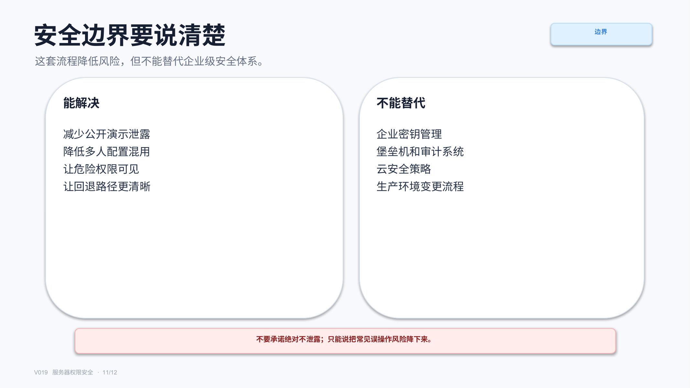

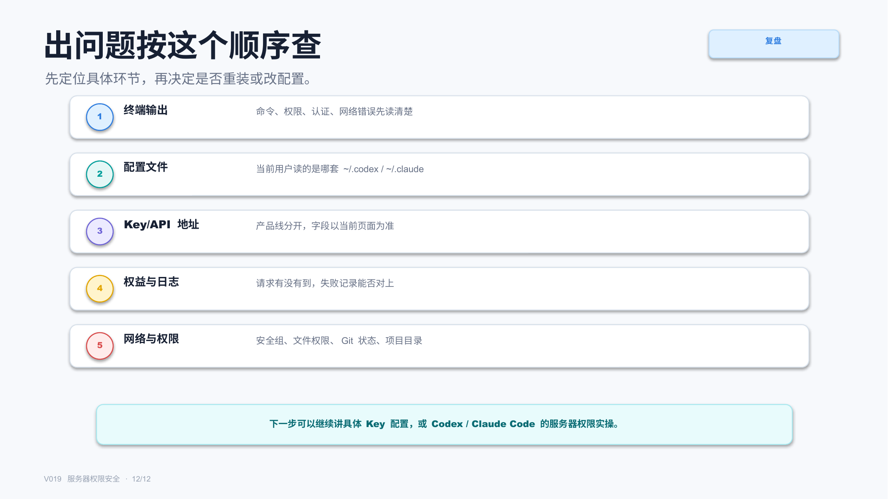

## 标签
#积木代码助手 #Codex #ClaudeCode #AI编程 #服务器安全 #Key保护 #权限管理 #SSH
