# V021 图文发布稿（带图版）

## 标题

Codex exec 非交互怎么用：JSONL、输出文件和 schema 示例

## 前两段短文案

这条用一个干净演示目录讲 Codex CLI 的非交互任务：输入文件怎么传给 `codex exec`，最终回答怎么写到文件，`--json` 事件流适合怎么看，`--output-schema` 做结构化输出时哪些地方要提前实测。

这篇主要解决：只知道输入 `codex`，不知道什么时候应该用 `codex exec`。看完你能：按一个清晰顺序理解本条视频的核心操作路线。建议先收藏，操作时对照配图一步步核对。

## 备用标题

不想手动复制 Codex 输出？用 `codex exec` 把结果写成文件
积木代码助手进阶：Codex CLI 自动化输出路线

## 完整正文备用

这条用一个干净演示目录讲 Codex CLI 的非交互任务：输入文件怎么传给 `codex exec`，最终回答怎么写到文件，`--json` 事件流适合怎么看，`--output-schema` 做结构化输出时哪些地方要提前实测。适合已经装好 Codex，想把固定格式报告、检查清单、需求拆解接到脚本里的用户。

这篇适合刚开始接触积木代码助手、Codex 或 Claude Code 的同学。不要只盯着一个按钮或一条命令，建议按图里的顺序看：先看当前问题，再看操作路径，最后确认结果有没有真正跑通。

常见卡点：
只知道输入 `codex`，不知道什么时候应该用 `codex exec`
想把 AI 输出保存到文件，但不想手动复制终端内容
自动化任务跑失败后，不知道看命令输出、JSONL 事件还是最终文件
想要固定格式报告，但不清楚 `--output-schema` 只能解决输出形状的一部分，仍要实测和校验

看完这篇，你应该能做到：
按一个清晰顺序理解本条视频的核心操作路线
知道关键页面、终端输出或配置位置应该看哪里
知道哪些信息发布前需要脱敏，哪些内容需要以录屏现场为准

我的建议是，第一次操作时不要一边改很多地方，一边猜原因。先把页面、终端输出、配置文件、日志记录这几块分开看，哪一步不一致，就从那一步往回查。

如果你也在配置或使用 AI 编程工具，可以先收藏这篇。后面遇到类似问题时，按这条路线重新核对一遍，通常能更快判断下一步该看哪里。

## 配图说明

首图用 `cover-flow-images/V021-cover-douyin.png`。
第二张用 `cover-flow-images/V021-flow.png`。
后面从 `ppt-images/slide-01.png` 到 `ppt-images/slide-08.png` 里选关键步骤图。
如果平台限制图片数量，优先保留：流程图、关键操作、常见错误、结果确认。

## 配图预览

### 首图与流程图

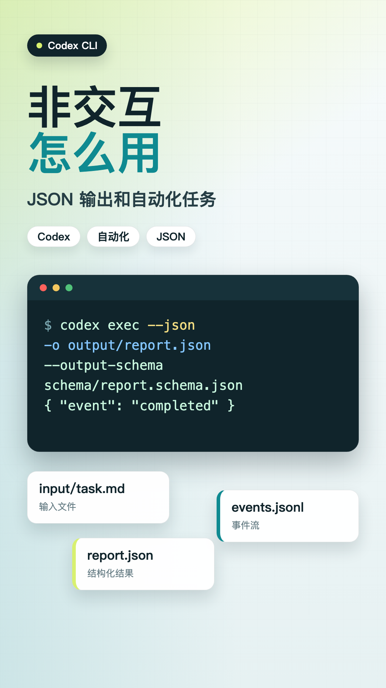

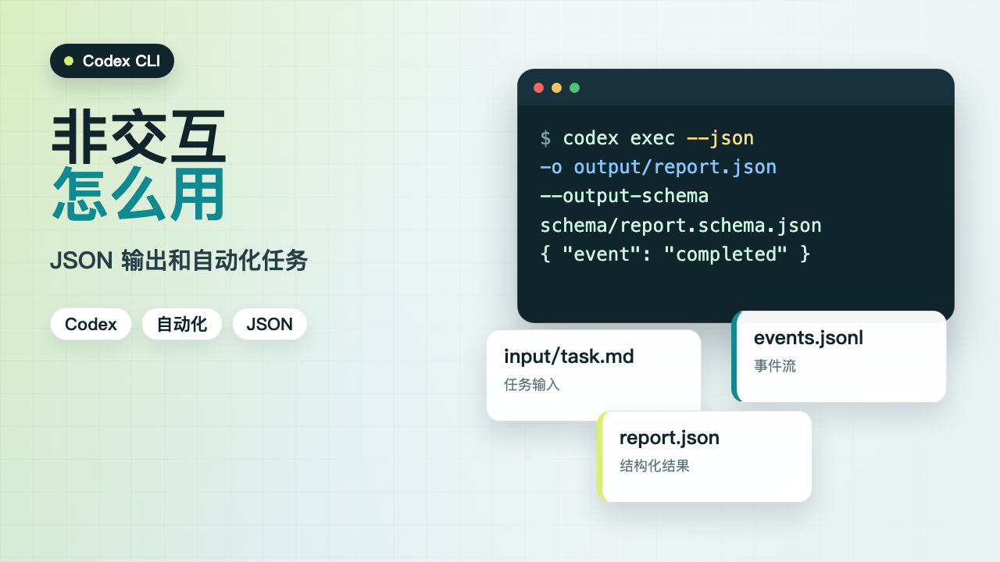

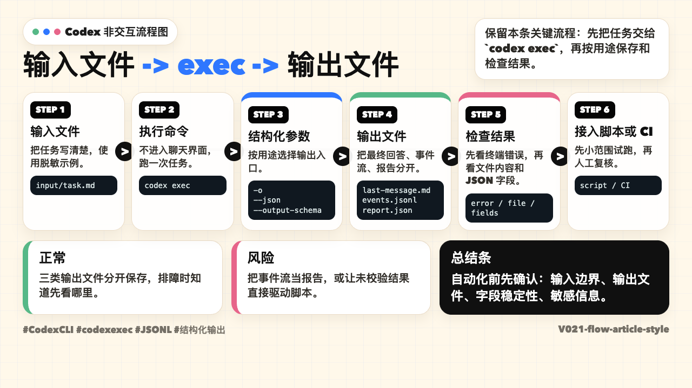

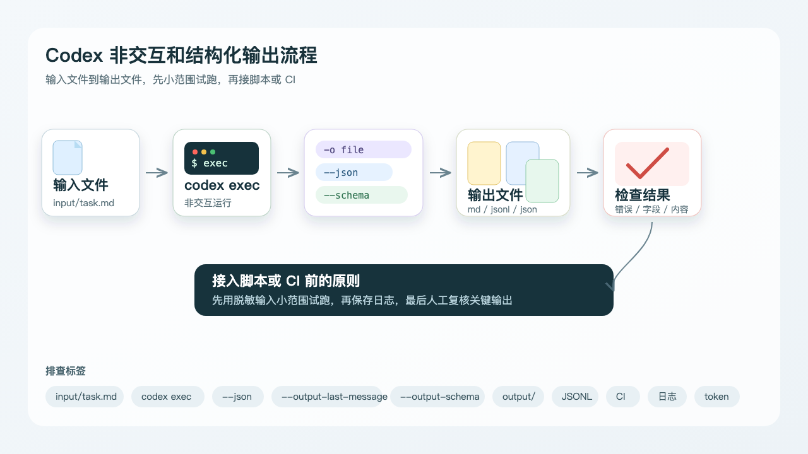

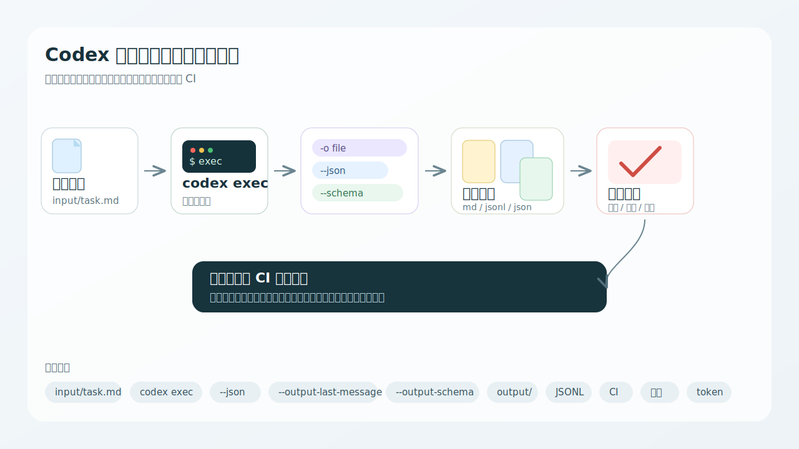

### PPT 步骤图

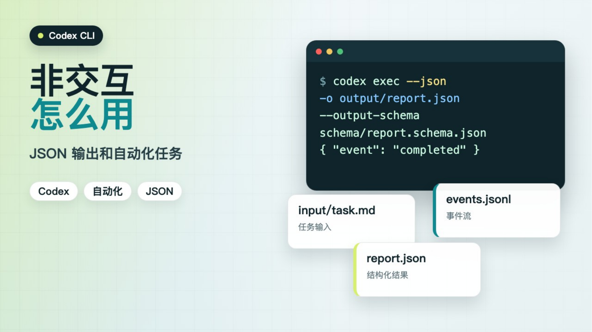

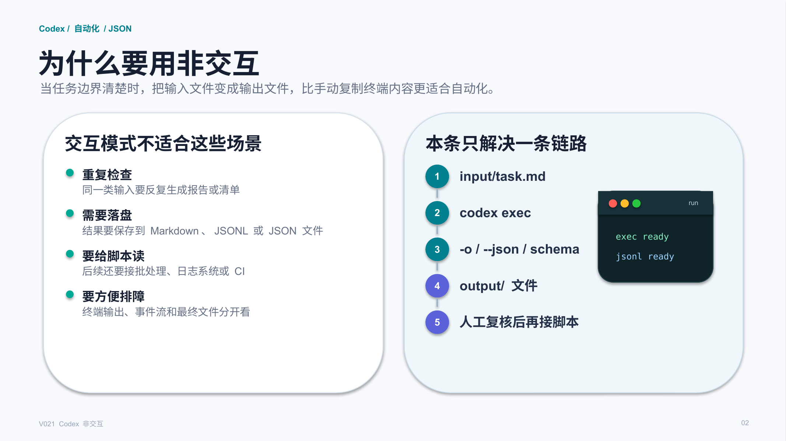

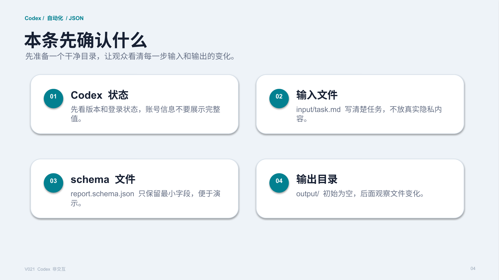

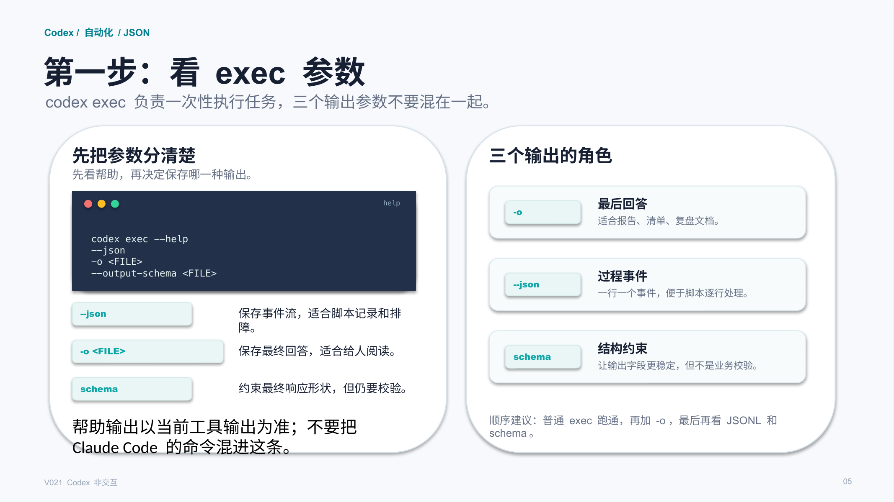

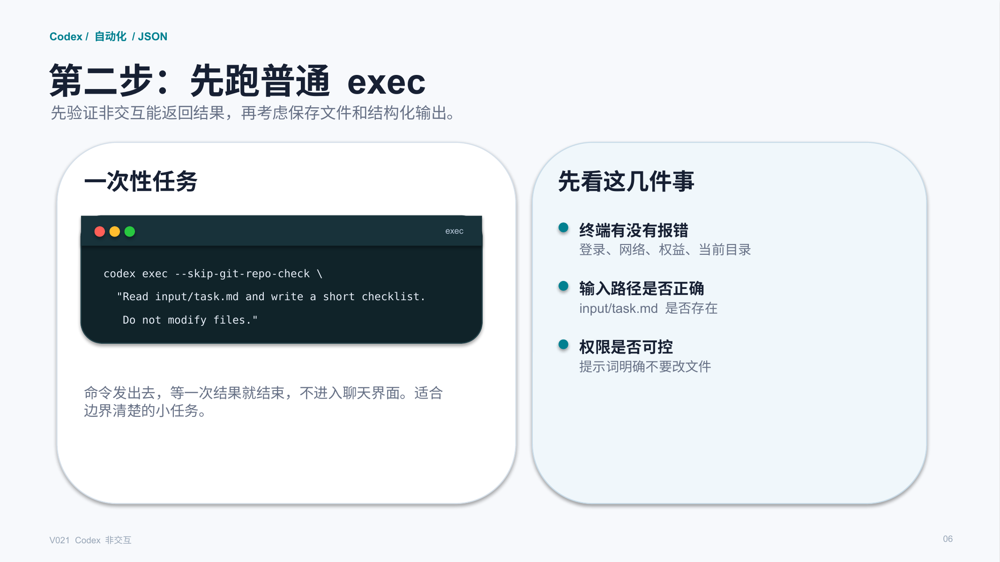

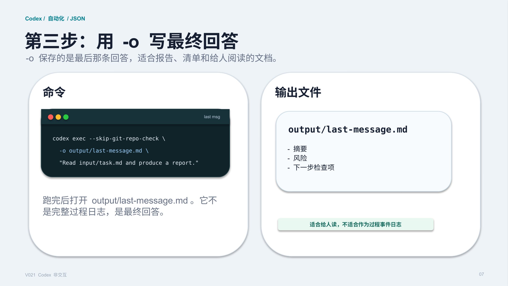

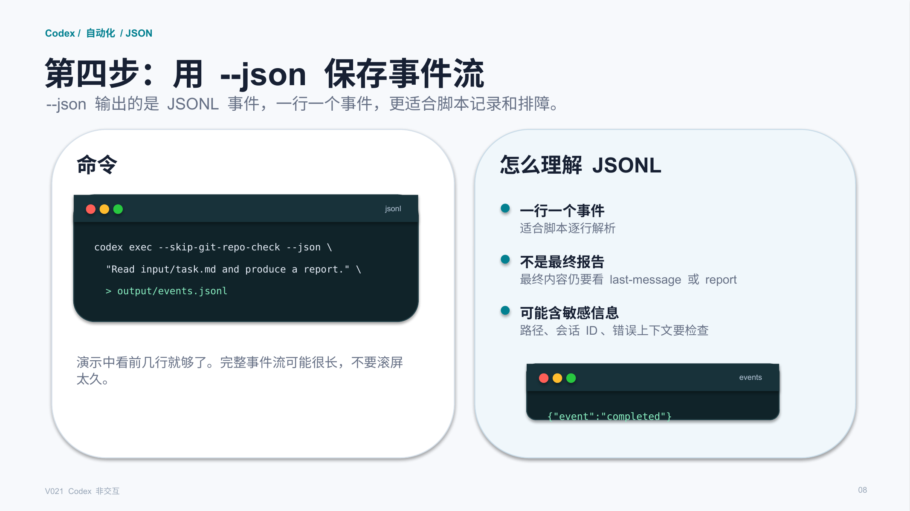

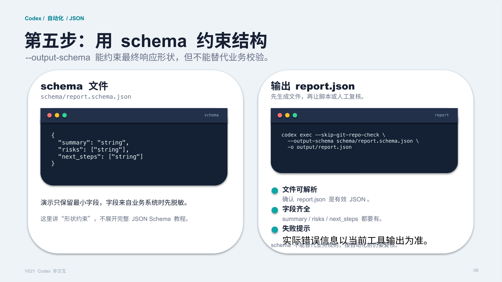

## 标签
#CodexCLI #AI编程 #自动化 #JSONL #结构化输出 #命令行工具 #积木代码助手 #配置教程
