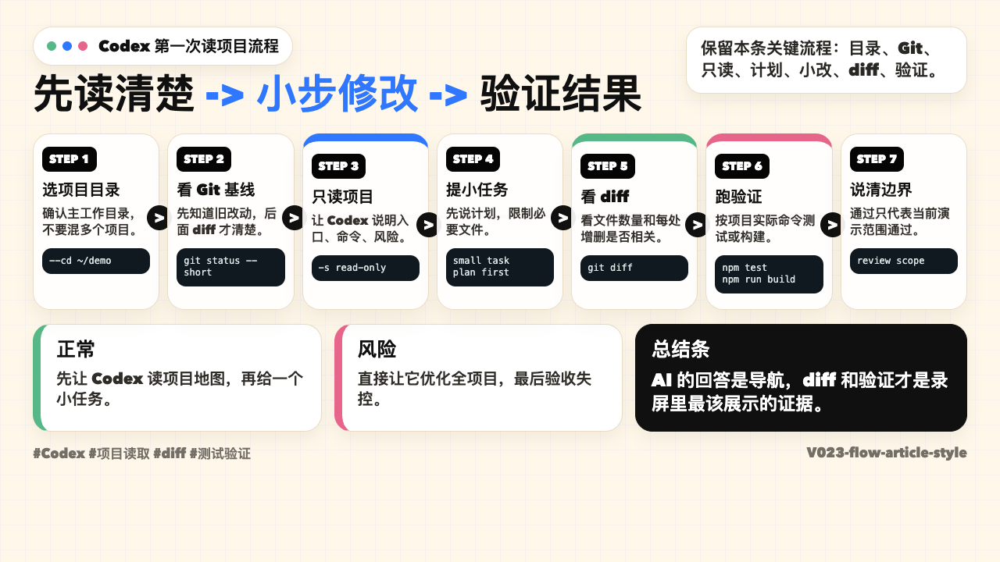
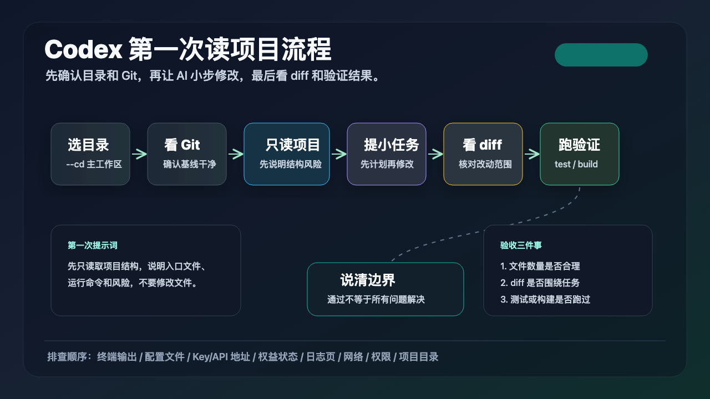
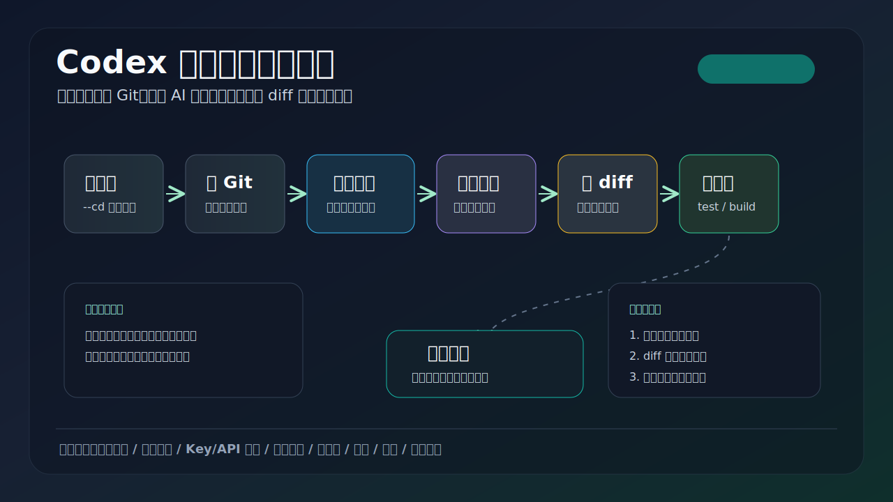
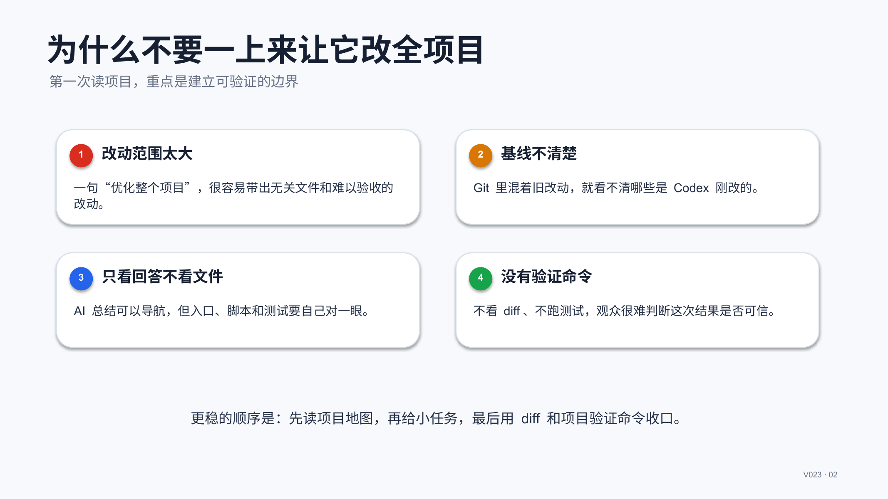
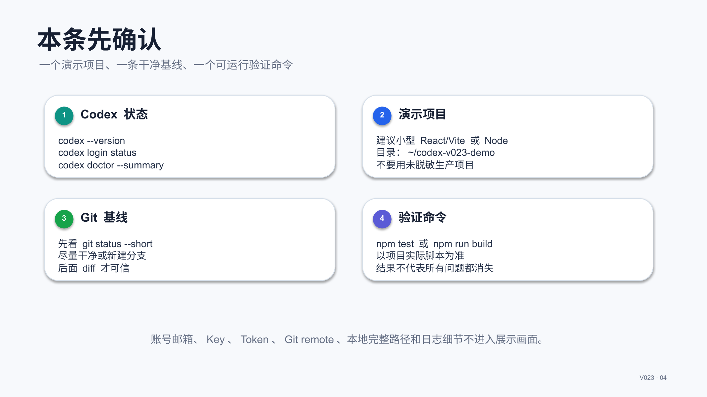
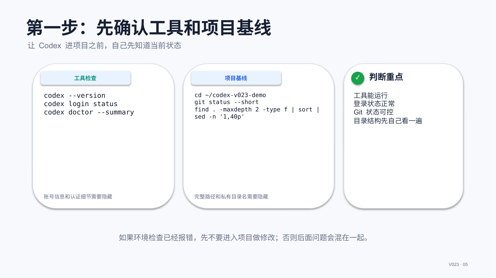
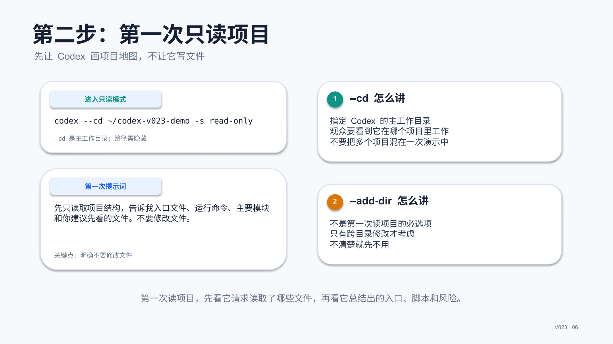
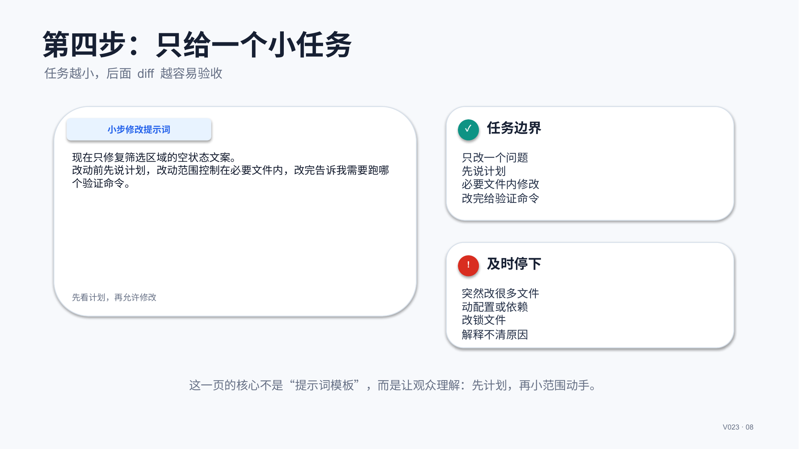
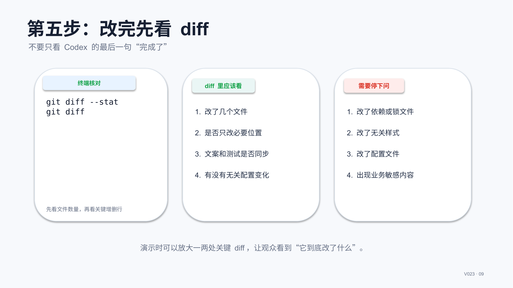
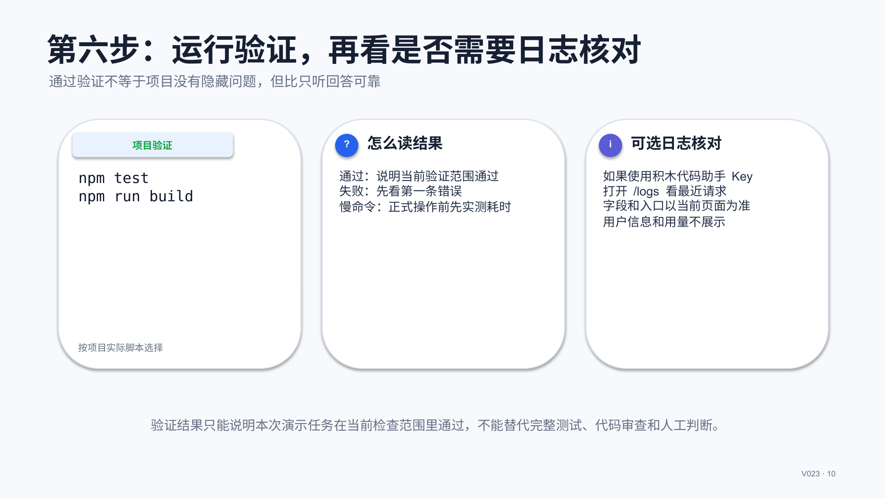

# V023 图文发布稿（带图版）

## 标题

Codex 进入项目后第一次读代码怎么录

## 前两段短文案

这条用一个统一演示项目，演示 Codex 第一次进入项目后应该怎么做：先检查工具和 Git 状态，再用 `--cd` 指定项目目录，让 Codex 只读结构、说明入口和风险，然后给一个小任务，查看 `git diff`，最后运行测试或构建做基础验证。

这篇主要解决：一进入项目就让 Codex “帮我优化整个项目”，结果修改范围太大，不知道怎么验收。看完你能：演示一条可录屏的 Codex 项目读取流程：选目录、看 Git 状态、只读项目、列风险、小步修改、看 diff、跑验证。建议先收藏，操作时对照配图一步步核对。

## 备用标题

Codex 进入项目后第一次读代码怎么录：按这条路线看就够了

## 完整正文备用

这条用一个统一演示项目，演示 Codex 第一次进入项目后应该怎么做：先检查工具和 Git 状态，再用 `--cd` 指定项目目录，让 Codex 只读结构、说明入口和风险，然后给一个小任务，查看 `git diff`，最后运行测试或构建做基础验证。适合刚开始把 Codex 放进真实项目里的用户。

这篇适合刚开始接触积木代码助手、Codex 或 Claude Code 的同学。不要只盯着一个按钮或一条命令，建议按图里的顺序看：先看当前问题，再看操作路径，最后确认结果有没有真正跑通。

常见卡点：
一进入项目就让 Codex “帮我优化整个项目”，结果修改范围太大，不知道怎么验收
不知道 `--cd` 和 `--add-dir` 在录屏里该怎么解释
不知道第一次应该让 Codex 看哪些文件，哪些文件不能随便打开或暴露
只展示 AI 回答，没有展示 `git diff`、测试输出、日志核对，观众难判断结果是否可信

看完这篇，你应该能做到：
演示一条可录屏的 Codex 项目读取流程：选目录、看 Git 状态、只读项目、列风险、小步修改、看 diff、跑验证
解释 `codex --cd <DIR>` 作为主工作目录的用法，以及 `--add-dir <DIR>` 只在需要额外可写目录时使用
给出第一次提问的可复用口径：先说明项目结构、入口、运行命令和风险，不要马上改文件
展示修改后如何用 `git diff` 和 `npm test` / `npm run build` 做基础确认

我的建议是，第一次操作时不要一边改很多地方，一边猜原因。先把页面、终端输出、配置文件、日志记录这几块分开看，哪一步不一致，就从那一步往回查。

如果你也在配置或使用 AI 编程工具，可以先收藏这篇。后面遇到类似问题时，按这条路线重新核对一遍，通常能更快判断下一步该看哪里。

## 配图说明

首图用 `cover-flow-images/V023-cover-douyin.png`。
第二张用 `cover-flow-images/V023-flow.png`。
后面从 `ppt-images/slide-01.png` 到 `ppt-images/slide-08.png` 里选关键步骤图。
如果平台限制图片数量，优先保留：流程图、关键操作、常见错误、结果确认。

## 配图预览

### 首图与流程图

### PPT 步骤图

## 标签
#Codex #积木代码助手 #AI编程 #项目读取 #CLI #git #diff #测试验证 #真实录屏
