# V032 图文发布稿（带图版）

## 标题

审批提示出现时到底该看哪些关键词

## 前两段短文案

这条讲 Codex 和 Claude Code 在出现审批提示、权限提示时该怎么判断。

这篇主要解决：只看按钮，不看命令、工具名、路径和动作类型。看完你能：先看是哪个工具或命令在请求权限。建议先收藏，操作时对照配图一步步核对。

## 备用标题

审批提示出现时到底该看哪些关键词：按这条路线看就够了

## 完整正文备用

这条讲 Codex 和 Claude Code 在出现审批提示、权限提示时该怎么判断。重点不是背参数，而是建立一个固定检查顺序：工具或命令、目标路径、动作类型、敏感数据、联网/推送、是否可回滚。视频里只用测试目录和脱敏示意画面，不展示真实 Key、真实 `.env` 或真实项目数据。

这篇适合刚开始接触积木代码助手、Codex 或 Claude Code 的同学。不要只盯着一个按钮或一条命令，建议按图里的顺序看：先看当前问题，再看操作路径，最后确认结果有没有真正跑通。

常见卡点：
只看按钮，不看命令、工具名、路径和动作类型
不知道 `rm`、`delete`、`overwrite`、`curl`、`wget`、`git push`、`chmod`、`chown` 等词为什么要慢下来
分不清“读文件”“写文件”“覆盖文件”“联网上传”“改项目外目录”的风险差异
Codex 里看到 shell 命令审批，Claude Code 里看到工具权限提示，却用同一种眼光处理

看完这篇，你应该能做到：
先看是哪个工具或命令在请求权限
再看目标路径是不是当前测试项目或工作区
继续看动作是读、写、删除、覆盖、改权限、联网还是提交/推送
单独检查 `.env`、Key、Token、SSH 密钥、订单、日志 ID、用户信息等敏感数据

我的建议是，第一次操作时不要一边改很多地方，一边猜原因。先把页面、终端输出、配置文件、日志记录这几块分开看，哪一步不一致，就从那一步往回查。

如果你也在配置或使用 AI 编程工具，可以先收藏这篇。后面遇到类似问题时，按这条路线重新核对一遍，通常能更快判断下一步该看哪里。

## 配图说明

首图用 `cover-flow-images/V032-cover-douyin.png`。
第二张用 `cover-flow-images/V032-flow.png`。
后面从 `ppt-images/slide-01.png` 到 `ppt-images/slide-08.png` 里选关键步骤图。
如果平台限制图片数量，优先保留：流程图、关键操作、常见错误、结果确认。

## 配图预览

### 首图与流程图

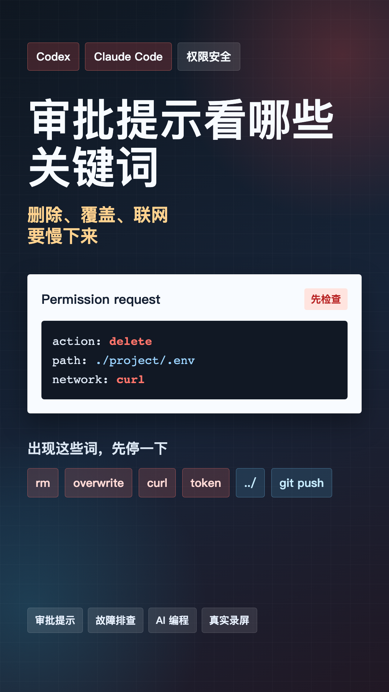

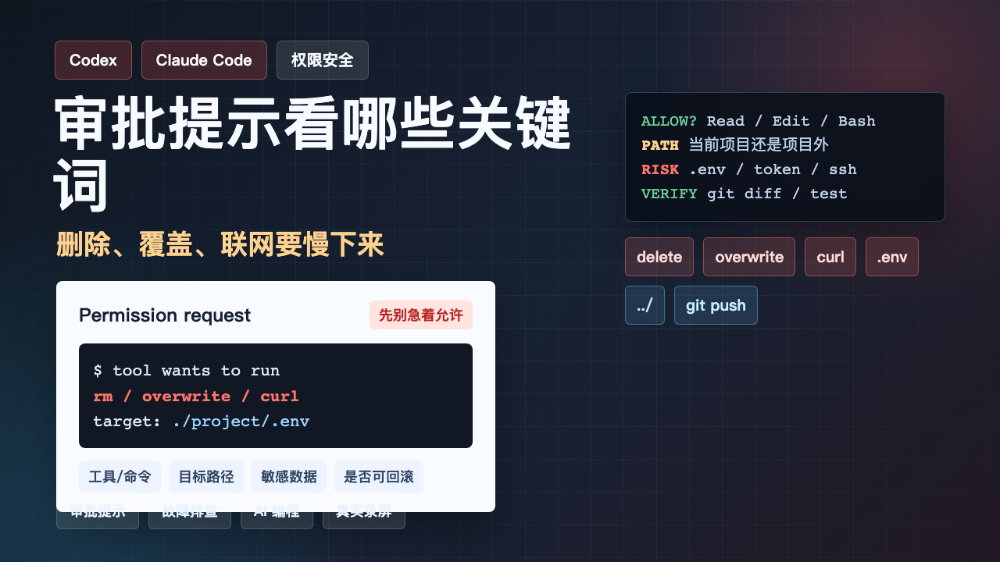

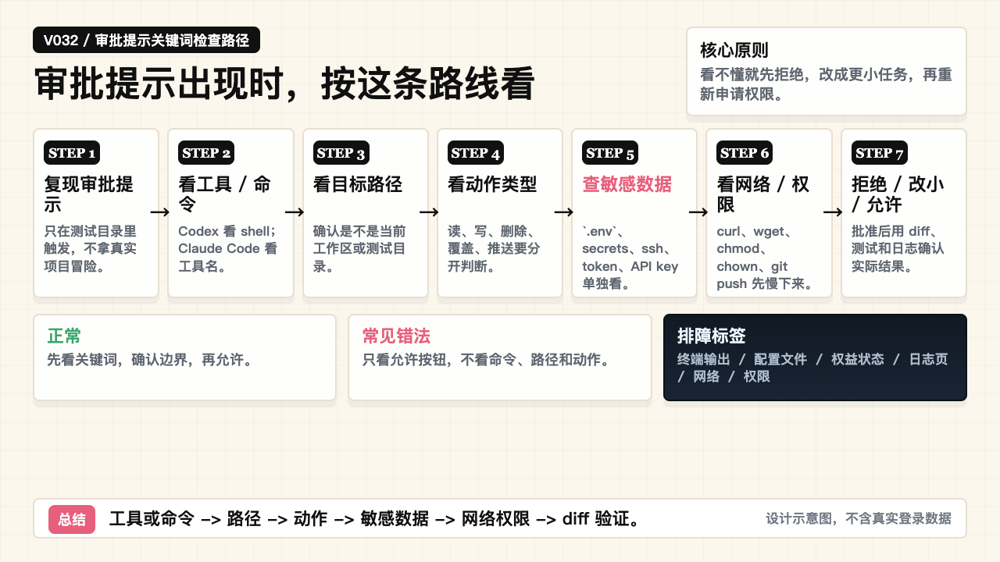

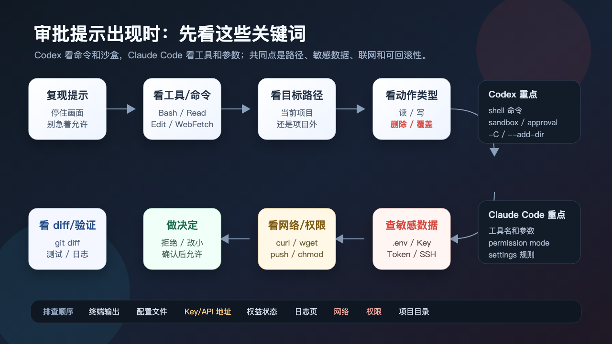

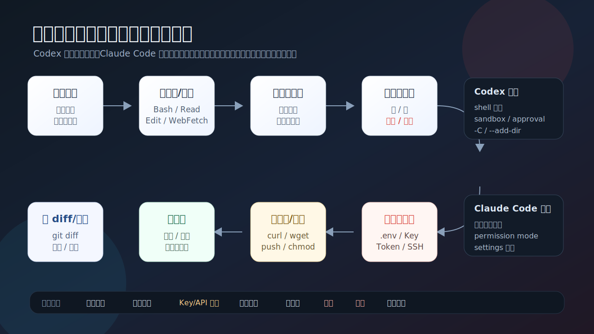

### PPT 步骤图

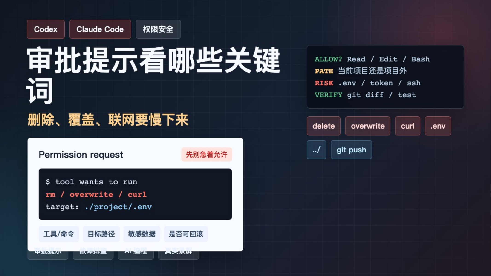

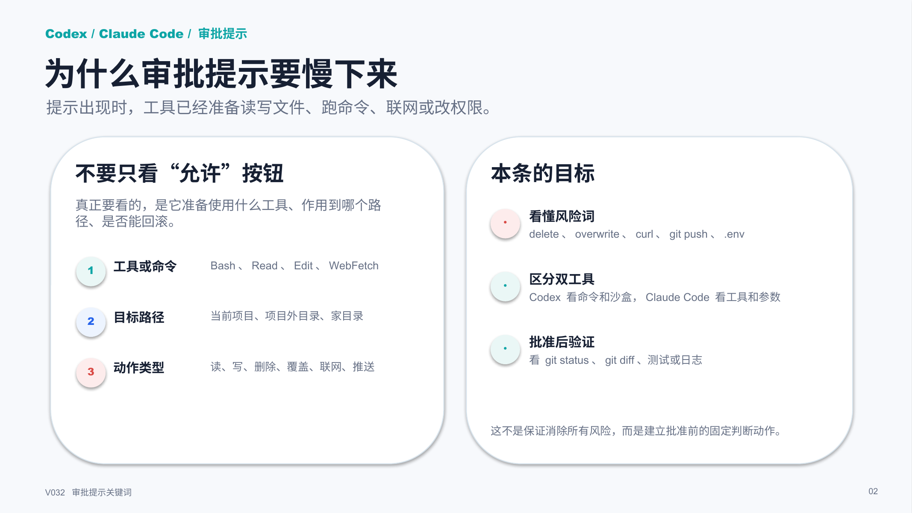

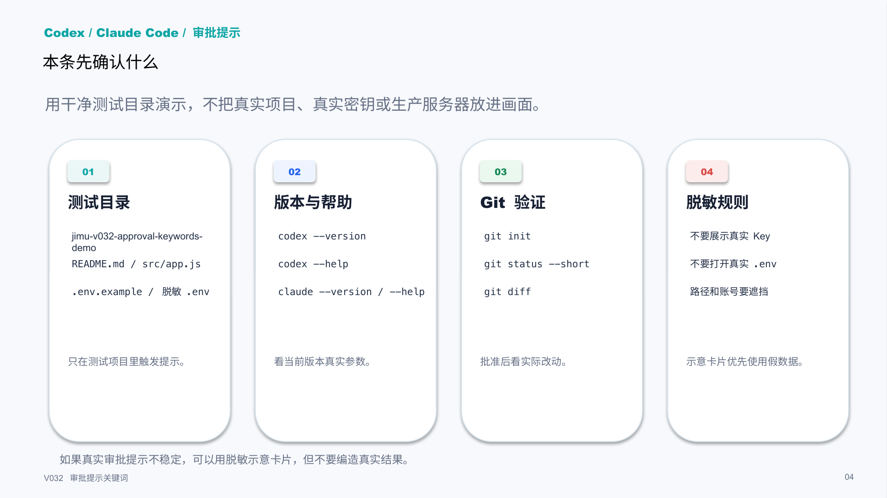

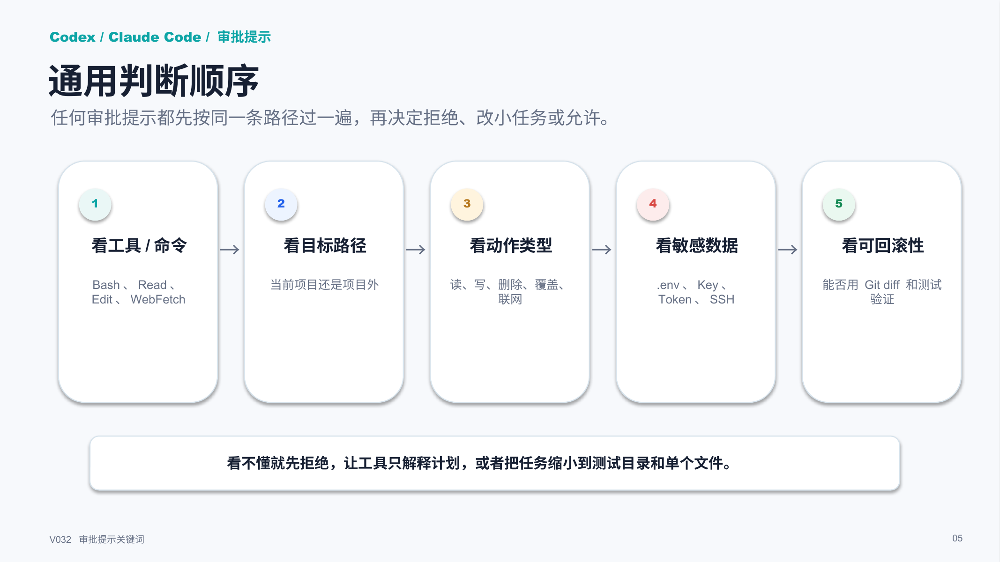

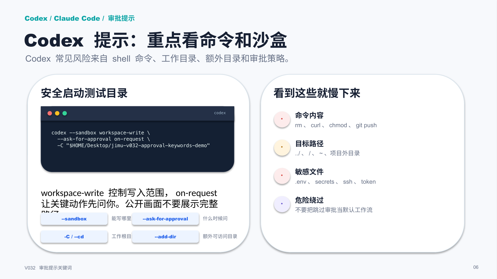

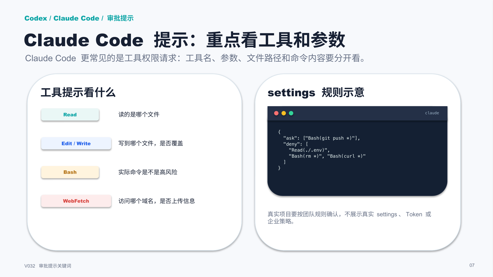

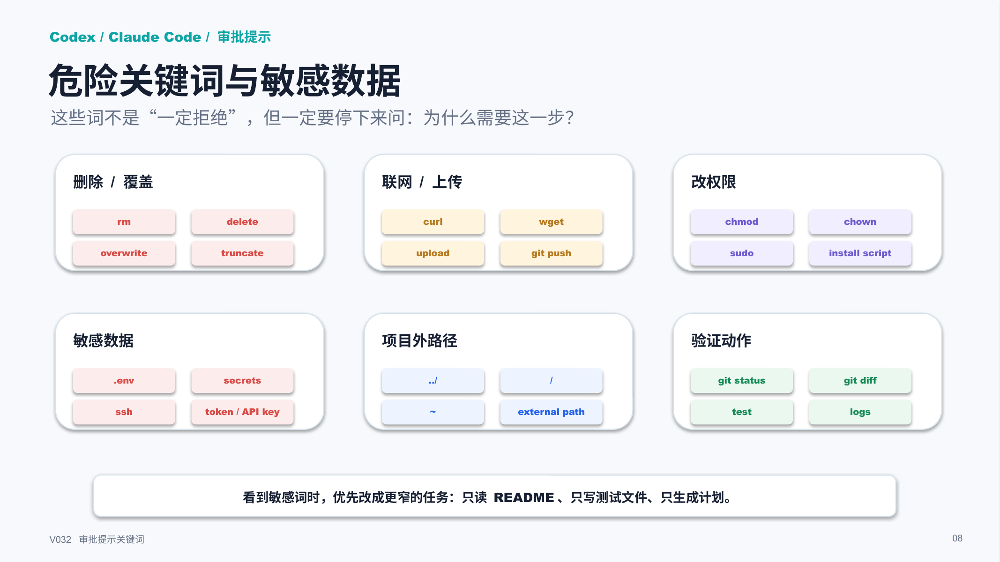

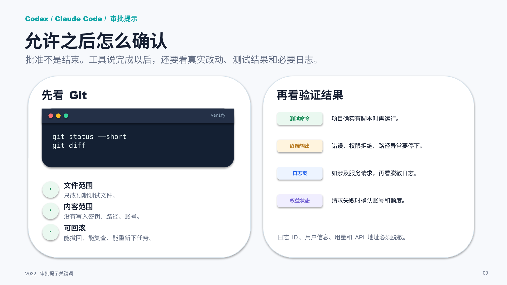

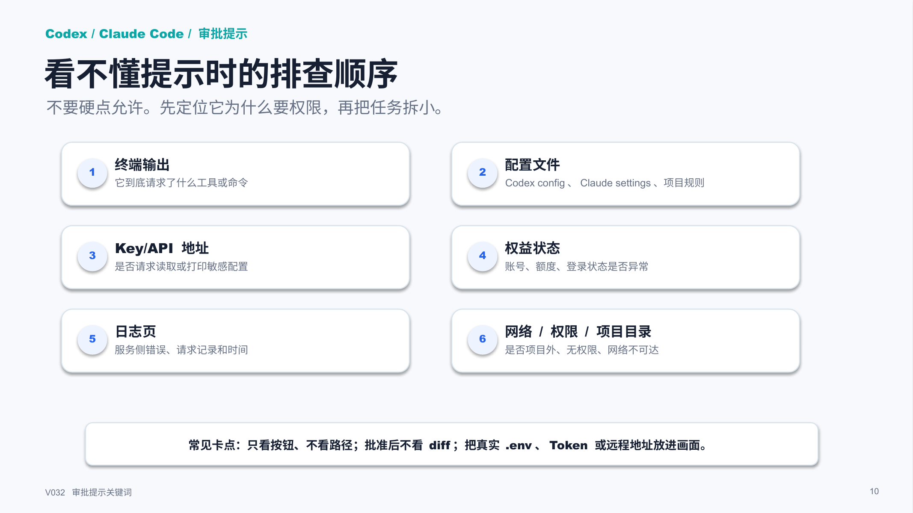

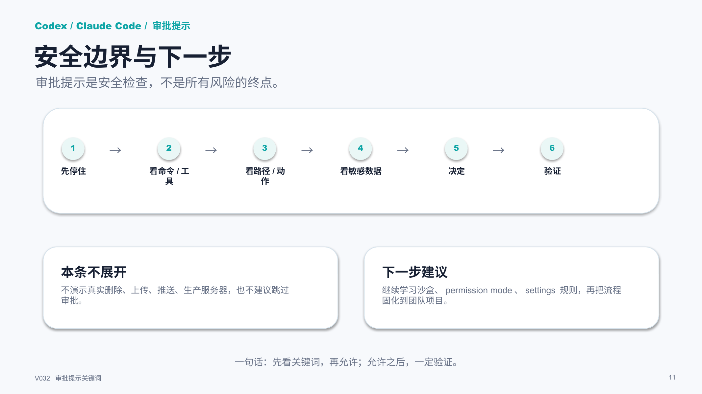

## 标签
#Codex #ClaudeCode #AI编程 #权限安全 #审批提示 #故障排查 #配置教程 #日志核对
