# V033 图文发布稿（带图版）

## 标题

Codex 和 Claude Code 的 MCP 怎么看？新手先搞懂连接、权限和失败点

## 前两段短文案

这条先不急着接 GitHub、数据库或浏览器 MCP，而是先把 MCP 的连接链路讲清楚：Codex 看哪些 `mcp` 命令，Claude Code 怎么区分 local / project / user scope，`/mcp` 面板适合看什么。

这篇主要解决：以为 MCP 是一个“一键打开所有工具”的功能，忽略了连接方式、权限和配置来源。看完你能：MCP 的基本链路：本地工具 / 远程服务 -> 配置文件 -> MCP server -> Codex 或 Claude Code -> 工具调用。建议先收藏，操作时对照配图一步步核对。

## 备用标题

MCP 一直连接不上？先按这个顺序查，不要反复重装
MCP 新手第 1 集：连接、权限、失败排查从哪里开始

## 完整正文备用

这条先不急着接 GitHub、数据库或浏览器 MCP，而是先把 MCP 的连接链路讲清楚：Codex 看哪些 `mcp` 命令，Claude Code 怎么区分 local / project / user scope，`/mcp` 面板适合看什么。连接失败时，建议按“终端输出、配置文件、Key/API 地址、权益状态、日志页、网络、权限、项目目录”的顺序排查。

视频中所有配置、日志和错误提示均使用非真实登录数据 / 脱敏示意。真实 Token、数据库地址、日志 ID 和账号信息录屏时必须打码。

这篇适合刚开始接触积木代码助手、Codex 或 Claude Code 的同学。不要只盯着一个按钮或一条命令，建议按图里的顺序看：先看当前问题，再看操作路径，最后确认结果有没有真正跑通。

常见卡点：
以为 MCP 是一个“一键打开所有工具”的功能，忽略了连接方式、权限和配置来源
分不清远程 HTTP MCP 和本地 stdio MCP，遇到连接失败只会重复执行添加命令
Codex 和 Claude Code 的 MCP 命令相似但不完全一样，容易把两个工具的参数混用
不知道失败时该先看终端输出、配置文件、Key/API 地址、权益状态、日志页、网络、权限还是项目目录

看完这篇，你应该能做到：
MCP 的基本链路：本地工具 / 远程服务 -> 配置文件 -> MCP server -> Codex 或 Claude Code -> 工具调用
Codex 的可确认命令：`codex mcp list`、`codex mcp list --json`、`codex mcp get <name>`、`codex mcp add <name> --url <url>`、`codex mcp add <name> -- <command>...`、`codex mcp remove <name>`、`codex mcp login <name> --scopes ...`、`codex mcp logout <name>`
Claude Code 的可确认命令：`claude mcp list`、`claude mcp get <name>`、`claude mcp add --transport http <name> <url>`、`claude mcp add --transport stdio --env KEY=value <name> -- <command> ...`、`claude mcp remove <name>`、`claude --mcp-config <file>`、`claude --strict-mcp-config`、会话内 `/mcp`
Claude Code 的 scope 差异：`local`、`project`、`user`；其中 project scope 会写入项目根目录 `.mcp.json`，local/user 记录在 `~/.claude.json`

我的建议是，第一次操作时不要一边改很多地方，一边猜原因。先把页面、终端输出、配置文件、日志记录这几块分开看，哪一步不一致，就从那一步往回查。

如果你也在配置或使用 AI 编程工具，可以先收藏这篇。后面遇到类似问题时，按这条路线重新核对一遍，通常能更快判断下一步该看哪里。

## 配图说明

首图用 `cover-flow-images/V033-cover-douyin.png`。
第二张用 `cover-flow-images/V033-flow.png`。
后面从 `ppt-images/slide-01.png` 到 `ppt-images/slide-08.png` 里选关键步骤图。
如果平台限制图片数量，优先保留：流程图、关键操作、常见错误、结果确认。

## 配图预览

### 首图与流程图

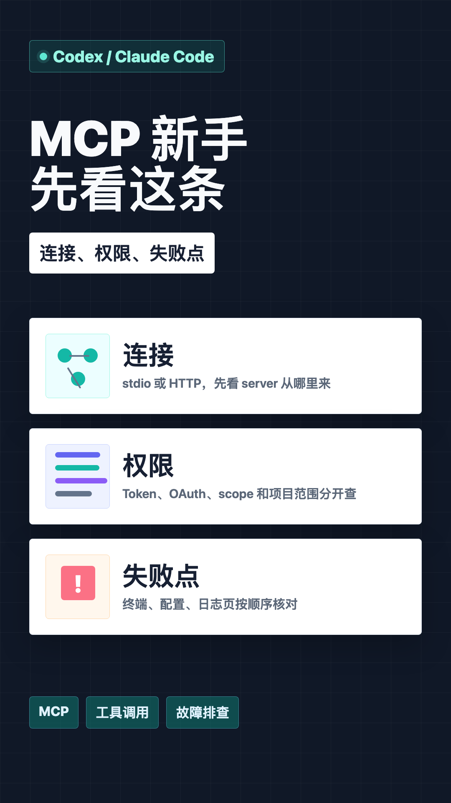

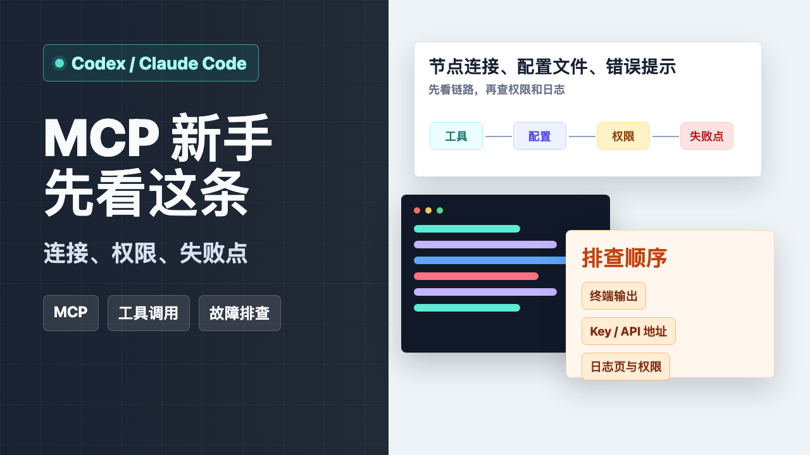

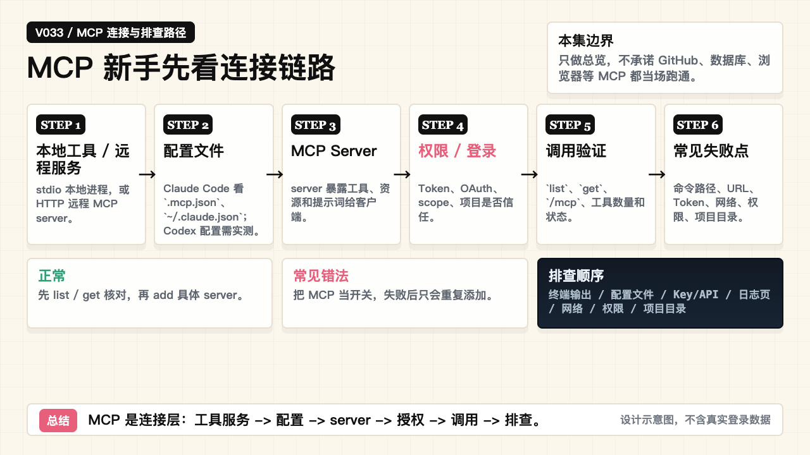

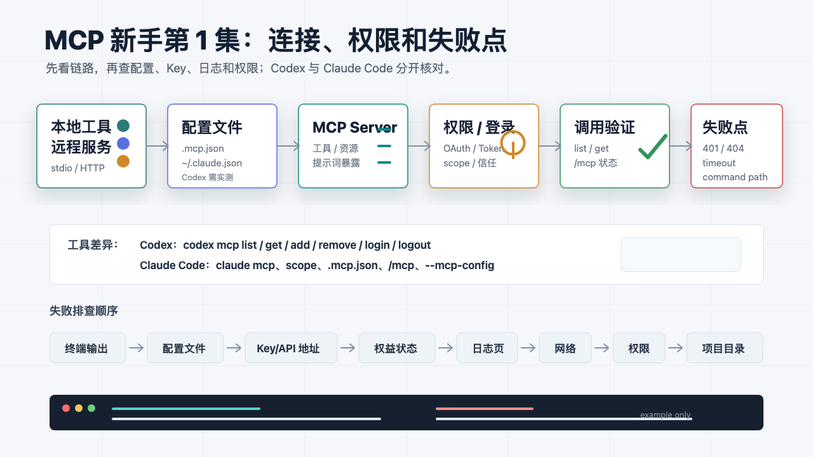

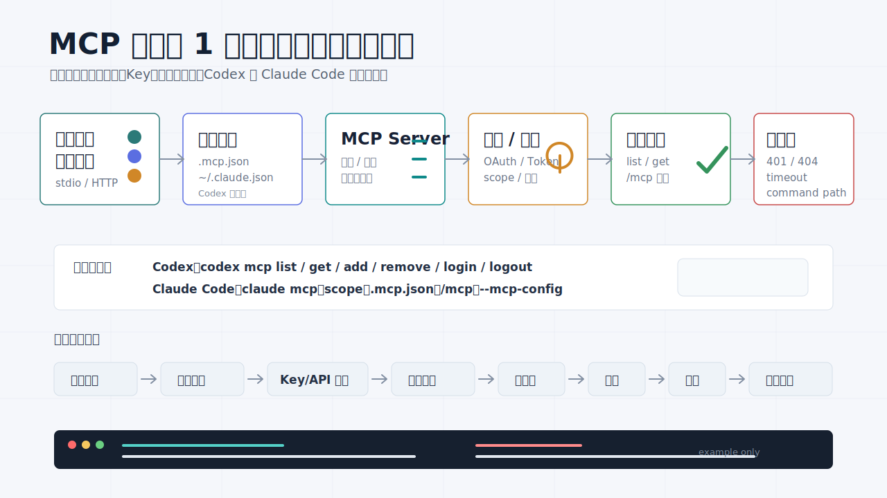

### PPT 步骤图

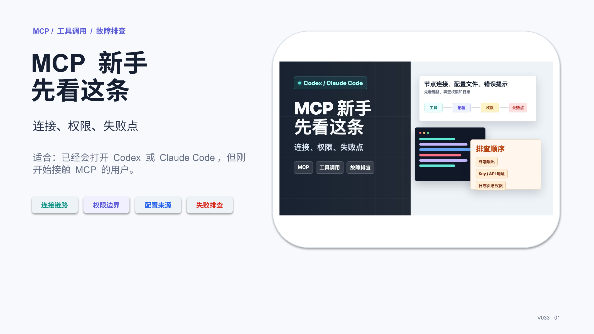

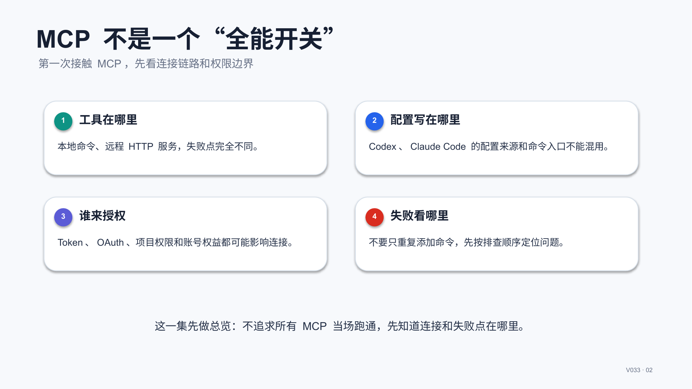

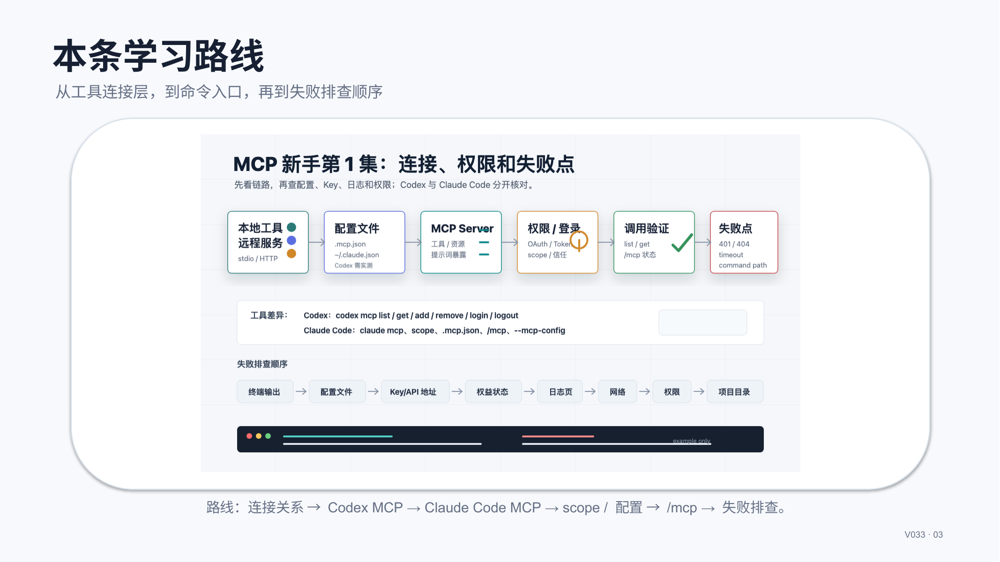

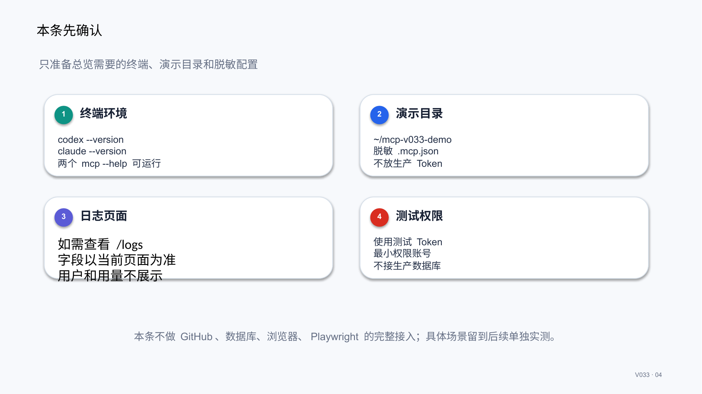

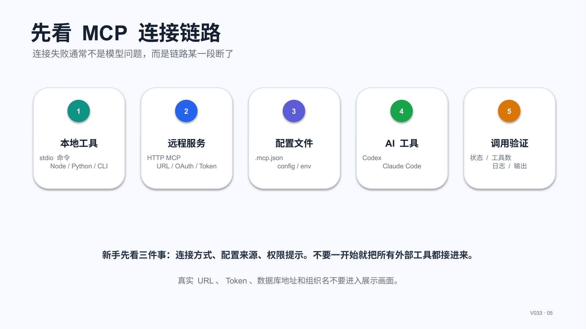

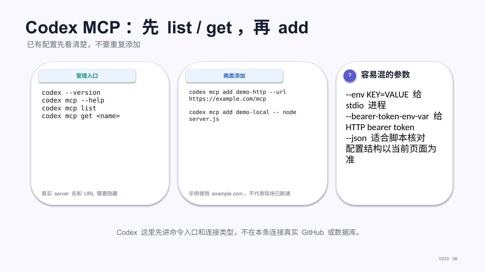

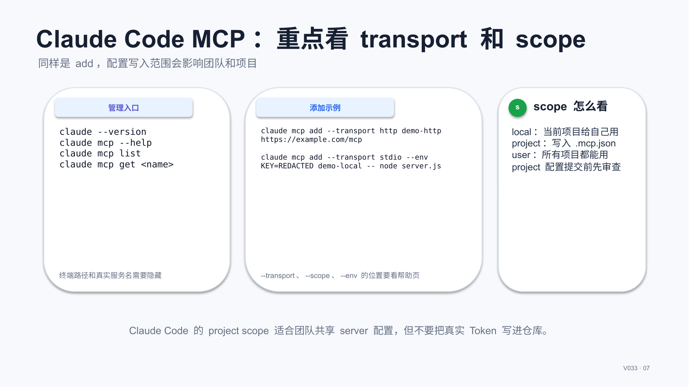

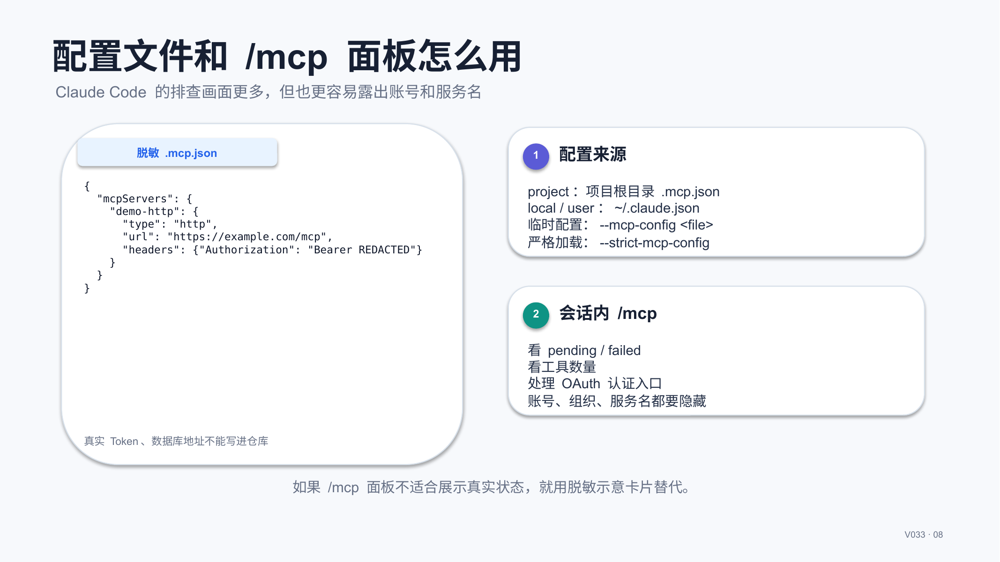

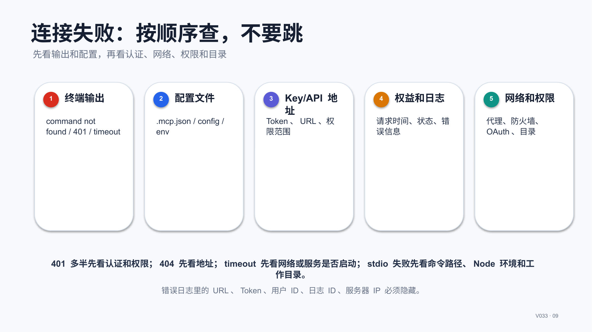

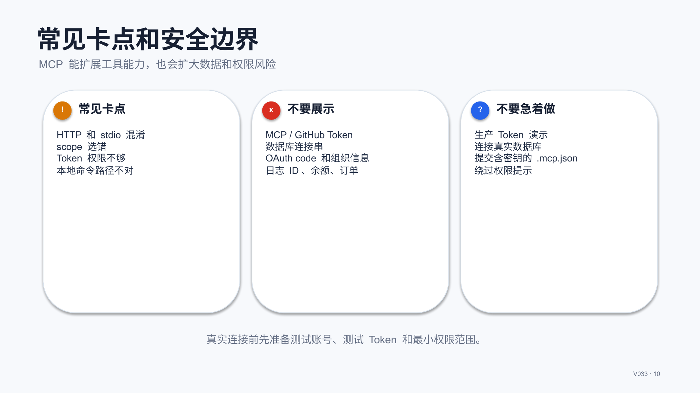

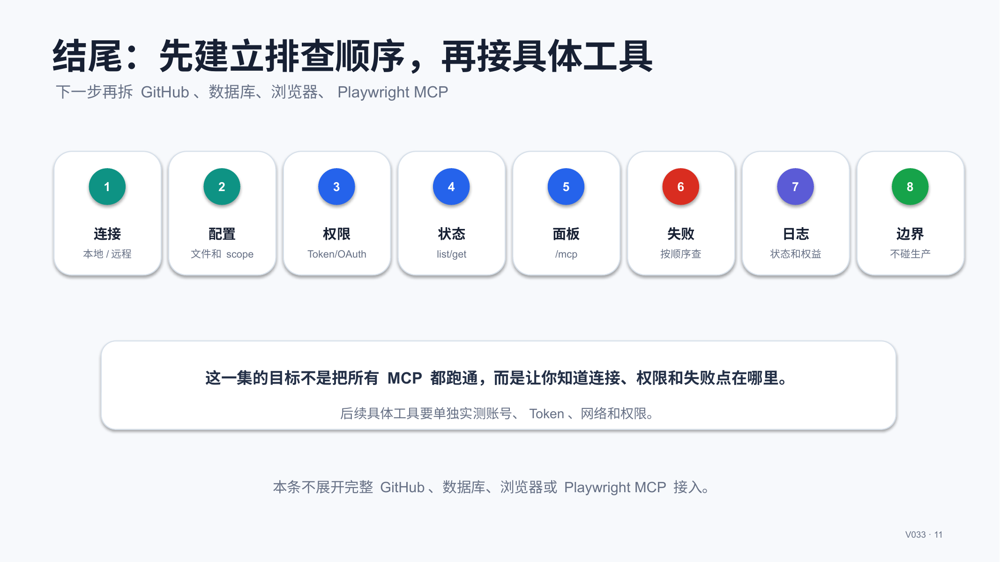

## 标签
#MCP #Codex #ClaudeCode #AI编程 #工具调用 #配置教程 #故障排查 #日志核对
