# V037 图文发布稿（带图版）

## 标题

Skill 适合做代码审查、视频脚本、项目初始化模板吗

## 前两段短文案

这条用三个具体场景讲 Skill 的适用边界：代码审查、视频脚本、项目初始化。重点不是做一个很长的提示词，而是把重复流程、输入字段和输出格式整理成可复用模板。

这篇主要解决：同一套检查清单每次都手动复制，容易漏项。看完你能：判断哪些重复任务适合做成 Skill 模板。建议先收藏，操作时对照配图一步步核对。

## 备用标题

Skill 适合做代码审查、视频脚本、项目初始化模板吗：按这条路线看就够了

## 完整正文备用

这条用三个具体场景讲 Skill 的适用边界：代码审查、视频脚本、项目初始化。重点不是做一个很长的提示词，而是把重复流程、输入字段和输出格式整理成可复用模板。Claude Code 已确认的 Skills 路径和权限字段会单独讲，Codex 的具体入口以录屏前实测为准。

这篇适合刚开始接触积木代码助手、Codex 或 Claude Code 的同学。不要只盯着一个按钮或一条命令，建议按图里的顺序看：先看当前问题，再看操作路径，最后确认结果有没有真正跑通。

常见卡点：
同一套检查清单每次都手动复制，容易漏项
代码审查、脚本撰写、项目初始化的输出格式不稳定，后期难复用
不清楚 Skill 更适合做流程模板，还是适合塞大量背景知识
不知道 Skill 调用时涉及哪些权限和安全边界

看完这篇，你应该能做到：
判断哪些重复任务适合做成 Skill 模板
看懂 `SKILL.md`、模板文件、示例文件之间的关系
用三个场景理解 Skill 的边界：代码审查、视频脚本、项目初始化
录屏时能分清 Claude Code 已确认的 Skills 路径和字段，以及 Codex 需要现场实测确认的部分

我的建议是，第一次操作时不要一边改很多地方，一边猜原因。先把页面、终端输出、配置文件、日志记录这几块分开看，哪一步不一致，就从那一步往回查。

如果你也在配置或使用 AI 编程工具，可以先收藏这篇。后面遇到类似问题时，按这条路线重新核对一遍，通常能更快判断下一步该看哪里。

## 配图说明

首图用 `cover-flow-images/V037-cover-douyin.png`。
第二张用 `cover-flow-images/V037-flow.png`。
后面从 `ppt-images/slide-01.png` 到 `ppt-images/slide-08.png` 里选关键步骤图。
如果平台限制图片数量，优先保留：流程图、关键操作、常见错误、结果确认。

## 配图预览

### 首图与流程图

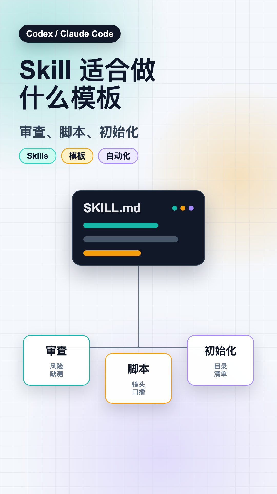

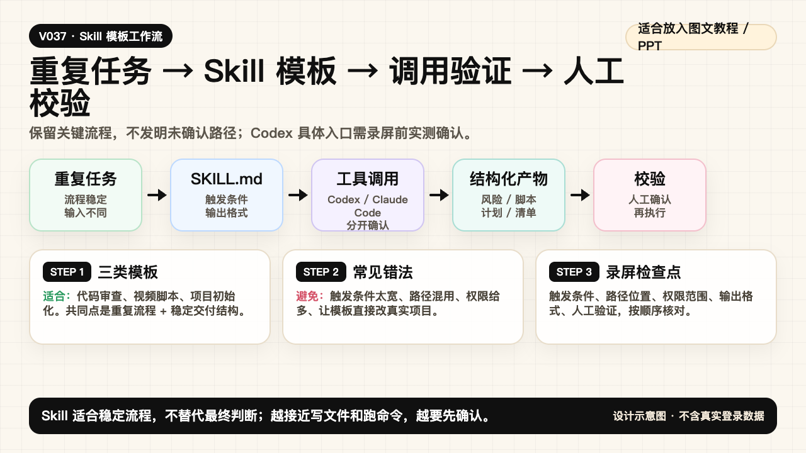

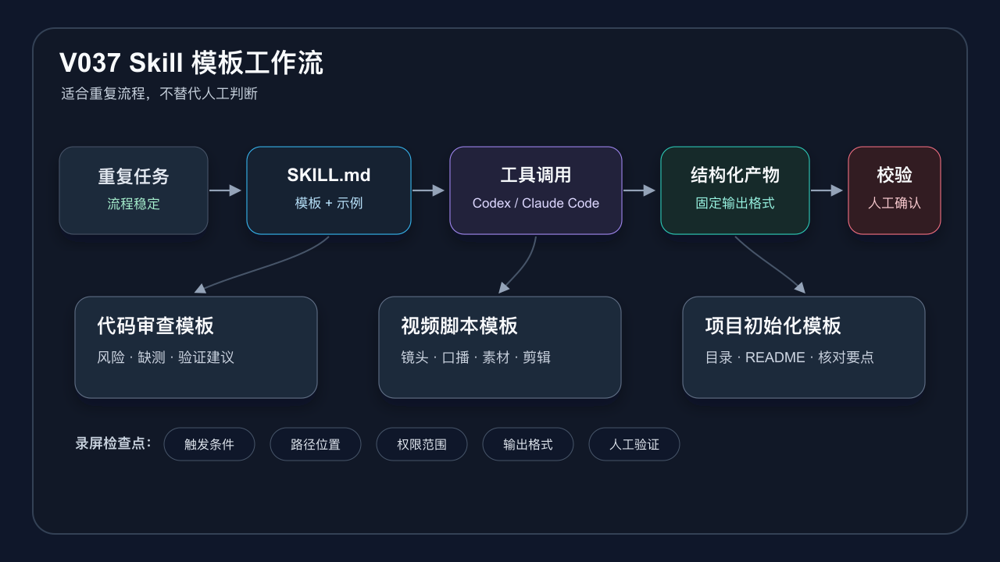

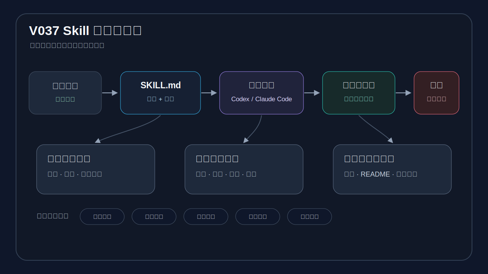

### PPT 步骤图

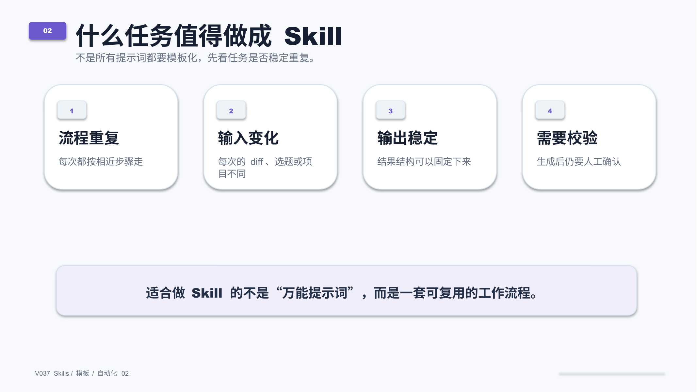

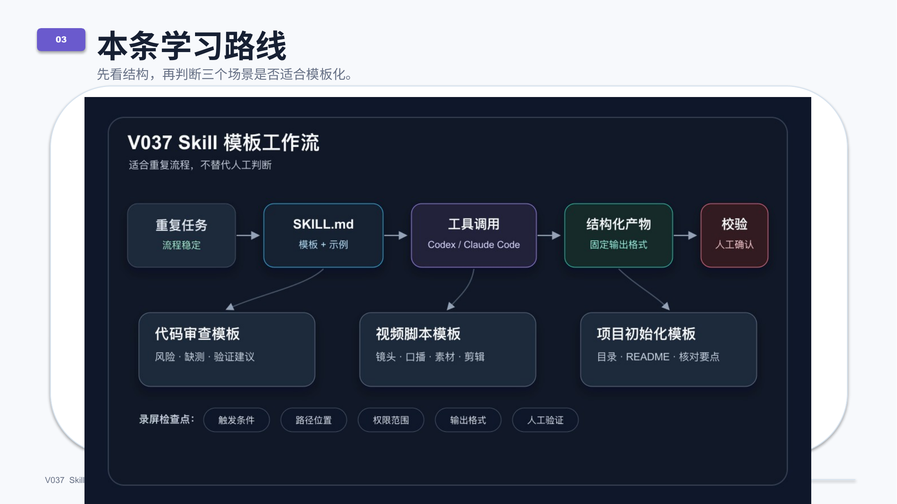

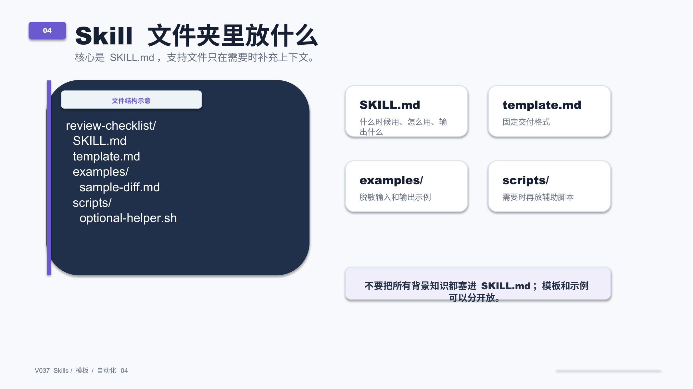

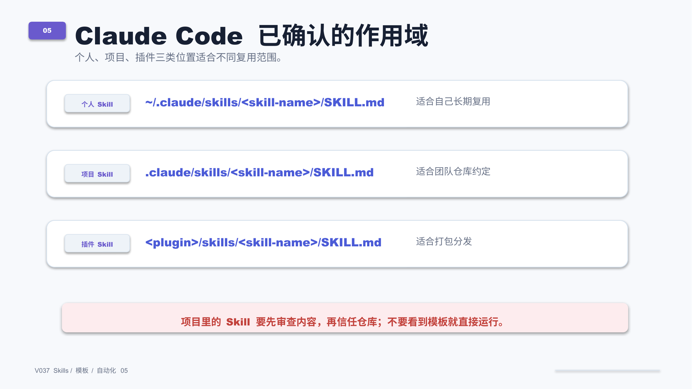

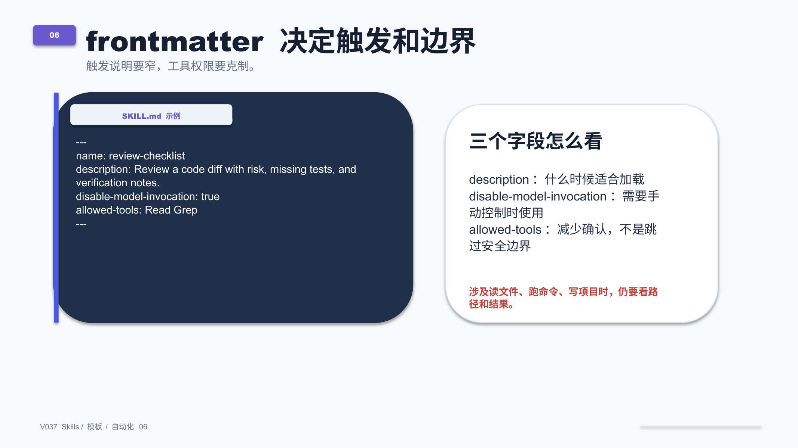

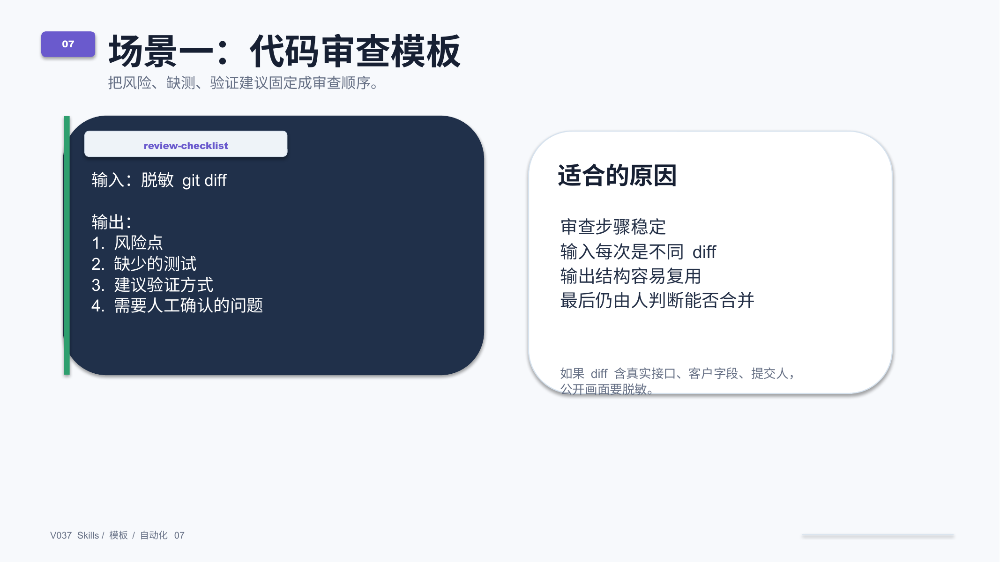

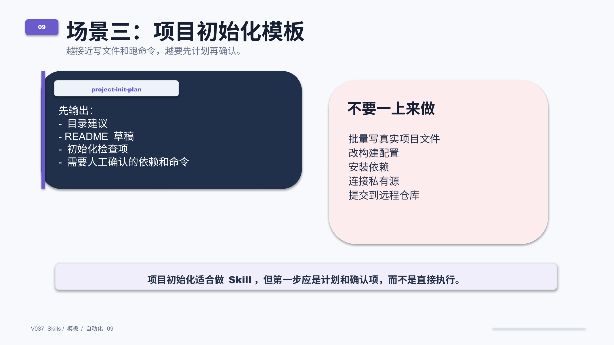

## 标签
#Codex #ClaudeCode #AI编程 #Skills #模板 #自动化 #代码审查 #视频脚本
