# V039 图文发布稿（带图版）

## 标题

批量检查多个仓库怎么录才不枯燥

## 前两段短文案

这条讲多仓库批量检查怎么录得清楚。用 3 个脱敏示例仓库演示：先给仓库清单，再给检查模板，分别展示 Codex `exec` 和 Claude Code `-p` 的单仓样例，再看批量进度、汇总报告、失败日志和安全边界。

这篇主要解决：批量检查一跑就是一长串终端输出，剪出来很枯燥。看完你能：设计一个 3 个小仓库的可录屏示例，不用真实公司仓库做演示。建议先收藏，操作时对照配图一步步核对。

## 备用标题

批量检查多个仓库怎么录才不枯燥：按这条路线看就够了

## 完整正文备用

这条讲多仓库批量检查怎么录得清楚。用 3 个脱敏示例仓库演示：先给仓库清单，再给检查模板，分别展示 Codex `exec` 和 Claude Code `-p` 的单仓样例，再看批量进度、汇总报告、失败日志和安全边界。重点不是夸自动化，而是让观众看懂输入、过程、输出和人工复核。

这篇适合刚开始接触积木代码助手、Codex 或 Claude Code 的同学。不要只盯着一个按钮或一条命令，建议按图里的顺序看：先看当前问题，再看操作路径，最后确认结果有没有真正跑通。

常见卡点：
批量检查一跑就是一长串终端输出，剪出来很枯燥
不知道多仓库场景里哪些画面必须录：仓库清单、输入提示词、单仓报告、汇总报告、失败日志
把 Codex `exec` 和 Claude Code `-p` 混成一个命令体系
忽略自动化权限：真实仓库地址、Token、Key、私有路径、日志文件容易露出

看完这篇，你应该能做到：
设计一个 3 个小仓库的可录屏示例，不用真实公司仓库做演示
用 Codex 和 Claude Code 分别展示“单仓库非交互检查”的命令入口
把多仓库批量检查拍成可理解的画面：清单、进度、报告、汇总、失败处理
知道自动化权限边界：只读检查、限制目录、限制工具、预算、日志打码

我的建议是，第一次操作时不要一边改很多地方，一边猜原因。先把页面、终端输出、配置文件、日志记录这几块分开看，哪一步不一致，就从那一步往回查。

如果你也在配置或使用 AI 编程工具，可以先收藏这篇。后面遇到类似问题时，按这条路线重新核对一遍，通常能更快判断下一步该看哪里。

## 配图说明

首图用 `cover-flow-images/V039-cover-douyin.png`。
第二张用 `cover-flow-images/V039-flow.png`。
后面从 `ppt-images/slide-01.png` 到 `ppt-images/slide-08.png` 里选关键步骤图。
如果平台限制图片数量，优先保留：流程图、关键操作、常见错误、结果确认。

## 配图预览

### 首图与流程图

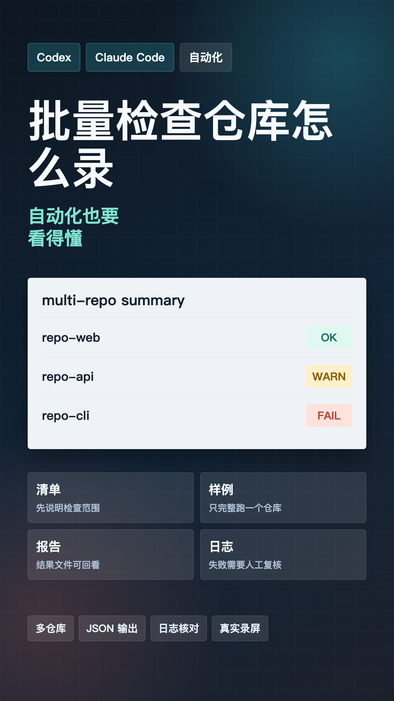

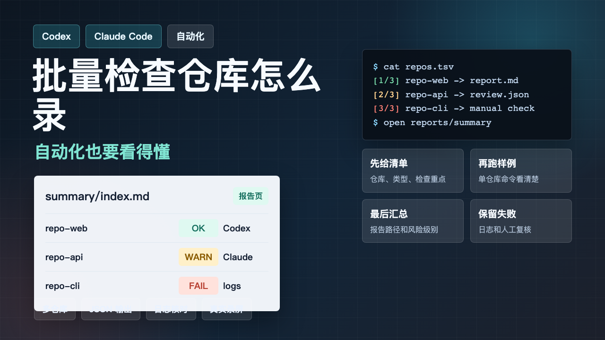

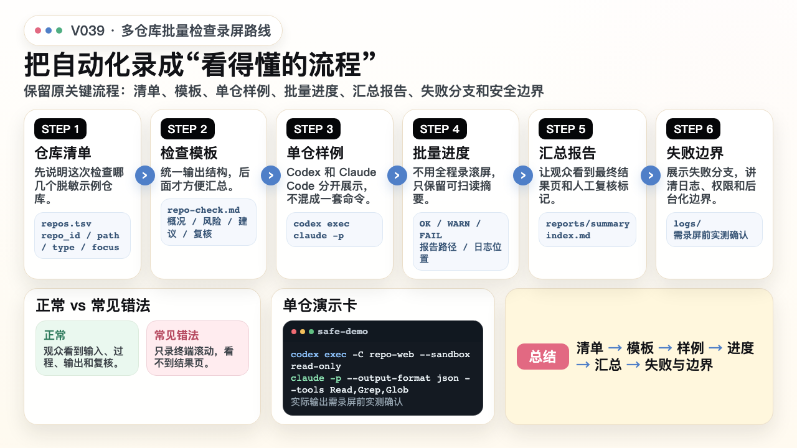

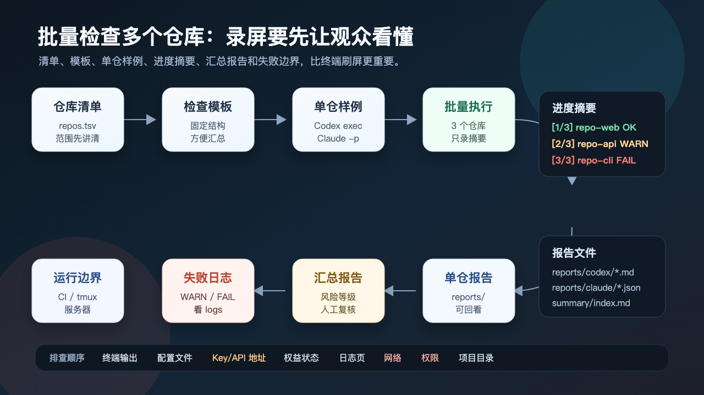

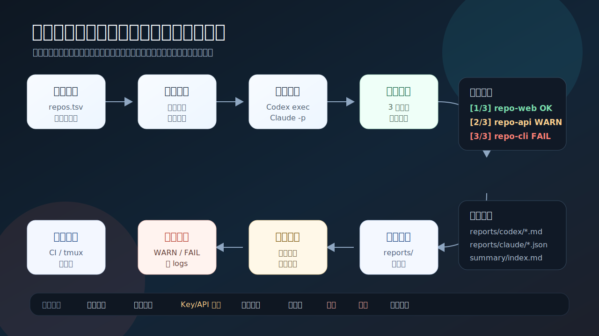

### PPT 步骤图

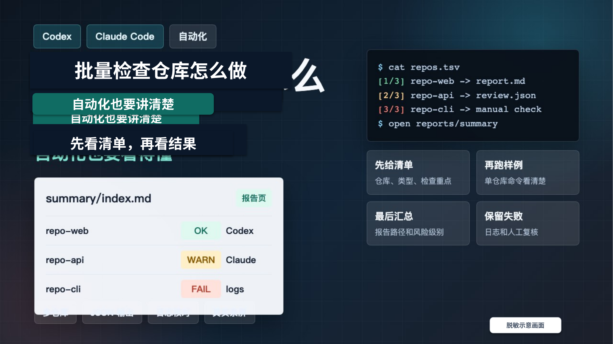

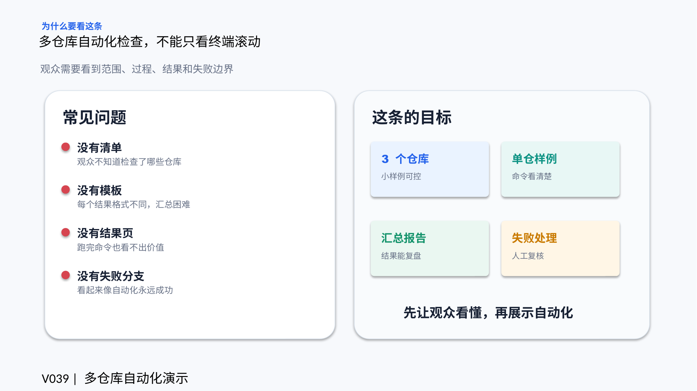

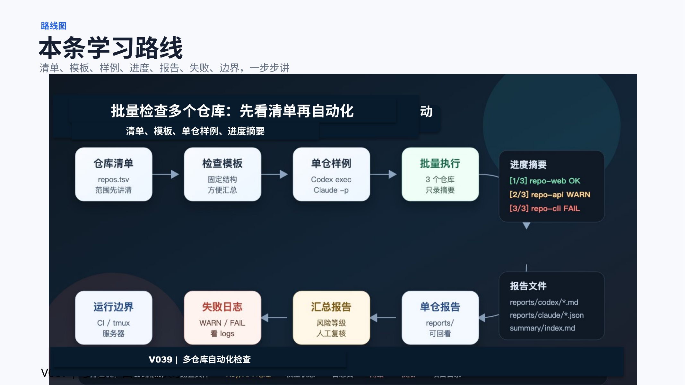

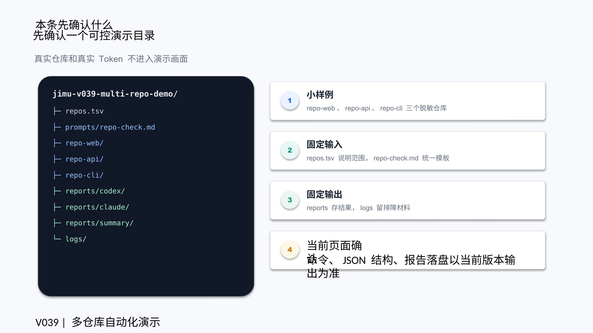

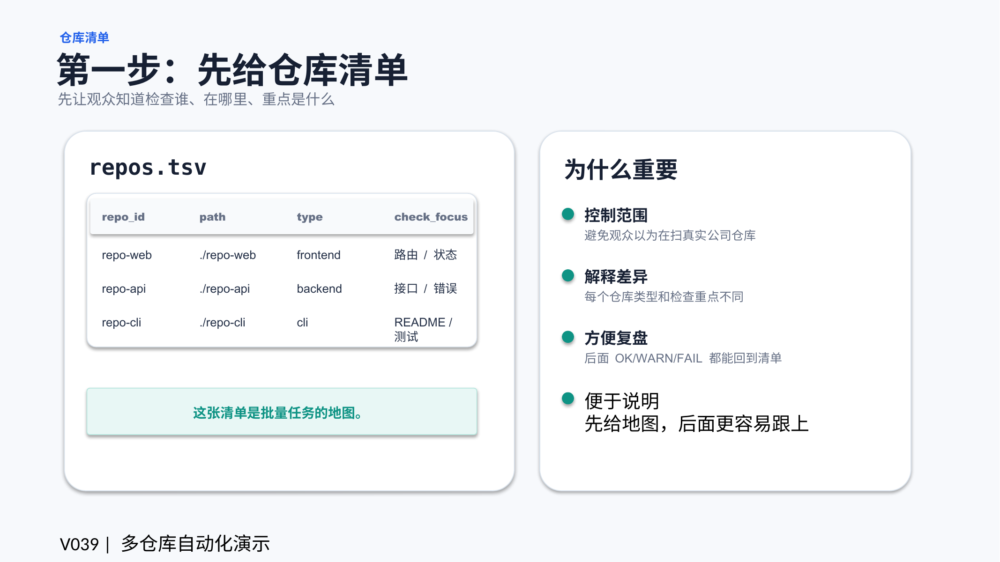

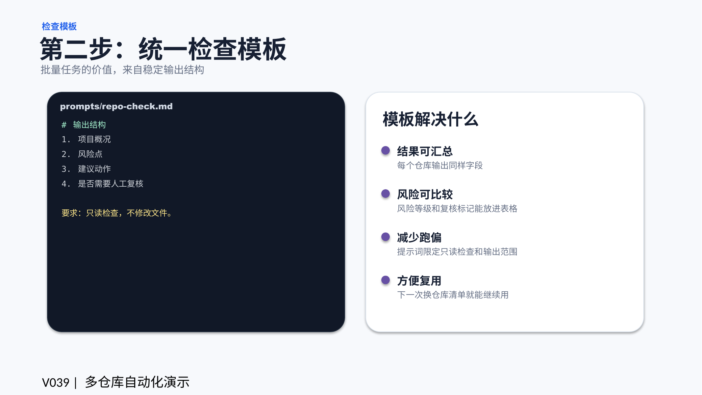

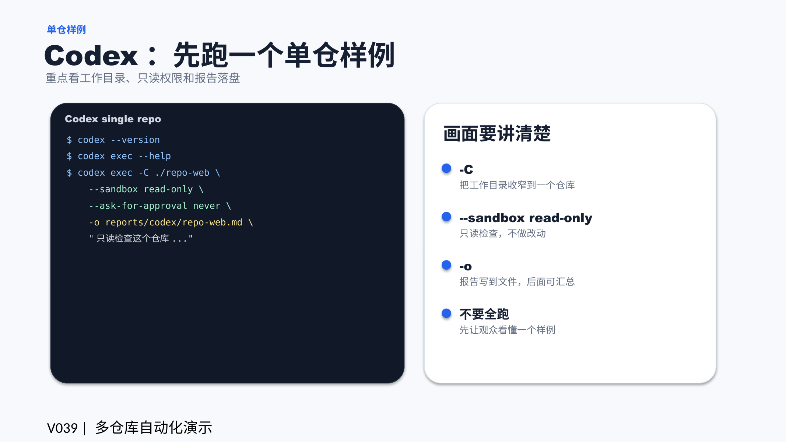

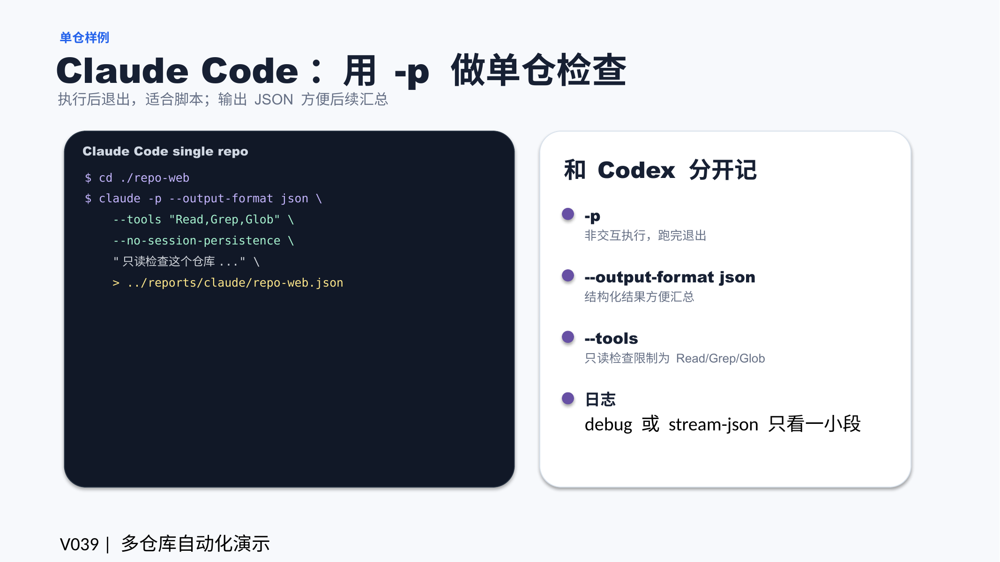

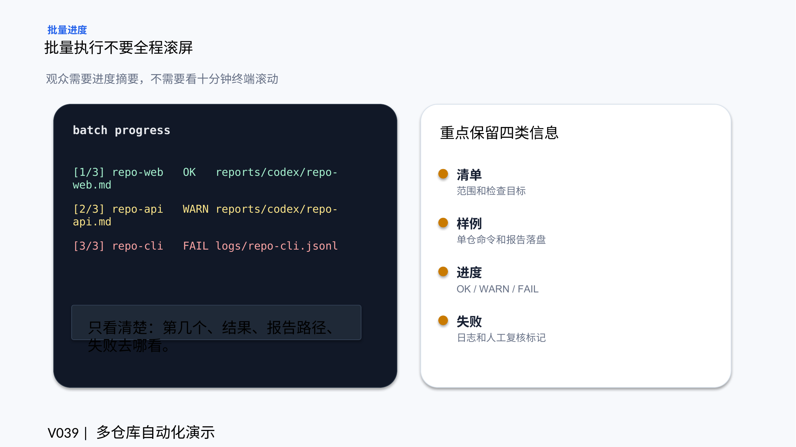

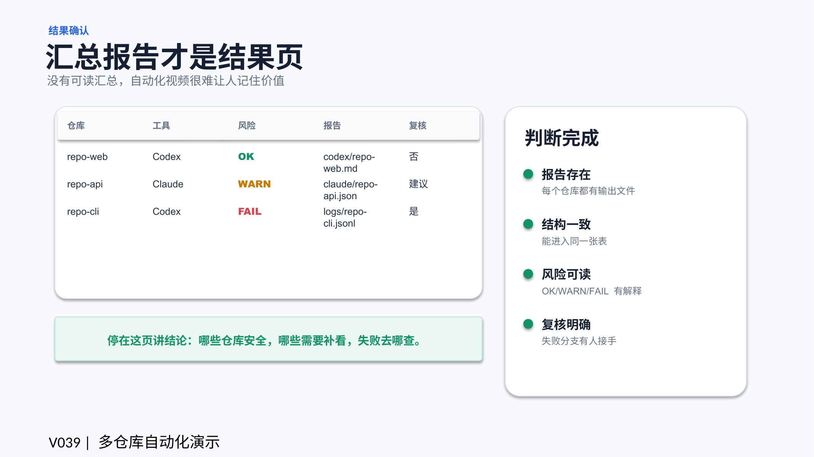

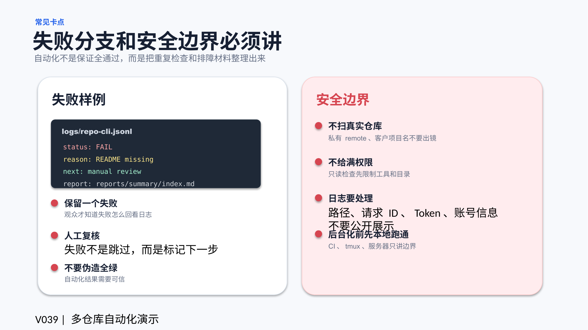

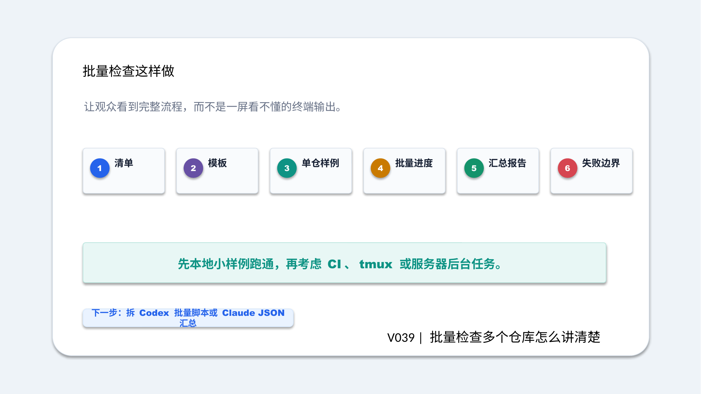

## 标签
#Codex #ClaudeCode #AI编程 #自动化 #多仓库 #报告 #JSON #输出
