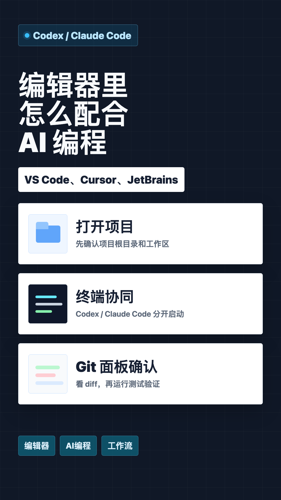
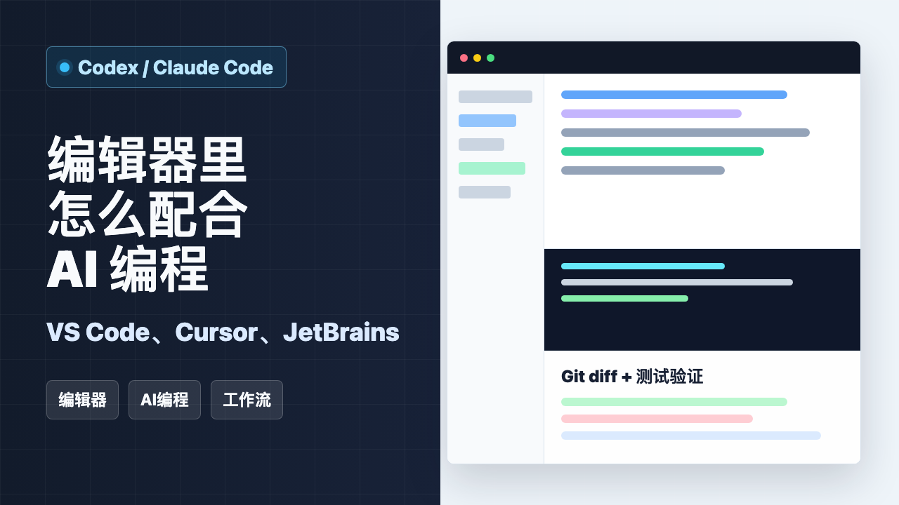
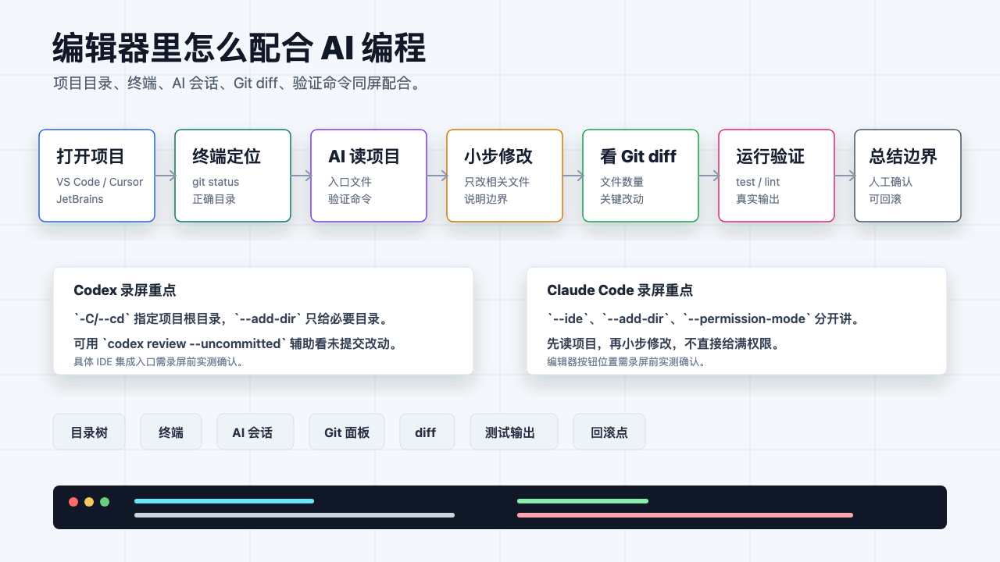
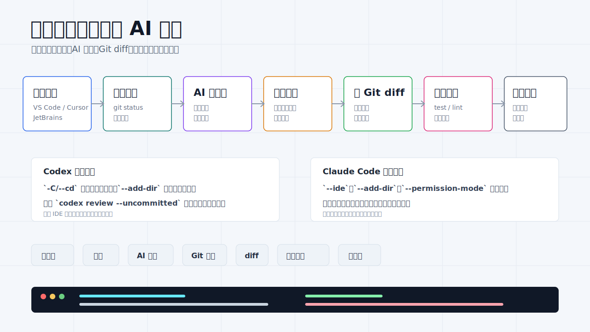
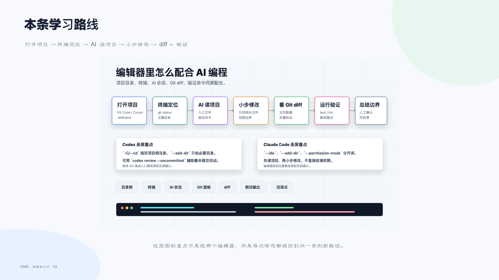
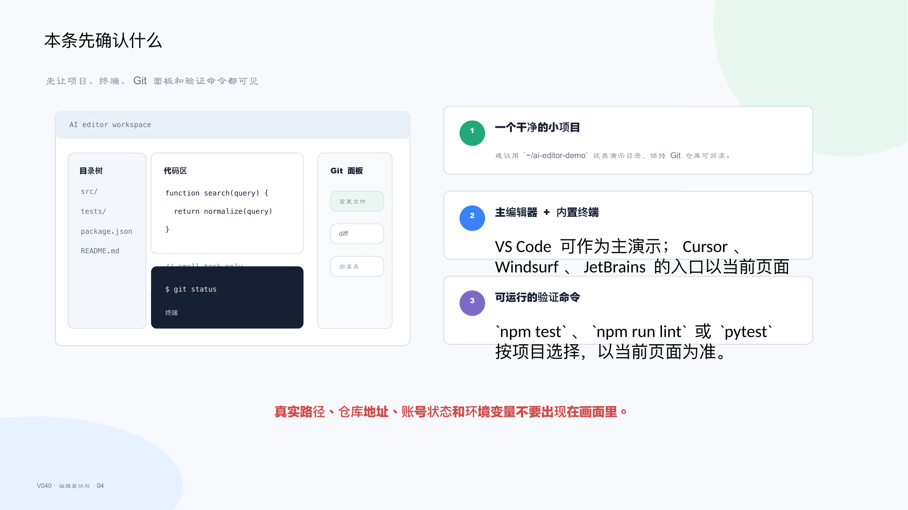
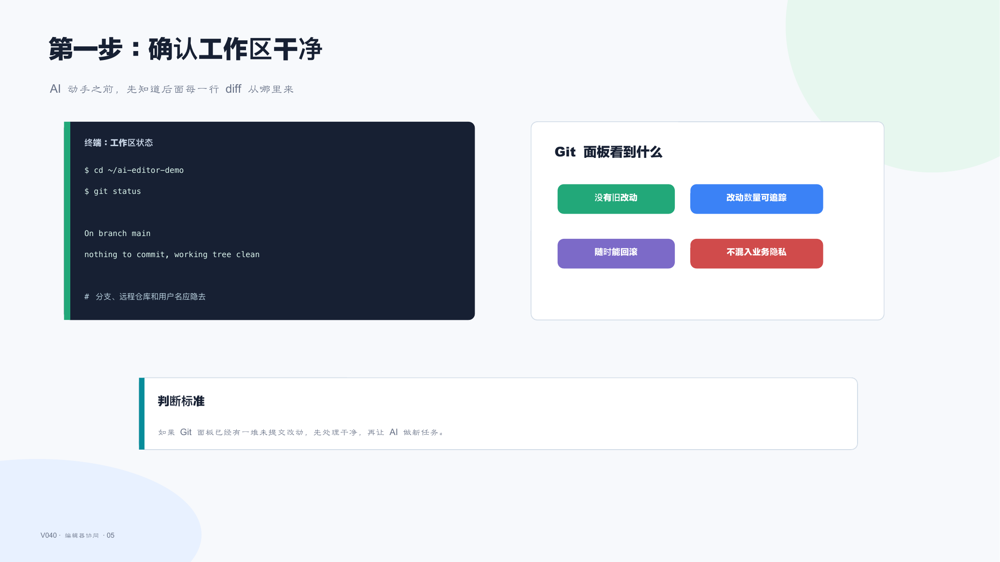
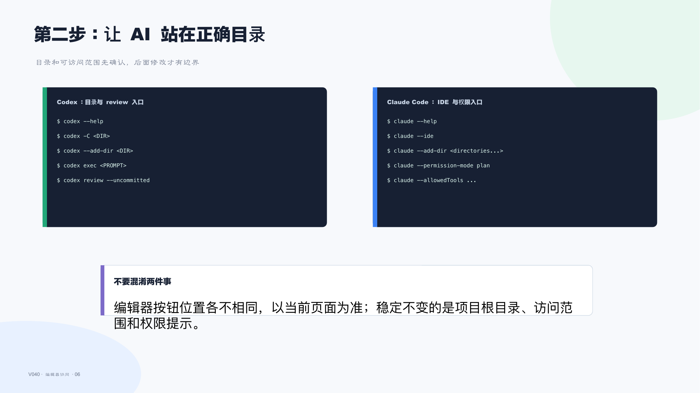
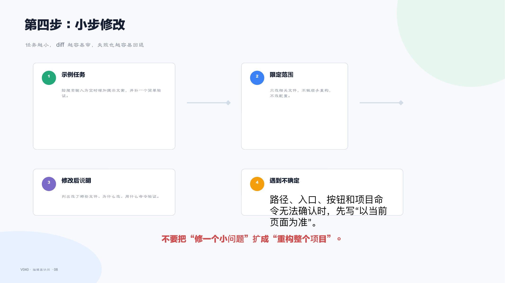
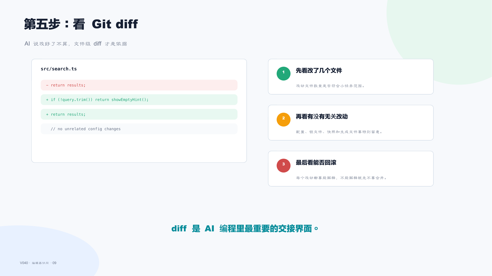

# V040 图文发布稿（带图版）

## 标题

VS Code、Cursor、Windsurf、JetBrains 里怎么配合 Codex / Claude Code

## 前两段短文案

这条不做编辑器排名，而是讲一个稳定工作流：打开项目，确认 Git 工作区，启动 Codex 或 Claude Code，先读项目，再做小修改，最后看 diff、跑验证。

这篇主要解决：以为换一个编辑器就能自动变强，忽略项目目录、终端工作区、Git 面板和测试验证。看完你能：VS Code、Cursor、Windsurf、JetBrains 在本条中的角色：编辑器和项目工作台，不是替代验证步骤。建议先收藏，操作时对照配图一步步核对。

## 备用标题

AI 改完代码别只看回答，编辑器里要看 diff 和测试
AI 编程工作流第 1 集：编辑器、终端、Git 面板怎么配合

## 完整正文备用

这条不做编辑器排名，而是讲一个稳定工作流：打开项目，确认 Git 工作区，启动 Codex 或 Claude Code，先读项目，再做小修改，最后看 diff、跑验证。VS Code、Cursor、Windsurf、JetBrains 的入口可能不同，但核心判断都离不开终端、Git 面板和测试结果。

视频中封面和示意卡片均使用非真实登录数据 / 脱敏示意。真实项目路径、仓库地址、Key、Token、用户信息和日志都必须打码。

这篇适合刚开始接触积木代码助手、Codex 或 Claude Code 的同学。不要只盯着一个按钮或一条命令，建议按图里的顺序看：先看当前问题，再看操作路径，最后确认结果有没有真正跑通。

常见卡点：
以为换一个编辑器就能自动变强，忽略项目目录、终端工作区、Git 面板和测试验证
把 Codex / Claude Code CLI 与 IDE 插件混成一个概念，录屏时不知道该拍编辑器还是终端
AI 改完代码后只看回答，不看 diff、不跑测试、不检查 Git 面板
多编辑器同屏容易混乱，观众看不清当前项目、当前命令、当前修改结果

看完这篇，你应该能做到：
VS Code、Cursor、Windsurf、JetBrains 在本条中的角色：编辑器和项目工作台，不是替代验证步骤
Codex 可确认命令入口：`codex --help`、`codex -C <DIR>`、`codex --add-dir <DIR>`、`codex exec`、`codex review --uncommitted`、`codex doctor`
Claude Code 可确认命令入口：`claude --help`、`claude --ide`、`claude --add-dir <directories...>`、`claude --permission-mode plan`、`claude --allowedTools`、`claude doctor`
一个可录屏小场景：打开演示项目 -> 读目录 -> 让 AI 修改一个小问题 -> 查看 Git diff -> 运行验证命令 -> 说明边界

我的建议是，第一次操作时不要一边改很多地方，一边猜原因。先把页面、终端输出、配置文件、日志记录这几块分开看，哪一步不一致，就从那一步往回查。

如果你也在配置或使用 AI 编程工具，可以先收藏这篇。后面遇到类似问题时，按这条路线重新核对一遍，通常能更快判断下一步该看哪里。

## 配图说明

首图用 `cover-flow-images/V040-cover-douyin.png`。
第二张用 `cover-flow-images/V040-flow.png`。
后面从 `ppt-images/slide-01.png` 到 `ppt-images/slide-08.png` 里选关键步骤图。
如果平台限制图片数量，优先保留：流程图、关键操作、常见错误、结果确认。

## 配图预览

### 首图与流程图

### PPT 步骤图

## 标签
#AI编程 #Codex #ClaudeCode #VS #Cursor #JetBrains #编辑器 #Git
