# V041 图文发布稿（带图版）

## 标题

AI 修改后怎么用 Git 面板和测试面板确认结果

## 前两段短文案

这条用一个小项目演示 AI 修改后的验收闭环：修改前确认 `git status`，修改后看 Git 面板和 `git diff`，再用测试面板或 `npm test` 验证。

这篇主要解决：AI 说“已完成”，但实际改动范围超了、漏改了测试，或者引入了新边界问题。看完你能：AI 修改前先确认 `git status` 干净，避免把旧改动混进本次验收。建议先收藏，操作时对照配图一步步核对。

## 备用标题

AI 改完别只看总结，先看 diff 和测试
积木代码助手进阶课：AI 修改后的验收流程

## 完整正文备用

这条用一个小项目演示 AI 修改后的验收闭环：修改前确认 `git status`，修改后看 Git 面板和 `git diff`，再用测试面板或 `npm test` 验证。Codex 侧讲已确认的 `codex review --uncommitted`；Claude Code 侧讲 `git diff HEAD` 汇总改动和 `/verify` 的实测边界。重点是不要只看 AI 总结，要看真实改动和测试输出。

这篇适合刚开始接触积木代码助手、Codex 或 Claude Code 的同学。不要只盯着一个按钮或一条命令，建议按图里的顺序看：先看当前问题，再看操作路径，最后确认结果有没有真正跑通。

常见卡点：
AI 说“已完成”，但实际改动范围超了、漏改了测试，或者引入了新边界问题
不知道 Git 面板、`git diff`、测试面板和终端输出分别该看什么
混淆 Codex 与 Claude Code 的审查入口，把未确认的 slash command 当成确定命令
没有形成“修改前干净工作区 -> AI 修改 -> 看 diff -> 跑测试 -> 人工确认”的闭环

看完这篇，你应该能做到：
AI 修改前先确认 `git status` 干净，避免把旧改动混进本次验收
AI 修改后先看 Git 面板和 `git diff`，确认改了哪些文件、有没有无关改动
用编辑器测试面板或终端命令跑验证，例如 `npm test`、`npm run lint` 或项目自己的测试命令
分别录 Codex 和 Claude Code 的确认画面：Codex 可确认 `codex review --uncommitted`；Claude Code 可确认 `/summarize-changes`、`/verify` 相关资料，但实际版本和入口要现场复核

我的建议是，第一次操作时不要一边改很多地方，一边猜原因。先把页面、终端输出、配置文件、日志记录这几块分开看，哪一步不一致，就从那一步往回查。

如果你也在配置或使用 AI 编程工具，可以先收藏这篇。后面遇到类似问题时，按这条路线重新核对一遍，通常能更快判断下一步该看哪里。

## 配图说明

首图用 `cover-flow-images/V041-cover-douyin.png`。
第二张用 `cover-flow-images/V041-flow.png`。
后面从 `ppt-images/slide-01.png` 到 `ppt-images/slide-08.png` 里选关键步骤图。
如果平台限制图片数量，优先保留：流程图、关键操作、常见错误、结果确认。

## 配图预览

### 首图与流程图

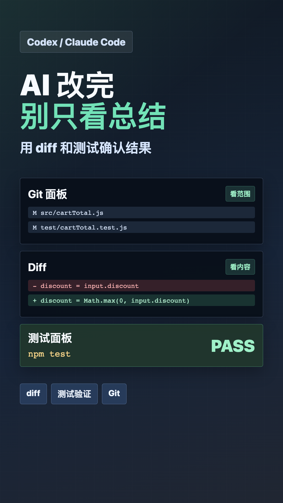

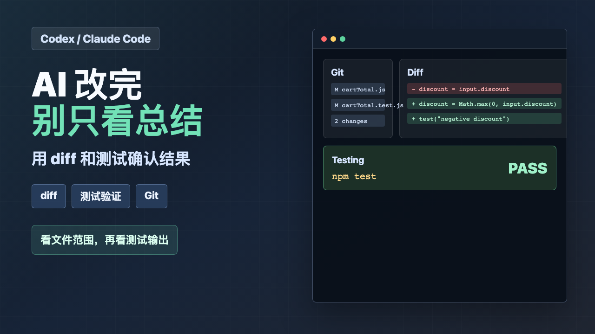

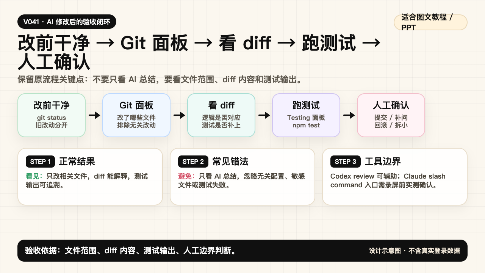

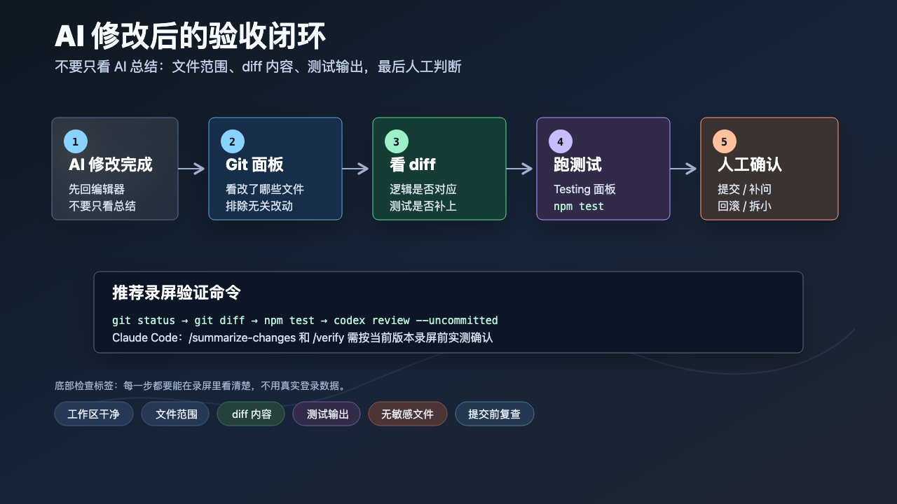

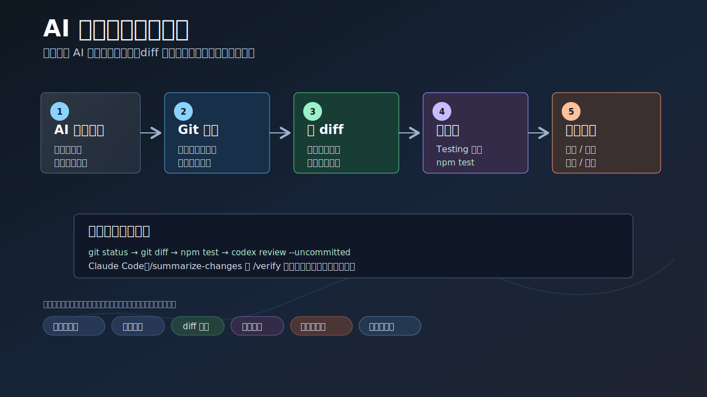

### PPT 步骤图

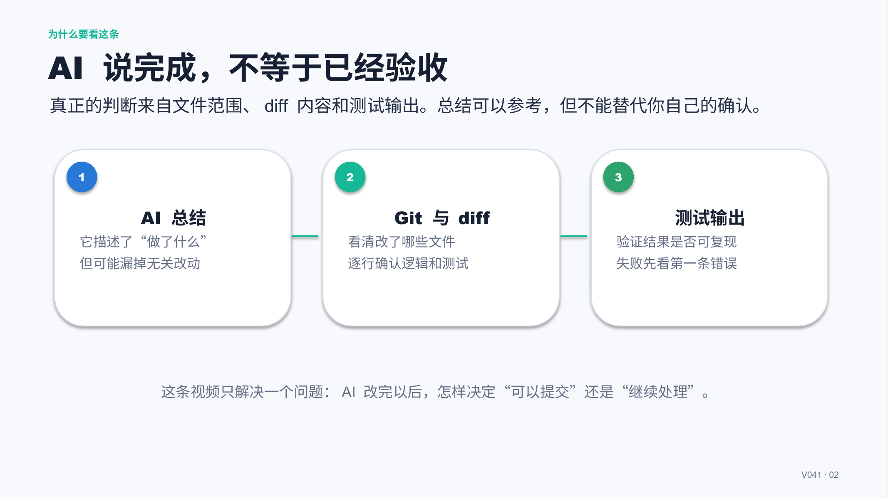

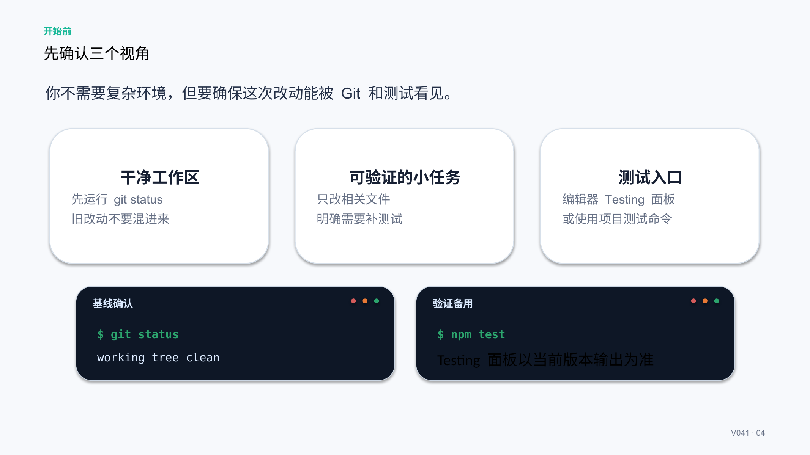

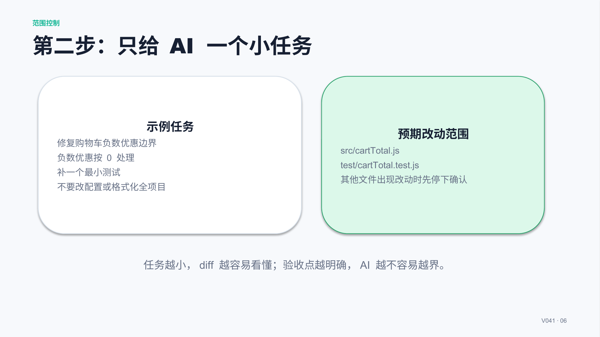

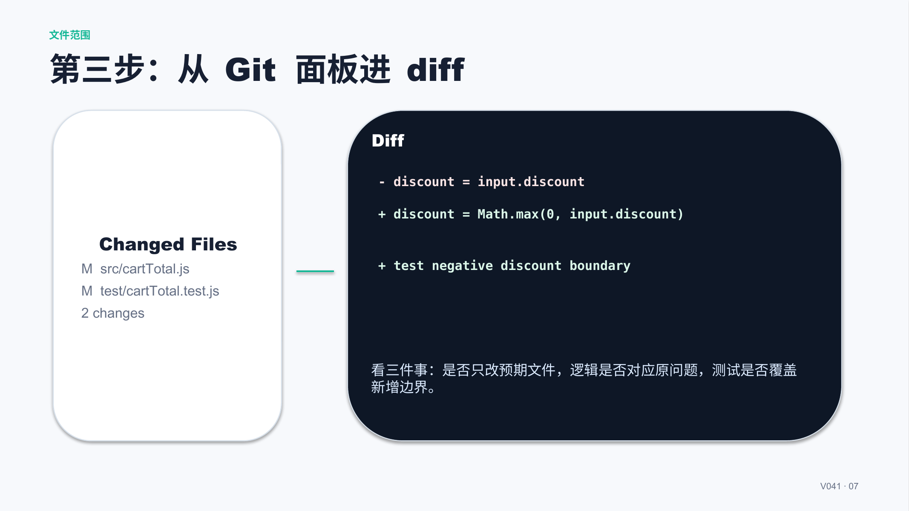

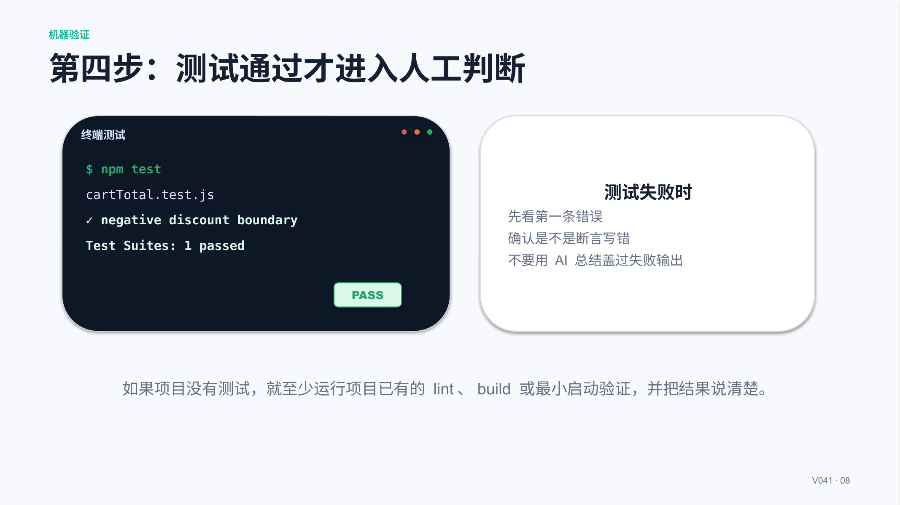

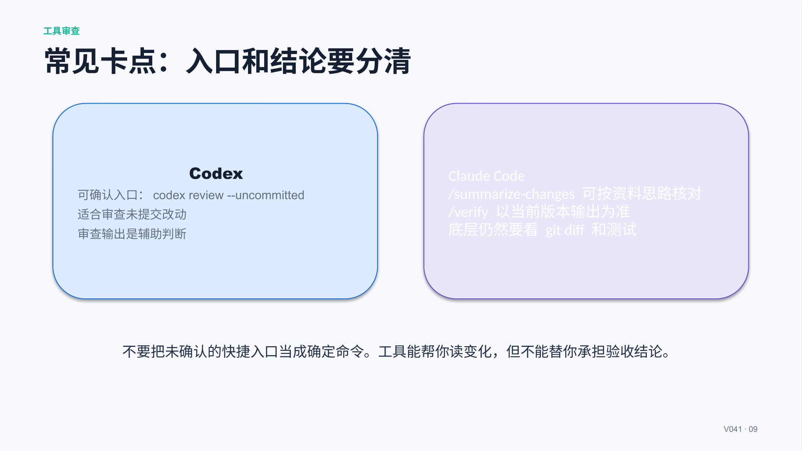

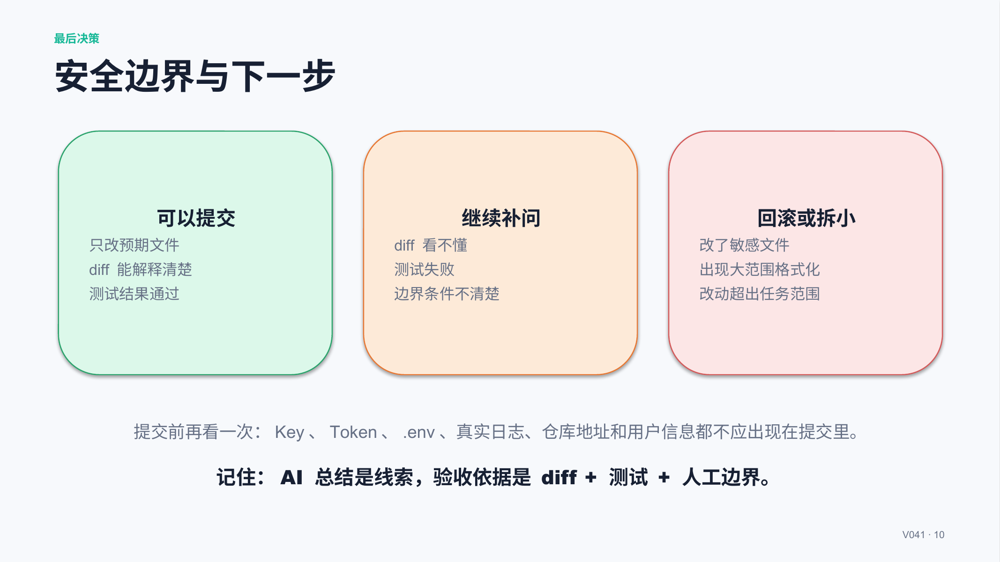

## 标签
#Codex #ClaudeCode #AI编程 #Git #diff #测试验证 #代码审查 #VS
