# V042 图文发布稿（带图版）

## 标题

修 Bug 前正确提问格式：复现、期望、边界、验证

## 前两段短文案

这条用一个脱敏小项目演示：修 Bug 前先把问题整理成复现、期望、边界、验证四块，再分别交给 Codex 和 Claude Code。

这篇主要解决：提问只给一句“报错了”，AI 需要反复追问，录屏节奏很慢。看完你能：修 Bug 前把问题整理成四块：复现、期望、边界、验证。建议先收藏，操作时对照配图一步步核对。

## 备用标题

修 Bug 前正确提问格式：复现、期望、边界、验证：按这条路线看就够了

## 完整正文备用

这条用一个脱敏小项目演示：修 Bug 前先把问题整理成复现、期望、边界、验证四块，再分别交给 Codex 和 Claude Code。重点不是背提示词，而是让 AI 先读项目、先解释、先计划，改完后看 diff 和跑验证命令。

这篇适合刚开始接触积木代码助手、Codex 或 Claude Code 的同学。不要只盯着一个按钮或一条命令，建议按图里的顺序看：先看当前问题，再看操作路径，最后确认结果有没有真正跑通。

常见卡点：
提问只给一句“报错了”，AI 需要反复追问，录屏节奏很慢
报错日志、复现步骤、期望结果、边界条件混在一起，AI 容易改偏
没要求 AI 先读项目、先解释原因、先列计划，导致一上来就改代码
改完后没有验证命令、没有 diff 检查，也不知道是否该回滚

看完这篇，你应该能做到：
修 Bug 前把问题整理成四块：复现、期望、边界、验证
分别给 Codex 和 Claude Code 输入同一份问题卡，观察两边处理方式
让 AI 先读项目、先解释原因、先列修改计划，再开始改代码
改完后看 `git diff`，运行项目测试或最小复现命令

我的建议是，第一次操作时不要一边改很多地方，一边猜原因。先把页面、终端输出、配置文件、日志记录这几块分开看，哪一步不一致，就从那一步往回查。

如果你也在配置或使用 AI 编程工具，可以先收藏这篇。后面遇到类似问题时，按这条路线重新核对一遍，通常能更快判断下一步该看哪里。

## 配图说明

首图用 `cover-flow-images/V042-cover-douyin.png`。
第二张用 `cover-flow-images/V042-flow.png`。
后面从 `ppt-images/slide-01.png` 到 `ppt-images/slide-08.png` 里选关键步骤图。
如果平台限制图片数量，优先保留：流程图、关键操作、常见错误、结果确认。

## 配图预览

### 首图与流程图

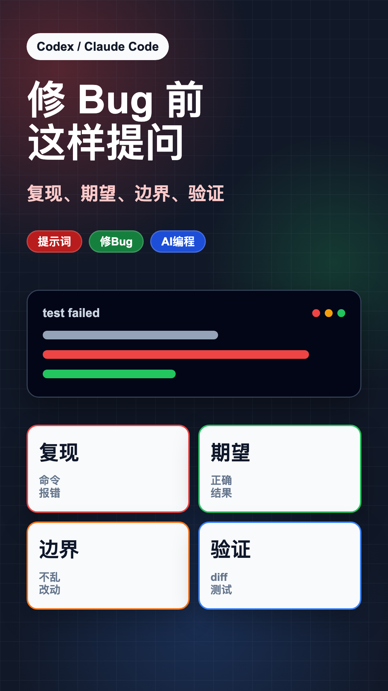

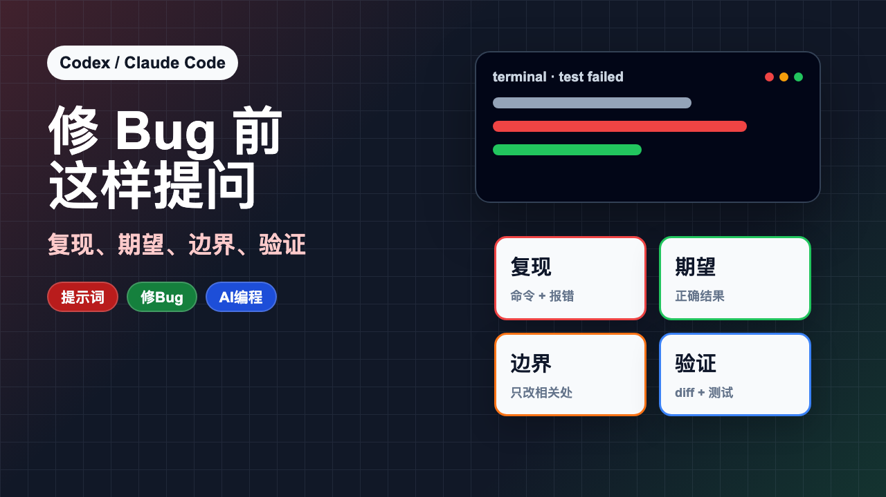

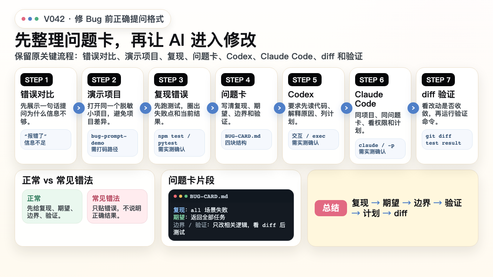

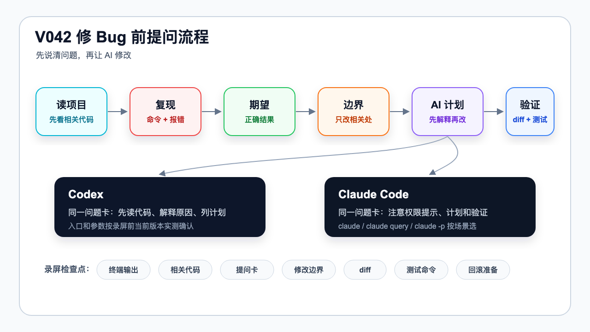

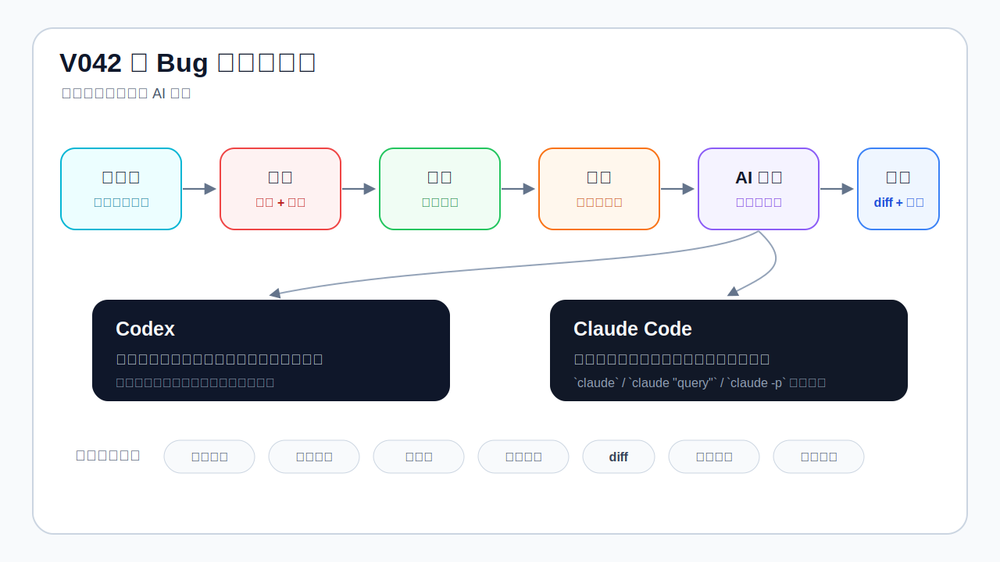

### PPT 步骤图

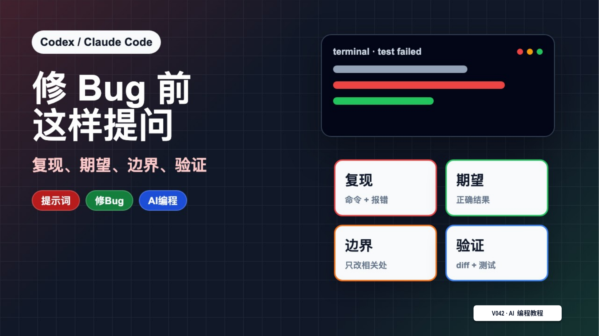

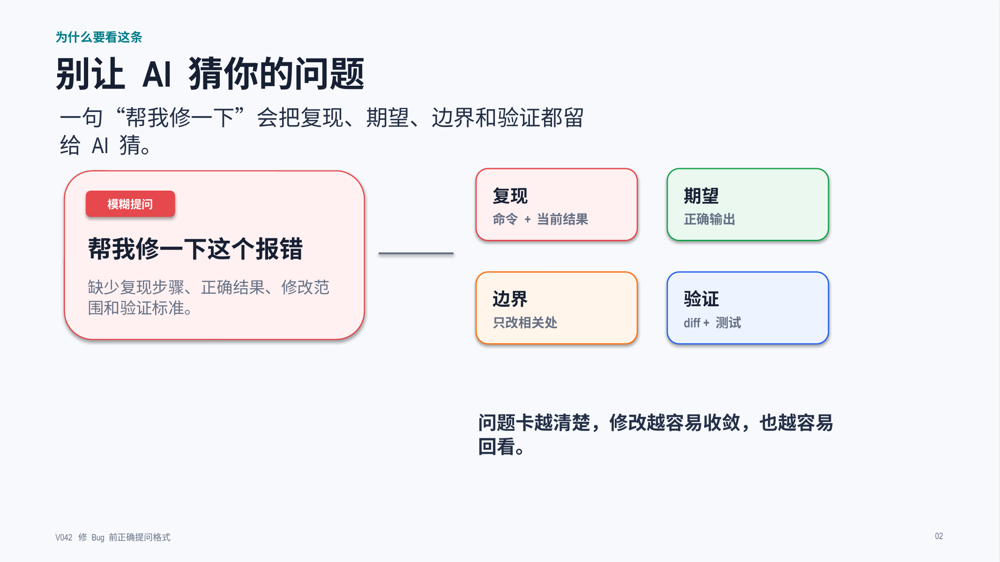

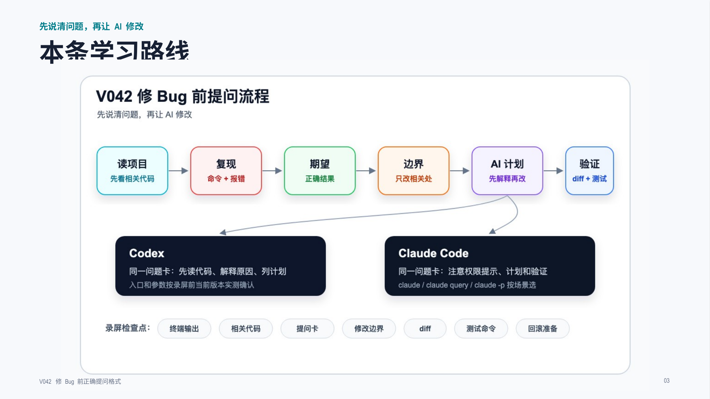

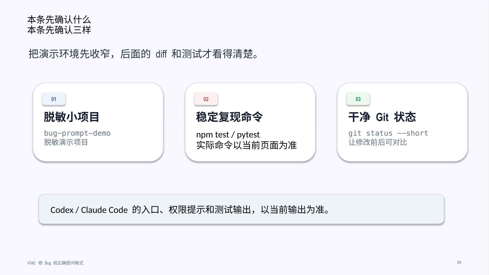

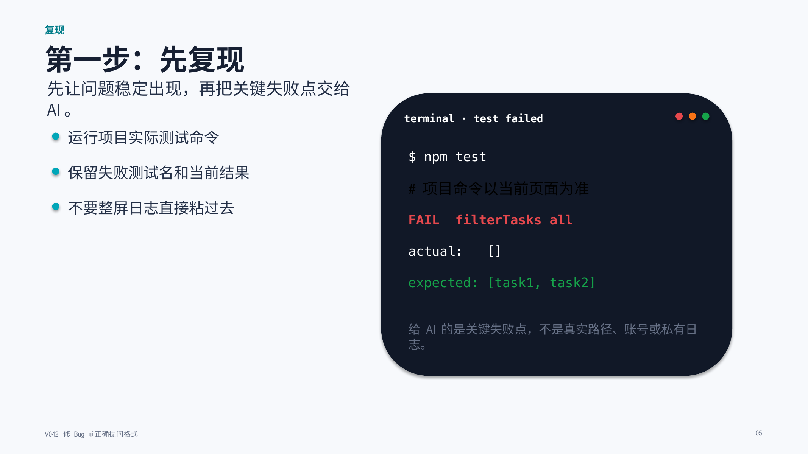

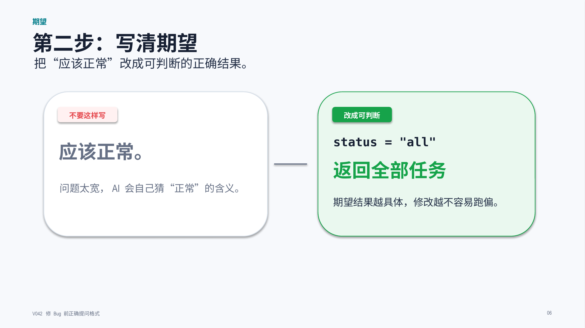

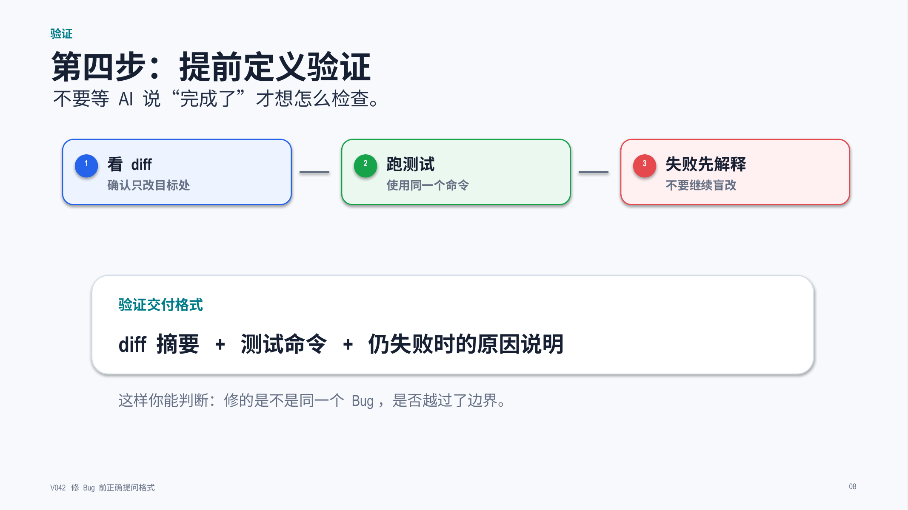

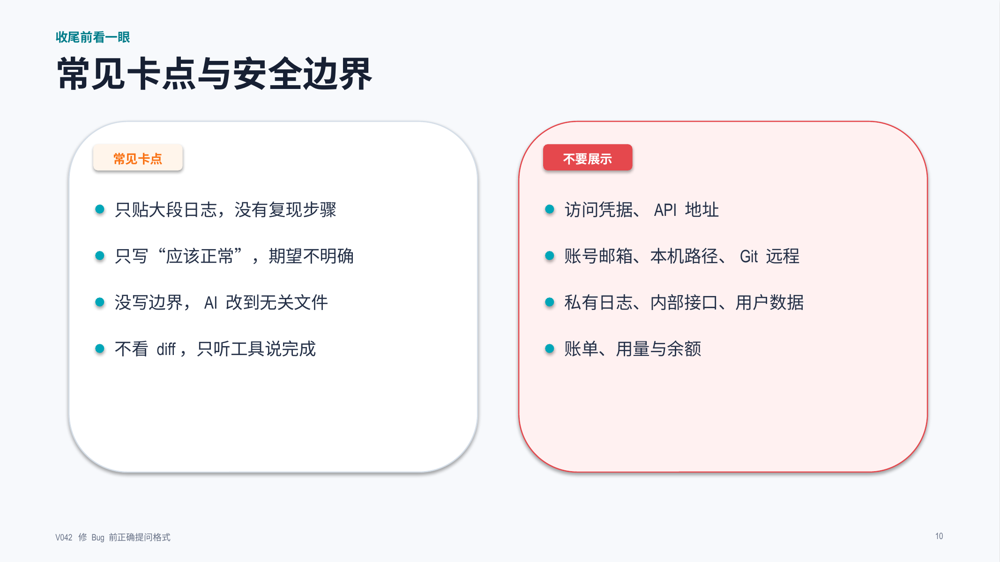

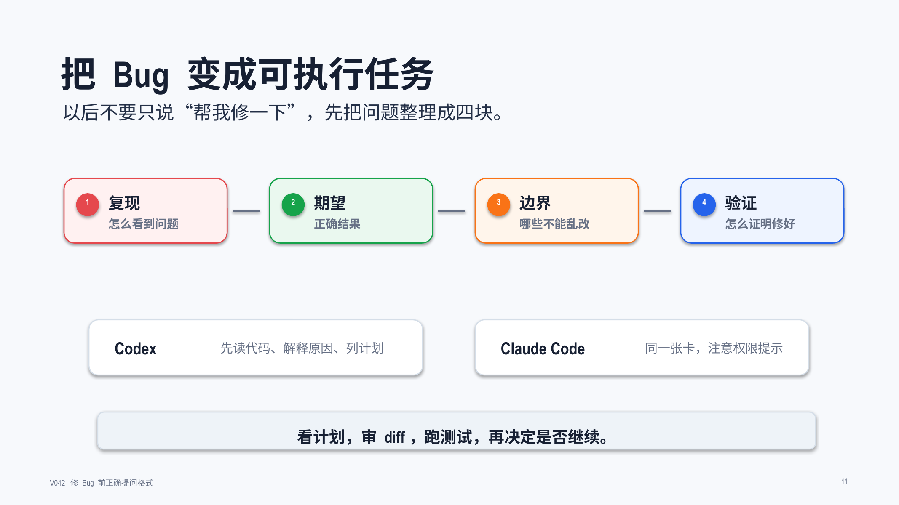

## 标签
#Codex #ClaudeCode #AI编程 #修Bug #提示词 #软件实操 #真实录屏 #代码调试
