# V043 图文发布稿（带图版）

## 标题

写新功能前怎么给 Codex / Claude Code 提约束？

## 前两段短文案

这条视频用一个小型功能演示，讲清楚写新功能前要给 AI 哪些约束：目标、范围、不能改什么、验收标准、验证命令和停止条件。

这篇主要解决：只给 AI 一句话“帮我加个功能”，结果它改了很多文件，甚至碰到配置、登录、数据库或支付逻辑。看完你能：先写清楚“本次只改一个小问题”。建议先收藏，操作时对照配图一步步核对。

## 备用标题

AI 写功能总是改太多？先把范围和验收写清楚
积木代码助手实战课：新功能任务卡怎么写

## 完整正文备用

这条视频用一个小型功能演示，讲清楚写新功能前要给 AI 哪些约束：目标、范围、不能改什么、验收标准、验证命令和停止条件。演示会分别说明 Codex 与 Claude Code 的录屏画面差异，并强调修改后一定要看 diff、跑测试。

这篇适合刚开始接触积木代码助手、Codex 或 Claude Code 的同学。不要只盯着一个按钮或一条命令，建议按图里的顺序看：先看当前问题，再看操作路径，最后确认结果有没有真正跑通。

常见卡点：
只给 AI 一句话“帮我加个功能”，结果它改了很多文件，甚至碰到配置、登录、数据库或支付逻辑
需求没有验收标准，最后不知道功能算不算完成
没有写“不允许改什么”，AI 会顺手重构、改样式、改路由或调整依赖
Codex 和 Claude Code 的入口、规则文件、权限参数不同，录屏时容易把两个工具混在一起讲

看完这篇，你应该能做到：
先写清楚“本次只改一个小问题”
明确范围：要改哪个文件、哪个组件、哪个接口，不碰哪些文件
明确验收标准：界面看到什么、命令跑什么、测试怎么过
让 AI 先读项目和复述方案，再小步修改

我的建议是，第一次操作时不要一边改很多地方，一边猜原因。先把页面、终端输出、配置文件、日志记录这几块分开看，哪一步不一致，就从那一步往回查。

如果你也在配置或使用 AI 编程工具，可以先收藏这篇。后面遇到类似问题时，按这条路线重新核对一遍，通常能更快判断下一步该看哪里。

## 配图说明

首图用 `cover-flow-images/V043-cover-douyin.png`。
第二张用 `cover-flow-images/V043-flow.png`。
后面从 `ppt-images/slide-01.png` 到 `ppt-images/slide-08.png` 里选关键步骤图。
如果平台限制图片数量，优先保留：流程图、关键操作、常见错误、结果确认。

## 配图预览

### 首图与流程图

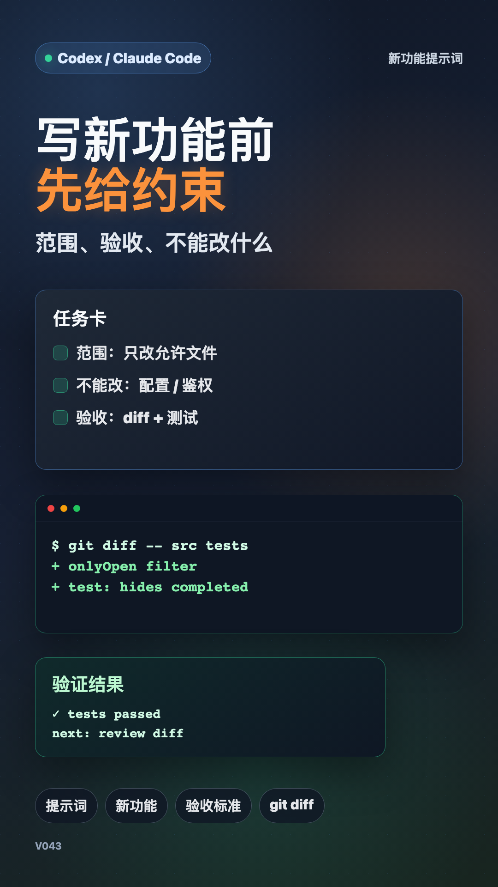

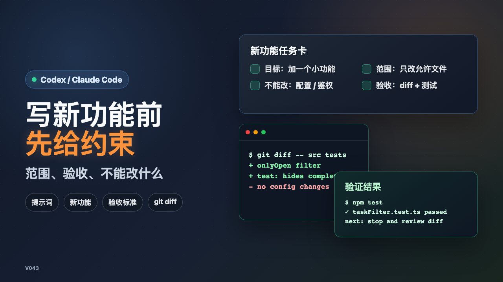

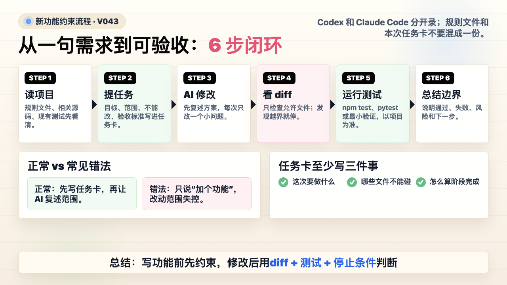

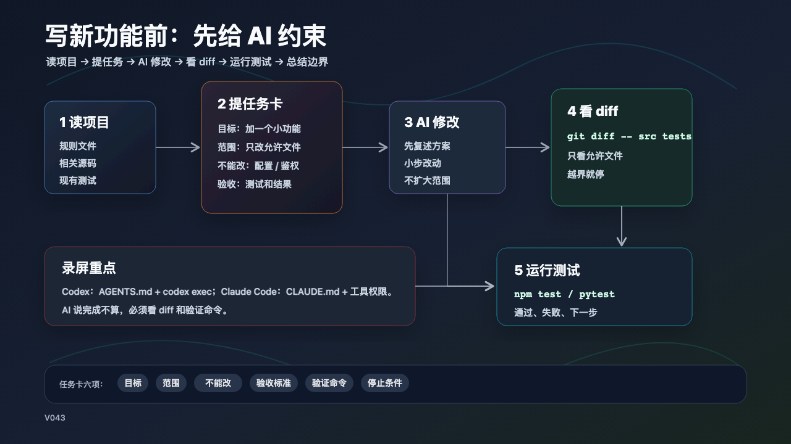

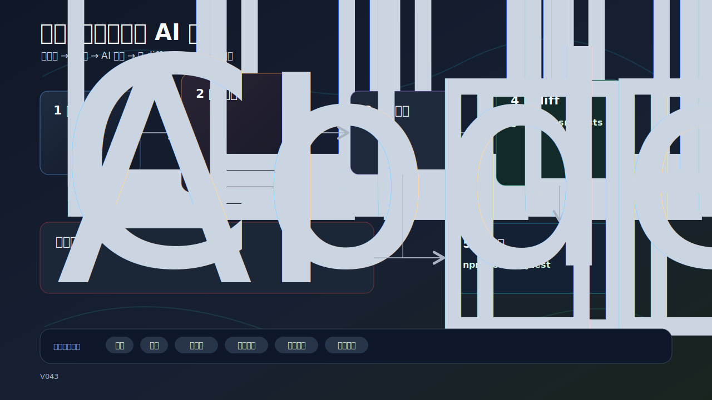

### PPT 步骤图

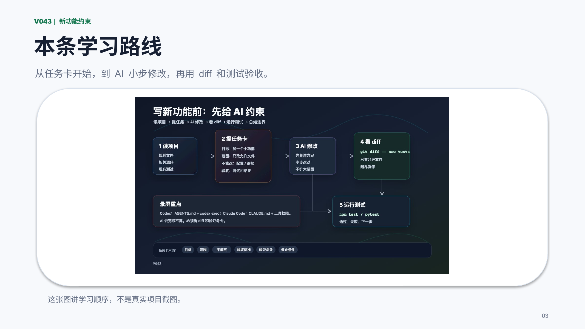

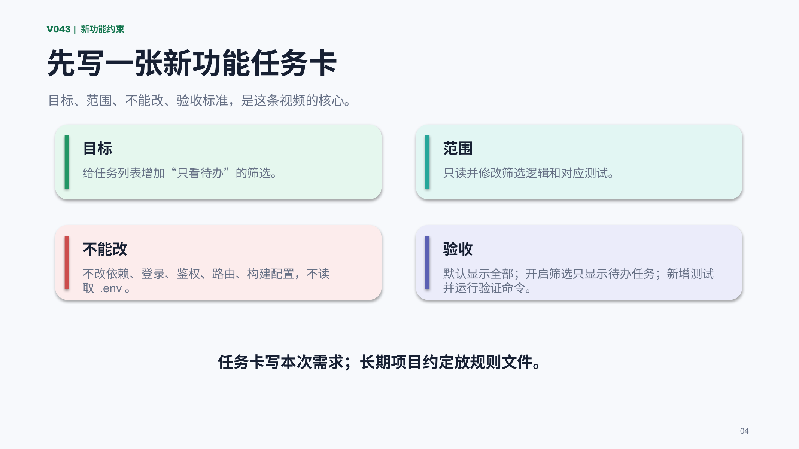

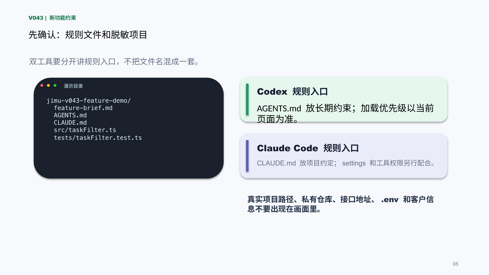

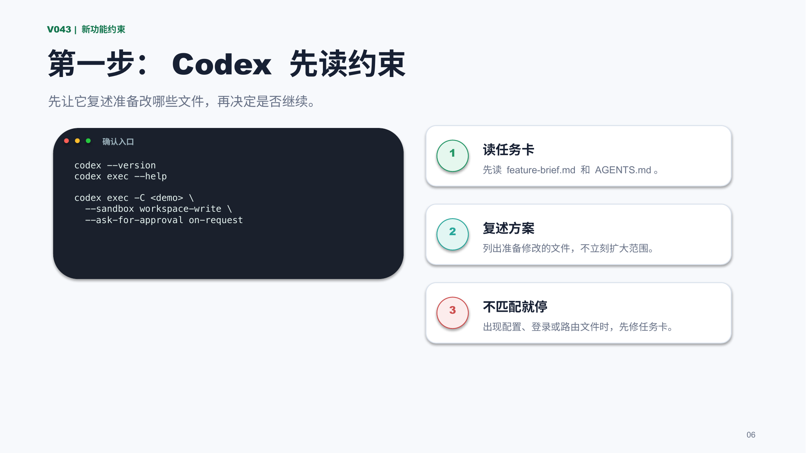

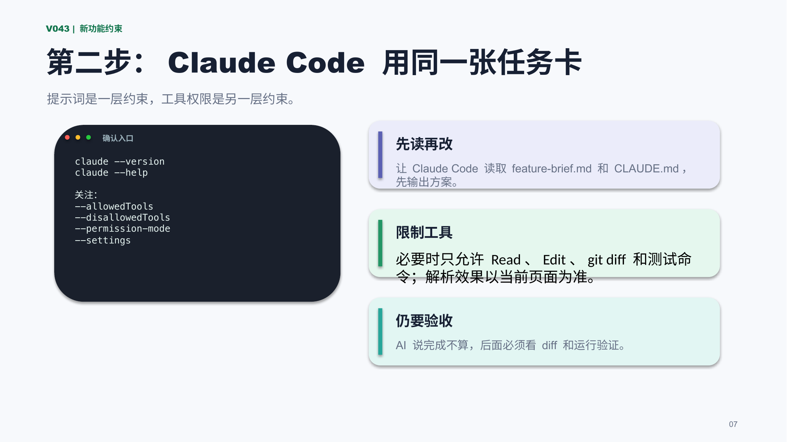

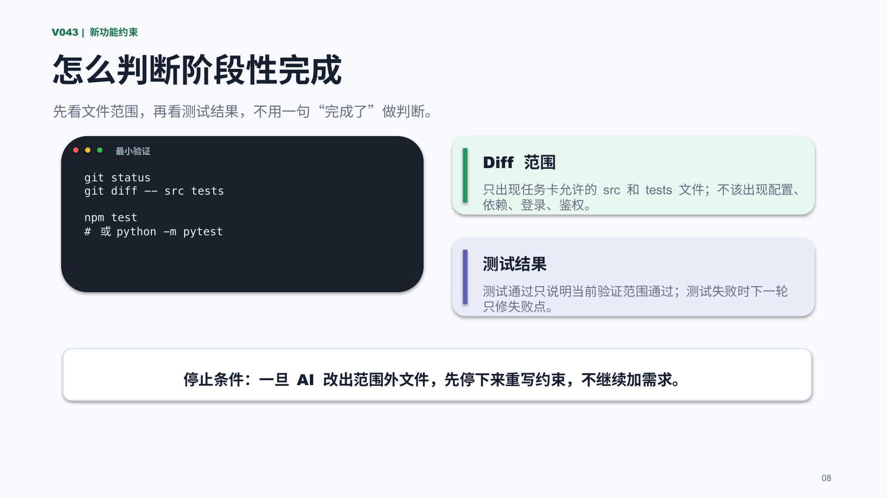

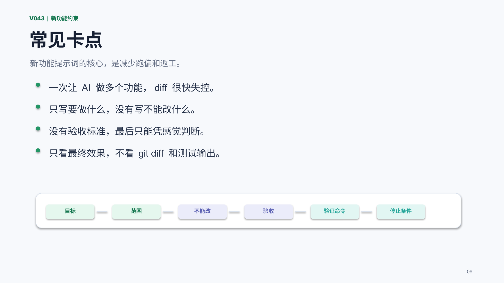

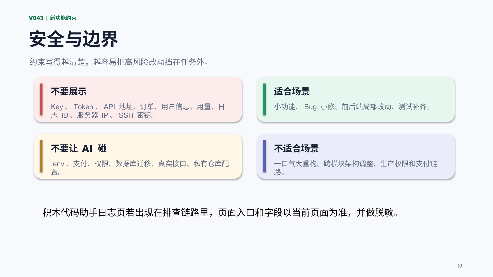

## 标签
#AI编程 #Codex #ClaudeCode #积木代码助手 #提示词 #新功能 #验收标准 #git
