# V044 图文发布稿（带图版）

## 标题

Codex / Claude Code 改代码前，怎么让 AI 先列风险和测试清单

## 前两段短文案

这条用一个小项目演示：在 Codex 和 Claude Code 里，不要直接让 AI 改代码，而是先要求它列出不确定项、多个方案、风险、回滚路径和测试清单。

这篇主要解决：提示词只写“帮我改一下”，AI 可能直接动手，结果不知道它依据什么判断。看完你能：先让 AI 读项目和复现背景。建议先收藏，操作时对照配图一步步核对。

## 备用标题

别让 AI 直接改代码：先让它说清楚不确定、回滚和测试
AI 编程工作流 044：让 AI 主动说风险

## 完整正文备用

这条用一个小项目演示：在 Codex 和 Claude Code 里，不要直接让 AI 改代码，而是先要求它列出不确定项、多个方案、风险、回滚路径和测试清单。重点看提示词怎么写、两个工具画面怎么分开录、改完后怎么用 `git diff` 和测试结果确认边界。

这篇适合刚开始接触积木代码助手、Codex 或 Claude Code 的同学。不要只盯着一个按钮或一条命令，建议按图里的顺序看：先看当前问题，再看操作路径，最后确认结果有没有真正跑通。

常见卡点：
提示词只写“帮我改一下”，AI 可能直接动手，结果不知道它依据什么判断
AI 改完后只看“完成了”，没有看 `git diff`、测试输出和回滚路径
Codex 和 Claude Code 的交互方式不同，容易把两个工具的权限、提示词和审查画面混在一起
真实项目里最容易漏掉不确定项：数据格式、边界条件、已有测试、权限文件、配置文件和依赖版本

看完这篇，你应该能做到：
先让 AI 读项目和复现背景
明确要求 AI 标出“不确定项”，不要直接假设
要求给出 2-3 个可选方案，并说明推荐方案
在修改前列风险、影响范围和回滚方式

我的建议是，第一次操作时不要一边改很多地方，一边猜原因。先把页面、终端输出、配置文件、日志记录这几块分开看，哪一步不一致，就从那一步往回查。

如果你也在配置或使用 AI 编程工具，可以先收藏这篇。后面遇到类似问题时，按这条路线重新核对一遍，通常能更快判断下一步该看哪里。

## 配图说明

首图用 `cover-flow-images/V044-cover-douyin.png`。
第二张用 `cover-flow-images/V044-flow.png`。
后面从 `ppt-images/slide-01.png` 到 `ppt-images/slide-08.png` 里选关键步骤图。
如果平台限制图片数量，优先保留：流程图、关键操作、常见错误、结果确认。

## 配图预览

### 首图与流程图

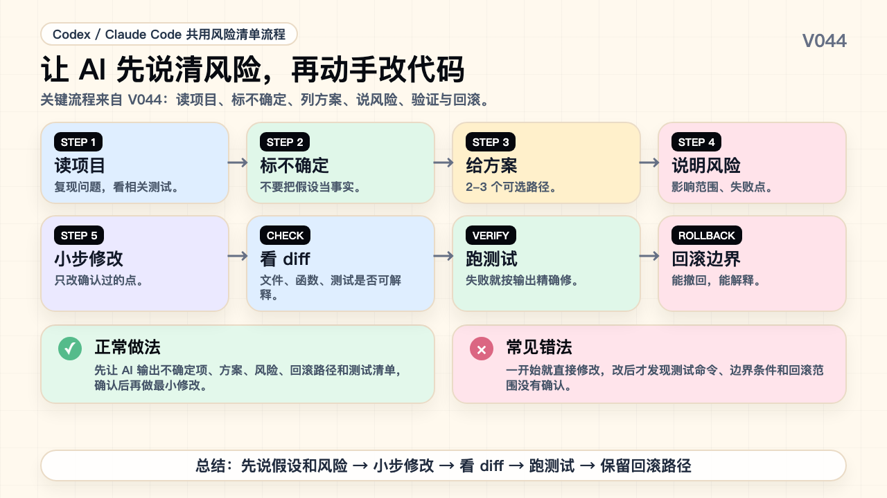

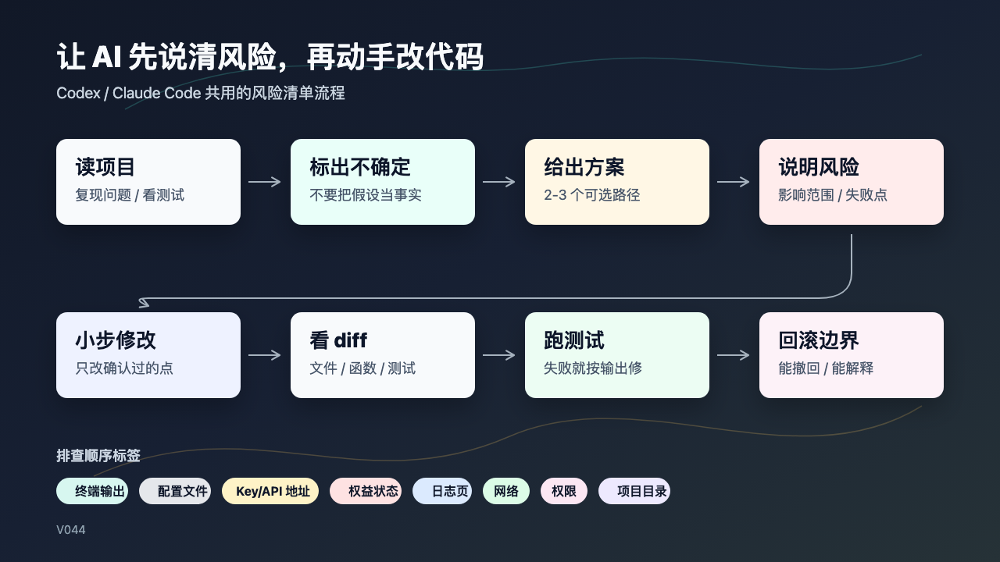

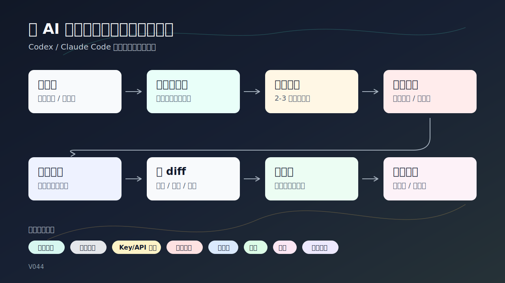

### PPT 步骤图

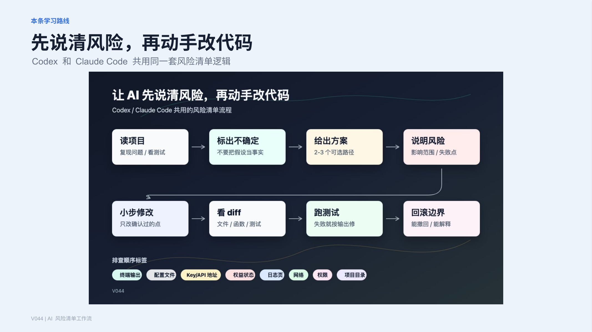

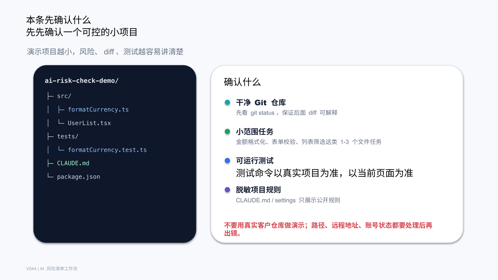

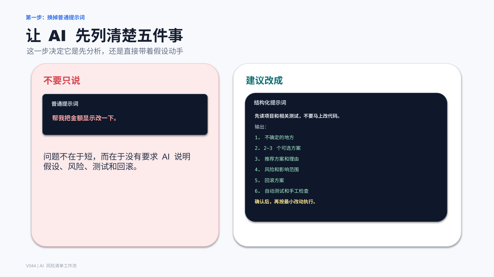

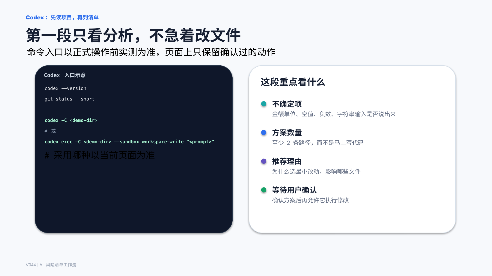

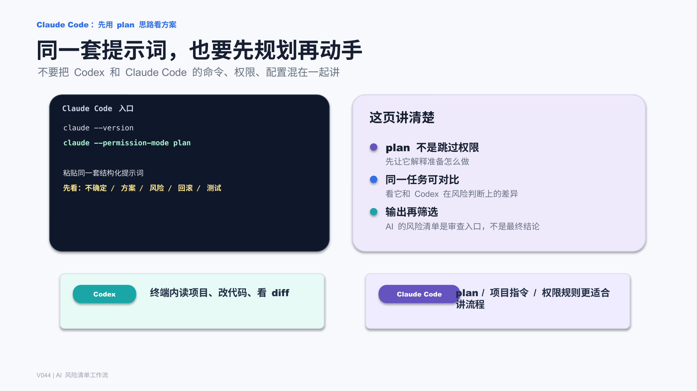

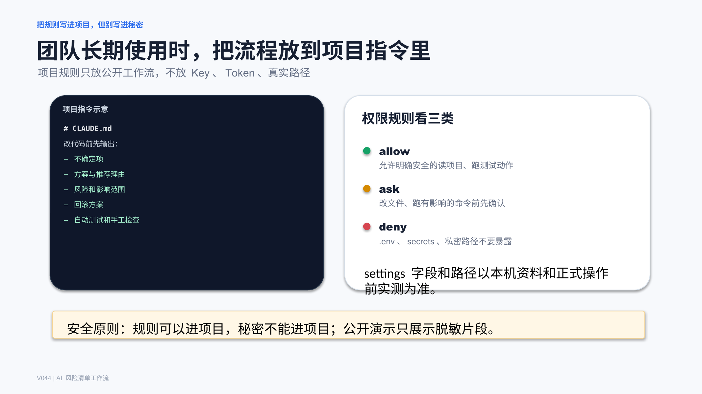

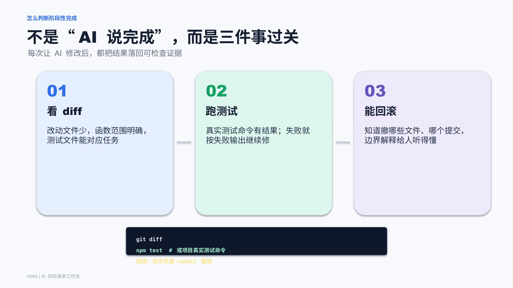

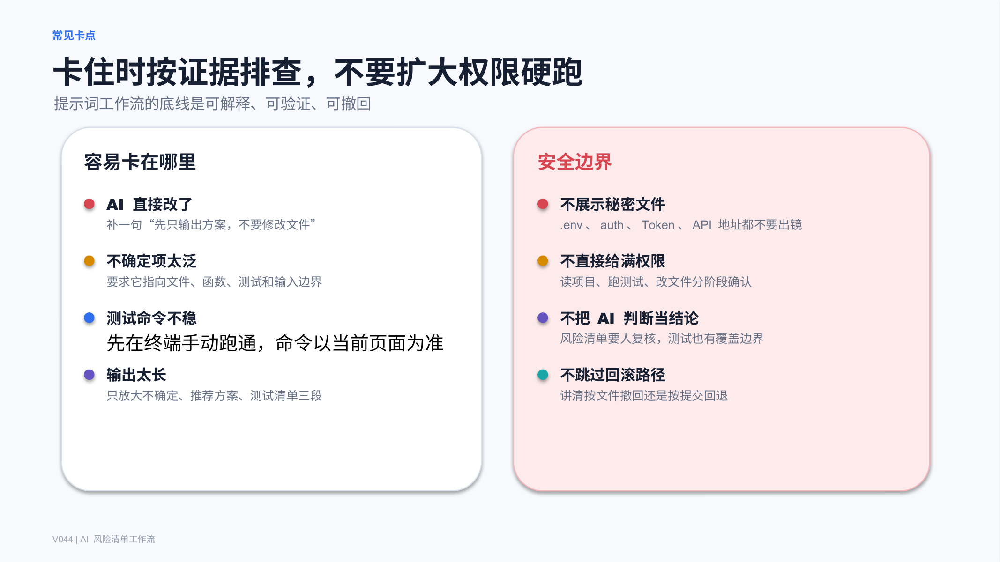

## 标签
#AI编程 #Codex #ClaudeCode #积木代码助手 #提示词 #代码审查 #Git #diff
