# V047 图文发布稿（带图版）

## 标题

Claude Code 前端实战：读项目、修 Bug、新增筛选项

## 前两段短文案

这条用一个脱敏前端任务列表项目演示 Claude Code 的实战流程：先读项目和组件，复现一个筛选 Bug，让 Claude Code 修改，再看 diff、跑测试、打开页面验证，最后新增一个筛选项。

这篇主要解决：不知道一进项目该先让 Claude Code 读哪些文件。看完你能：用 Claude Code 先读一个前端项目的目录、入口页面和关键组件。建议先收藏，操作时对照配图一步步核对。

## 备用标题

Claude Code 前端实战：读项目、修 Bug、新增筛选项：按这条路线看就够了

## 完整正文备用

这条用一个脱敏前端任务列表项目演示 Claude Code 的实战流程：先读项目和组件，复现一个筛选 Bug，让 Claude Code 修改，再看 diff、跑测试、打开页面验证，最后新增一个筛选项。重点是任务切小、权限看清、改完验证。

这篇适合刚开始接触积木代码助手、Codex 或 Claude Code 的同学。不要只盯着一个按钮或一条命令，建议按图里的顺序看：先看当前问题，再看操作路径，最后确认结果有没有真正跑通。

常见卡点：
不知道一进项目该先让 Claude Code 读哪些文件
直接让 AI 改页面，结果改动太散，diff 不好检查
修 Bug 和新增筛选项混在一个大需求里，容易看不清边界
改完只看页面，不看 `git diff`、测试结果和移动端状态

看完这篇，你应该能做到：
用 Claude Code 先读一个前端项目的目录、入口页面和关键组件
设计一个小 Bug：按钮没反应或筛选逻辑错误，并让 Claude Code 先定位再修改
新增一个筛选项，但限制改动范围，避免顺手重构
查看 diff、运行验证命令、打开页面确认结果

我的建议是，第一次操作时不要一边改很多地方，一边猜原因。先把页面、终端输出、配置文件、日志记录这几块分开看，哪一步不一致，就从那一步往回查。

如果你也在配置或使用 AI 编程工具，可以先收藏这篇。后面遇到类似问题时，按这条路线重新核对一遍，通常能更快判断下一步该看哪里。

## 配图说明

首图用 `cover-flow-images/V047-cover-douyin.png`。
第二张用 `cover-flow-images/V047-flow.png`。
后面从 `ppt-images/slide-01.png` 到 `ppt-images/slide-08.png` 里选关键步骤图。
如果平台限制图片数量，优先保留：流程图、关键操作、常见错误、结果确认。

## 配图预览

### 首图与流程图

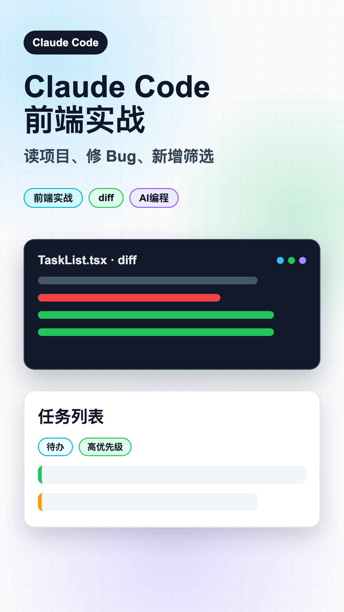

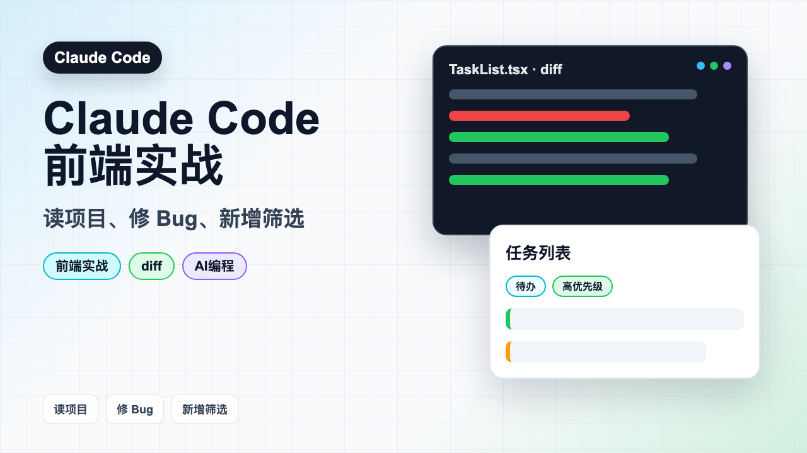

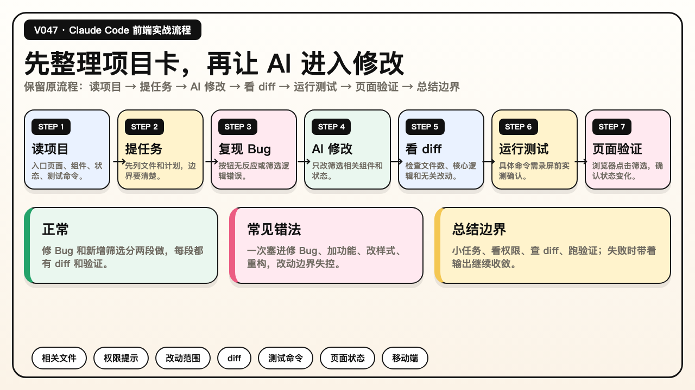

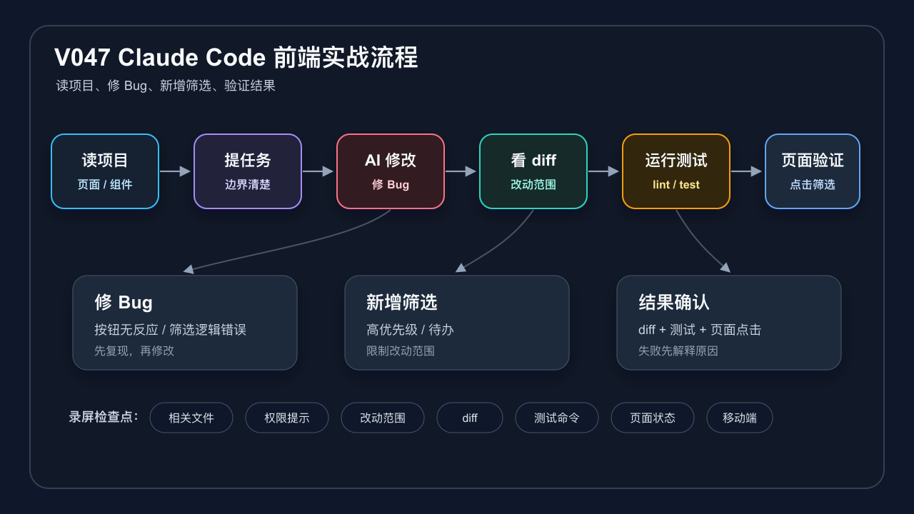

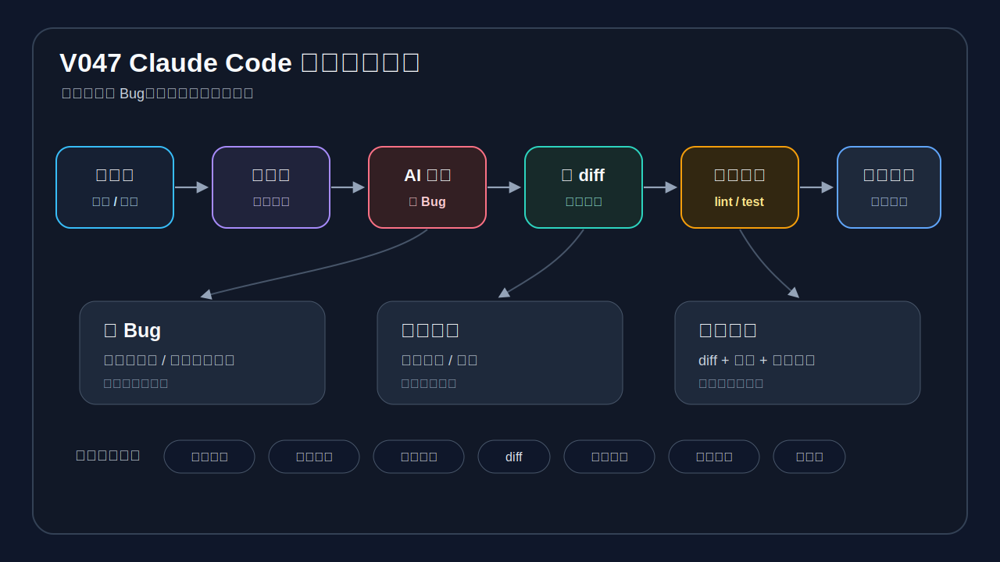

### PPT 步骤图

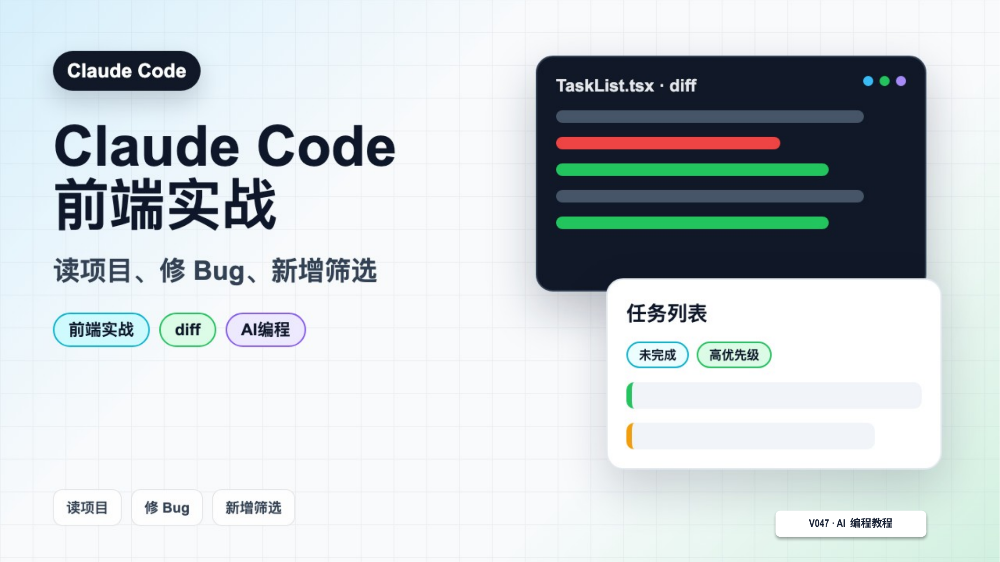

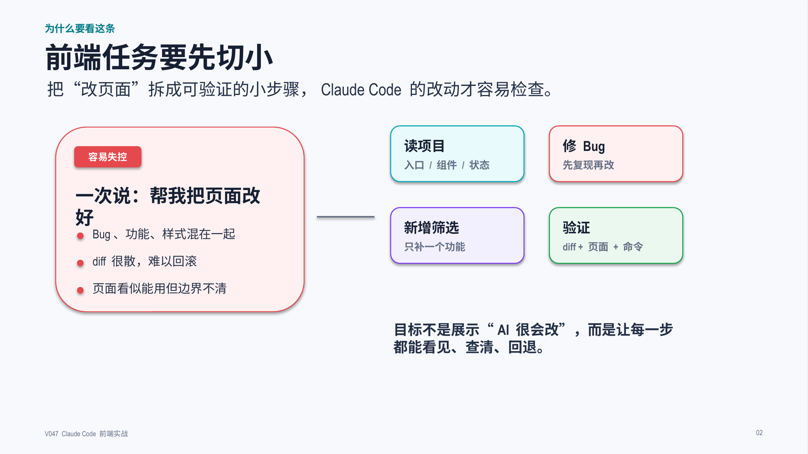

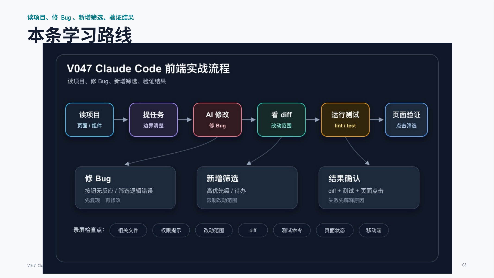

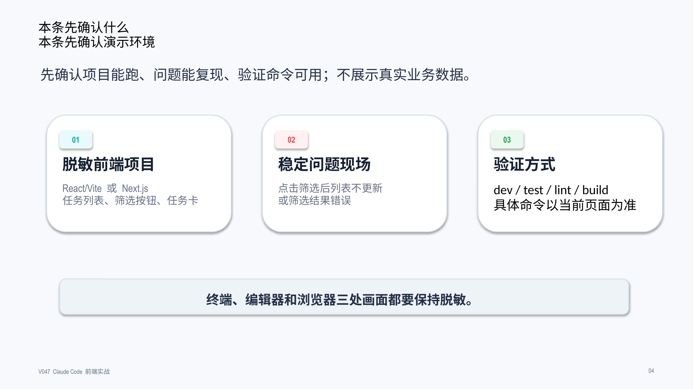

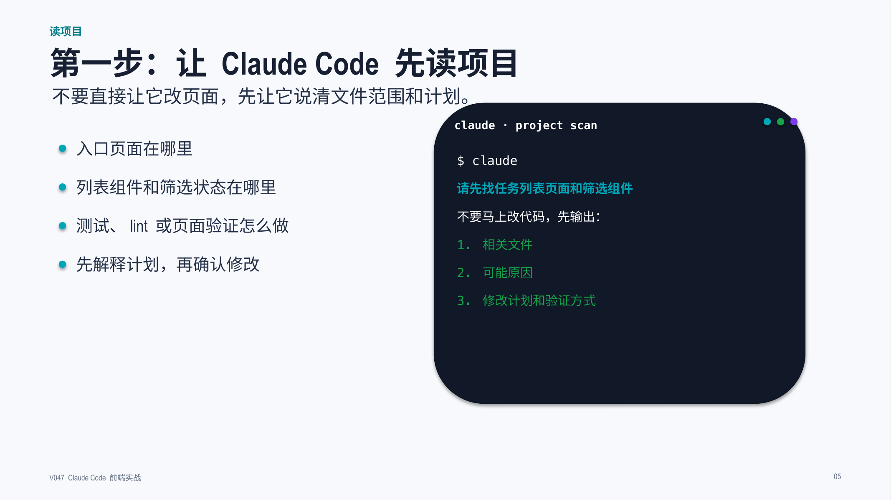

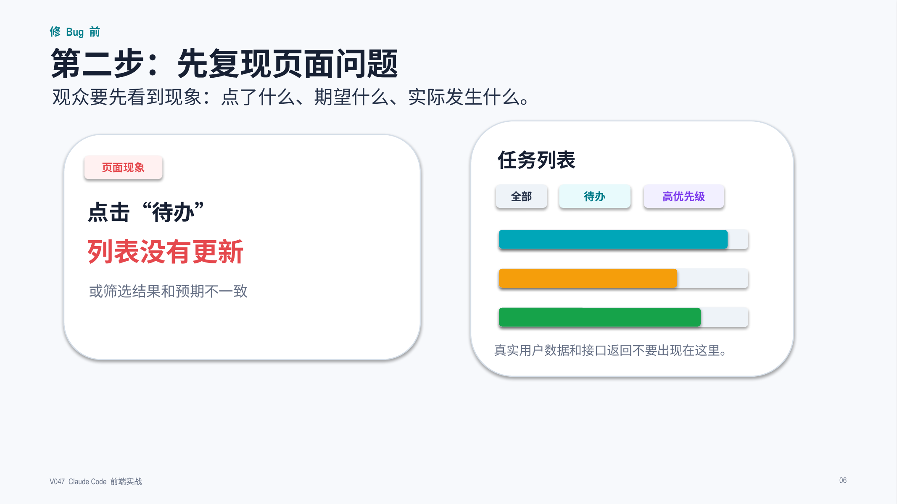

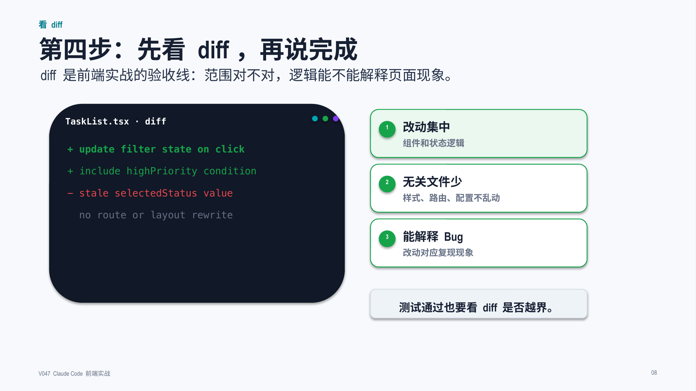

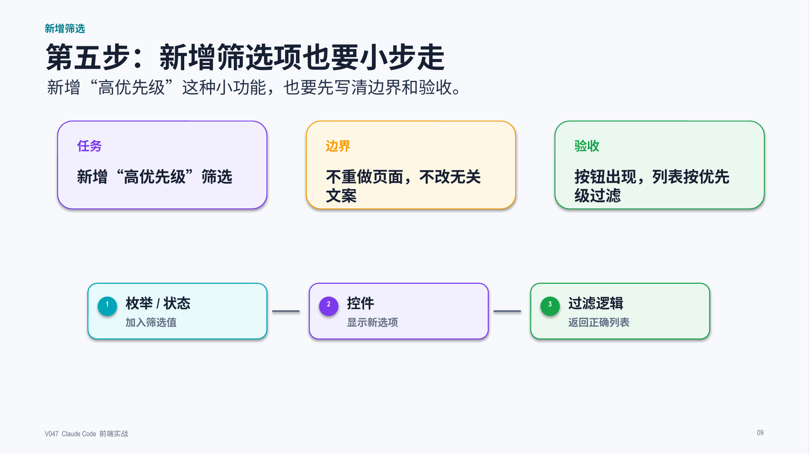

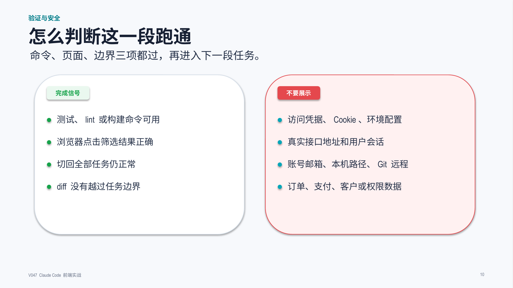

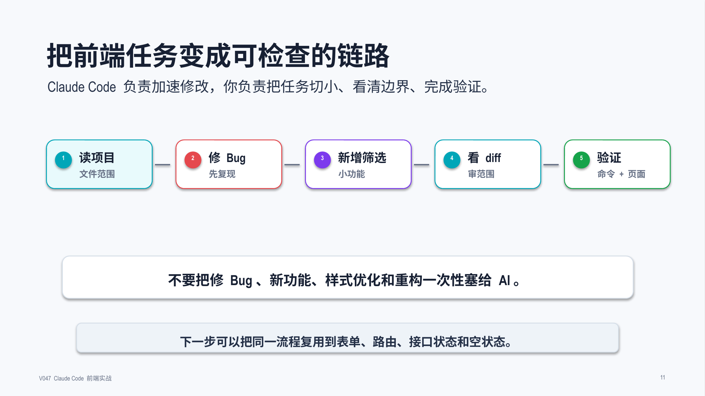

## 标签
#ClaudeCode #AI编程 #前端实战 #React #Vue #Next #diff #修Bug
