# V048 图文发布稿（带图版）

## 标题

前端 AI 编程录屏项目怎么设计？按钮、表单、路由、状态、权限一次规划

## 前两段短文案

这条讲前端 AI 编程教程录屏前的项目设计：一个可复用的 demo 项目，至少要能展示按钮、表单、路由、状态和权限。

这篇主要解决：演示项目太简单，只能录一个按钮，撑不起系列内容。看完你能：按一个清晰顺序理解本条视频的核心操作路线。建议先收藏，操作时对照配图一步步核对。

## 备用标题

别拿真实后台直接录屏，前端实战项目先这样设计
Codex / Claude Code 前端实战前置课：先搭一个可录屏 demo 项目

## 完整正文备用

这条讲前端 AI 编程教程录屏前的项目设计：一个可复用的 demo 项目，至少要能展示按钮、表单、路由、状态和权限。后续 Codex 与 Claude Code 前端实战都可以复用同一套页面、任务卡、diff 和测试画面。

这篇适合刚开始接触积木代码助手、Codex 或 Claude Code 的同学。不要只盯着一个按钮或一条命令，建议按图里的顺序看：先看当前问题，再看操作路径，最后确认结果有没有真正跑通。

常见卡点：
演示项目太简单，只能录一个按钮，撑不起系列内容
演示项目太像真实业务，容易暴露用户信息、接口地址和业务页面
没有提前设计 Bug、需求、验收标准，录屏时 AI 输出不可控
前端页面只看 UI，不看状态、路由、权限和测试，观众很难判断 AI 改得对不对

看完这篇，你应该能做到：
按一个清晰顺序理解本条视频的核心操作路线
知道关键页面、终端输出或配置位置应该看哪里
知道哪些信息发布前需要脱敏，哪些内容需要以录屏现场为准

我的建议是，第一次操作时不要一边改很多地方，一边猜原因。先把页面、终端输出、配置文件、日志记录这几块分开看，哪一步不一致，就从那一步往回查。

如果你也在配置或使用 AI 编程工具，可以先收藏这篇。后面遇到类似问题时，按这条路线重新核对一遍，通常能更快判断下一步该看哪里。

## 配图说明

首图用 `cover-flow-images/V048-cover-douyin.png`。
第二张用 `cover-flow-images/V048-flow.png`。
后面从 `ppt-images/slide-01.png` 到 `ppt-images/slide-08.png` 里选关键步骤图。
如果平台限制图片数量，优先保留：流程图、关键操作、常见错误、结果确认。

## 配图预览

### 首图与流程图

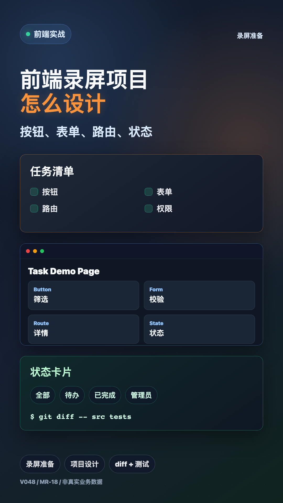

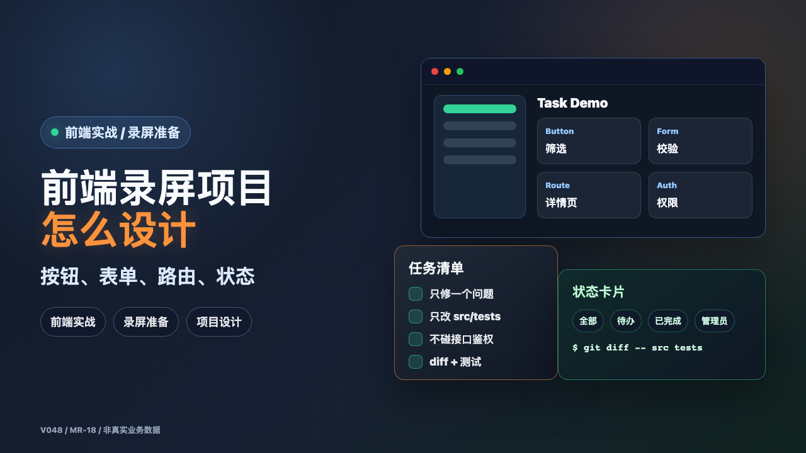

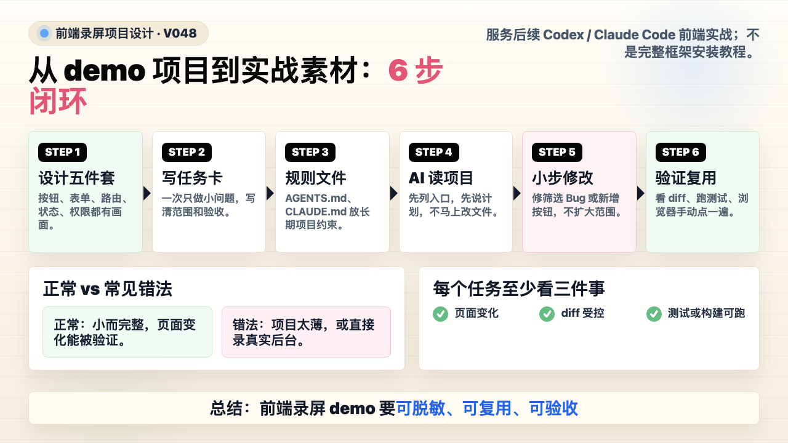

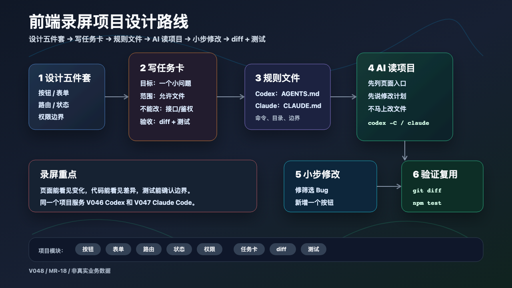

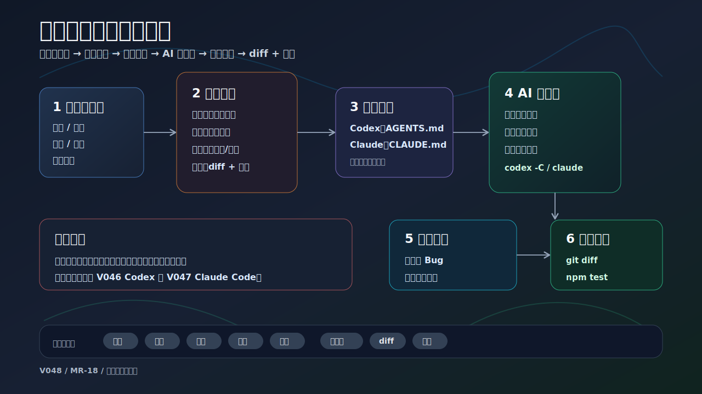

### PPT 步骤图

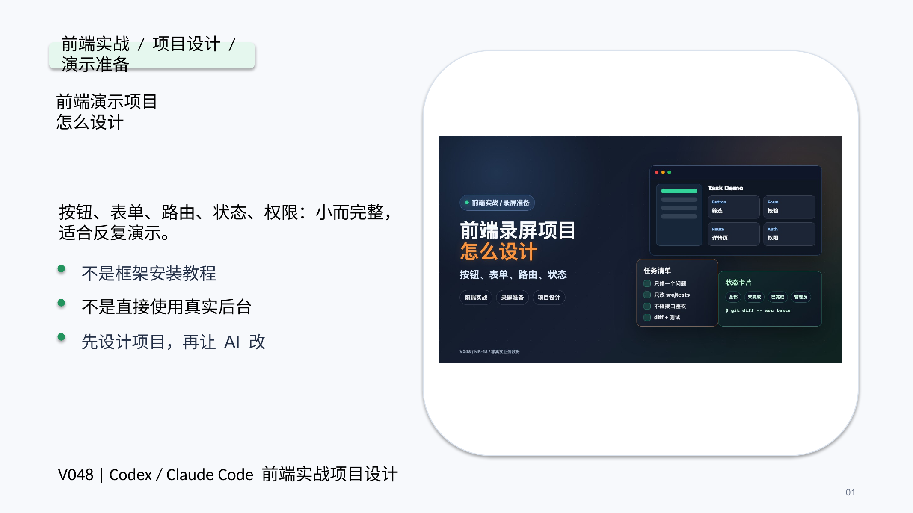

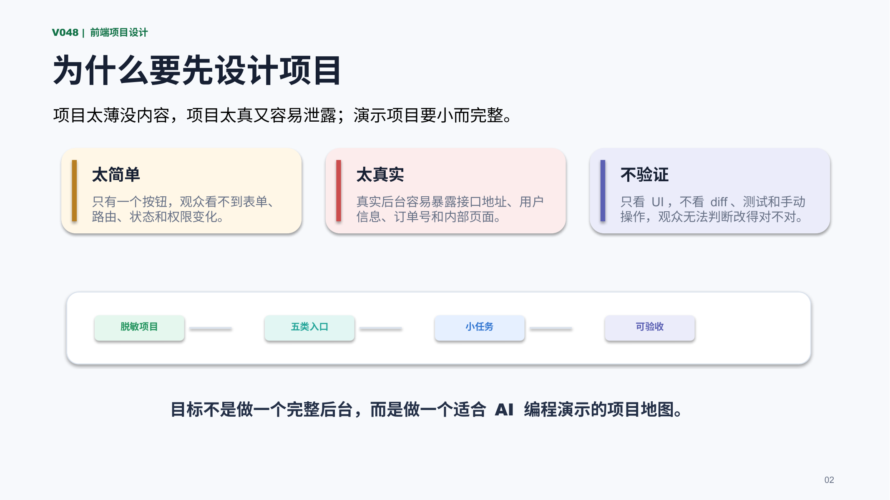

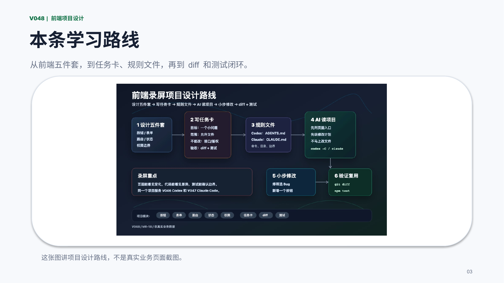

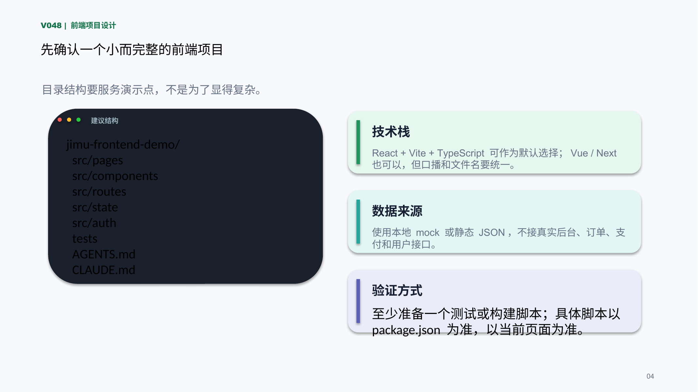

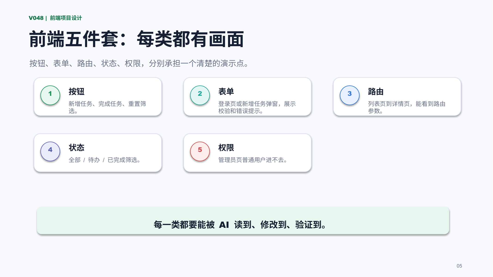

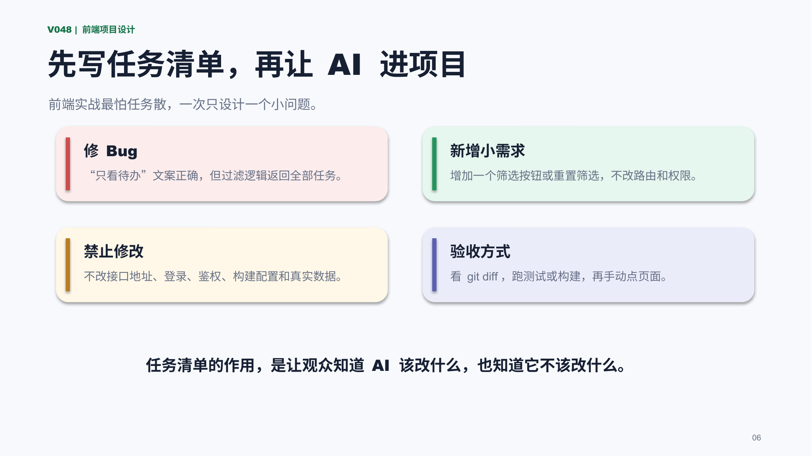

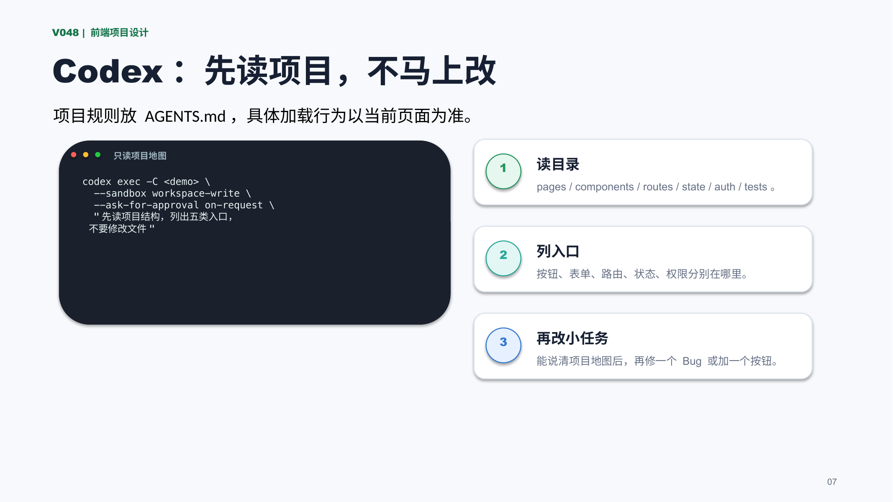

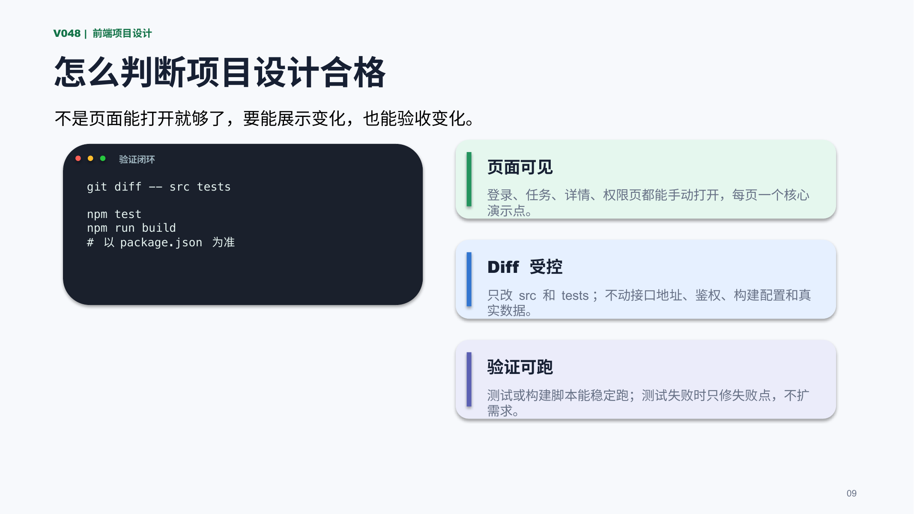

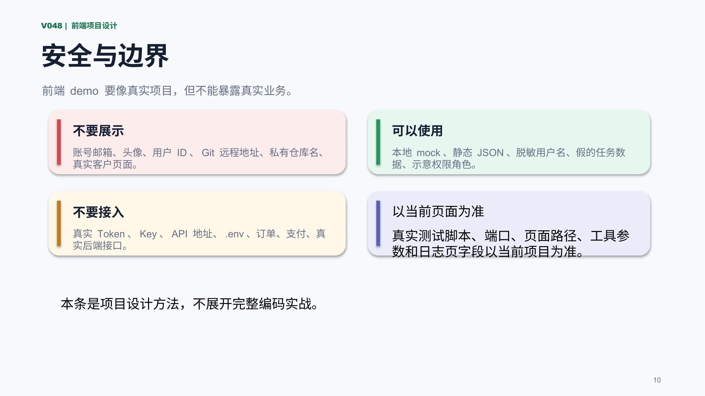

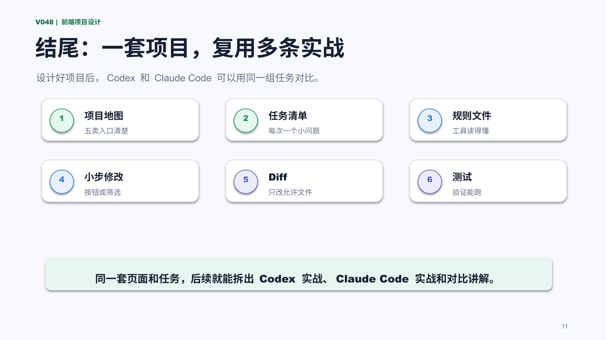

## 标签
#AI编程 #Codex #ClaudeCode #前端实战 #录屏准备 #项目设计 #React #Vue
