# V049 图文发布稿（带图版）

## 标题

Codex 后端实战：接口 500 怎么定位并补测试

## 前两段短文案

这期用一个可控 FastAPI 后端项目演示 Codex 后端实战：先复现接口 500，再让 Codex 读路由、service 和 tests，定位问题后做最小修改，最后看 `git diff`、跑测试、再次请求接口确认结果。

这篇主要解决：后端接口报 500 时，只看到终端一串 stack trace，不知道应该先看路由、请求参数还是服务层。看完你能：用 Codex 先读一个后端项目的路由、服务层和测试结构。建议先收藏，操作时对照配图一步步核对。

## 备用标题

后端接口又 500？让 Codex 先读路由和日志再修
AI 编程实战 049：Codex 读接口、定位 500、补测试

## 完整正文备用

这期用一个可控 FastAPI 后端项目演示 Codex 后端实战：先复现接口 500，再让 Codex 读路由、service 和 tests，定位问题后做最小修改，最后看 `git diff`、跑测试、再次请求接口确认结果。

这篇适合刚开始接触积木代码助手、Codex 或 Claude Code 的同学。不要只盯着一个按钮或一条命令，建议按图里的顺序看：先看当前问题，再看操作路径，最后确认结果有没有真正跑通。

常见卡点：
后端接口报 500 时，只看到终端一串 stack trace，不知道应该先看路由、请求参数还是服务层
让 AI 直接“修一下”，容易改动过大，甚至把接口语义改乱
修改完只看接口不报错，没有补测试，下一次同类输入还会复发
登录、订单、支付、退款这些真实业务不适合直接录屏，必须设计脱敏演示项目

看完这篇，你应该能做到：
用 Codex 先读一个后端项目的路由、服务层和测试结构
复现一个接口 500，并把终端日志作为定位入口
让 Codex 说明问题链路，再做最小修改
查看 `git diff`，确认只改接口错误处理和相关测试

我的建议是，第一次操作时不要一边改很多地方，一边猜原因。先把页面、终端输出、配置文件、日志记录这几块分开看，哪一步不一致，就从那一步往回查。

如果你也在配置或使用 AI 编程工具，可以先收藏这篇。后面遇到类似问题时，按这条路线重新核对一遍，通常能更快判断下一步该看哪里。

## 配图说明

首图用 `cover-flow-images/V049-cover-douyin.png`。
第二张用 `cover-flow-images/V049-flow.png`。
后面从 `ppt-images/slide-01.png` 到 `ppt-images/slide-08.png` 里选关键步骤图。
如果平台限制图片数量，优先保留：流程图、关键操作、常见错误、结果确认。

## 配图预览

### 首图与流程图

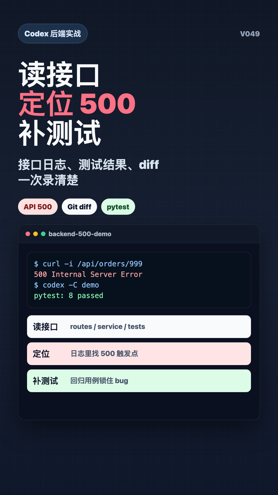

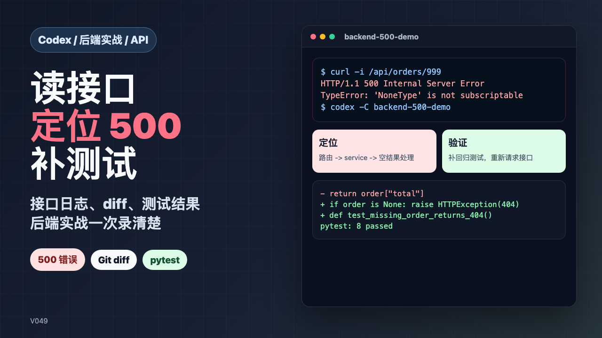

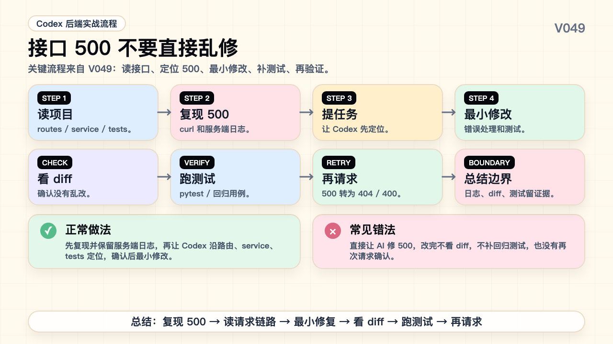

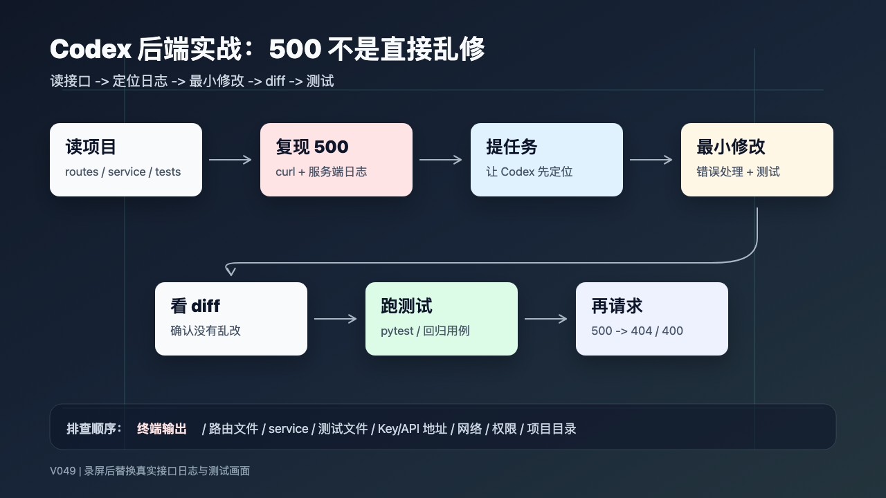

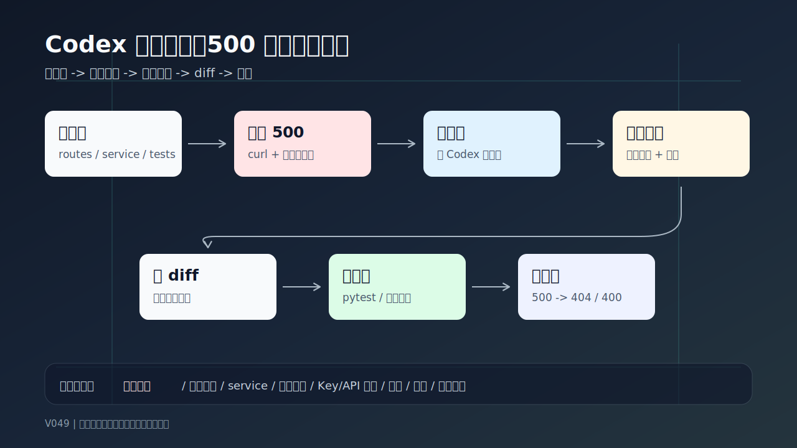

### PPT 步骤图

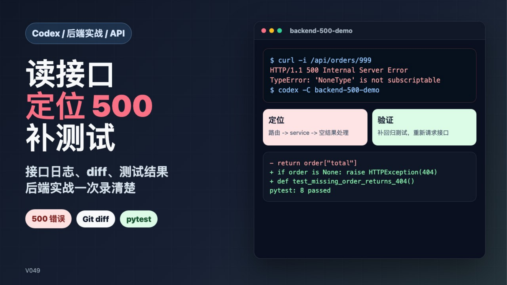

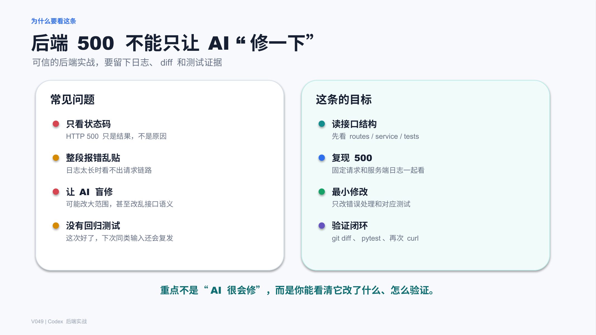

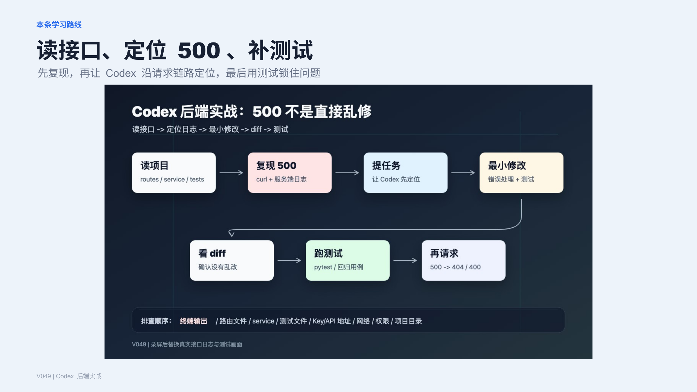

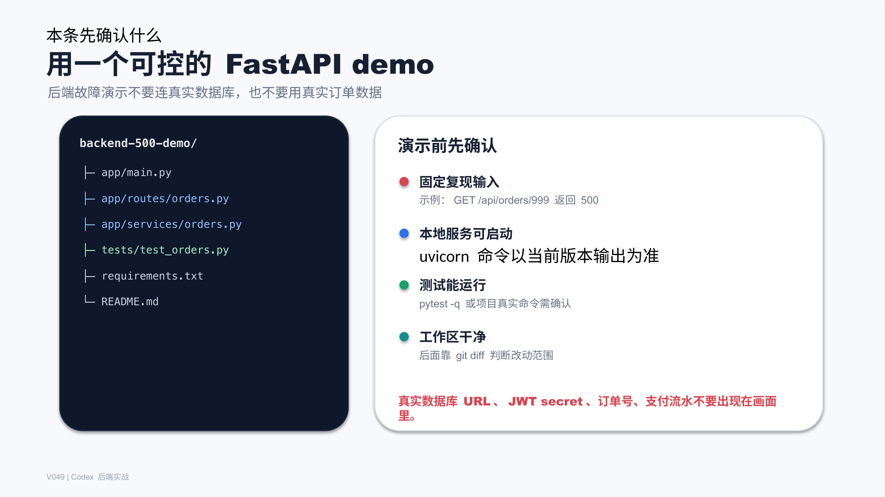

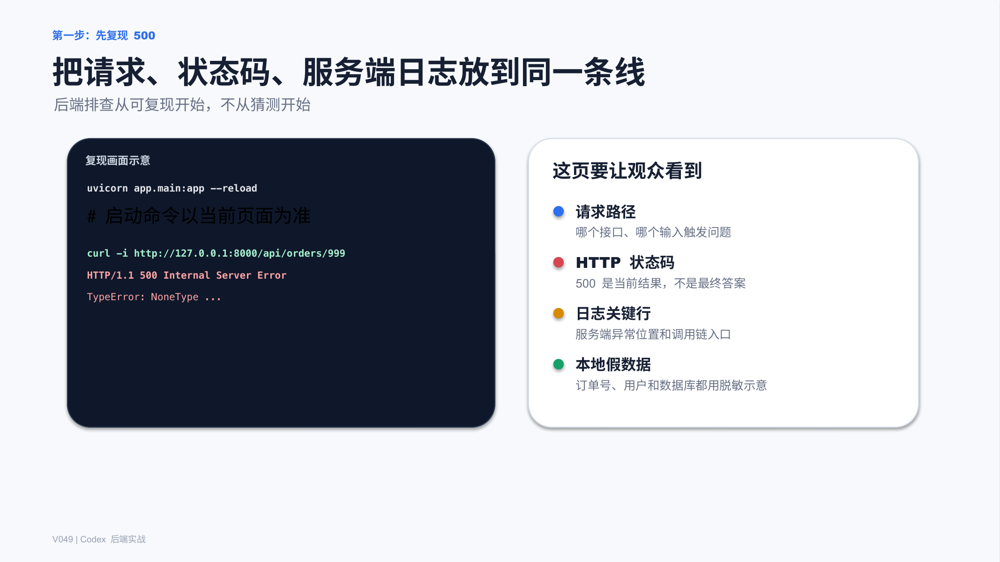

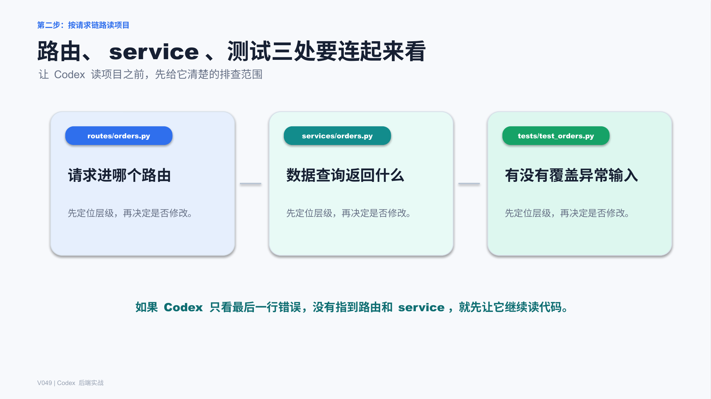

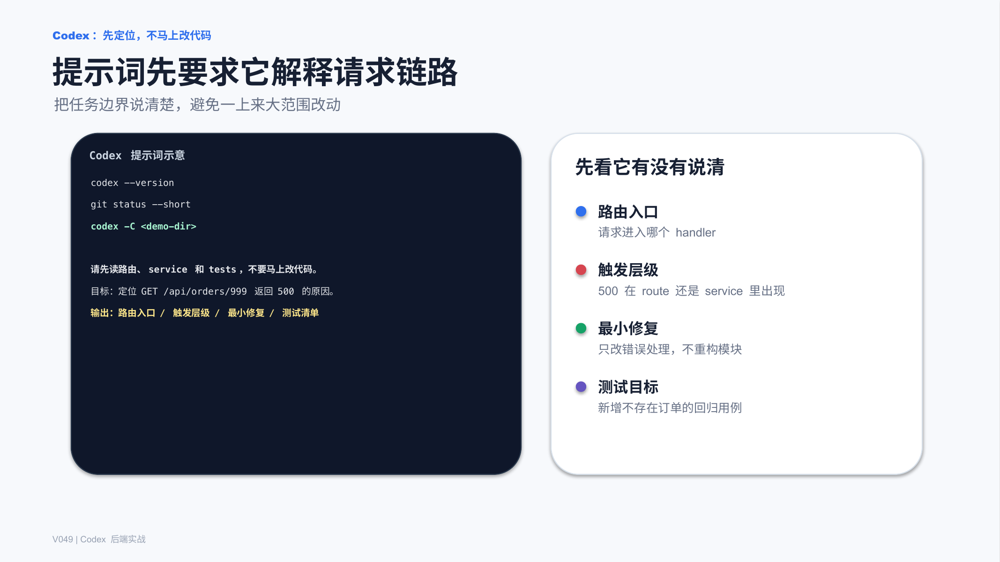

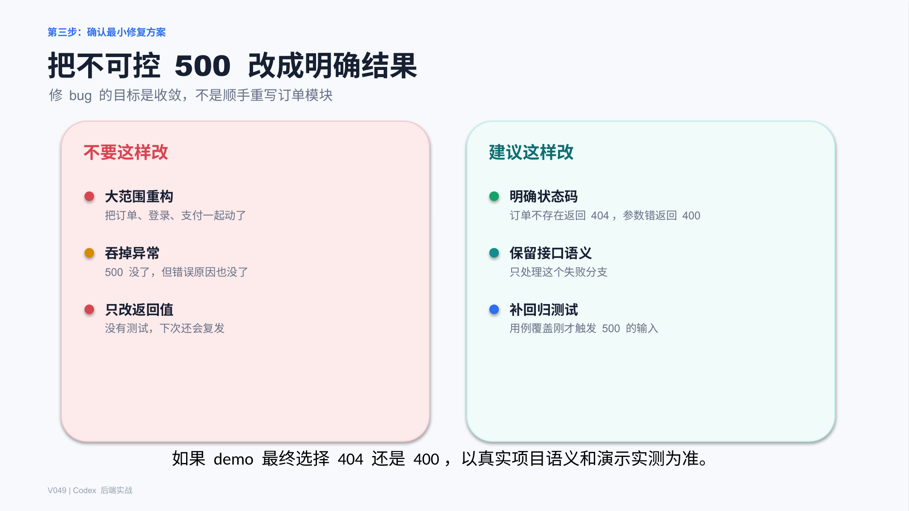

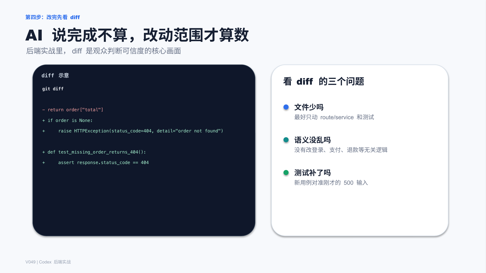

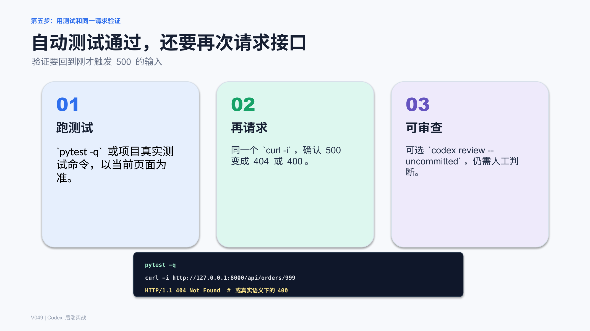

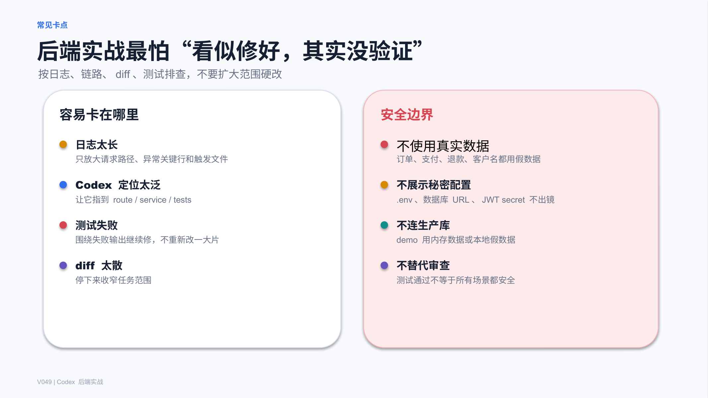

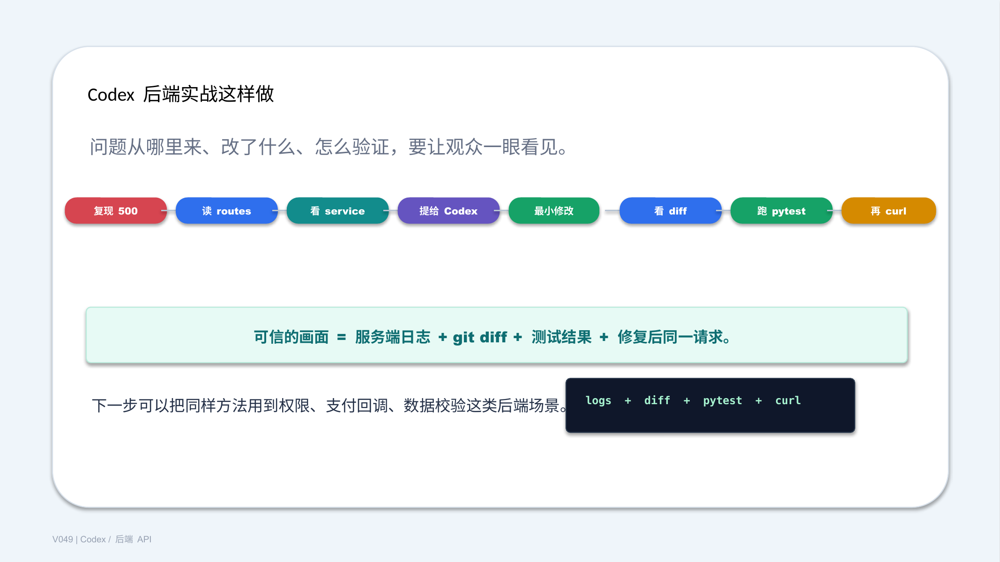

## 标签
#Codex #AI编程 #后端实战 #FastAPI #接口调试 #500错误 #pytest #Git #diff
