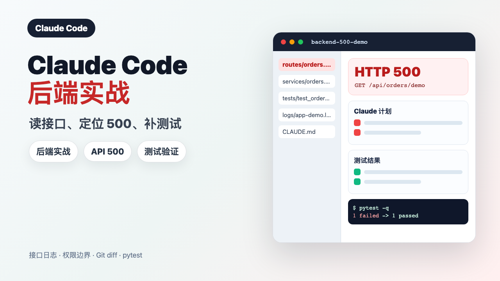
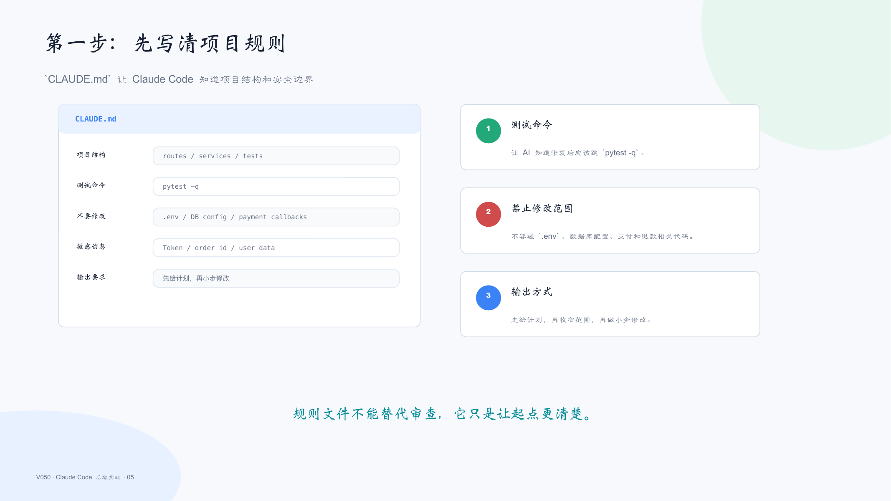
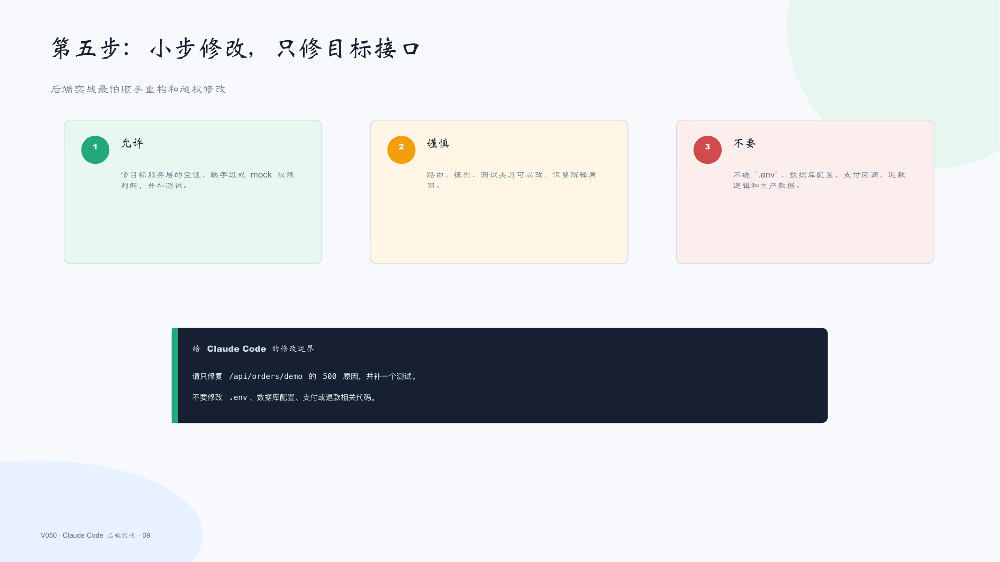
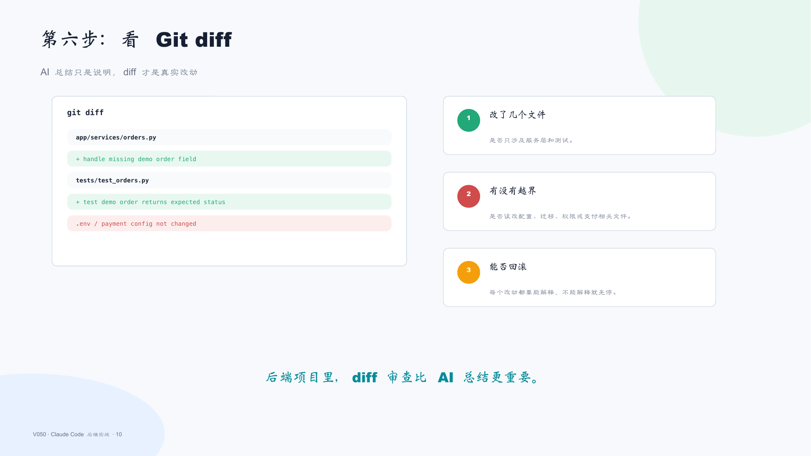
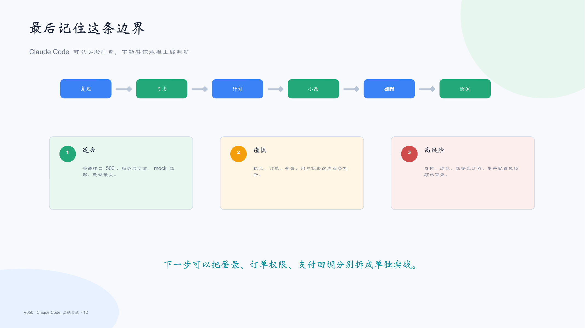

# V050｜Claude Code 后端实战：读接口、定位 500、补测试

这是 V001-V058 推广图文素材库中的第 50 篇，保留原始图文发布稿和配图，适合在 GitHub / Gitee 预览后复制到公众号、B站、小红书、抖音图文等平台。

## 发布稿

- [图文发布稿.md](图文发布稿.md)
- [图文发布稿-直接复制.md](图文发布稿-直接复制.md)

## 封面与流程图

- [V050-cover-douyin.png](cover-flow-images/V050-cover-douyin.png)
- [V050-cover-landscape.png](cover-flow-images/V050-cover-landscape.png)
- [V050-flow-article-style.png](cover-flow-images/V050-flow-article-style.png)
- [V050-flow.png](cover-flow-images/V050-flow.png)
- [V050-flow.svg](cover-flow-images/V050-flow.svg)

## PPT 图片

- 
- 
- 
- 
- 
- 
- 
- 
- 
- 
- 
- 

---

[返回总目录](../../README.md)
