# V055 图文发布稿（带图版）

## 标题

Agent 没按预期工作怎么排查？Codex 和 Claude Code 先看这几处

## 前两段短文案

Agent 跑偏时，不一定是模型坏了，也不一定是 Key 配置错了。这条用 Codex 和 Claude Code 分开演示：先复现现象，再看终端输出、任务描述、Agent 配置、目录权限和日志页。

这篇主要解决：Agent 没读到目标项目，结果像是在猜。看完你能：先复现 Agent 到底哪里没按预期工作。建议先收藏，操作时对照配图一步步核对。

## 备用标题

Agent 没读项目、没用工具、卡住了，先别急着重装
积木代码助手进阶排查 55：Agent 任务、权限和日志怎么看

## 完整正文备用

Agent 跑偏时，不一定是模型坏了，也不一定是 Key 配置错了。这条用 Codex 和 Claude Code 分开演示：先复现现象，再看终端输出、任务描述、Agent 配置、目录权限和日志页。重点是把 Agent 问题和普通命令失败分开排查。

这篇适合刚开始接触积木代码助手、Codex 或 Claude Code 的同学。不要只盯着一个按钮或一条命令，建议按图里的顺序看：先看当前问题，再看操作路径，最后确认结果有没有真正跑通。

常见卡点：
Agent 没读到目标项目，结果像是在猜
Agent 被权限限制住，但终端提示没有被认真看
Agent 任务写得太宽，只返回泛泛建议
Claude Code 里项目 subagent、用户 subagent、`--agents` 临时 JSON、插件 agent 混在一起，不知道到底哪个生效

看完这篇，你应该能做到：
先复现 Agent 到底哪里没按预期工作
看终端或 Agent 面板输出，不先猜原因
检查任务描述是否给了目标文件、范围和验收标准
检查 Agent 定义、工作目录、可访问目录和工具权限

我的建议是，第一次操作时不要一边改很多地方，一边猜原因。先把页面、终端输出、配置文件、日志记录这几块分开看，哪一步不一致，就从那一步往回查。

如果你也在配置或使用 AI 编程工具，可以先收藏这篇。后面遇到类似问题时，按这条路线重新核对一遍，通常能更快判断下一步该看哪里。

## 配图说明

首图用 `cover-flow-images/V055-cover-douyin.png`。
第二张用 `cover-flow-images/V055-flow.png`。
后面从 `ppt-images/slide-01.png` 到 `ppt-images/slide-08.png` 里选关键步骤图。
如果平台限制图片数量，优先保留：流程图、关键操作、常见错误、结果确认。

## 配图预览

### 首图与流程图

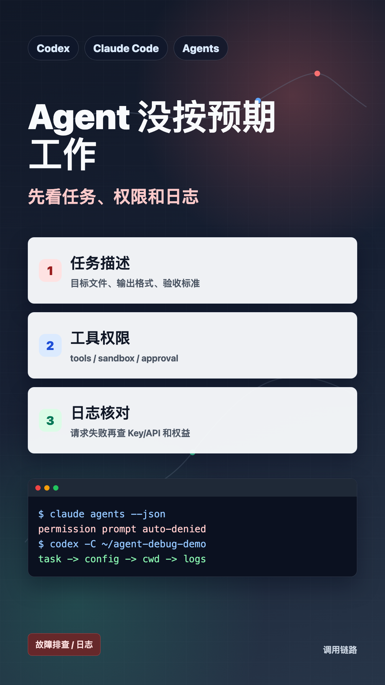

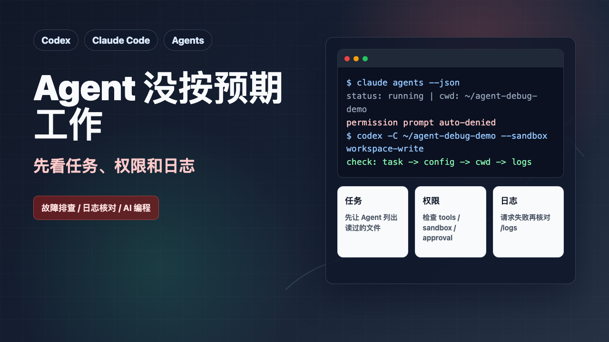

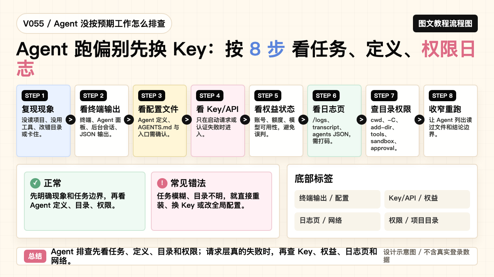

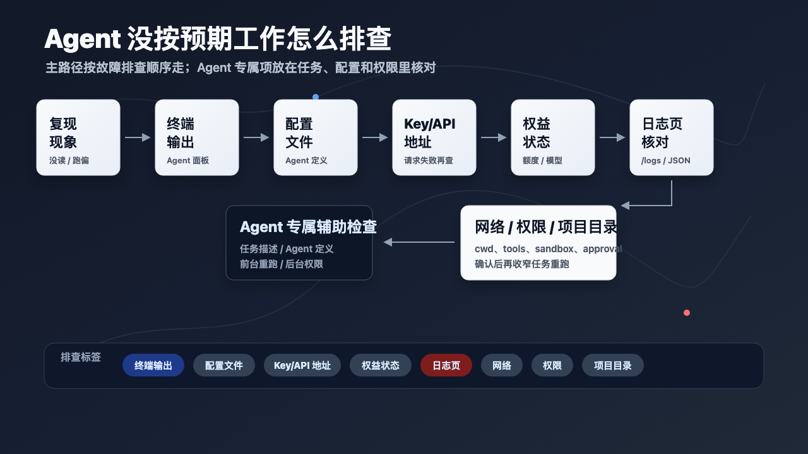

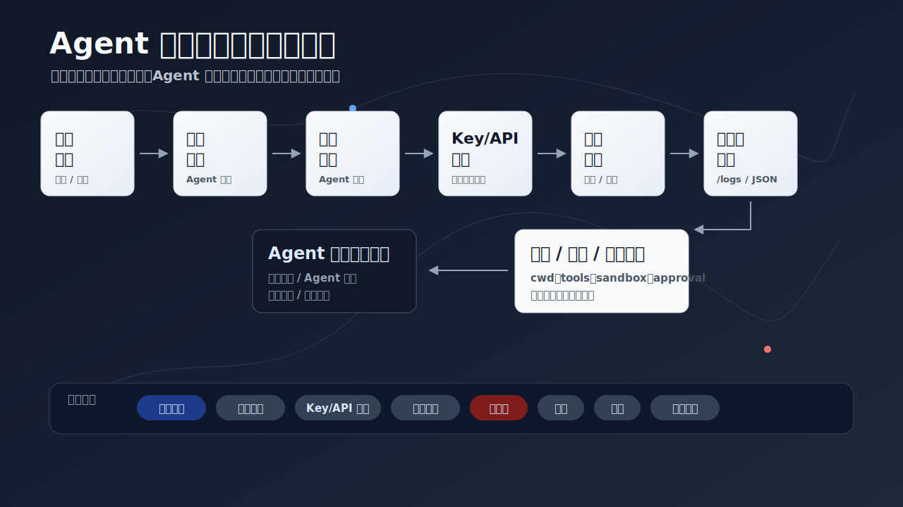

### PPT 步骤图

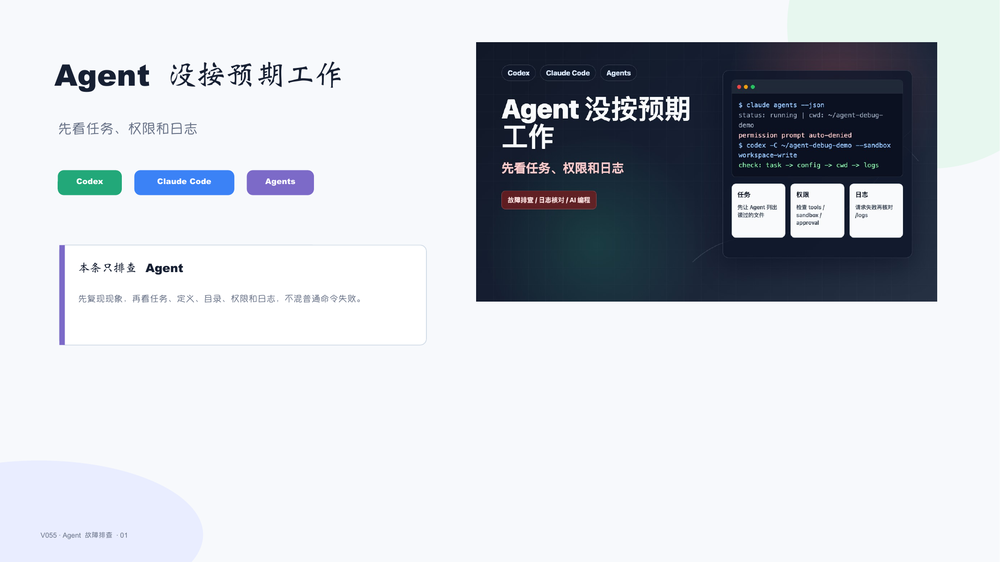

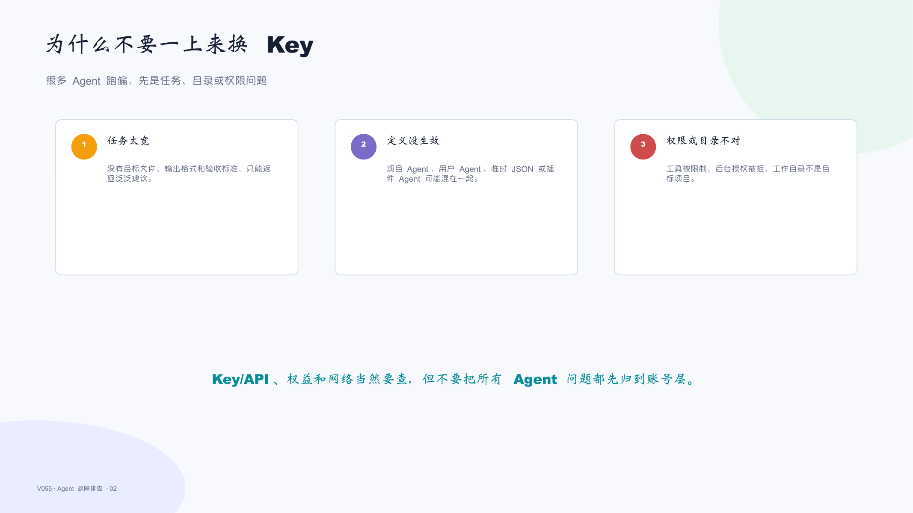

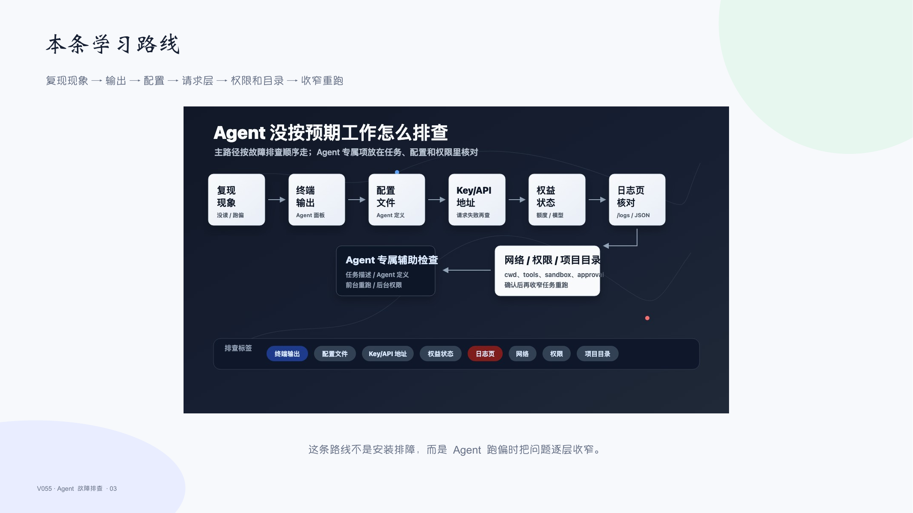

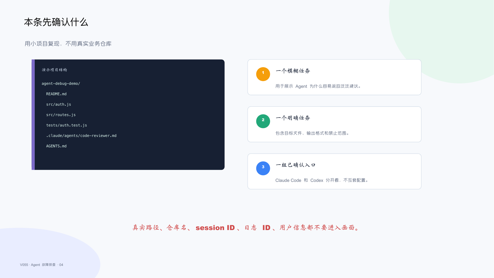

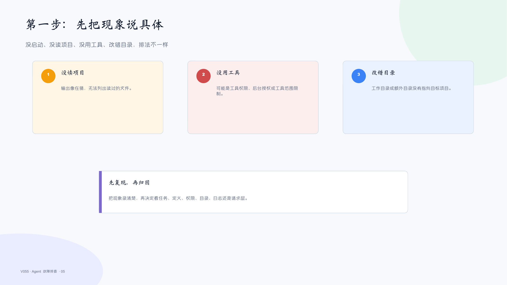

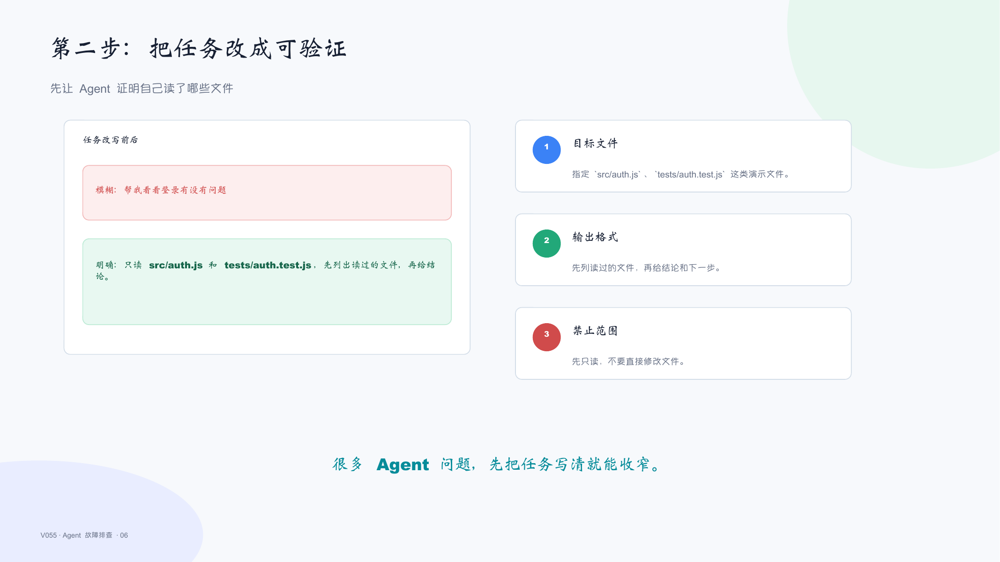

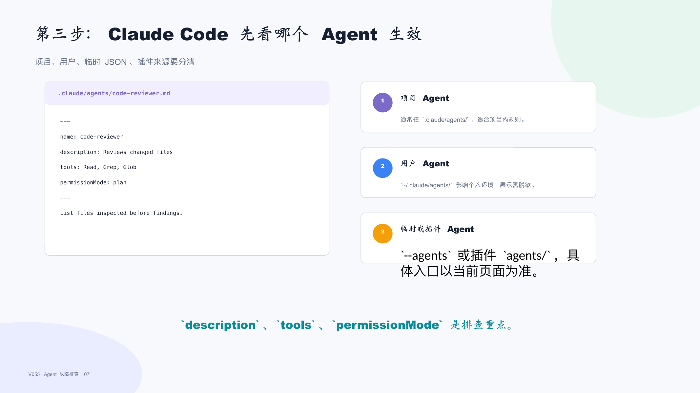

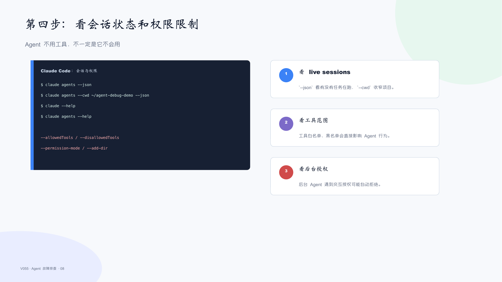

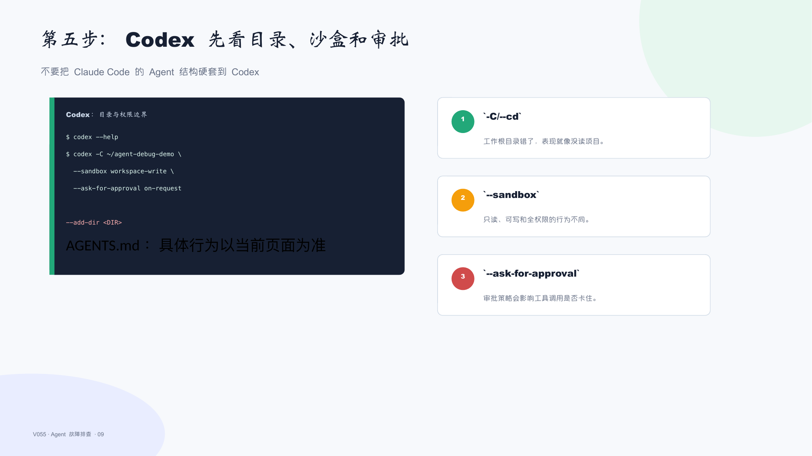

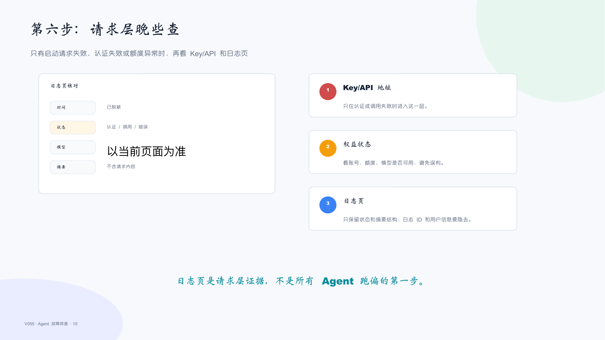

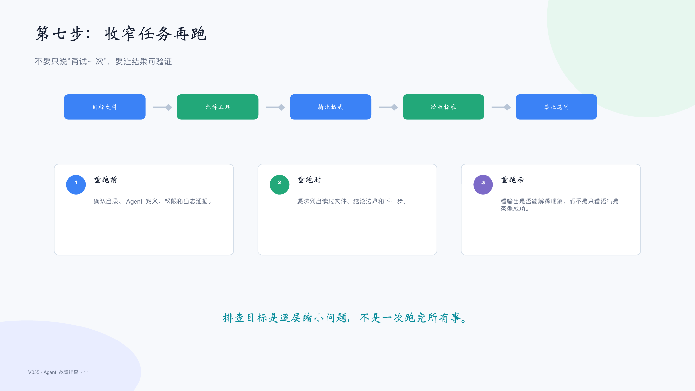

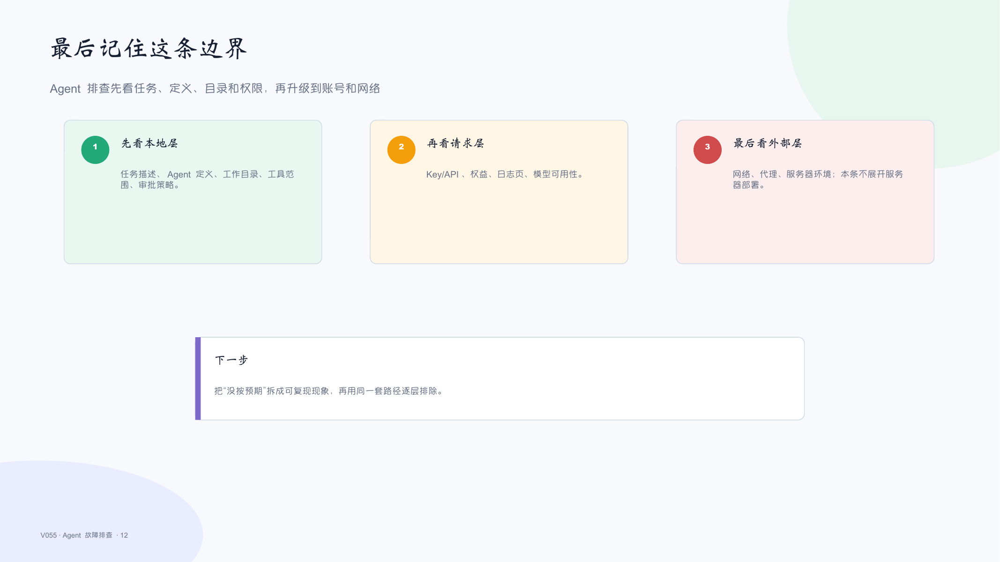

## 标签
#Codex #ClaudeCode #积木代码助手 #AI编程 #Agents #故障排查 #日志核对 #权限配置
