# V057 图文发布稿（带图版）

## 标题

AI 编程教程怎么拆成抖音、B站、小红书和公众号

## 前两段短文案

这条讲录完 Codex 或 Claude Code 教程之后，怎么把同一条母素材拆成四个平台版本：抖音做竖屏短节奏，B站保留横屏完整流程，小红书改成步骤图文，公众号写成长文复盘和检查清单。

这篇主要解决：横屏教程直接裁成竖屏，终端字太小，手机看不清。看完你能：给出一套“母素材 -> 四个平台版本”的拆条路线。建议先收藏，操作时对照配图一步步核对。

## 备用标题

横屏教程别直接裁竖屏，AI 编程内容要按平台重排
积木代码助手实战 V057：一条 AI 编程教程拆成四个平台版本

## 完整正文备用

这条讲录完 Codex 或 Claude Code 教程之后，怎么把同一条母素材拆成四个平台版本：抖音做竖屏短节奏，B站保留横屏完整流程，小红书改成步骤图文，公众号写成长文复盘和检查清单。

重点不是简单多平台分发，而是按平台重新安排画面、标题、封面、简介、标签和打码。

这篇适合刚开始接触积木代码助手、Codex 或 Claude Code 的同学。不要只盯着一个按钮或一条命令，建议按图里的顺序看：先看当前问题，再看操作路径，最后确认结果有没有真正跑通。

常见卡点：
横屏教程直接裁成竖屏，终端字太小，手机看不清
B站适合讲完整流程，但抖音开头太慢就容易被划走
小红书和公众号不能只放视频截图，需要重新排步骤图和文字
Codex / Claude Code 的工具名、场景、解决的问题在封面上不够明确

看完这篇，你应该能做到：
给出一套“母素材 -> 四个平台版本”的拆条路线
说明四个平台各自优先保留什么：抖音看结论和关键操作，B站看完整流程，小红书看步骤图，公众号看复盘和清单
展示横屏与竖屏的画面重排原则，避免直接硬裁
给出截图素材、封面素材、标题方向和发布文案的准备方式

我的建议是，第一次操作时不要一边改很多地方，一边猜原因。先把页面、终端输出、配置文件、日志记录这几块分开看，哪一步不一致，就从那一步往回查。

如果你也在配置或使用 AI 编程工具，可以先收藏这篇。后面遇到类似问题时，按这条路线重新核对一遍，通常能更快判断下一步该看哪里。

## 配图说明

首图用 `cover-flow-images/V057-cover-douyin.png`。
第二张用 `cover-flow-images/V057-flow.png`。
后面从 `ppt-images/slide-01.png` 到 `ppt-images/slide-08.png` 里选关键步骤图。
如果平台限制图片数量，优先保留：流程图、关键操作、常见错误、结果确认。

## 配图预览

### 首图与流程图

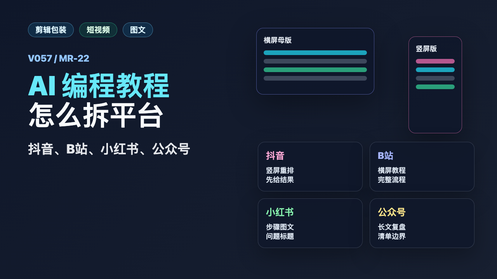

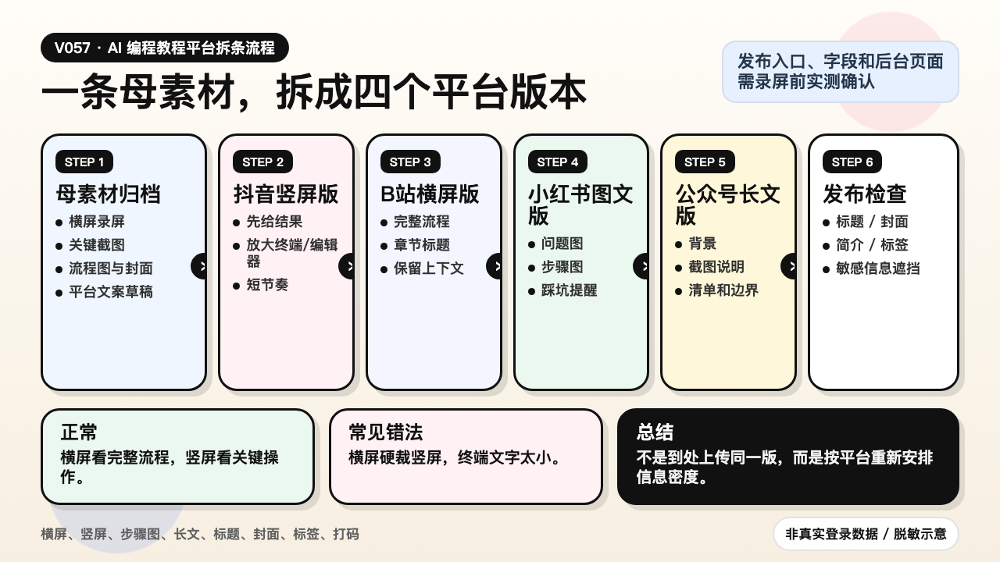

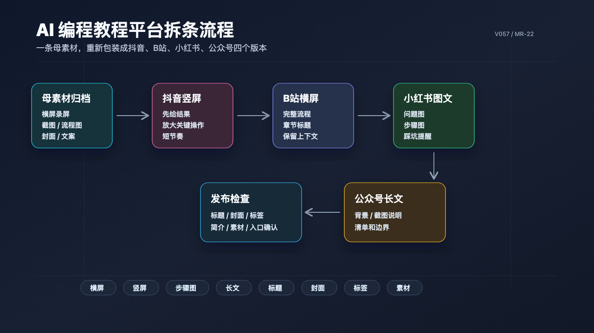

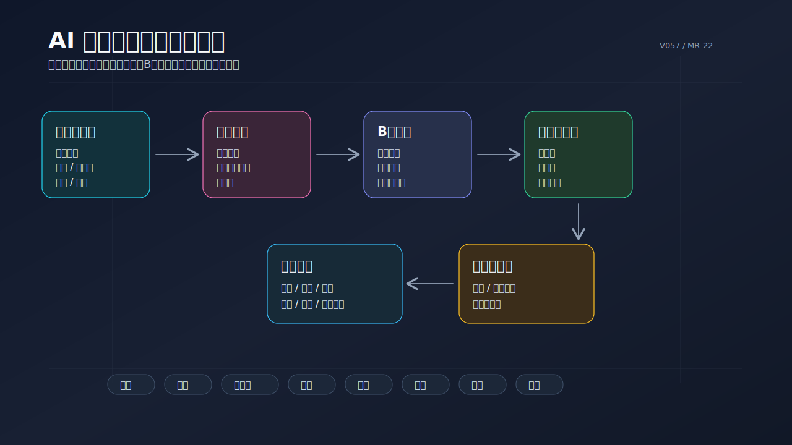

### PPT 步骤图

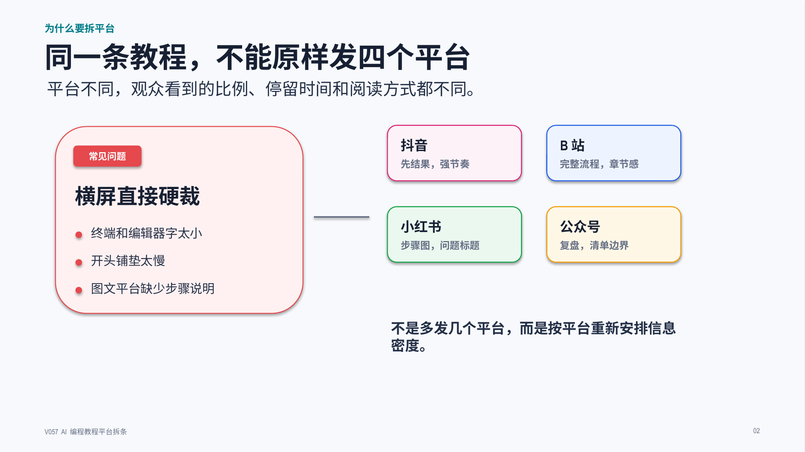

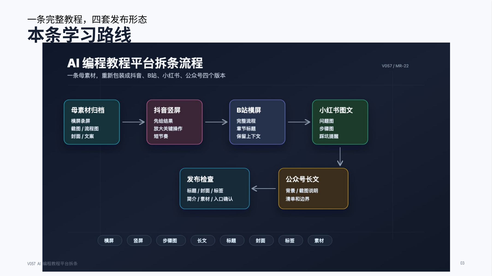

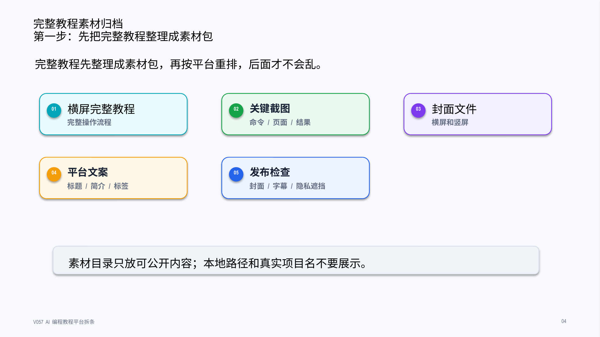

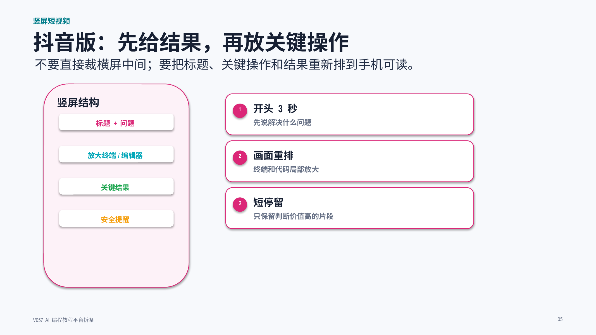

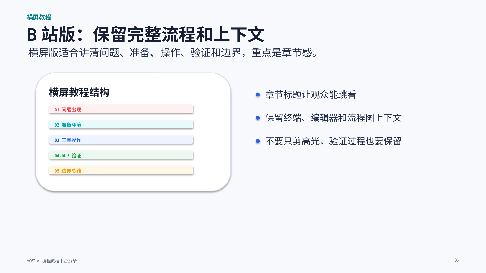

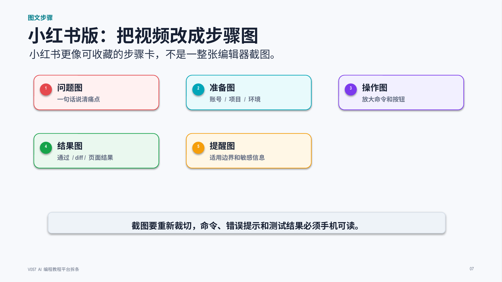

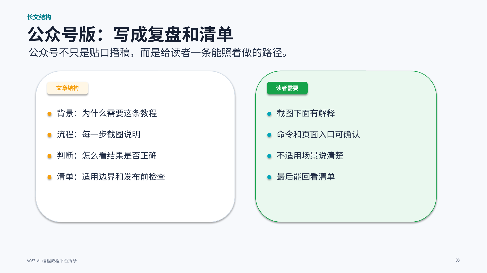

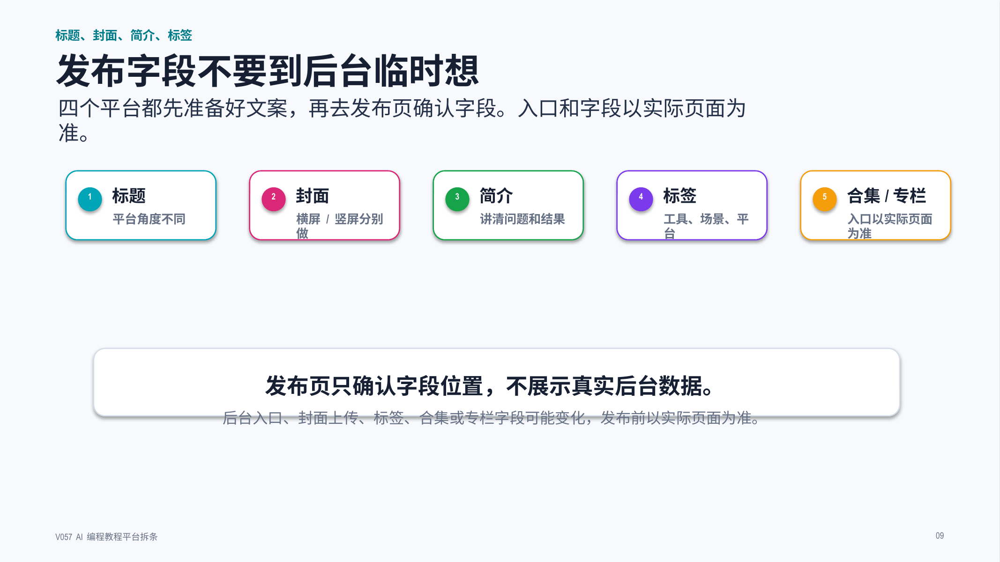

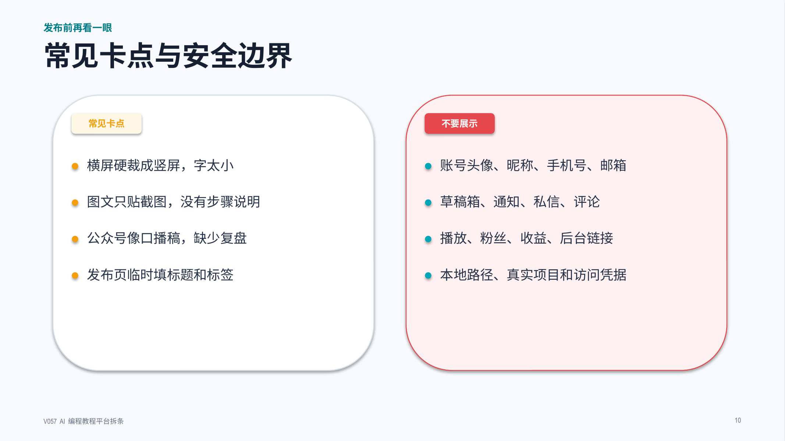

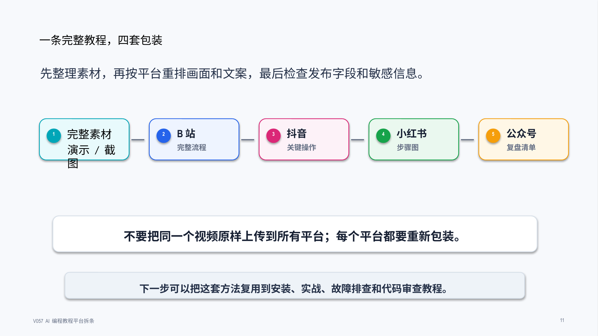

## 标签
#AI编程 #Codex #ClaudeCode #剪辑包装 #短视频剪辑 #图文改写 #B站教程 #抖音教程
