# V058 图文发布稿（带图版）

## 标题

Codex ／ Claude Code 适合录屏展示的高频场景

## 前两段短文案

这条讲的不是单个命令，而是 AI 编程教程录屏前的场景筛选方法。用 Codex 和 Claude Code 举例，把候选场景按高频、可视化、可验证、可打码、可复用五个标准筛一遍，帮助你决定哪些画面适合做封面、哪些适合剪辑放大、哪些应该等实测后再录。

这篇主要解决：录屏内容太抽象，只说“AI 会改代码”，画面上看不到证据。看完你能：按一个清晰顺序理解本条视频的核心操作路线。建议先收藏，操作时对照配图一步步核对。

## 备用标题

AI 编程录屏不好剪？先别急着录，场景要这样选
积木代码助手系列：Codex / Claude Code 适合录屏展示的场景清单

## 完整正文备用

这条讲的不是单个命令，而是 AI 编程教程录屏前的场景筛选方法。用 Codex 和 Claude Code 举例，把候选场景按高频、可视化、可验证、可打码、可复用五个标准筛一遍，帮助你决定哪些画面适合做封面、哪些适合剪辑放大、哪些应该等实测后再录。

这篇适合刚开始接触积木代码助手、Codex 或 Claude Code 的同学。不要只盯着一个按钮或一条命令，建议按图里的顺序看：先看当前问题，再看操作路径，最后确认结果有没有真正跑通。

常见卡点：
录屏内容太抽象，只说“AI 会改代码”，画面上看不到证据
选题太偏，先录复杂 MCP、Agents 或长项目，反而新手看不懂
封面和标题只写工具名，没有明确场景、问题和结果
录屏时把 Key、Token、用户信息、订单、日志、服务器 IP 等敏感内容直接露出来

看完这篇，你应该能做到：
按一个清晰顺序理解本条视频的核心操作路线
知道关键页面、终端输出或配置位置应该看哪里
知道哪些信息发布前需要脱敏，哪些内容需要以录屏现场为准

我的建议是，第一次操作时不要一边改很多地方，一边猜原因。先把页面、终端输出、配置文件、日志记录这几块分开看，哪一步不一致，就从那一步往回查。

如果你也在配置或使用 AI 编程工具，可以先收藏这篇。后面遇到类似问题时，按这条路线重新核对一遍，通常能更快判断下一步该看哪里。

## 配图说明

首图用 `cover-flow-images/V058-cover-douyin.png`。
第二张用 `cover-flow-images/V058-flow.png`。
后面从 `ppt-images/slide-01.png` 到 `ppt-images/slide-08.png` 里选关键步骤图。
如果平台限制图片数量，优先保留：流程图、关键操作、常见错误、结果确认。

## 配图预览

### 首图与流程图

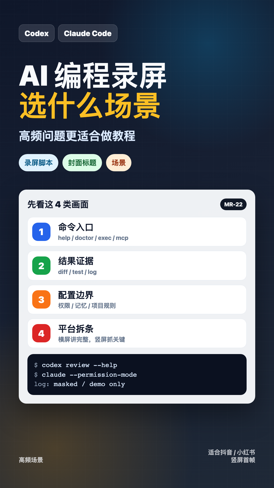

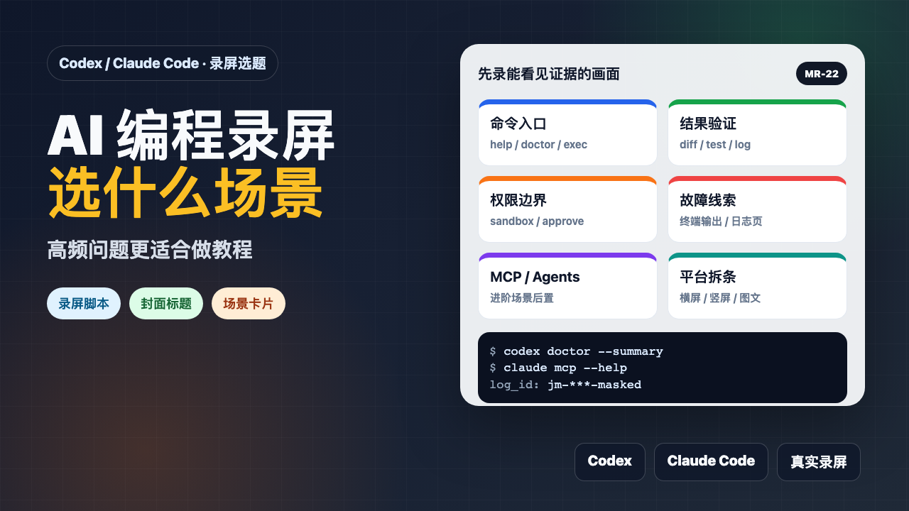

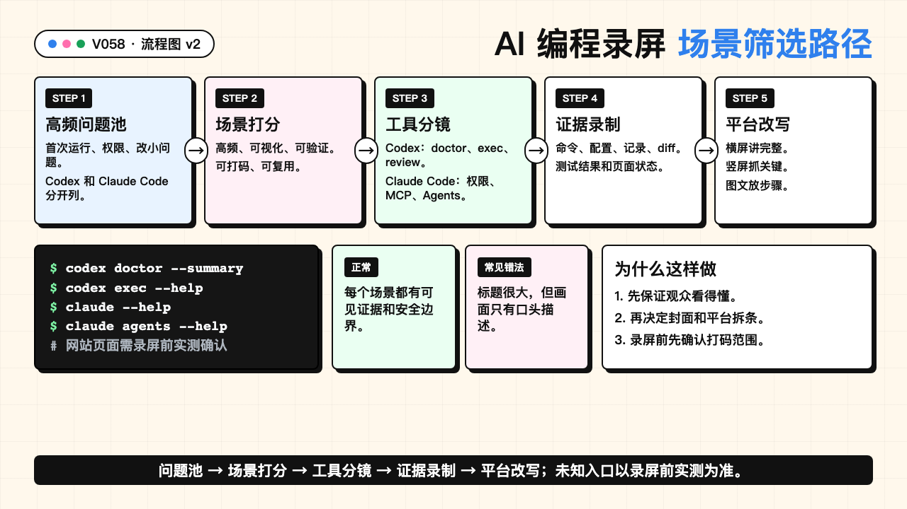

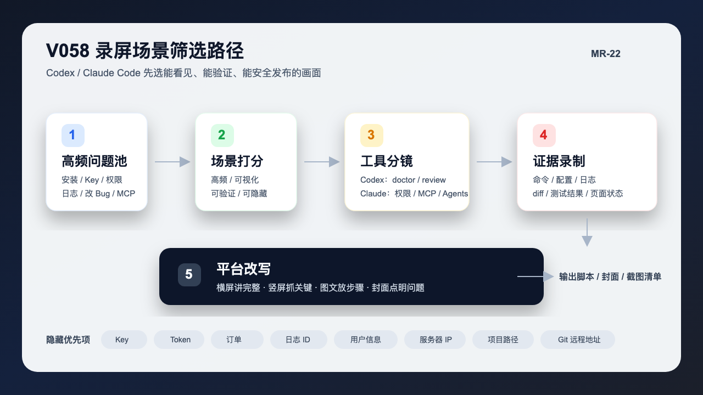

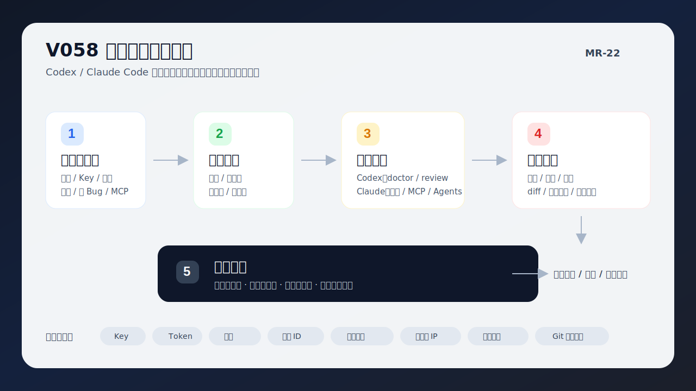

### PPT 步骤图

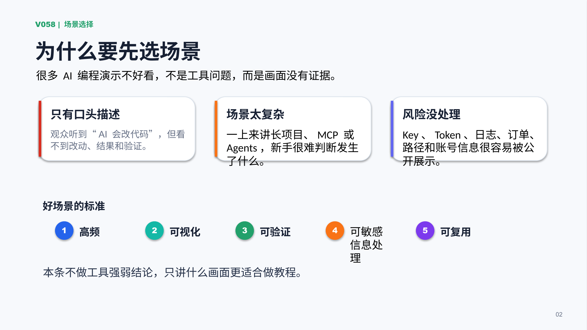

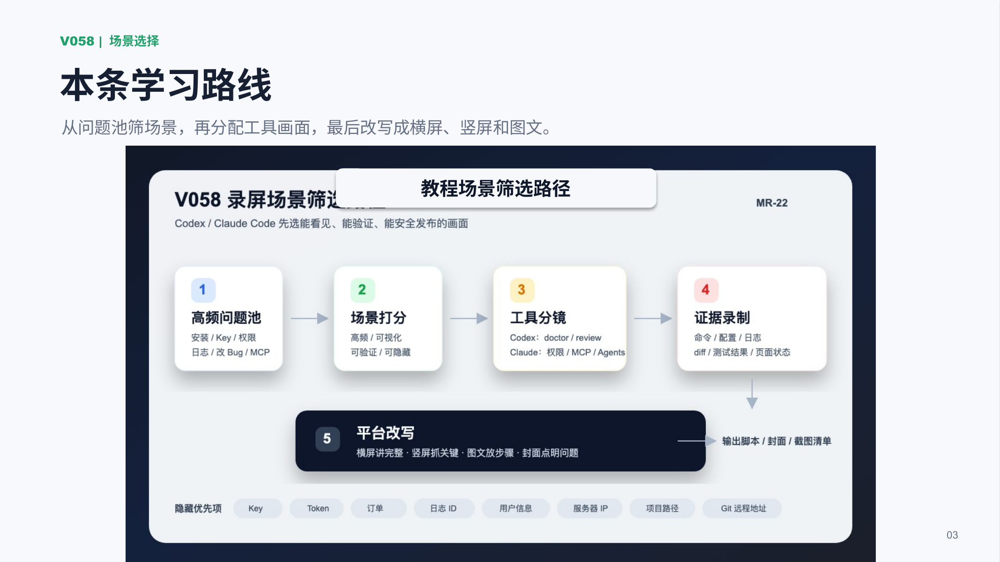

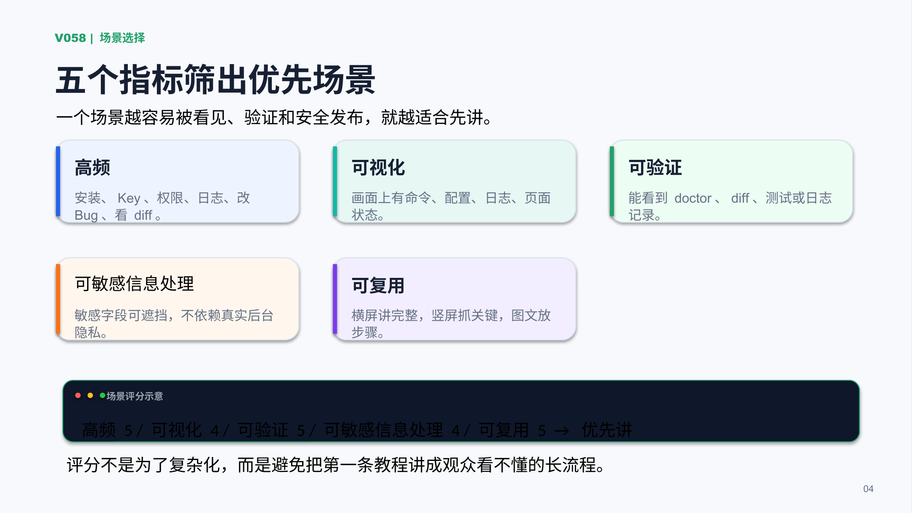

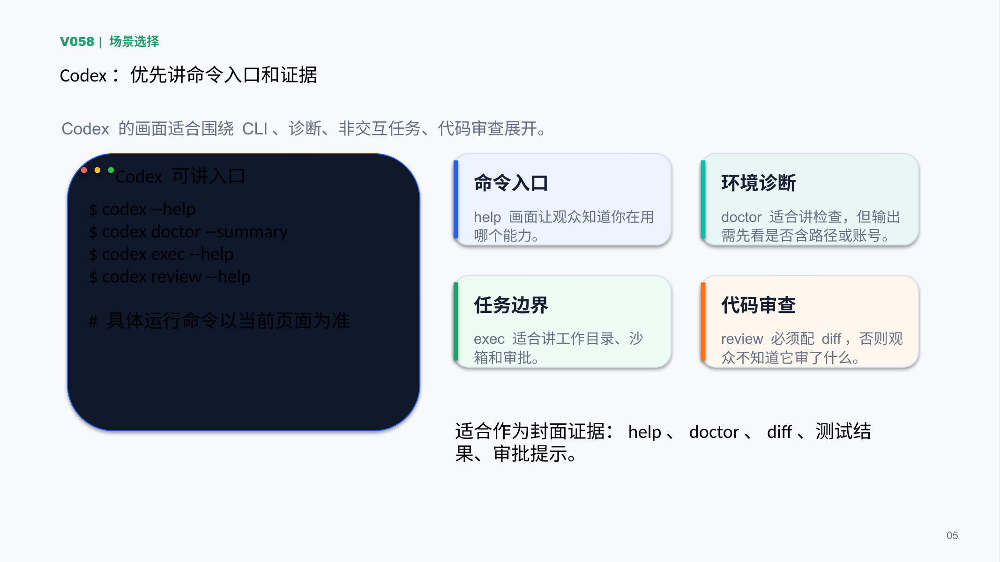

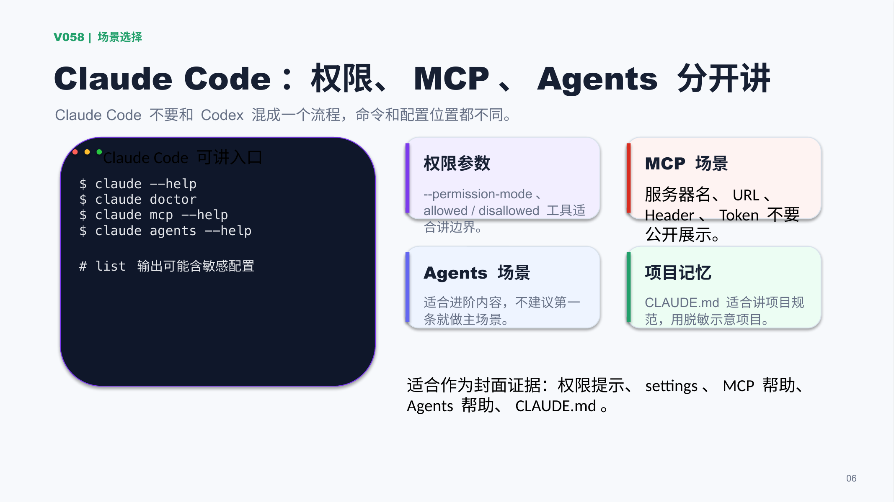

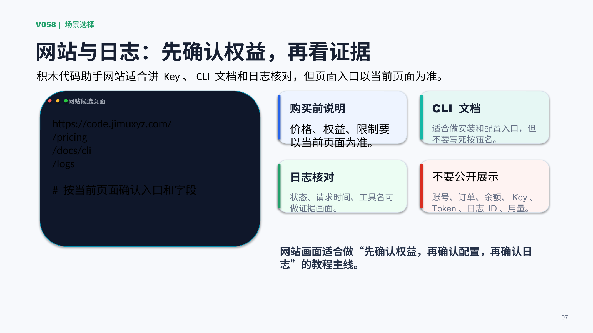

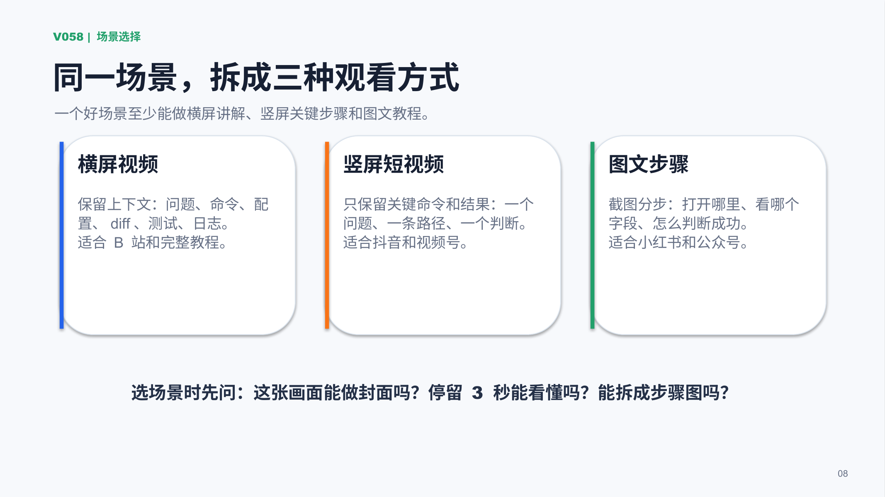

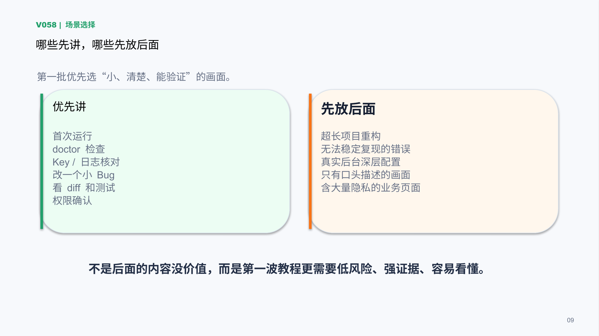

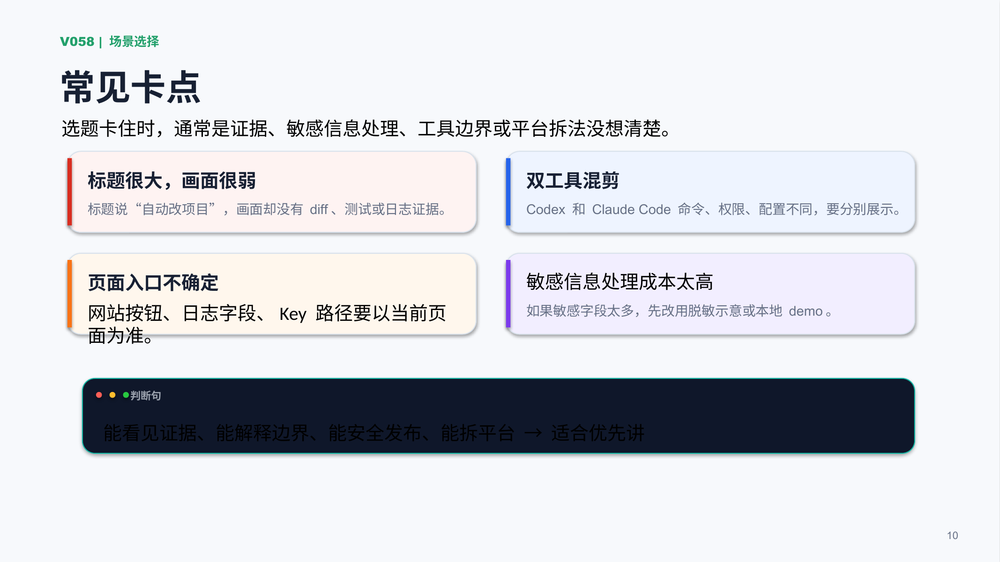

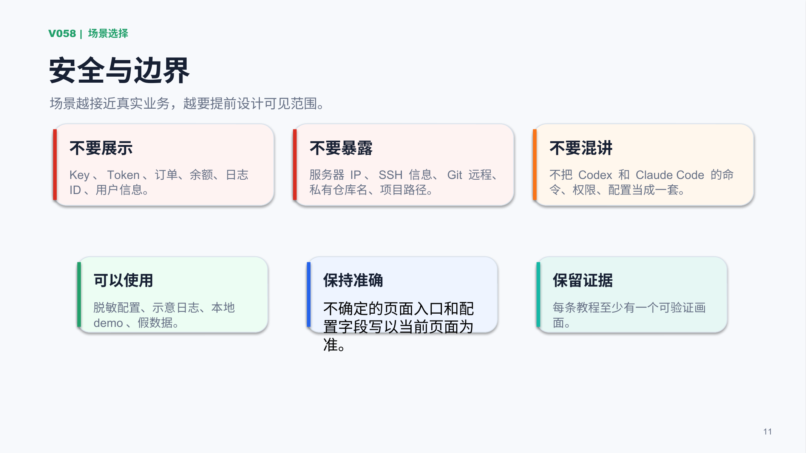

## 标签
#Codex #ClaudeCode #AI编程 #积木代码助手 #录屏脚本 #封面标题 #教程制作 #软件实操
